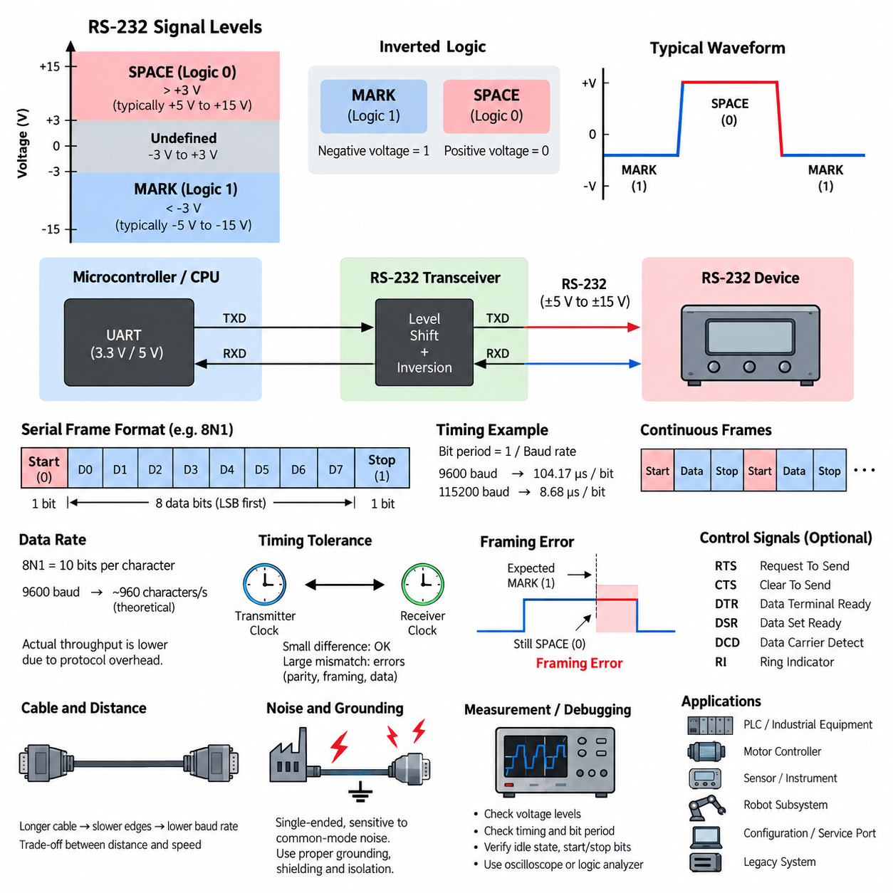
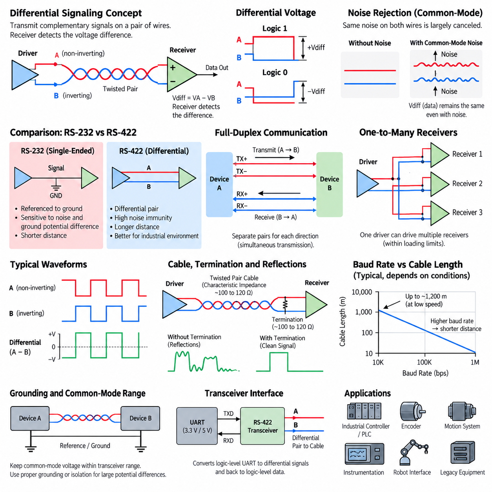
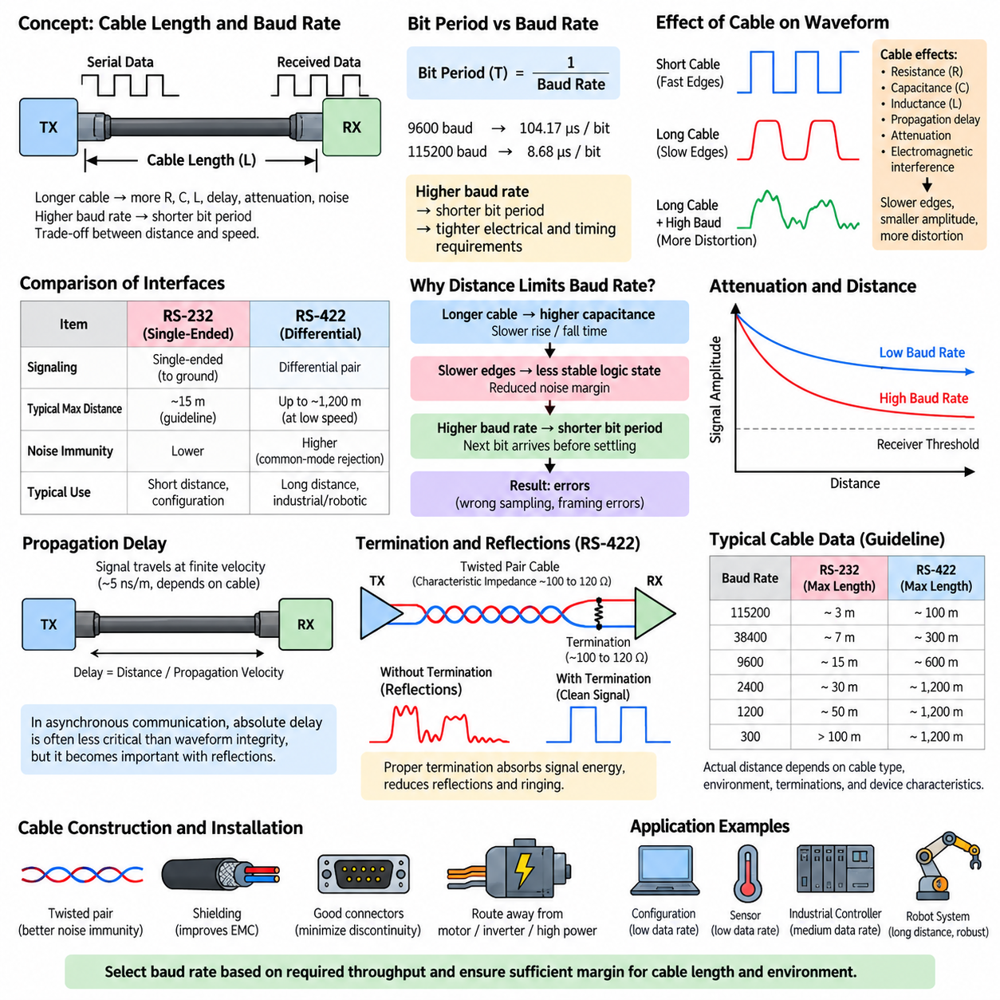
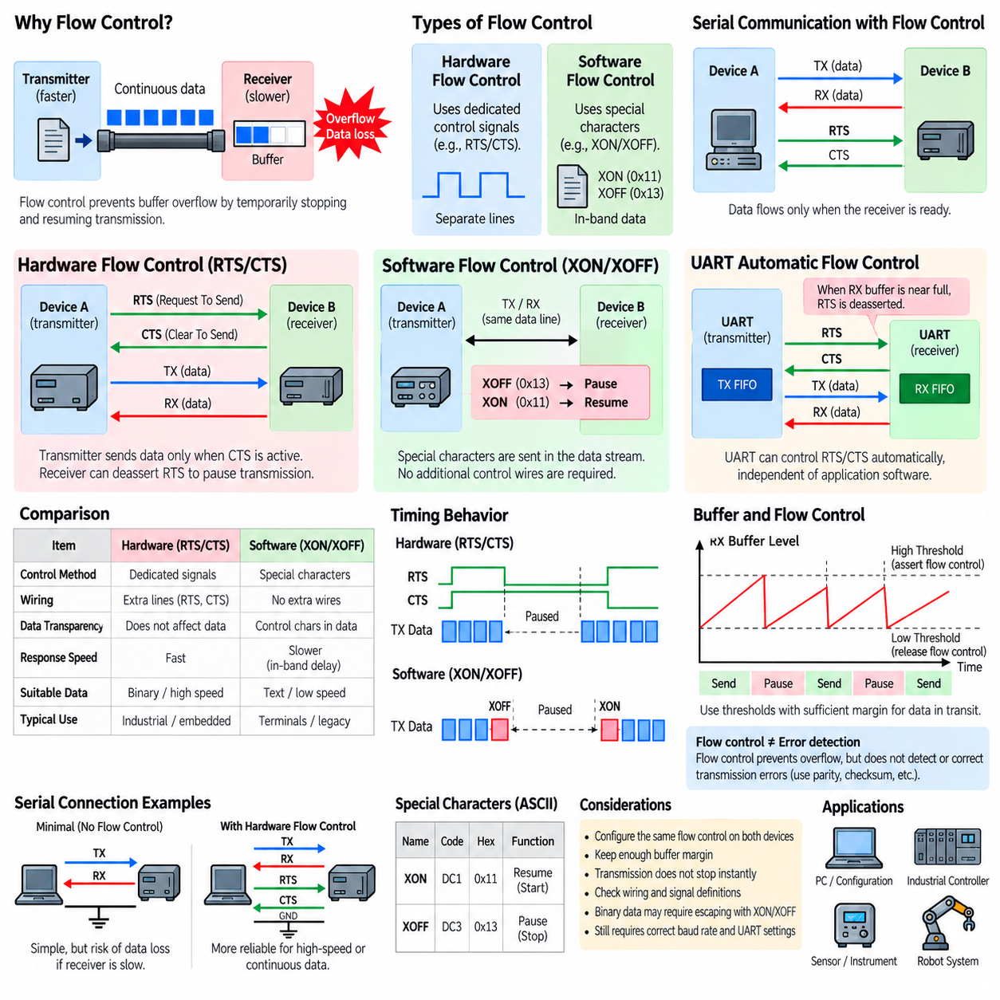
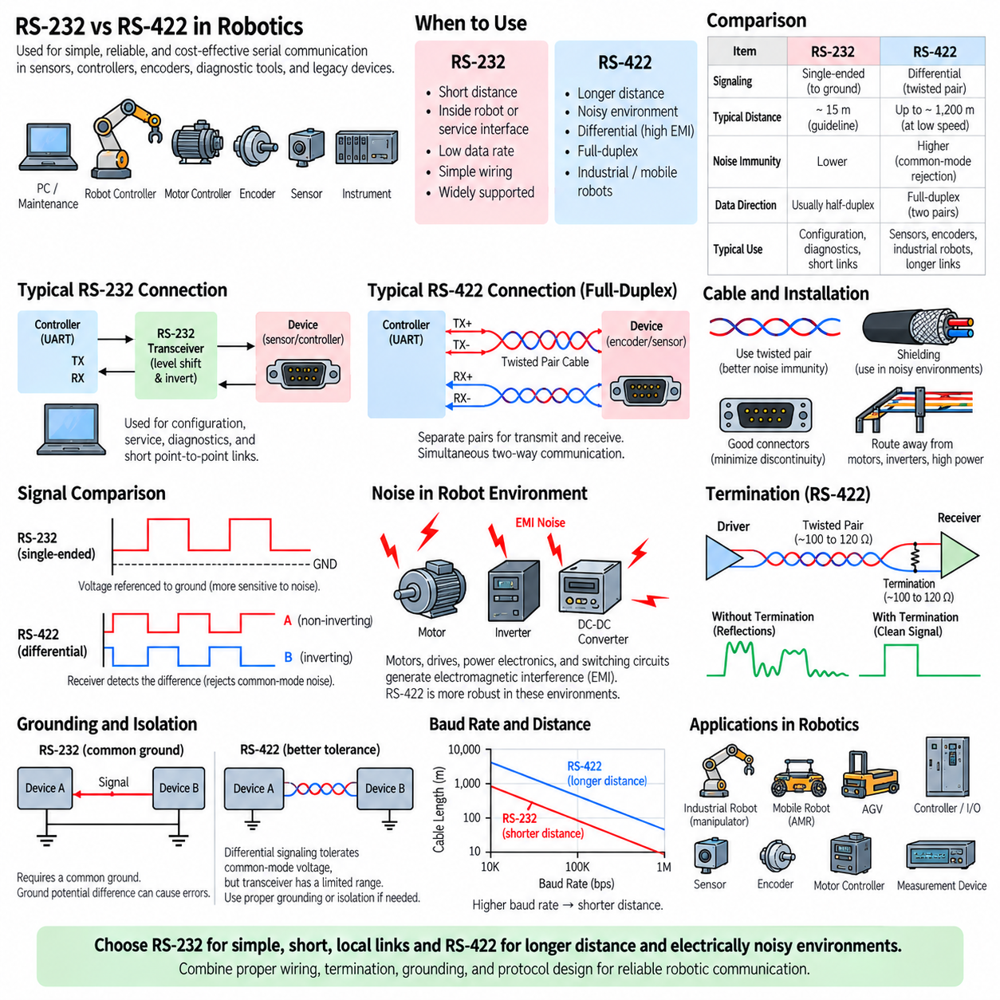

**Volume 07. Industrial Communication**

# Chapter 01. RS232/RS422

## 01.01. RS232 Signal Level and Timing

{width="7.268055555555556in" height="7.268055555555556in"}

RS-232 is a single-ended serial communication standard in which binary information is represented by voltage levels referenced to a common signal ground. Unlike modern digital logic, where positive voltage normally represents logic 1, RS-232 uses an inverted convention. A sufficiently negative voltage represents the MARK state, corresponding to binary 1, while a sufficiently positive voltage represents the SPACE state, corresponding to binary 0. This electrical convention is one of the defining characteristics of the interface.

The formal RS-232 electrical specification provides relatively wide voltage margins so that communication can remain reliable despite cable losses, noise, and differences between equipment. At the receiver, voltages more negative than approximately −3 V are interpreted as MARK, while voltages more positive than approximately +3 V are interpreted as SPACE. The region between −3 V and +3 V is intentionally undefined, providing a noise margin between the two valid signaling regions.

Transmitters traditionally generate signal amplitudes substantially beyond the receiver thresholds, commonly using levels such as approximately ±5 V to ±15 V depending on the implementation. Earlier equipment often used power supplies that naturally supported larger positive and negative voltages, while modern systems frequently employ charge-pump transceivers that generate suitable RS-232 voltages from low-voltage logic supplies. The exact transmitted amplitude is therefore implementation-dependent, but it must satisfy the electrical requirements of compatible receivers.

Because RS-232 voltage levels are fundamentally different from TTL or CMOS logic levels, an RS-232 connector should not normally be connected directly to a microcontroller UART. A UART may operate at 5 V, 3.3 V, 1.8 V, or another logic voltage and generally uses non-inverted logic signaling. An RS-232 transceiver performs both voltage translation and logical inversion, allowing the UART inside a controller, PLC, embedded computer, or robot subsystem to communicate safely with an RS-232 device.

RS-232 communication is normally asynchronous, meaning that transmitter and receiver do not share a separate clock line. Both endpoints are configured in advance for the same baud rate and frame format. When no character is being transmitted, the line remains in the MARK state. Transmission begins when the transmitter generates a start bit by changing the line to the SPACE state, allowing the receiver to recognize the beginning of a new serial character and synchronize its internal sampling process.

After detecting the start-bit transition, the receiver samples the signal according to the configured bit period. For a baud rate of 9600 baud, one bit occupies approximately 104.17 microseconds, while at 115200 baud the bit period is approximately 8.68 microseconds. Receiver hardware commonly uses an internal clock significantly faster than the nominal baud rate so that it can detect the start transition and sample each data bit near its center, where timing uncertainty has the least influence.

A typical asynchronous RS-232 frame contains one start bit, several data bits, an optional parity bit, and one or more stop bits. A widely used configuration is 8N1, meaning eight data bits, no parity, and one stop bit. Data bits are normally transmitted least significant bit first. The stop bit returns the line to the MARK state and provides a defined interval before another character begins, although another start bit may follow immediately after the required stop interval.

Baud rate describes the signaling rate, while the useful data throughput is lower because framing bits consume transmission time. With an 8N1 format, every eight-bit payload character requires ten transmitted bits: one start bit, eight data bits, and one stop bit. Consequently, a 9600-baud connection can theoretically carry approximately 960 eight-bit characters per second when characters are transmitted continuously. Additional protocol headers, delimiters, acknowledgments, and application processing can further reduce effective throughput.

Timing accuracy is important because asynchronous communication relies on the transmitter and receiver maintaining sufficiently similar clocks during each character. The receiver resynchronizes when it detects each start bit, so small clock-frequency differences are normally acceptable. However, excessive baud-rate mismatch causes the sampling point to drift progressively away from the center of successive bits. Eventually the receiver may sample the wrong logical state, producing corrupted characters, parity errors, or framing errors.

The stop-bit interval also provides an important timing check. When the receiver expects a stop bit, it should observe the MARK state. If the signal is still in the SPACE state at the expected sampling point, the UART can report a framing error. Such errors may indicate incorrect baud-rate configuration, mismatched frame settings, severe electrical noise, damaged cabling, or timing instability. Framing-error statistics can therefore provide useful diagnostic information when troubleshooting industrial serial links.

Signal quality depends not only on nominal voltage but also on cable capacitance, source impedance, grounding, and electromagnetic interference. As cable length increases, electrical transitions become slower and the waveform may require more time to cross the receiver thresholds. Higher baud rates reduce the available bit period and therefore reduce tolerance for slow edges and distortion. This relationship explains why practical RS-232 installations generally trade communication distance against signaling speed rather than treating baud rate and cable length independently.

RS-232 is single-ended, so every signal voltage is interpreted relative to a common reference conductor. Differences in ground potential between two machines can therefore appear directly as unwanted signal voltage. In industrial environments containing motors, inverters, contactors, switching power supplies, and long cable routes, this characteristic makes RS-232 more susceptible to common-mode disturbances than differential interfaces such as RS-422 or RS-485. Proper grounding, cable routing, shielding, and isolation may consequently become important engineering considerations.

The electrical standard should also be distinguished from the higher-level serial data format implemented by a UART. RS-232 primarily specifies electrical interface characteristics and associated control signals, whereas the UART generates and interprets asynchronous start bits, data bits, parity, and stop bits. Applications then place their own protocol structures above this serial stream. A robot sensor, for example, may transmit ASCII commands or binary packets through a UART whose physical electrical interface is converted to RS-232.

Traditional RS-232 interfaces may include control lines in addition to transmitted data and received data. Signals such as RTS, CTS, DTR, DSR, DCD, and RI were historically important for communication between data terminal equipment and modems. Many modern embedded and robotic applications use only TX, RX, and signal ground, while some retain RTS and CTS for hardware flow control. The electrical polarity conventions of these control signals follow the RS-232 signaling philosophy rather than ordinary MCU logic conventions.

When debugging an RS-232 interface, engineers should therefore examine voltage and timing together. Measuring only whether characters appear in software can hide physical-layer problems. An oscilloscope can reveal idle polarity, voltage amplitude, transition quality, start-bit timing, individual bit periods, and stop-bit behavior. A logic analyzer is useful after voltage conversion, while direct probing of the RS-232 side requires equipment and connections appropriate for its bipolar signal levels.

RS-232 remains useful in industrial communication because its operation is simple, mature, inexpensive, and easily diagnosed. Configuration ports, legacy PLC equipment, motor controllers, laboratory instruments, barcode readers, industrial computers, robot subsystems, and service interfaces may continue to expose RS-232 even when the surrounding system uses Ethernet or fieldbus networks. Understanding its signal levels and timing therefore provides an important foundation before studying RS-422, RS-485, Modbus RTU, and more advanced industrial communication architectures.

## 01.02. RS422 Differential Signaling

{width="7.268055555555556in" height="7.268055555555556in"}

RS-422 is a serial communication electrical standard designed to improve transmission reliability over longer distances and in electrically noisy environments. Its defining characteristic is differential signaling, in which each logical signal is transmitted through a pair of conductors rather than as a voltage referenced directly to ground. The receiver determines the data state from the voltage difference between the two conductors, making communication substantially more resistant to externally induced electrical noise.

In a differential pair, the two conductors carry complementary electrical states. When the transmitter drives one conductor toward a higher voltage, it drives the other toward a lower voltage, producing a differential voltage between them. When the transmitted logical state changes, the polarity of this voltage difference reverses. The receiver therefore does not primarily depend on the absolute voltage of either conductor but instead evaluates their relative voltage, expressed conceptually as Vdiff = VA − VB.

This operating principle differs fundamentally from the single-ended signaling used by RS-232. In RS-232, the receiver interprets the voltage of a signal conductor relative to a common signal ground, so differences in ground potential and coupled electrical interference can directly disturb the received signal. RS-422 instead uses the difference between two signal conductors, allowing disturbances that affect both wires similarly to be largely rejected by the differential receiver.

The ability to reject noise arises from common-mode behavior. If an electromagnetic disturbance induces approximately the same unwanted voltage onto both wires, both conductor voltages move together while their difference remains nearly unchanged. Because the receiver responds primarily to this difference, much of the common-mode noise is canceled. This property makes differential signaling particularly useful around motors, variable-frequency drives, switching power supplies, relays, contactors, and other industrial noise sources.

A twisted pair is normally used for RS-422 transmission because twisting helps expose both conductors to similar electromagnetic fields. As the wires repeatedly exchange their physical positions along the cable, externally induced interference tends to affect them more equally. This improves common-mode noise rejection and reduces susceptibility to magnetic coupling. Twisted-pair construction is therefore an important physical complement to the electrical advantages provided by differential signaling.

RS-422 commonly supports full-duplex communication by using separate differential pairs for transmission and reception. One pair carries data from the first device to the second, while another pair carries data in the opposite direction. Because the two directions use independent electrical paths, both devices can transmit simultaneously. This arrangement contrasts with two-wire half-duplex networks commonly associated with RS-485, where multiple devices may share a single differential pair and must coordinate access to the communication medium.

The RS-422 electrical architecture is generally based on one driver communicating with one or more receivers. A single transmitter can therefore distribute a signal to multiple receiving devices within the electrical loading limits of the interface. This capability can be useful for industrial equipment where one controller must provide serial information to several receiving nodes. However, RS-422 should not automatically be treated as a general-purpose multidrop network with multiple transmitters sharing the same pair.

Differential transmission also provides significantly greater practical communication distance than conventional RS-232. RS-422 links can operate across cable lengths approaching approximately 1,200 meters under suitable low-speed conditions, although achievable distance depends strongly on baud rate, cable characteristics, termination, environmental noise, transceiver performance, and installation quality. As signaling speed increases, allowable cable length generally decreases because propagation delay, attenuation, reflections, and waveform distortion become increasingly important.

The relationship between baud rate and cable length is therefore a central RS-422 engineering consideration. At relatively low signaling rates, the receiver has more time to distinguish a stable differential voltage after each transition. At higher rates, each bit occupies a shorter interval, so cable propagation effects and slow signal settling consume a larger fraction of the available bit period. Reliable design requires evaluating transmission distance and signaling speed together rather than selecting them independently.

Long cables must also be treated as transmission lines when signal transition times become sufficiently short relative to cable propagation delay. If the cable impedance is not properly controlled, an electrical transition reaching the end of the cable can be reflected back toward the transmitter. These reflections may distort the differential waveform, create multiple threshold crossings, or reduce timing margin. The problem becomes increasingly significant as cable length and signaling speed increase.

Termination resistance is commonly placed at the receiving end of an RS-422 link to reduce signal reflections. The termination resistor is selected to approximately match the characteristic impedance of the transmission cable, which is often around 100 to 120 ohms for typical twisted-pair communication cables. Correct termination absorbs much of the arriving signal energy rather than allowing it to reflect from the cable end, producing cleaner transitions and improving communication reliability at higher speeds or over longer distances.

Termination must nevertheless be considered as part of the complete electrical load. A termination resistor continuously draws current from the differential driver whenever a voltage is applied across the pair. The transmitter must therefore be capable of driving the cable, receiver inputs, and termination while maintaining the required differential voltage. Incorrect termination values, excessive receiver loading, unsuitable cable, or unnecessary additional termination can reduce signal amplitude and compromise communication reliability.

Although differential signaling reduces sensitivity to ground differences, RS-422 does not mean that grounding can be completely ignored. Transceiver inputs have a finite common-mode voltage range, and excessive potential differences between distant equipment can move both signal conductors outside that allowable range. A reference conductor, appropriate grounding strategy, galvanic isolation, or isolated transceiver may therefore be required when equipment operates from different power systems or is separated by substantial physical distance.

Cable shielding can provide additional protection in severe industrial electromagnetic environments. A shield can intercept electric-field interference and provide a controlled path for unwanted high-frequency currents when it is terminated according to the system grounding and EMC strategy. However, shielding does not replace differential signaling, correct twisted-pair routing, or proper grounding. Reliable RS-422 installation results from coordinating cable construction, shielding, grounding, termination, connector design, and physical routing.

RS-422 specifies the electrical signaling layer rather than the complete application protocol. The differential interface can transport asynchronous UART data using familiar start bits, data bits, parity, and stop bits, but it can also support other serial signaling arrangements depending on the equipment design. Consequently, engineers must distinguish the RS-422 physical electrical interface from the framing and application protocol transported through it. Matching voltage interfaces alone does not guarantee protocol compatibility.

A practical RS-422 interface usually contains a digital controller or UART connected to an RS-422 line driver and receiver. The transceiver converts logic-level TX data into complementary differential signals for the cable and converts the received differential voltage back into logic-level RX data. This separation allows processors, PLCs, embedded controllers, sensors, encoders, and robot subsystems to use ordinary digital logic internally while obtaining the transmission robustness of differential communication externally.

Troubleshooting an RS-422 link requires examination of the differential pair rather than considering either conductor alone. An oscilloscope with appropriate differential measurement capability can reveal differential amplitude, polarity, edge quality, reflections, ringing, common-mode movement, and timing. Engineers should also verify pair polarity, termination location, cable continuity, connector pin assignment, grounding, baud rate, and serial frame configuration when communication errors occur.

RS-422 remains valuable in industrial and robotic systems because it combines relatively simple serial communication with long-distance transmission, strong noise immunity, and deterministic point-to-point behavior. It is commonly encountered in industrial controllers, encoders, motion systems, instrumentation, legacy automation equipment, and robot interfaces. Understanding its differential signaling principle also provides an essential foundation for RS-485 and other robust physical-layer technologies used throughout industrial communication systems.

## 01.03. Cable Length and Baud Rate

{width="7.268055555555556in" height="7.268055555555556in"}

Cable length and baud rate are closely related parameters in serial communication because every physical cable introduces resistance, capacitance, inductance, propagation delay, attenuation, and susceptibility to electromagnetic interference. As the cable becomes longer, these effects increasingly distort the transmitted waveform. At the same time, increasing the baud rate shortens each symbol period, leaving less time for the receiver to distinguish a valid electrical state before the next transition occurs.

Baud rate describes the number of signaling symbols transmitted per second. In common binary asynchronous serial communication, one symbol normally represents one bit, so baud rate and bit rate often have the same numerical value. A 9600-baud link therefore has a nominal bit period of approximately 104.17 microseconds, whereas a 115200-baud link provides only about 8.68 microseconds for each bit. Higher signaling rates consequently impose much tighter electrical and timing requirements on the physical connection.

Cable capacitance is particularly important in relatively long serial links. Every cable contains distributed capacitance between its conductors and between the conductors and surrounding shield or ground. The transmitter must charge and discharge this capacitance whenever the signal changes state. Increasing cable length increases the total capacitive load, which can slow voltage transitions and produce rounded signal edges instead of the sharp transitions expected from an ideal digital waveform.

Slow signal edges are not necessarily errors by themselves, but they reduce the time during which the receiver observes an unambiguous logical state. At low baud rates, a waveform may have sufficient time to settle after each transition even when the cable introduces significant rise and fall times. At high baud rates, the next bit transition can begin before the previous signal has fully stabilized, reducing noise margin and eventually causing incorrect sampling or framing errors.

Signal attenuation also increases with transmission distance. The cable and its associated electrical loading reduce the amplitude of high-frequency components that form sharp waveform transitions. Consequently, a long cable may deliver a smaller and more distorted signal to the receiver than a short cable. Whether communication remains reliable depends on the transmitter amplitude, receiver sensitivity, cable construction, signaling method, baud rate, termination, and surrounding electromagnetic environment.

Propagation delay becomes increasingly relevant as cable length and signaling speed increase. Electrical signals travel through a cable at a finite velocity rather than instantaneously. For ordinary asynchronous communication, absolute propagation delay is often less important than waveform integrity, because the receiver does not require the transmitted character to arrive at a predetermined global time. However, propagation delay becomes important when reflections and signal transitions interact within the duration of individual bits.

RS-232 is especially sensitive to the cable-length and baud-rate relationship because it uses single-ended signaling referenced to a common signal ground. Longer cables increase capacitance and provide greater physical exposure to electromagnetic interference. Ground potential differences between distant devices can also disturb the received voltage. Traditional RS-232 installations are therefore normally associated with relatively short communication distances compared with differential standards such as RS-422 and RS-485.

The often-cited RS-232 cable length of approximately 15 meters should be understood as a traditional engineering guideline rather than a universal physical boundary. Actual achievable distance depends on cable capacitance, baud rate, driver characteristics, receiver thresholds, grounding, shielding, connector quality, and environmental noise. Low-speed RS-232 communication can sometimes operate over considerably longer distances, while electrically severe environments may require shorter cables even at moderate baud rates.

RS-422 provides much greater distance capability because it uses differential signaling over a twisted pair. The receiver evaluates the voltage difference between two conductors, allowing noise coupled similarly onto both wires to be rejected as common-mode interference. Under suitable conditions and relatively low signaling rates, RS-422 links can approach distances of approximately 1,200 meters. This capability makes RS-422 significantly more appropriate than RS-232 for long industrial cable runs.

The maximum practical distance of RS-422 nevertheless decreases as baud rate increases. A long cable behaves increasingly like a transmission line when signal transition time becomes short relative to cable propagation delay. Impedance discontinuities at connectors, branches, and cable ends can then generate reflections. These reflected signals can combine with newly transmitted transitions and distort the differential waveform, making the received logical state uncertain during critical sampling intervals.

Termination is therefore an important consideration for high-speed or long-distance differential communication. A termination resistor placed at the receiving end can approximately match the characteristic impedance of the cable and absorb arriving signal energy. Typical twisted-pair communication cables may have characteristic impedances around 100 to 120 ohms. Correct termination reduces reflections, ringing, and multiple threshold crossings, allowing higher baud rates to operate more reliably over significant cable distances.

Cable construction directly affects the achievable combination of distance and speed. Controlled-impedance twisted pairs provide more predictable transmission characteristics than arbitrary parallel wires. Twisting improves immunity to magnetic and electric interference by exposing both conductors more equally to external fields. Low-capacitance cable reduces electrical loading, while appropriate shielding can improve electromagnetic compatibility in environments containing motors, inverters, switching converters, relays, and other industrial noise sources.

Connectors, splices, adapters, and branch points also influence signal integrity. Every discontinuity can introduce additional capacitance, inductance, contact resistance, or impedance mismatch. A communication link that works reliably on a laboratory bench with a short cable may therefore behave differently after installation inside a robot or factory. Harness routing near motor phase cables, high-current battery wiring, inverter outputs, or switching power converters can further increase communication errors even when the nominal cable length remains unchanged.

Baud rate should consequently be selected according to the actual bandwidth required by the application rather than simply choosing the highest value supported by the devices. Configuration interfaces, diagnostic ports, temperature sensors, simple controllers, and low-rate instrumentation often require relatively little throughput. Operating these links at a moderate baud rate can provide greater timing margin, better noise tolerance, and increased cable-distance capability without affecting application performance.

Effective application throughput is also lower than the nominal baud rate because serial framing consumes transmission capacity. In an 8N1 UART configuration, each eight-bit data byte requires ten transmitted bits when one start bit and one stop bit are included. A 115200-baud connection therefore provides a theoretical maximum of approximately 11,520 eight-bit characters per second before protocol headers, checksums, acknowledgments, idle intervals, retransmissions, and software processing are considered.

Reliable communication design should therefore consider required payload throughput first and then determine an appropriate baud rate with sufficient engineering margin. The selected physical interface must subsequently support that rate across the required cable distance and operating environment. When RS-232 cannot provide adequate margin, moving to RS-422 or another differential interface may be more effective than attempting to improve reliability solely through software retries or error-handling mechanisms.

Verification should be performed using the final cable type, approximate installation length, connectors, termination, grounding arrangement, and representative electromagnetic environment. Oscilloscope measurements can reveal reduced amplitude, slow rise and fall times, ringing, reflections, common-mode movement, and unstable threshold crossings. Communication error statistics should also be evaluated across expected temperature, supply voltage, mechanical configuration, and operating modes rather than testing only under ideal laboratory conditions.

For industrial robots and automation systems, cable length and baud rate should ultimately be treated as a system-level trade-off involving throughput, distance, noise immunity, wiring architecture, and reliability. Short local connections can often support relatively high signaling rates, while long field connections generally benefit from differential signaling and appropriately reduced baud rates. Understanding this relationship provides the practical foundation for selecting between RS-232, RS-422, RS-485, and later industrial communication technologies.

## 01.04. Flow Control (HW/SW)

{width="7.268055555555556in" height="7.268055555555556in"}

Flow control is a mechanism used in serial communication to regulate the rate at which data is transmitted between devices. A transmitter may be capable of sending characters continuously while the receiving device has limited buffer capacity or requires additional time to process incoming information. Without flow control, the receiver can become overloaded, causing buffer overflow, lost characters, corrupted messages, or protocol failures even when the electrical connection itself is operating correctly.

The need for flow control arises because communication speed and processing speed are not necessarily identical. A UART may receive bytes at a fixed baud rate while the processor must simultaneously execute control algorithms, service interrupts, access storage, or communicate with other peripherals. Temporary processing delays can therefore cause received data to accumulate in a buffer. Flow control allows the receiver to temporarily request that transmission stop before this buffer becomes full and to resume transmission when sufficient capacity becomes available.

Serial communication commonly uses two broad forms of flow control: hardware flow control and software flow control. Hardware flow control uses dedicated electrical control signals in addition to the TX and RX data lines. Software flow control instead inserts special control characters into the transmitted data stream. Both approaches attempt to solve the same fundamental problem, but they differ significantly in wiring requirements, response behavior, protocol transparency, and suitability for different applications.

Hardware flow control in RS-232 commonly uses RTS and CTS signals. RTS means Request To Send, while CTS means Clear To Send. In a typical implementation, one device indicates through its control output whether communication should proceed, and the other device observes the corresponding input before transmitting. Exact historical meanings and implementations can vary between equipment, so engineers must verify how RTS and CTS are actually defined by the devices being connected rather than relying only on signal names.

In many modern UART implementations, RTS and CTS operate automatically through the serial hardware. When the receiver buffer approaches a configured threshold, the UART can change its flow-control output to request that the remote transmitter pause. After enough buffered data has been processed, the signal changes again and transmission resumes. Because this mechanism can operate independently of application software, it can respond quickly and reduce the risk that processor scheduling delays will cause data loss.

Hardware flow control requires additional conductors and compatible interfaces at both endpoints. A minimal asynchronous serial connection may need only TX, RX, and a reference ground, whereas an RTS/CTS connection requires additional signal wiring. Traditional RS-232 systems may also contain DTR, DSR, DCD, and other modem-oriented control signals, but these should not automatically be confused with byte-level flow control. Their purpose depends on the equipment and communication architecture.

The main advantage of RTS/CTS hardware flow control is that it does not consume values within the user data stream. Binary packets can contain any byte value without accidentally being interpreted as a pause or resume request. The flow-control state is communicated independently through dedicated electrical lines. This characteristic makes hardware flow control attractive for binary protocols, continuous data streams, high data rates, and embedded systems where reliable receiver-buffer protection is important.

Hardware flow control also provides relatively fast reaction because the receiving UART can change a control line as soon as its buffer reaches a threshold. However, transmission does not necessarily stop instantaneously. Characters may already exist in the transmitting UART, FIFO, driver, operating-system buffer, or communication adapter. The receiver must therefore maintain sufficient reserve buffer capacity to accept data that may still arrive after the flow-control state changes.

Software flow control eliminates dedicated control wires by transmitting special characters through the same serial data path as application data. The most familiar method is XON/XOFF flow control. XOFF is conventionally represented by the control character DC3, commonly associated with hexadecimal value 0x13, while XON is represented by DC1, commonly associated with hexadecimal value 0x11. These characters tell the remote transmitter to pause and later resume transmission.

When a receiver using XON/XOFF determines that its input buffer is becoming full, it transmits an XOFF character. The transmitting device recognizes this character as a flow-control command and temporarily stops sending normal data. After the receiver processes enough buffered information, it sends XON and the transmitter resumes. Because the control information travels through the ordinary serial channel, no additional RTS or CTS conductors are required.

The reduced wiring requirement makes software flow control useful for simple serial links where only TX, RX, and ground are available. It was historically common in terminals, modems, instrumentation, and other serial equipment. It can also remain useful for embedded or legacy interfaces when additional hardware handshake lines are unavailable. However, both endpoints must explicitly support and consistently configure the same software flow-control behavior.

A major limitation of XON/XOFF is that the control characters occupy values that might otherwise appear as ordinary application data. This is usually manageable for text-oriented communication, but arbitrary binary data can naturally contain 0x11 or 0x13. If the communication system interprets those values as flow-control commands, transmission may unexpectedly pause or resume. Binary protocols therefore require escaping, encoding, or another mechanism when software flow control is enabled.

Software flow control can also respond less directly than hardware flow control because the pause command itself must travel through the serial communication path and be received and interpreted before the transmitter reacts. Buffers and queued characters can introduce additional delay. As with hardware flow control, the receiver should not wait until its buffer is completely full before requesting a pause. Adequate margin must be maintained for data already in transit or queued for transmission.

Flow control should be distinguished from error detection and retransmission. RTS/CTS or XON/XOFF attempts to prevent data loss caused by a receiver that cannot temporarily accept more data, but it does not determine whether transmitted bits were corrupted by electrical noise. Parity, checksums, cyclic redundancy checks, acknowledgments, sequence numbers, and retransmission mechanisms address different communication problems and may be implemented at other layers of the protocol.

Flow control is also different from baud-rate matching. Both devices must still be configured with compatible baud rates, data-bit settings, parity, and stop-bit configuration. Flow control does not compensate for incorrect UART timing or electrical signal problems. A connection with perfectly functioning RTS/CTS can still produce corrupted data if its baud rates differ substantially, while a correctly configured electrical link can still lose data if the receiving software cannot process incoming characters quickly enough.

Buffer design is therefore closely related to flow-control design. UART hardware may contain a small FIFO, while device drivers and operating systems can provide larger software buffers. Embedded applications may implement additional ring buffers between interrupt handlers and processing tasks. Engineers should understand the complete buffering path because flow-control thresholds must provide enough time and capacity for the remote transmitter to react before the final available buffer space is exhausted.

In industrial controllers and robotic systems, the appropriate method depends on communication behavior and system constraints. A low-rate configuration interface may operate reliably without flow control, while a device continuously transmitting measurements or diagnostic information may require stronger buffer protection. Hardware flow control can be advantageous when dedicated conductors are available, whereas software flow control may be selected when wiring must remain minimal and the transported data format can safely accommodate control characters.

Troubleshooting requires verifying both configuration and physical wiring. A system configured for RTS/CTS may appear completely unable to transmit if CTS remains in an inactive state because of incorrect wiring or an unsupported remote interface. Similarly, unexpected pauses in an XON/XOFF link can occur when binary application data is interpreted as control characters. Serial terminal settings, UART configuration, connector pin assignments, cable wiring, and protocol documentation should therefore be checked together.

Properly designed flow control allows communication throughput to adapt temporarily to the receiving device without changing the underlying baud rate. The transmitter continues operating at its configured signaling speed whenever transmission is permitted, but pauses when the receiver requires additional processing time. Understanding both hardware and software flow control is therefore essential when integrating RS-232 and related UART-based interfaces into industrial equipment, embedded controllers, sensors, and robotic communication systems.

## 01.05. RS232/RS422 in Robotics

{width="7.268055555555556in" height="7.268055555555556in"}

RS-232 and RS-422 remain useful in robotics because many robot subsystems require simple, deterministic, and inexpensive serial communication rather than a high-bandwidth network. Sensors, motor controllers, encoders, positioning devices, diagnostic interfaces, industrial instruments, and legacy peripherals may provide UART-based interfaces using either electrical standard. Selecting between them depends primarily on communication distance, electromagnetic environment, wiring architecture, required data rate, and equipment compatibility.

RS-232 is particularly suitable for short point-to-point connections inside a robot or for external configuration and service interfaces. An embedded computer, microcontroller, or maintenance laptop can communicate with a peripheral through a straightforward TX and RX connection using an appropriate RS-232 transceiver. Because the technology is mature and widely supported, it provides a practical interface for commissioning, parameter configuration, firmware diagnostics, debugging, and communication with legacy industrial equipment.

A typical robotic RS-232 architecture contains a processor UART connected to an RS-232 transceiver that performs voltage translation and logical inversion. The external cable then connects the transceiver to a sensor, controller, or service device. Direct connection between low-voltage UART pins and an RS-232 interface should be avoided because their electrical levels and polarity conventions differ. This distinction is especially important when integrating custom robot controller boards with commercially available serial equipment.

RS-232 becomes less attractive when the cable must travel through electrically noisy areas of a robot. Mobile robots contain motors, motor drives, DC-DC converters, battery switching circuits, contactors, chargers, and high-current wiring that can generate substantial electromagnetic interference. Because RS-232 uses single-ended signaling referenced to ground, noise coupling and ground-potential differences can reduce communication margin, particularly when the cable becomes longer or is routed close to power electronics.

RS-422 provides a stronger physical interface for these environments by transmitting information through differential signal pairs. Noise induced similarly onto both conductors can be rejected by the differential receiver, while twisted-pair cabling further improves immunity to electromagnetic interference. This makes RS-422 useful when a robot must communicate reliably with encoders, measurement devices, remote sensors, motion-related equipment, or industrial peripherals located farther from the main controller.

Full-duplex RS-422 communication commonly uses two differential pairs, one for transmission and one for reception. The independent paths allow data to move simultaneously in both directions without requiring direction switching. This behavior can simplify communication with devices that continuously return measurements while also accepting commands. A controller can therefore transmit configuration or control information while receiving status, position, diagnostic, or sensor data through a separate differential channel.

Robot size and cable routing strongly influence interface selection. A compact indoor robot may contain only short communication paths and can often use RS-232 successfully for low-rate peripheral connections. A larger outdoor AMR, mobile manipulator, inspection platform, or industrial robot may have longer harnesses passing near actuators and power distribution equipment. In these systems, RS-422 can provide substantially greater electrical margin and distance capability without requiring a more complex Ethernet-based communication architecture.

Cable construction remains important even when RS-422 is used. Differential pairs should normally be implemented using suitable twisted-pair cable, and signal routing should avoid unnecessary proximity to motor phase wires, inverter outputs, high-current battery cables, and switching power conductors. Shielding may be beneficial in severe electromagnetic environments, but its effectiveness depends on correct grounding and termination. Differential signaling improves robustness but cannot compensate for fundamentally poor harness design.

Long or high-speed RS-422 links may also require termination that approximately matches the characteristic impedance of the cable. Proper termination reduces reflections and ringing that could otherwise distort transitions and create uncertain receiver states. This becomes increasingly important as baud rate and cable length increase. Robot communication design should therefore consider transceiver capability, cable impedance, termination, connector quality, harness topology, and expected signaling speed as parts of one physical-layer system.

Grounding requires attention for both interfaces. RS-232 directly depends on a common signal reference, making excessive ground differences particularly problematic. RS-422 tolerates common-mode disturbances more effectively, but its transceiver still has a finite common-mode operating range. Robots containing isolated power domains, long external cables, chargers, stationary industrial equipment, or separately powered peripherals may therefore require carefully designed reference connections or galvanically isolated serial transceivers.

Baud rate should be selected according to actual robotic data requirements rather than simply configured to the maximum supported value. A temperature sensor, configuration port, battery monitor, or diagnostic interface may require only modest throughput. Lower signaling rates provide greater timing and signal-integrity margin, particularly over long cables. High-rate devices should be evaluated according to payload size, update frequency, latency requirements, cable length, and the electrical characteristics of the installation.

Flow control may also become relevant when robot subsystems generate data faster than a controller can temporarily process it. RS-232 equipment can use RTS/CTS hardware flow control or XON/XOFF software flow control when supported by both endpoints. Hardware flow control is particularly useful for binary streams because it does not reserve values within the payload. However, many deterministic sensor interfaces avoid flow control by selecting fixed message rates and ensuring that receiving buffers can handle worst-case traffic.

Serial communication should not be confused with the application protocol carried over it. RS-232 and RS-422 primarily define electrical signaling characteristics, while a robot device may exchange ASCII commands, proprietary binary frames, encoder messages, measurement packets, or diagnostic records above that physical interface. Engineers must therefore verify electrical compatibility, baud rate, data bits, parity, stop bits, flow-control configuration, packet structure, byte order, checksum behavior, and command semantics when integrating a device.

Reliability can be improved by adding protocol-level error detection above the serial interface. A robotic sensor or controller may use checksums or cyclic redundancy checks to detect corrupted messages, sequence numbers to identify missing packets, and acknowledgments or timeouts to detect communication failures. These mechanisms complement the physical robustness of RS-232 or RS-422 rather than replacing it. A reliable robot interface combines appropriate electrical design with appropriate framing and communication supervision.

Diagnostics are especially important because serial interfaces often connect subsystems that are difficult to distinguish from software failures. If an encoder, sensor, or motor controller stops reporting data, the cause may be incorrect baud rate, swapped TX/RX conductors, reversed RS-422 pair polarity, missing ground reference, incorrect termination, connector damage, electromagnetic interference, or an application-protocol mismatch. Layer-by-layer troubleshooting helps separate physical communication faults from higher-level software problems.

Oscilloscopes, differential probes, logic analyzers, USB-to-serial adapters, and terminal software can therefore be valuable robot development tools. Measurements can verify voltage levels, idle state, differential polarity, bit timing, edge quality, reflections, and noise. After confirming the physical waveform, engineers can examine UART framing and finally the application packets. This progression from electrical behavior to protocol interpretation provides a systematic method for diagnosing serial communication problems.

RS-232 and RS-422 should also be positioned appropriately within a modern robot communication architecture. They are well suited to relatively simple peripheral and service links, but they are not replacements for CAN, CANopen, EtherCAT, industrial Ethernet, or other networks when many distributed nodes require coordinated real-time communication. A robot may therefore use Ethernet or CAN as its main backbone while retaining RS-232 or RS-422 for specific sensors, instruments, maintenance interfaces, and legacy devices.

The engineering value of RS-232 and RS-422 in robotics is consequently not based on technological novelty but on practical suitability. RS-232 offers simplicity and compatibility for short local connections, while RS-422 extends serial communication toward longer distances and electrically demanding environments through differential signaling. Understanding their electrical behavior, cable limitations, timing, flow control, grounding, and diagnostic methods allows them to be integrated reliably as specialized communication links within larger robotic systems.
