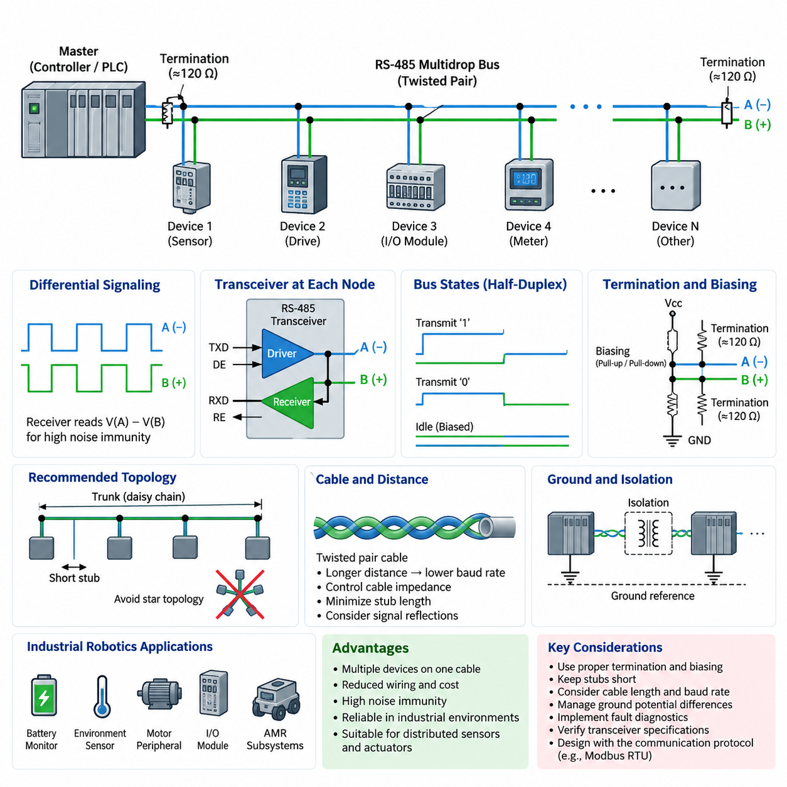
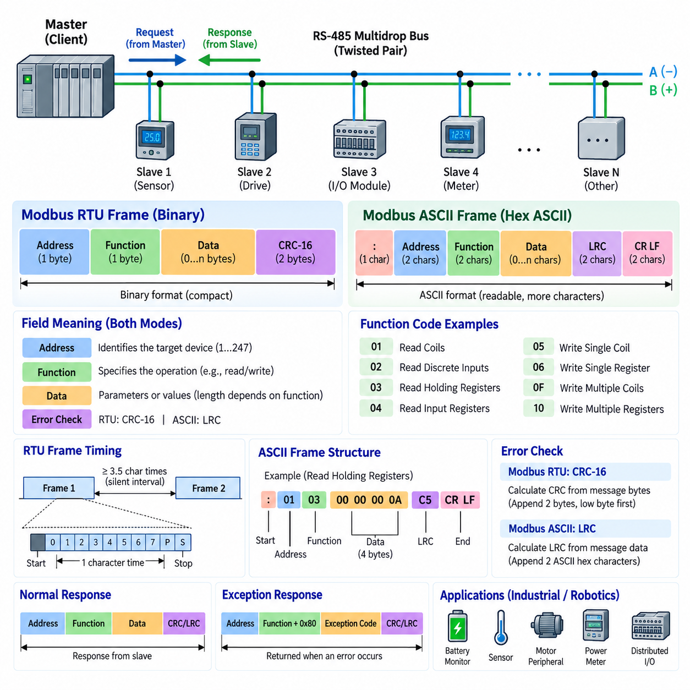
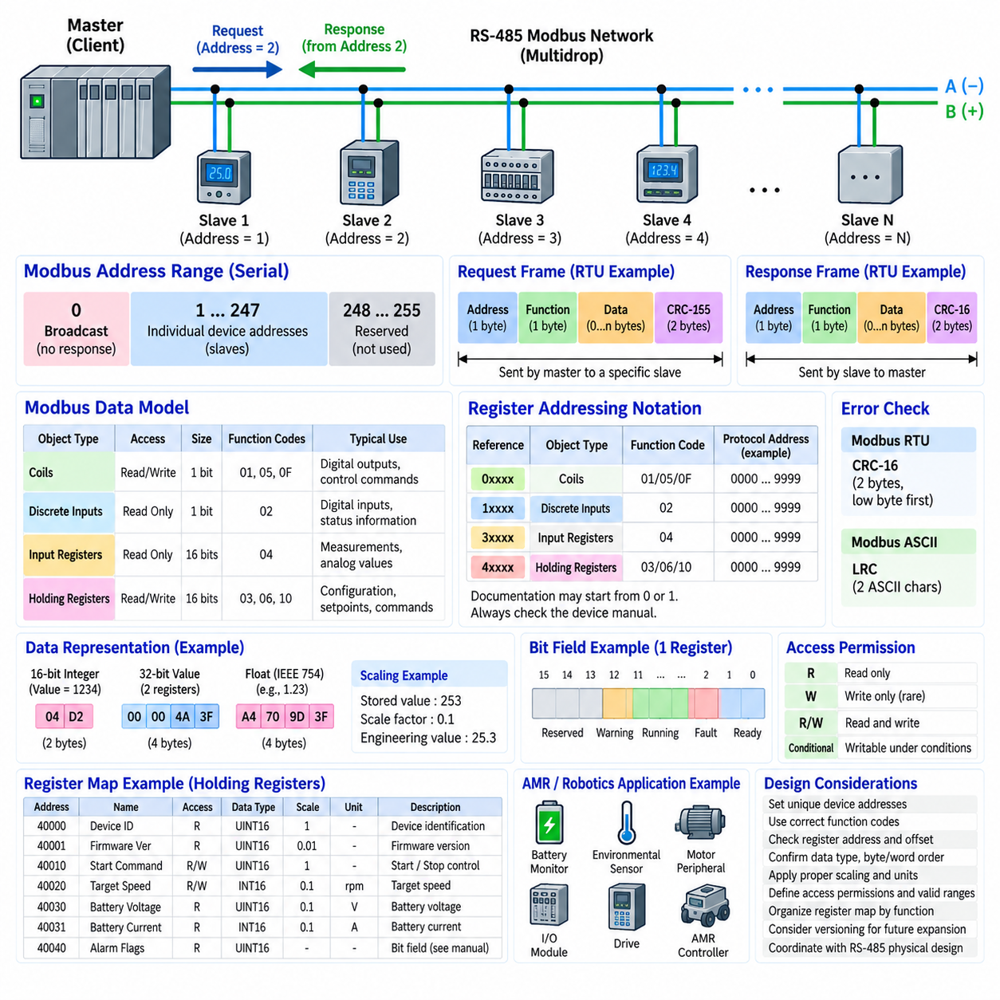
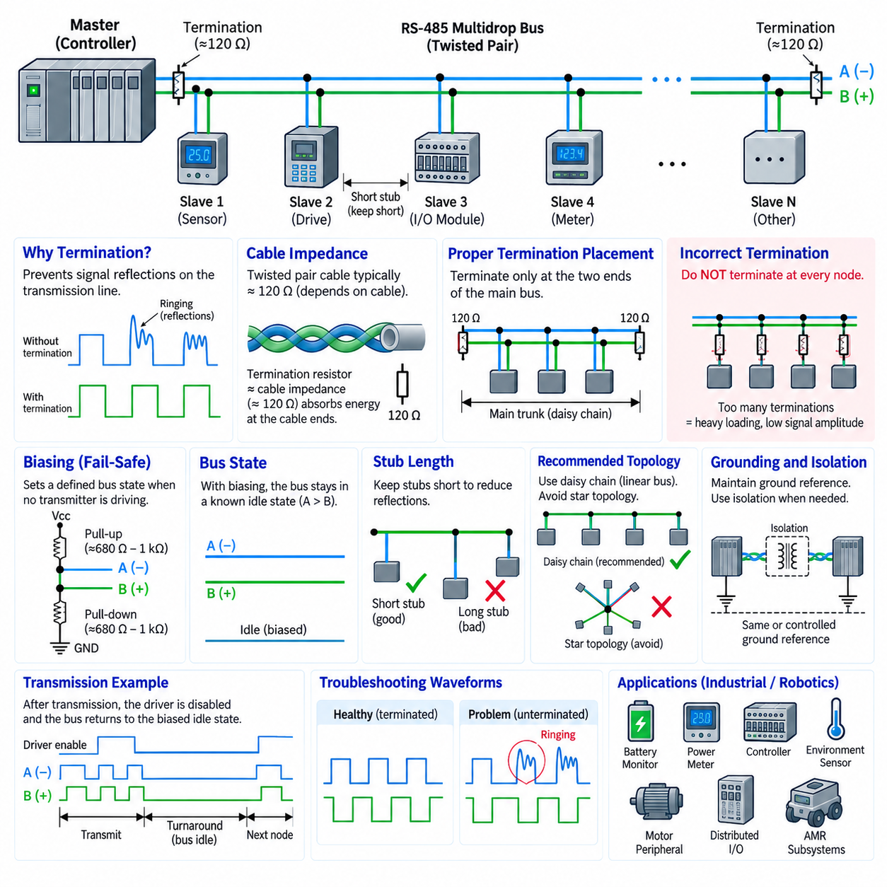
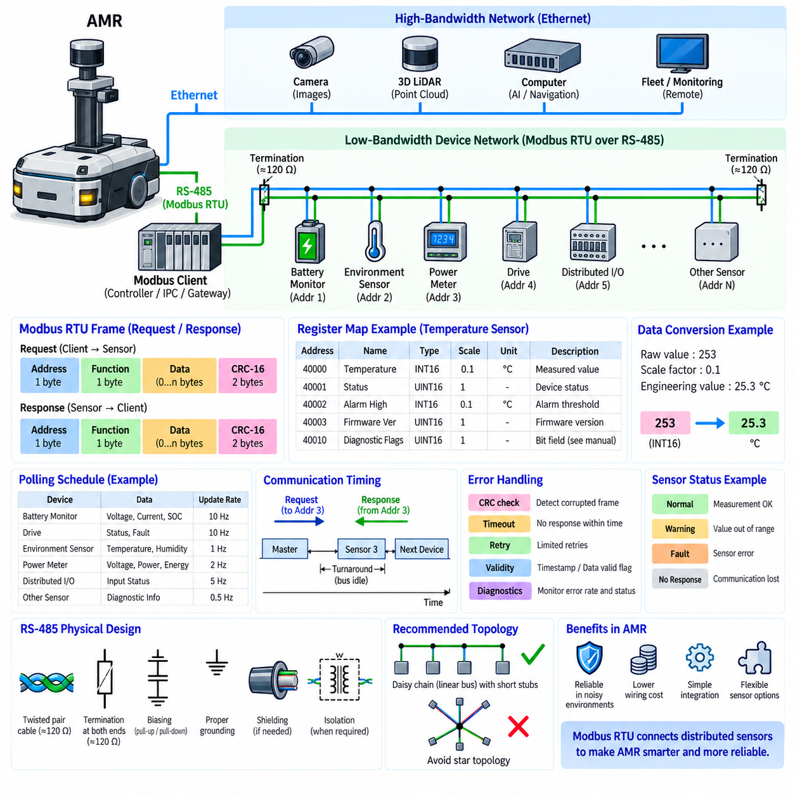

**Volume 07. Industrial Communication**


# Chapter 02. RS485 Modbus RTU

##  

## 02.01. RS485 Multidrop Architecture

{width="7.268055555555556in" height="7.268055555555556in"}

RS-485 is a differential serial communication standard designed for reliable data exchange across relatively long cables and electrically noisy industrial environments. Its most important architectural feature is the ability to connect multiple devices to the same physical communication pair. Unlike point-to-point interfaces, an RS-485 network can form a shared multidrop bus in which one communication medium serves controllers, sensors, drives, meters, and other distributed devices.

The physical layer normally uses a twisted pair carrying two complementary signal lines, commonly identified as A and B. A receiver determines the transmitted logic state from the voltage difference between these conductors rather than measuring either conductor directly against ground. Noise coupled approximately equally onto both wires therefore tends to appear as common-mode interference and can be rejected by the differential receiver, giving RS-485 strong noise immunity in industrial installations.

A multidrop architecture places several transceivers along one shared differential bus. Electrically, the preferred topology resembles a single trunk cable with devices attached using very short branches or stubs. This structure is fundamentally different from a star network. Long branches create impedance discontinuities and signal reflections, so physical placement, cable routing, termination, and stub length become increasingly important as communication speed or cable length increases.

RS-485 itself defines the electrical signaling method rather than a complete communication protocol. It does not inherently define device addresses, message formats, register structures, error-recovery procedures, or application semantics. These functions must be supplied by a higher-layer protocol. Modbus RTU is one of the most common examples, which is why RS-485 and Modbus RTU are frequently discussed together even though they represent different layers of the communication system.

A two-wire RS-485 network generally operates in half-duplex mode. All participating devices share the same differential pair, so transmission and reception occur on the same physical medium at different times. A transmitting node enables its driver, places data on the bus, and then releases the bus after transmission. Other devices must avoid transmitting simultaneously unless the higher-level protocol explicitly provides a mechanism capable of resolving access to the shared medium.

This shared-medium characteristic makes bus-access control essential. In a typical Modbus RTU installation, one client or master initiates communication and addressed server or slave devices respond when requested. Because only the selected device should respond, the protocol prevents arbitrary simultaneous transmissions. The RS-485 physical layer therefore provides multidrop electrical connectivity, while the communication protocol determines which node may transmit, when it may transmit, and how recipients interpret the data.

Each RS-485 node contains a differential driver and receiver, usually integrated into a transceiver. The transmitter converts logic-level data from a UART or communication controller into differential bus signals, while the receiver reconstructs logic-level data from the differential voltage. Driver-enable and receiver-enable signals may also be controlled by software or hardware so that a device can disconnect its transmitter electrically when it does not own the shared bus.

Three important electrical states can consequently appear on the bus: active transmission of one logical state, active transmission of the opposite state, and an idle condition in which participating transmitters are disabled. A multidrop network must maintain a predictable receiver state during idle intervals. Biasing resistors can establish a known differential voltage when no transmitter actively drives the pair, preventing an electrically floating bus from producing unstable or false transitions.

Termination addresses another physical-layer problem. A sufficiently long cable behaves as a transmission line rather than an ideal conductor, particularly when signal edge rates become significant relative to propagation delay. Reflections can occur when signals reach impedance discontinuities or unterminated cable ends. Terminating resistors are therefore normally placed at the two physical ends of the main RS-485 trunk and selected to approximate the characteristic impedance of the cable.

Termination should not be installed indiscriminately at every device. Multiple unnecessary terminating resistors excessively load the differential drivers and can reduce signal amplitude. Similarly, nodes located between the two ends of the trunk are normally connected without additional termination. Correct RS-485 design therefore requires engineers to distinguish physical endpoints from logical roles; the master does not automatically require termination simply because it controls communication.

Cable length, signaling rate, topology, transceiver characteristics, and electromagnetic conditions interact rather than forming independent design parameters. Longer networks generally require more conservative data rates, while high-speed communication demands tighter control of cable impedance, stub length, termination, and routing. Practical RS-485 engineering should therefore evaluate the complete physical channel instead of assuming that a nominal maximum distance or baud rate can be applied independently of installation conditions.

Ground reference must also be considered even though information is transmitted differentially. RS-485 receivers tolerate a specified range of common-mode voltage, but large ground-potential differences between remote devices can exceed that range. Industrial systems may therefore provide a reference conductor, galvanic isolation, or isolated power and transceivers where appropriate. Isolation is especially valuable when equipment is distributed across buildings, machinery, or power domains with substantial electrical disturbances.

The multidrop concept provides an important economic advantage because many devices can share one communication cable rather than requiring an independent serial connection for every endpoint. A PLC, industrial computer, or embedded controller can communicate with numerous distributed sensors and actuators through a compact wiring infrastructure. This reduces cable quantity, connector requirements, controller interface count, and installation complexity, particularly when relatively small amounts of cyclic or supervisory data are exchanged.

In robotics, RS-485 remains useful for devices whose bandwidth requirements are modest but whose wiring distance and noise environment make simple single-ended serial communication undesirable. Battery monitors, environmental sensors, power meters, motor-related peripherals, industrial I/O modules, and auxiliary controllers can be connected along a shared bus. The architecture is especially attractive when deterministic request-response communication is more important than high-bandwidth streaming.

An AMR may therefore contain several communication domains rather than relying on RS-485 for every subsystem. Cameras, LiDARs, and high-performance computing nodes commonly require higher-bandwidth networks, while lower-rate industrial devices can remain on RS-485. A gateway or embedded controller can collect information from these multidrop devices and expose processed data to higher-level computing through Ethernet or another network, creating a hierarchical communication architecture.

Fault behavior must be considered carefully because the shared bus creates common dependencies. A short circuit, incorrectly enabled transmitter, damaged termination, severe grounding problem, or malfunctioning node can affect communication with multiple devices. Diagnostic design should consequently include communication timeouts, CRC monitoring at the protocol layer, node-specific error counters, physical inspection points, and procedures for isolating defective branches or devices during maintenance.

Scalability is therefore not determined only by the theoretical number of transceivers supported by the electrical standard. Every additional node introduces electrical loading, connectors, stub capacitance, installation variation, and another possible failure location. Modern transceivers with reduced unit loading can support substantial node counts, but robust engineering still requires verification of the actual transceiver specifications, cable structure, termination arrangement, baud rate, environmental conditions, and protocol timing.

RS-485 multidrop architecture is best understood as a physical communication backbone rather than a complete networking solution. Differential signaling provides noise resistance, the shared trunk enables economical connection of distributed devices, and tri-state transmitters permit multiple nodes to use the same conductors. Reliable operation emerges only when topology, termination, biasing, grounding, timing, addressing, and higher-layer protocol behavior are engineered as one coordinated system.

RS-485는 비교적 긴 케이블과 전기적 잡음이 많은 산업 환경에서 신뢰성 높은 데이터 교환을 위해 설계된 차동 직렬 통신(Differential Serial Communication) 표준이다. 가장 중요한 아키텍처적 특징은 동일한 물리적 통신 선로에 여러 장치를 연결할 수 있다는 점이다. 지점 간 연결(Point-to-Point) 인터페이스와 달리 RS-485 네트워크는 하나의 통신 매체를 컨트롤러, 센서, 드라이브, 계측기 및 기타 분산 장치가 공유하는 멀티드롭 버스(Multidrop Bus)를 구성할 수 있다.

물리 계층(Physical Layer)은 일반적으로 A와 B로 표시되는 두 개의 상보적인 신호선을 전달하는 연선(Twisted Pair)을 사용한다. 수신기는 각 도체의 전압을 접지(Ground)를 기준으로 직접 측정하는 대신 두 도체 사이의 전압 차이를 이용하여 전송된 논리 상태를 판별한다. 따라서 두 선에 거의 동일하게 결합되는 잡음은 공통 모드 간섭(Common-Mode Interference)으로 나타나며 차동 수신기(Differential Receiver)에 의해 제거될 수 있어 산업 환경에서 높은 잡음 내성(Noise Immunity)을 제공한다.

멀티드롭 아키텍처(Multidrop Architecture)는 하나의 공유 차동 버스(Shared Differential Bus)를 따라 여러 개의 트랜시버(Transceiver)를 배치한다. 전기적으로 권장되는 토폴로지(Topology)는 하나의 주 트렁크 케이블(Trunk Cable)에 장치들이 매우 짧은 분기선 또는 스텁(Stub)을 통해 연결되는 형태이다. 이러한 구조는 스타 네트워크(Star Network)와 근본적으로 다르다. 긴 분기선은 임피던스 불연속(Impedance Discontinuity)과 신호 반사(Signal Reflection)를 발생시키므로 통신 속도나 케이블 길이가 증가할수록 장치 배치, 케이블 라우팅, 종단 및 스텁 길이 관리가 더욱 중요해진다.

RS-485 자체는 완전한 통신 프로토콜(Communication Protocol)이 아니라 전기적 신호 전달 방식(Electrical Signaling Method)을 정의한다. 따라서 장치 주소(Device Address), 메시지 형식(Message Format), 레지스터 구조(Register Structure), 오류 복구 절차(Error-Recovery Procedure), 애플리케이션 의미론(Application Semantics)을 자체적으로 정의하지 않는다. 이러한 기능은 상위 계층 프로토콜(Higher-Layer Protocol)이 제공해야 한다. Modbus RTU는 대표적인 사례이며, 이 때문에 RS-485와 Modbus RTU가 자주 함께 언급되지만 두 기술은 서로 다른 통신 계층을 담당한다.

2선식 RS-485 네트워크(Two-Wire RS-485 Network)는 일반적으로 반이중 통신(Half-Duplex Communication) 방식으로 동작한다. 모든 참여 장치가 동일한 차동 신호선 쌍을 공유하므로 송신과 수신은 동일한 물리적 매체에서 서로 다른 시간에 이루어진다. 송신 노드는 드라이버(Driver)를 활성화하고 버스에 데이터를 전송한 다음 전송이 완료되면 버스를 해제한다. 상위 계층 프로토콜이 공유 매체 접근을 해결하는 별도의 방법을 제공하지 않는다면 다른 장치들은 동시에 송신하지 않아야 한다.

이러한 공유 매체(Shared Medium)의 특성으로 인해 버스 접근 제어(Bus-Access Control)는 매우 중요하다. 일반적인 Modbus RTU 구성에서는 하나의 클라이언트 또는 마스터(Client or Master)가 통신을 시작하고 주소가 지정된 서버 또는 슬레이브(Server or Slave)가 요청에 응답한다. 선택된 장치만 응답해야 하므로 프로토콜을 통해 임의의 동시 송신을 방지한다. 따라서 RS-485 물리 계층은 멀티드롭 전기적 연결성을 제공하고, 통신 프로토콜은 어떤 노드가 언제 송신할 수 있으며 수신 장치가 데이터를 어떻게 해석하는지를 결정한다.

각 RS-485 노드(Node)는 차동 드라이버(Differential Driver)와 수신기(Receiver)를 포함하며 일반적으로 하나의 트랜시버(Transceiver)에 통합된다. 송신기는 UART 또는 통신 컨트롤러에서 전달된 논리 수준 데이터를 차동 버스 신호로 변환하고, 수신기는 차동 전압으로부터 다시 논리 수준 데이터를 복원한다. 또한 드라이버 활성화(Driver Enable)와 수신기 활성화(Receiver Enable) 신호를 소프트웨어 또는 하드웨어로 제어하여 해당 장치가 공유 버스를 사용하지 않을 때 송신기를 전기적으로 분리할 수 있다.

따라서 버스에는 하나의 논리 상태를 능동적으로 전송하는 상태, 반대 논리 상태를 능동적으로 전송하는 상태, 그리고 참여하는 모든 송신기가 비활성화된 유휴 상태(Idle State)가 존재할 수 있다. 멀티드롭 네트워크에서는 유휴 구간에서도 예측 가능한 수신 상태를 유지해야 한다. 바이어싱 저항(Biasing Resistor)을 이용하면 어떤 송신기도 차동 신호선을 능동적으로 구동하지 않을 때 일정한 차동 전압을 형성하여 전기적으로 부유하는 버스(Floating Bus)에서 불안정하거나 잘못된 신호 전이가 발생하는 것을 방지할 수 있다.

종단(Termination)은 또 다른 물리 계층 문제를 해결한다. 충분히 긴 케이블은 이상적인 도체가 아니라 전송선로(Transmission Line)로 동작하며, 특히 신호 에지 속도(Signal Edge Rate)가 전파 지연(Propagation Delay)에 비해 중요해지면 이러한 특성이 두드러진다. 신호가 임피던스 불연속 지점이나 종단되지 않은 케이블 끝에 도달하면 반사가 발생할 수 있다. 따라서 종단 저항(Termination Resistor)은 일반적으로 RS-485 주 트렁크의 물리적인 양쪽 끝에 배치하며 케이블의 특성 임피던스(Characteristic Impedance)에 근접하도록 선정한다.

종단 저항을 모든 장치에 무분별하게 설치해서는 안 된다. 불필요하게 많은 종단 저항은 차동 드라이버에 과도한 전기적 부하를 발생시키고 신호 진폭(Signal Amplitude)을 감소시킬 수 있다. 마찬가지로 트렁크의 두 끝 사이에 위치한 노드에는 일반적으로 추가적인 종단 저항을 설치하지 않는다. 따라서 올바른 RS-485 설계에서는 물리적 종단점(Physical Endpoint)과 논리적 역할(Logical Role)을 구분해야 하며, 마스터가 통신을 제어한다는 이유만으로 반드시 종단 저항을 가져야 하는 것은 아니다.

케이블 길이(Cable Length), 신호 전송 속도(Signaling Rate), 토폴로지, 트랜시버 특성(Transceiver Characteristics), 전자기 환경(Electromagnetic Environment)은 서로 독립적인 설계 변수가 아니라 상호 영향을 미친다. 일반적으로 네트워크가 길어질수록 보수적인 데이터 전송 속도가 요구되며, 고속 통신에서는 케이블 임피던스, 스텁 길이, 종단 및 배선 경로를 더욱 엄격하게 관리해야 한다. 따라서 실제 RS-485 설계에서는 명목상의 최대 거리나 전송 속도를 개별적으로 적용하기보다 전체 물리적 통신 채널(Physical Channel)을 종합적으로 평가해야 한다.

정보가 차동 방식으로 전송되더라도 접지 기준(Ground Reference)은 반드시 고려해야 한다. RS-485 수신기는 규정된 범위의 공통 모드 전압(Common-Mode Voltage)을 허용하지만 멀리 떨어진 장치 사이의 큰 접지 전위차(Ground-Potential Difference)는 이 범위를 초과할 수 있다. 따라서 산업 시스템에서는 필요에 따라 기준 도체(Reference Conductor), 갈바닉 절연(Galvanic Isolation), 절연 전원(Isolated Power), 절연형 트랜시버(Isolated Transceiver)를 사용할 수 있다. 특히 서로 다른 건물, 기계 또는 전력 도메인(Power Domain)에 장치가 분산된 환경에서는 절연이 매우 유용하다.

멀티드롭 개념은 각 장치마다 독립적인 직렬 연결을 구성하는 대신 여러 장치가 하나의 통신 케이블을 공유할 수 있기 때문에 중요한 경제적 장점을 제공한다. PLC, 산업용 컴퓨터(Industrial Computer), 임베디드 컨트롤러(Embedded Controller)는 하나의 간결한 배선 인프라를 통해 다수의 분산 센서와 액추에이터(Actuator)와 통신할 수 있다. 특히 비교적 적은 양의 주기적 데이터나 감시 데이터를 교환하는 시스템에서는 케이블 수량, 커넥터, 컨트롤러 인터페이스 수 및 설치 복잡성을 줄일 수 있다.

로보틱스(Robotics) 분야에서 RS-485는 대역폭 요구량은 크지 않지만 배선 거리가 길거나 잡음 환경으로 인해 단순한 단일 종단 직렬 통신(Single-Ended Serial Communication)을 사용하기 어려운 장치에 여전히 유용하다. 배터리 모니터(Battery Monitor), 환경 센서(Environmental Sensor), 전력 계측기(Power Meter), 모터 관련 주변 장치, 산업용 I/O 모듈(Industrial I/O Module), 보조 컨트롤러(Auxiliary Controller) 등을 하나의 공유 버스에 연결할 수 있다. 특히 고대역폭 스트리밍보다 결정론적인 요청-응답 통신(Deterministic Request-Response Communication)이 중요한 환경에 적합하다.

따라서 자율이동로봇(AMR)은 모든 서브시스템에 RS-485를 적용하는 대신 여러 개의 통신 도메인(Communication Domain)을 구성할 수 있다. 카메라(Camera), 라이다(LiDAR), 고성능 컴퓨팅 노드(High-Performance Computing Node)는 일반적으로 더 높은 대역폭의 네트워크를 필요로 하는 반면, 낮은 데이터 속도의 산업용 장치는 RS-485에 유지할 수 있다. 게이트웨이(Gateway) 또는 임베디드 컨트롤러는 이러한 멀티드롭 장치에서 정보를 수집하고 처리된 데이터를 이더넷(Ethernet) 등의 상위 네트워크에 제공함으로써 계층적 통신 아키텍처(Hierarchical Communication Architecture)를 구성할 수 있다.

공유 버스는 공통 의존성을 형성하므로 고장 동작(Fault Behavior)을 신중하게 고려해야 한다. 단락(Short Circuit), 잘못 활성화된 송신기, 손상된 종단, 심각한 접지 문제 또는 오동작하는 노드 하나가 여러 장치의 통신에 영향을 줄 수 있다. 따라서 진단 설계(Diagnostic Design)에는 통신 타임아웃(Communication Timeout), 프로토콜 계층의 CRC 모니터링, 노드별 오류 카운터(Error Counter), 물리적 검사 지점(Inspection Point), 유지보수 과정에서 고장난 분기나 장치를 격리할 수 있는 절차를 포함하는 것이 중요하다.

따라서 확장성(Scalability)은 전기 표준에서 이론적으로 지원하는 트랜시버 수만으로 결정되지 않는다. 노드가 추가될 때마다 전기적 부하(Electrical Loading), 커넥터, 스텁 커패시턴스(Stub Capacitance), 설치 편차 및 추가적인 잠재 고장 지점이 증가한다. 감소된 단위 부하(Reduced Unit Load)를 갖는 최신 트랜시버는 많은 노드를 지원할 수 있지만, 견고한 시스템 설계를 위해서는 실제 트랜시버 사양, 케이블 구조, 종단 구성, 전송 속도, 환경 조건 및 프로토콜 타이밍을 함께 검증해야 한다.

RS-485 멀티드롭 아키텍처(RS-485 Multidrop Architecture)는 완전한 네트워킹 솔루션(Networking Solution)이라기보다 물리적 통신 백본(Physical Communication Backbone)으로 이해하는 것이 적절하다. 차동 신호 방식은 높은 잡음 내성을 제공하고, 공유 트렁크 구조는 분산 장치를 경제적으로 연결하며, 3상태 송신기(Tri-State Transmitter)는 여러 노드가 동일한 도체를 공유할 수 있도록 한다. 신뢰성 있는 동작은 토폴로지, 종단, 바이어싱, 접지, 타이밍, 주소 지정 및 상위 계층 프로토콜 동작을 하나의 통합된 시스템으로 설계할 때 확보할 수 있다.

##  

## 02.02. Modbus RTU/ASCII Frame

{width="7.268055555555556in" height="7.268055555555556in"}

Modbus RTU and Modbus ASCII are serial message formats used to exchange structured information between devices over communication links such as RS-485. While RS-485 defines the electrical signaling and multidrop physical connection, Modbus defines how communicating devices organize requests and responses. Each message contains fields that identify the destination device, specify the requested operation, carry application data, and provide error-detection information.

A Modbus serial network commonly follows a client-server communication model, historically described as master-slave operation. The client initiates a transaction by transmitting a request addressed to a particular server, and the addressed server processes the request and returns an appropriate response. Other devices connected to the same RS-485 multidrop bus observe the transmission but normally remain silent because the address field identifies which device is expected to participate in the transaction.

A Modbus RTU frame is compact because message fields are transmitted primarily as binary values rather than printable characters. The basic frame consists of a device address, a function code, a variable-length data field, and a cyclic redundancy check. The address identifies the intended server, the function code describes the requested operation, the data field supplies parameters or returned values, and the CRC provides protection against transmission errors affecting the frame.

The address field occupies one byte in a conventional Modbus serial application data unit. Addresses are used to distinguish multiple servers sharing the same serial bus. A request sent by the client therefore contains the address of the device expected to execute the command. When that server generates a normal response, it returns its address as part of the response frame, allowing the client to associate the received information with the correct network participant.

The function code is another one-byte field and defines the type of operation being requested. Depending on the supported Modbus implementation, function codes can request the reading or writing of coils, discrete inputs, input registers, or holding registers. The meaning and length of the following data field depend on this function. Consequently, a receiver must interpret the function code before it can correctly decode the remaining application data contained within the frame.

The data field carries parameters associated with the selected function. A register-reading request may contain a starting register address and the number of registers to read, while the corresponding response can contain a byte count followed by the requested register values. A write request instead carries information describing the destination and value to be written. The frame structure therefore remains consistent while the internal interpretation of the data field changes according to the function code.

Modbus RTU uses a 16-bit cyclic redundancy check, commonly called CRC-16, for frame error detection. The transmitting device calculates the CRC from the relevant message bytes and appends the resulting value to the frame. The receiving device independently performs the same calculation and compares its result with the received CRC. If the values differ, the message is considered corrupted and is normally discarded rather than processed as a valid command or response.

Frame boundaries in Modbus RTU are strongly associated with communication timing. Because RTU messages do not contain printable start and end delimiters, a sufficiently long silent interval separates one frame from another. Traditionally, a silent period of at least 3.5 character times indicates the boundary between frames. Timing inside a frame is also constrained, making uninterrupted transmission important for allowing receivers to distinguish a complete message from separate or malformed transmissions.

The concept of character time depends on serial configuration and baud rate. A transmitted character includes not only the data bits but also serial framing elements such as start, parity when configured, and stop bits. Consequently, the absolute duration corresponding to 3.5 character times changes with communication speed. Implementations must therefore configure UART parameters and Modbus timing consistently across all devices participating in the serial network.

Modbus ASCII represents essentially the same protocol information differently. Instead of transmitting frame contents directly as compact binary bytes, the binary values are converted into hexadecimal ASCII characters. One data byte is therefore represented by two printable hexadecimal characters. This makes messages easier for a person to observe with a terminal or serial diagnostic tool, but it increases the number of transmitted characters and consequently reduces communication efficiency compared with RTU.

A Modbus ASCII frame uses explicit characters to identify its boundaries. The message begins with a colon character and normally ends with carriage-return and line-feed characters. Between these delimiters are ASCII representations of the address, function code, data, and error-checking value. Because the frame has visible delimiters, Modbus ASCII is less dependent on the short inter-character timing behavior that is important to RTU framing, although communication timing requirements still apply.

The error-checking method also differs between the two serial modes. Modbus RTU normally uses CRC-16, whereas Modbus ASCII uses a longitudinal redundancy check, or LRC. The LRC is calculated from the message data represented by the ASCII frame and appended before the terminating characters. Both mechanisms are intended to detect communication corruption, but RTU\'s CRC provides a stronger and widely preferred error-detection mechanism for compact industrial serial communication.

The difference between RTU and ASCII is therefore primarily a difference in serial encoding and framing rather than application meaning. A command to read a particular register can represent the same logical Modbus transaction in either mode, but its physical serial representation differs. RTU transmits compact binary bytes and relies significantly on silent timing intervals, whereas ASCII expands bytes into readable hexadecimal characters and uses explicit start and end delimiters.

RTU is generally preferred in modern RS-485 installations because its binary representation provides better bandwidth efficiency. A given amount of Modbus application data requires fewer transmitted characters than in ASCII mode, allowing shorter transaction times and better utilization of a shared multidrop bus. This advantage becomes important when a controller must periodically poll many sensors, drives, power devices, or distributed I/O modules within a limited communication cycle.

Modbus ASCII can nevertheless be useful in systems where human readability, simple serial monitoring, or compatibility with legacy equipment is more important than bandwidth efficiency. Because the transmitted characters can be viewed directly as hexadecimal text, troubleshooting with basic communication tools can be straightforward. However, engineers should not assume that RTU and ASCII devices can communicate merely because both implement Modbus; every device on a serial segment must use compatible framing and communication settings.

Normal responses generally return the requested function code together with the appropriate response data. If a server receives a valid request but cannot perform the requested operation, Modbus provides an exception-response mechanism. The response indicates that an exception occurred and supplies an exception code describing the general reason. This allows the client to distinguish protocol-level problems from situations in which no valid response was received because of wiring, timing, addressing, or device failures.

Reliable Modbus serial communication therefore depends on more than assembling address, function, data, and error-check fields. Both ends must agree on baud rate, data format, parity, stop-bit configuration, RTU or ASCII framing mode, device addressing, and interpretation of the register map. On RS-485 networks, these protocol requirements must additionally be coordinated with correct termination, biasing, grounding, topology, transmitter control, and multidrop bus-access behavior.

In industrial robots and AMRs, Modbus RTU can provide a practical interface for low-to-moderate-bandwidth equipment such as battery monitors, power meters, environmental sensors, motor-related peripherals, auxiliary controllers, and distributed I/O. Higher-bandwidth perception and computing traffic can remain on Ethernet-based networks while Modbus RTU handles conventional industrial devices, allowing the communication architecture to combine efficient local serial control with higher-level networked computing.

Understanding the Modbus RTU and ASCII frame formats establishes the foundation for interpreting later concepts such as device addresses, register maps, function codes, exception responses, timing, and diagnostics. RS-485 supplies the shared electrical transport, while Modbus serial framing transforms that transport into structured transactions. Correct system behavior emerges when physical-layer integrity, frame encoding, timing rules, error detection, and application-level register definitions are designed as a coordinated communication system.

Modbus RTU와 Modbus ASCII는 RS-485와 같은 통신 링크를 통해 장치 간에 구조화된 정보를 교환하기 위해 사용되는 직렬 메시지 형식(Serial Message Format)이다. RS-485가 전기적 신호 방식(Electrical Signaling)과 멀티드롭 물리 연결(Multidrop Physical Connection)을 정의한다면, Modbus는 통신 장치가 요청과 응답을 어떻게 구성하는지를 정의한다. 각 메시지에는 목적지 장치를 식별하고, 요청된 동작을 지정하며, 애플리케이션 데이터를 전달하고, 오류 검출 정보를 제공하는 필드가 포함된다.

Modbus 직렬 네트워크(Modbus Serial Network)는 일반적으로 클라이언트-서버 통신 모델(Client-Server Communication Model)을 따르며, 전통적으로는 마스터-슬레이브 동작(Master-Slave Operation)이라고 표현되었다. 클라이언트(Client)는 특정 서버(Server)를 주소로 지정하여 요청을 전송함으로써 트랜잭션(Transaction)을 시작하고, 해당 서버는 요청을 처리한 후 적절한 응답을 반환한다. 동일한 RS-485 멀티드롭 버스에 연결된 다른 장치들도 전송 신호를 관찰하지만, 주소 필드가 통신에 참여할 장치를 지정하므로 일반적으로 응답하지 않는다.

Modbus RTU 프레임(Modbus RTU Frame)은 메시지 필드가 인쇄 가능한 문자 대신 주로 이진 값(Binary Value)으로 전송되기 때문에 매우 간결하다. 기본 프레임은 장치 주소(Device Address), 기능 코드(Function Code), 가변 길이 데이터 필드(Variable-Length Data Field), 순환 중복 검사(Cyclic Redundancy Check)로 구성된다. 주소는 대상 서버를 식별하고, 기능 코드는 요청된 동작을 나타내며, 데이터 필드는 매개변수 또는 반환 값을 전달하고, CRC는 프레임에 발생할 수 있는 전송 오류를 검출한다.

일반적인 Modbus 직렬 애플리케이션 데이터 단위(Application Data Unit)에서 주소 필드(Address Field)는 1바이트를 차지한다. 주소는 동일한 직렬 버스를 공유하는 여러 서버를 구분하는 데 사용된다. 따라서 클라이언트가 전송하는 요청에는 명령을 수행해야 하는 장치의 주소가 포함된다. 해당 서버가 정상적인 응답을 생성할 때 자신의 주소를 응답 프레임에 포함하므로 클라이언트는 수신된 정보가 올바른 네트워크 참여 장치에서 전달되었는지 확인할 수 있다.

기능 코드(Function Code) 역시 1바이트 필드이며 요청되는 동작의 유형을 정의한다. 지원되는 Modbus 구현에 따라 기능 코드는 코일(Coil), 이산 입력(Discrete Input), 입력 레지스터(Input Register), 유지 레지스터(Holding Register)의 읽기 또는 쓰기를 요청할 수 있다. 이후에 이어지는 데이터 필드의 의미와 길이는 기능 코드에 따라 달라진다. 따라서 수신기는 프레임에 포함된 나머지 애플리케이션 데이터를 올바르게 해석하기 전에 기능 코드를 먼저 해석해야 한다.

데이터 필드(Data Field)는 선택된 기능과 관련된 매개변수를 전달한다. 레지스터 읽기 요청(Register-Reading Request)은 시작 레지스터 주소와 읽어야 할 레지스터 수를 포함할 수 있으며, 이에 대한 응답에는 바이트 수(Byte Count)와 요청된 레지스터 값이 포함될 수 있다. 반면 쓰기 요청(Write Request)은 기록할 대상과 값을 설명하는 정보를 전달한다. 따라서 전체 프레임 구조는 일관성을 유지하면서 데이터 필드 내부의 의미는 기능 코드에 따라 달라진다.

Modbus RTU는 프레임 오류 검출(Frame Error Detection)을 위해 일반적으로 CRC-16이라고 부르는 16비트 순환 중복 검사(16-bit Cyclic Redundancy Check)를 사용한다. 송신 장치는 관련 메시지 바이트를 이용하여 CRC를 계산하고 그 결과 값을 프레임 끝에 추가한다. 수신 장치는 동일한 계산을 독립적으로 수행한 뒤 계산 결과와 수신된 CRC를 비교한다. 두 값이 일치하지 않으면 메시지가 손상된 것으로 판단하고 일반적으로 유효한 명령이나 응답으로 처리하지 않고 폐기한다.

Modbus RTU에서 프레임 경계(Frame Boundary)는 통신 타이밍(Communication Timing)과 밀접하게 관련된다. RTU 메시지에는 인쇄 가능한 시작 및 종료 구분자(Start and End Delimiter)가 포함되지 않으므로 충분히 긴 무통신 구간(Silent Interval)을 이용하여 하나의 프레임과 다음 프레임을 구분한다. 전통적으로 최소 3.5 문자 시간(Character Time)의 무통신 구간이 프레임 사이의 경계를 나타낸다. 프레임 내부의 타이밍도 제한되므로 수신기가 완전한 메시지를 분리되거나 비정상적인 전송과 구별할 수 있도록 중단 없는 전송이 중요하다.

문자 시간(Character Time)의 개념은 직렬 통신 설정과 보드율(Baud Rate)에 따라 달라진다. 하나의 전송 문자는 데이터 비트뿐만 아니라 시작 비트(Start Bit), 설정된 경우의 패리티 비트(Parity Bit), 정지 비트(Stop Bit)와 같은 직렬 프레이밍 요소를 포함한다. 따라서 3.5 문자 시간에 해당하는 실제 시간은 통신 속도에 따라 달라진다. 직렬 네트워크에 참여하는 모든 장치는 UART 매개변수와 Modbus 타이밍을 일관되게 설정해야 한다.

Modbus ASCII는 본질적으로 동일한 프로토콜 정보를 다른 방식으로 표현한다. 프레임 내용을 압축된 이진 바이트(Binary Byte) 형태로 직접 전송하는 대신 이진 값을 16진수 ASCII 문자(Hexadecimal ASCII Character)로 변환한다. 따라서 하나의 데이터 바이트는 두 개의 인쇄 가능한 16진수 문자로 표현된다. 이 방식은 사람이 터미널이나 직렬 진단 도구를 통해 메시지를 쉽게 확인할 수 있도록 하지만 전송 문자 수가 증가하므로 RTU에 비해 통신 효율이 낮아진다.

Modbus ASCII 프레임(Modbus ASCII Frame)은 프레임 경계를 식별하기 위해 명시적인 문자(Explicit Character)를 사용한다. 메시지는 콜론 문자(Colon Character)로 시작하고 일반적으로 캐리지 리턴(Carriage Return)과 라인 피드(Line Feed) 문자로 종료된다. 이러한 구분자 사이에는 주소, 기능 코드, 데이터 및 오류 검사 값의 ASCII 표현이 위치한다. 프레임에 명확한 구분자가 존재하기 때문에 Modbus ASCII는 RTU 프레이밍에서 중요한 짧은 문자 간 타이밍(Inter-Character Timing)에 상대적으로 덜 의존하지만 통신 타이밍 요구사항 자체가 없어지는 것은 아니다.

오류 검사 방법(Error-Checking Method)에서도 두 직렬 모드는 차이가 있다. Modbus RTU는 일반적으로 CRC-16을 사용하는 반면 Modbus ASCII는 종방향 중복 검사(Longitudinal Redundancy Check), 즉 LRC를 사용한다. LRC는 ASCII 프레임으로 표현되는 메시지 데이터를 기반으로 계산되어 종료 문자 앞에 추가된다. 두 방식 모두 통신 중 데이터 손상을 검출하기 위한 것이지만 RTU의 CRC는 압축된 산업용 직렬 통신에서 더욱 강력하고 널리 사용되는 오류 검출 방법을 제공한다.

따라서 RTU와 ASCII의 차이는 애플리케이션 의미(Application Meaning)의 차이라기보다 주로 직렬 인코딩(Serial Encoding)과 프레이밍(Framing) 방식의 차이이다. 특정 레지스터를 읽는 명령은 두 모드에서 동일한 논리적 Modbus 트랜잭션을 나타낼 수 있지만 실제 직렬 전송 표현은 서로 다르다. RTU는 압축된 이진 바이트를 전송하고 무통신 타이밍 구간에 크게 의존하는 반면, ASCII는 바이트를 사람이 읽을 수 있는 16진수 문자로 확장하고 명시적인 시작 및 종료 구분자를 사용한다.

RTU는 이진 표현(Binary Representation)을 통해 더 높은 대역폭 효율(Bandwidth Efficiency)을 제공하기 때문에 현대 RS-485 시스템에서 일반적으로 선호된다. 동일한 양의 Modbus 애플리케이션 데이터를 전송할 때 ASCII보다 필요한 전송 문자 수가 적으므로 트랜잭션 시간을 단축하고 공유 멀티드롭 버스를 더욱 효율적으로 활용할 수 있다. 이러한 장점은 하나의 컨트롤러가 제한된 통신 주기 내에서 다수의 센서, 드라이브, 전력 장치 또는 분산 I/O 모듈을 주기적으로 폴링(Polling)해야 할 때 특히 중요하다.

그러나 Modbus ASCII는 대역폭 효율보다 사람이 읽을 수 있는 형태(Human Readability), 간단한 직렬 모니터링(Serial Monitoring), 기존 장비와의 호환성(Legacy Equipment Compatibility)이 중요한 시스템에서 유용할 수 있다. 전송되는 문자를 16진수 텍스트로 직접 확인할 수 있기 때문에 기본적인 통신 도구를 이용한 문제 해결이 비교적 간단하다. 하지만 두 장치가 모두 Modbus를 지원한다는 이유만으로 RTU 장치와 ASCII 장치가 서로 통신할 수 있다고 가정해서는 안 되며, 하나의 직렬 세그먼트에 존재하는 모든 장치는 호환되는 프레이밍 방식과 통신 설정을 사용해야 한다.

정상 응답(Normal Response)은 일반적으로 요청된 기능 코드와 적절한 응답 데이터를 함께 반환한다. 서버가 유효한 요청을 수신했지만 요청된 동작을 수행할 수 없는 경우 Modbus는 예외 응답 메커니즘(Exception-Response Mechanism)을 제공한다. 응답에는 예외가 발생했음을 나타내는 정보와 일반적인 원인을 설명하는 예외 코드(Exception Code)가 포함된다. 이를 통해 클라이언트는 프로토콜 수준의 문제와 배선, 타이밍, 주소 지정 또는 장치 고장으로 인해 유효한 응답 자체를 받지 못한 상황을 구분할 수 있다.

따라서 신뢰성 높은 Modbus 직렬 통신(Reliable Modbus Serial Communication)을 구현하려면 주소, 기능, 데이터 및 오류 검사 필드를 조립하는 것만으로는 충분하지 않다. 통신 양쪽 장치는 보드율, 데이터 형식(Data Format), 패리티(Parity), 정지 비트 설정(Stop-Bit Configuration), RTU 또는 ASCII 프레이밍 모드, 장치 주소 지정(Device Addressing), 레지스터 맵(Register Map)의 해석을 동일하게 설정해야 한다. RS-485 네트워크에서는 이러한 프로토콜 요구사항과 함께 올바른 종단(Termination), 바이어싱(Biasing), 접지(Grounding), 토폴로지, 송신기 제어 및 멀티드롭 버스 접근 동작도 함께 조정해야 한다.

산업용 로봇(Industrial Robot)과 자율이동로봇(AMR)에서 Modbus RTU는 배터리 모니터(Battery Monitor), 전력 계측기(Power Meter), 환경 센서(Environmental Sensor), 모터 관련 주변 장치(Motor-Related Peripheral), 보조 컨트롤러(Auxiliary Controller), 분산 I/O(Distributed I/O)와 같은 낮거나 중간 수준의 대역폭을 요구하는 장비에 실용적인 인터페이스를 제공할 수 있다. 고대역폭 인지 및 컴퓨팅 트래픽은 이더넷 기반 네트워크(Ethernet-Based Network)를 사용하면서 기존 산업 장치는 Modbus RTU로 처리함으로써 효율적인 로컬 직렬 제어와 상위 수준 네트워크 컴퓨팅을 결합할 수 있다.

Modbus RTU와 ASCII 프레임 형식(Frame Format)을 이해하는 것은 이후에 다루게 될 장치 주소(Device Address), 레지스터 맵(Register Map), 기능 코드(Function Code), 예외 응답(Exception Response), 타이밍(Timing), 진단(Diagnostics) 등의 개념을 이해하기 위한 기반이 된다. RS-485가 공유 전기적 전송 수단(Shared Electrical Transport)을 제공한다면 Modbus 직렬 프레이밍은 이러한 전송 수단을 구조화된 트랜잭션으로 변환한다. 물리 계층의 무결성, 프레임 인코딩, 타이밍 규칙, 오류 검출 및 애플리케이션 수준의 레지스터 정의를 하나의 통합된 통신 시스템으로 설계할 때 올바르고 신뢰성 높은 시스템 동작을 확보할 수 있다.

##  

## 02.03. Modbus Address and Register Map

{width="7.268055555555556in" height="7.268055555555556in"}

Modbus addressing provides the logical structure that allows one controller to communicate with many devices and access specific data inside each device. On an RS-485 multidrop network, the device address identifies the intended Modbus server, while the register map identifies the information or control point inside that server. Together, these mechanisms transform a shared serial bus into an organized interface for distributed industrial equipment.

In a typical Modbus RTU transaction, the client places the destination server address at the beginning of the request frame. Every server connected to the shared RS-485 bus can electrically receive the transmission, but each device examines the address before processing the request. Only the addressed server normally executes the requested function and returns a response, allowing many independent devices to coexist on the same physical communication medium.

Traditional Modbus serial addressing reserves address 0 for broadcast communication and normally uses addresses 1 through 247 for individually addressed servers. A broadcast request can be used for operations intended for multiple devices, but servers do not return individual responses because simultaneous replies would create collisions on a shared RS-485 bus. Addresses above the normal server range are reserved or unavailable for ordinary device addressing under the standard convention.

Device addressing and data addressing represent two different levels of identification. The device address answers the question of which physical or logical server should process a message, while the data address identifies which coil, discrete input, input register, or holding register is involved. A complete transaction therefore combines a server address, a function code, and one or more data addresses to define precisely where an operation should occur.

The Modbus data model traditionally divides accessible information into four principal object types. Coils represent single-bit read/write values, discrete inputs represent single-bit read-only values, input registers represent 16-bit read-only values, and holding registers represent 16-bit read/write values. This separation allows device designers to distinguish status information, digital commands, measured values, configuration parameters, and control variables through a consistent logical organization.

Coils are commonly associated with binary outputs or writable Boolean states. A coil may represent commands such as enabling a subsystem, activating an output, resetting a condition, or requesting an operating mode. Although the historical terminology originates from PLC relay logic, modern Modbus devices can map coils to software flags or internal control states. Their actual engineering meaning must therefore be defined by the device manufacturer\'s register map.

Discrete inputs provide single-bit information that the client can read but does not normally write through the corresponding Modbus object type. They are suitable for states such as limit-switch activation, alarm status, interlock conditions, digital sensor states, or hardware-ready indications. The term "input" describes the Modbus data model rather than requiring the information to originate directly from a physical electrical input.

Input registers contain 16-bit values intended primarily for read access. Industrial devices frequently use them for measurements or status quantities such as voltage, current, temperature, speed, pressure, or sensor readings. However, Modbus defines the communication representation rather than the engineering unit or scaling rule. The register map must therefore explain whether a value represents raw counts, scaled integers, encoded status information, or part of a larger data type.

Holding registers are among the most widely used Modbus objects because they support both reading and writing. They can contain configuration parameters, operating commands, thresholds, calibration values, setpoints, or internal state information. A controller can read the current contents and, where permitted by the device implementation, write new values. This flexibility makes holding registers especially important when integrating configurable sensors, drives, controllers, and robotic subsystems.

A register map is the specification that assigns engineering meaning to these logical data locations. A useful map normally identifies the register or object address, access type, data representation, scaling, engineering unit, valid range, default value, and functional description. Without this information, receiving a valid Modbus frame is insufficient because the client may know the numerical contents of a register without knowing what the value physically represents.

One important source of integration errors is the distinction between register reference notation and the actual address transmitted in a Modbus protocol data unit. Documentation may describe objects using familiar ranges such as 0xxxx, 1xxxx, 3xxxx, and 4xxxx, while the protocol request carries a relative data address associated with the selected function code. Implementations can also differ in whether documentation begins numbering at zero or one, creating the well-known zero-based versus one-based addressing problem.

For this reason, engineers should not determine a transmitted address merely by looking at a displayed register number. The device documentation should explicitly state the Modbus function code, logical register reference, and protocol address or offset expected in the request. A one-register displacement can produce values that appear technically valid while actually belonging to neighboring parameters, making addressing errors particularly difficult to diagnose when no communication exception occurs.

The function code provides essential context for interpreting a data address. The same numerical offset does not necessarily refer to the same type of information when used with different Modbus functions. Reading coils, reading discrete inputs, reading input registers, and reading holding registers operate on different logical object spaces. Consequently, a robust register-map specification should associate every accessible item with both its address and the function or access method used to reach it.

Because a basic Modbus register is 16 bits wide, larger data types require multiple consecutive registers. A 32-bit integer or IEEE 754 floating-point value typically occupies two registers, while a 64-bit value requires four. Modbus does not universally define how every manufacturer must order bytes and words for these multi-register values, so byte order and word order must be documented and verified between communicating devices.

Scaling is equally important because many embedded devices avoid transmitting floating-point values directly. A temperature of 25.3 degrees, for example, might be stored as the integer 253 with a scale factor of 0.1. Voltage, current, position, velocity, pressure, battery state, and other quantities can use similar conventions. The register map must specify these conversion rules so that application software can reconstruct meaningful engineering values from the transmitted integers.

Some registers use individual bits as status or control flags rather than treating the entire 16-bit word as one numerical quantity. One bit may indicate a warning, another an operating state, and another a communication or hardware fault. In such cases, the register-map definition should include a bit-field description showing the meaning of each implemented bit and identifying reserved bits that software should ignore or preserve when appropriate.

Access permissions should also be explicit. Registers may be read-only, write-only in unusual implementations, read/write, or writable only under particular operating conditions. Certain configuration values may require the machine to be stopped, while command registers may trigger immediate physical actions. Industrial and robotic software should therefore treat register writes as controlled operations rather than assuming that every holding register can safely accept arbitrary values.

A well-designed register map should reserve logical regions for related information instead of assigning addresses randomly. Device identification, operating status, sensor measurements, commands, configuration parameters, diagnostics, and fault history can occupy separate address ranges. Such organization simplifies software development and troubleshooting while leaving unused address space for future firmware expansion without forcing existing interfaces to change.

Register-map versioning becomes important when firmware evolves. Adding new registers is usually easier to manage than changing the meaning of existing ones because deployed PLC, gateway, robot, or supervisory software may depend on established addresses. Device identification registers can therefore include firmware or interface-version information, allowing client software to determine which capabilities and register definitions are available before using optional features.

For an AMR, a Modbus register map might expose battery voltage, current, state information, environmental measurements, auxiliary I/O status, peripheral alarms, and equipment commands through one or more RS-485 devices. The AMR controller can periodically poll these registers and translate them into internal software states, while higher-bandwidth perception and planning data remain on Ethernet-based networks. This creates a practical separation between industrial device communication and compute-intensive robot networking.

Reliable Modbus integration ultimately depends on treating the address and register map as a formal interface contract. Engineers must agree not only on server addresses but also on function codes, protocol offsets, object types, data widths, byte and word ordering, scaling, units, access permissions, valid ranges, and exception behavior. When these definitions are documented consistently, Modbus provides a simple and effective mechanism for connecting heterogeneous industrial and robotic devices through a shared communication architecture.

Modbus 주소 지정(Modbus Addressing)은 하나의 컨트롤러가 여러 장치와 통신하고 각 장치 내부의 특정 데이터에 접근할 수 있도록 하는 논리적 구조를 제공한다. RS-485 멀티드롭 네트워크(RS-485 Multidrop Network)에서 장치 주소(Device Address)는 통신 대상인 Modbus 서버(Server)를 식별하고, 레지스터 맵(Register Map)은 해당 서버 내부에서 접근할 정보 또는 제어 지점을 식별한다. 이 두 가지 메커니즘을 통해 하나의 공유 직렬 버스를 분산 산업 장비를 위한 체계적인 인터페이스로 구성할 수 있다.

일반적인 Modbus RTU 트랜잭션(Modbus RTU Transaction)에서 클라이언트(Client)는 요청 프레임의 시작 부분에 대상 서버 주소(Destination Server Address)를 배치한다. 공유 RS-485 버스에 연결된 모든 서버는 전기적으로 전송 신호를 수신할 수 있지만 각 장치는 요청을 처리하기 전에 주소를 확인한다. 일반적으로 주소가 일치하는 서버만 요청된 기능을 수행하고 응답을 반환하므로 여러 독립적인 장치가 동일한 물리적 통신 매체에 함께 존재할 수 있다.

전통적인 Modbus 직렬 주소 지정(Modbus Serial Addressing)에서는 주소 0을 브로드캐스트 통신(Broadcast Communication)을 위해 예약하고 일반적으로 주소 1부터 247까지를 개별 서버 주소로 사용한다. 브로드캐스트 요청은 여러 장치에 적용되는 동작에 사용할 수 있지만, 공유 RS-485 버스에서 여러 서버가 동시에 응답하면 충돌이 발생하기 때문에 서버들은 개별 응답을 반환하지 않는다. 일반적인 서버 주소 범위를 초과하는 주소는 표준 규칙에 따라 예약되거나 일반 장치 주소 지정에는 사용할 수 없다.

장치 주소 지정(Device Addressing)과 데이터 주소 지정(Data Addressing)은 서로 다른 두 수준의 식별 방법이다. 장치 주소는 어떤 물리적 또는 논리적 서버가 메시지를 처리해야 하는지를 나타내며, 데이터 주소는 어떤 코일(Coil), 이산 입력(Discrete Input), 입력 레지스터(Input Register), 유지 레지스터(Holding Register)를 대상으로 하는지를 나타낸다. 따라서 하나의 완전한 트랜잭션은 서버 주소, 기능 코드(Function Code), 하나 이상의 데이터 주소를 조합하여 동작이 수행될 정확한 위치를 정의한다.

Modbus 데이터 모델(Modbus Data Model)은 전통적으로 접근 가능한 정보를 네 가지 주요 객체 유형(Object Type)으로 구분한다. 코일(Coil)은 읽기/쓰기가 가능한 단일 비트 값을 나타내고, 이산 입력(Discrete Input)은 읽기 전용 단일 비트 값을 나타낸다. 입력 레지스터(Input Register)는 읽기 전용 16비트 값을 나타내며, 유지 레지스터(Holding Register)는 읽기/쓰기가 가능한 16비트 값을 나타낸다. 이러한 구분을 통해 상태 정보, 디지털 명령, 측정값, 설정 매개변수 및 제어 변수를 일관된 논리 구조로 구성할 수 있다.

코일(Coil)은 일반적으로 이진 출력(Binary Output) 또는 쓰기가 가능한 불리언 상태(Boolean State)와 연관된다. 코일은 서브시스템 활성화, 출력 작동, 특정 상태 초기화 또는 운전 모드 요청과 같은 명령을 표현할 수 있다. 이러한 용어는 PLC 릴레이 로직(PLC Relay Logic)에서 유래했지만 현대 Modbus 장치에서는 코일을 소프트웨어 플래그(Software Flag)나 내부 제어 상태에 매핑할 수도 있다. 따라서 실제 공학적 의미는 장치 제조업체의 레지스터 맵에 정의되어야 한다.

이산 입력(Discrete Input)은 클라이언트가 읽을 수 있지만 해당 Modbus 객체 유형을 통해 일반적으로 쓸 수 없는 단일 비트 정보를 제공한다. 리미트 스위치 작동(Limit-Switch Activation), 경보 상태(Alarm Status), 인터록 조건(Interlock Condition), 디지털 센서 상태 또는 하드웨어 준비 상태(Hardware-Ready Indication) 등에 적합하다. 여기서 입력(Input)이라는 용어는 Modbus 데이터 모델을 의미하며 반드시 정보가 실제 물리적 전기 입력에서 직접 발생해야 한다는 의미는 아니다.

입력 레지스터(Input Register)는 주로 읽기 접근(Read Access)을 목적으로 하는 16비트 값을 저장한다. 산업 장치에서는 전압, 전류, 온도, 속도, 압력 또는 센서 측정값과 같은 상태량이나 측정량을 표현하는 데 자주 사용한다. 그러나 Modbus는 통신상의 표현 방식만 정의할 뿐 공학 단위(Engineering Unit)나 스케일링 규칙(Scaling Rule)은 정의하지 않는다. 따라서 레지스터 맵에는 값이 원시 카운트(Raw Count), 스케일된 정수, 인코딩된 상태 정보 또는 더 큰 데이터 형식의 일부인지 명확하게 설명되어야 한다.

유지 레지스터(Holding Register)는 읽기와 쓰기를 모두 지원하기 때문에 가장 널리 사용되는 Modbus 객체 중 하나이다. 설정 매개변수(Configuration Parameter), 운전 명령, 임계값(Threshold), 보정 값(Calibration Value), 설정값(Setpoint), 내부 상태 정보를 저장할 수 있다. 컨트롤러는 현재 내용을 읽고 장치 구현에서 허용하는 경우 새로운 값을 기록할 수 있다. 이러한 유연성 때문에 유지 레지스터는 설정 가능한 센서, 드라이브, 컨트롤러 및 로봇 서브시스템 통합에서 특히 중요하다.

레지스터 맵(Register Map)은 이러한 논리적 데이터 위치에 공학적 의미를 부여하는 사양이다. 유용한 레지스터 맵에는 일반적으로 레지스터 또는 객체 주소, 접근 유형(Access Type), 데이터 표현(Data Representation), 스케일링, 공학 단위, 유효 범위(Valid Range), 기본값(Default Value), 기능 설명이 포함된다. 이러한 정보가 없다면 유효한 Modbus 프레임을 수신하더라도 클라이언트는 레지스터의 숫자 값만 알 수 있을 뿐 그 값이 물리적으로 무엇을 의미하는지 판단할 수 없다.

통합 과정에서 자주 발생하는 오류 중 하나는 레지스터 참조 표기(Register Reference Notation)와 실제 Modbus 프로토콜 데이터 단위(Protocol Data Unit)에 전송되는 주소의 차이에서 발생한다. 문서에서는 0xxxx, 1xxxx, 3xxxx, 4xxxx와 같은 익숙한 범위로 객체를 표현할 수 있지만 실제 프로토콜 요청에서는 선택된 기능 코드에 대응하는 상대 데이터 주소(Relative Data Address)가 전달된다. 또한 구현에 따라 문서상의 번호가 0 또는 1부터 시작할 수 있어 잘 알려진 0 기반 주소 지정(Zero-Based Addressing)과 1 기반 주소 지정(One-Based Addressing) 문제가 발생한다.

따라서 엔지니어는 표시된 레지스터 번호만 보고 실제 전송 주소를 결정해서는 안 된다. 장치 문서에는 Modbus 기능 코드, 논리적 레지스터 참조(Logical Register Reference), 요청에서 사용해야 하는 프로토콜 주소 또는 오프셋(Protocol Address or Offset)이 명확하게 정의되어야 한다. 하나의 레지스터만큼 주소가 어긋나도 기술적으로는 정상적인 값이 수신될 수 있지만 실제로는 인접한 다른 매개변수의 값일 수 있으므로 통신 예외가 발생하지 않는 주소 오류는 특히 진단하기 어렵다.

기능 코드(Function Code)는 데이터 주소를 해석하는 데 필수적인 문맥을 제공한다. 동일한 숫자의 오프셋이라도 서로 다른 Modbus 기능과 함께 사용하면 반드시 동일한 유형의 정보를 의미하는 것은 아니다. 코일 읽기, 이산 입력 읽기, 입력 레지스터 읽기, 유지 레지스터 읽기는 서로 다른 논리적 객체 공간(Logical Object Space)을 대상으로 동작한다. 따라서 견고한 레지스터 맵 사양에서는 접근 가능한 모든 항목에 대해 주소뿐만 아니라 해당 항목에 접근하기 위한 기능 또는 접근 방법도 함께 정의해야 한다.

기본 Modbus 레지스터는 16비트 폭이므로 더 큰 데이터 형식(Data Type)은 여러 개의 연속된 레지스터를 사용해야 한다. 32비트 정수 또는 IEEE 754 부동소수점 값(Floating-Point Value)은 일반적으로 두 개의 레지스터를 사용하고, 64비트 값은 네 개의 레지스터를 사용한다. Modbus는 모든 제조업체가 다중 레지스터 값의 바이트와 워드를 어떤 순서로 배치해야 하는지를 보편적으로 정의하지 않으므로 통신 장치 사이에서 바이트 순서(Byte Order)와 워드 순서(Word Order)를 문서화하고 검증해야 한다.

스케일링(Scaling) 역시 중요하다. 많은 임베디드 장치는 부동소수점 값을 직접 전송하지 않고 정수 값과 스케일 계수(Scale Factor)를 사용하기 때문이다. 예를 들어 25.3도의 온도를 253이라는 정수와 0.1의 스케일 계수로 저장할 수 있다. 전압, 전류, 위치, 속도, 압력, 배터리 상태 등도 이와 유사한 방식을 사용할 수 있다. 따라서 애플리케이션 소프트웨어가 전송된 정수로부터 의미 있는 공학 값을 복원할 수 있도록 레지스터 맵에서 변환 규칙을 명확하게 정의해야 한다.

일부 레지스터는 전체 16비트 워드를 하나의 숫자 값으로 처리하는 대신 개별 비트를 상태 또는 제어 플래그(Status or Control Flag)로 사용한다. 하나의 비트는 경고를 나타내고 다른 비트는 운전 상태를 나타내며 또 다른 비트는 통신 또는 하드웨어 고장을 나타낼 수 있다. 이러한 경우 레지스터 맵 정의에는 구현된 각 비트의 의미를 보여주는 비트 필드 설명(Bit-Field Description)이 포함되어야 하며, 소프트웨어가 필요에 따라 무시하거나 보존해야 하는 예약 비트(Reserved Bit)도 식별해야 한다.

접근 권한(Access Permission) 역시 명확하게 정의해야 한다. 레지스터는 읽기 전용(Read-Only), 일부 특수 구현에서의 쓰기 전용(Write-Only), 읽기/쓰기(Read/Write), 또는 특정 운전 조건에서만 쓰기가 가능한 형태로 구성될 수 있다. 일부 설정 값은 장비가 정지된 상태에서만 변경할 수 있고, 명령 레지스터(Command Register)에 값을 기록하면 즉시 물리적인 동작이 발생할 수도 있다. 따라서 산업 및 로봇 소프트웨어에서는 모든 유지 레지스터에 임의의 값을 안전하게 기록할 수 있다고 가정하지 말고 레지스터 쓰기를 통제된 동작으로 처리해야 한다.

잘 설계된 레지스터 맵은 주소를 임의로 할당하는 대신 관련 정보별로 논리적 영역(Logical Region)을 구분해야 한다. 장치 식별(Device Identification), 운전 상태, 센서 측정값, 명령, 설정 매개변수, 진단(Diagnostics), 고장 이력(Fault History)을 서로 다른 주소 범위에 배치할 수 있다. 이러한 구조는 소프트웨어 개발과 문제 해결을 단순화하고 향후 펌웨어 기능 확장을 위한 미사용 주소 공간을 확보하여 기존 인터페이스를 변경하지 않고 새로운 기능을 추가할 수 있도록 한다.

펌웨어(Firmware)가 발전함에 따라 레지스터 맵 버전 관리(Register-Map Versioning)도 중요해진다. 이미 배포된 PLC, 게이트웨이(Gateway), 로봇 또는 상위 감시 소프트웨어가 기존 주소에 의존할 수 있으므로 기존 레지스터의 의미를 변경하는 것보다 새로운 레지스터를 추가하는 방식이 일반적으로 관리하기 쉽다. 따라서 장치 식별 레지스터에 펌웨어 또는 인터페이스 버전 정보를 포함하면 클라이언트 소프트웨어가 선택적인 기능을 사용하기 전에 어떤 기능과 레지스터 정의가 제공되는지 판단할 수 있다.

자율이동로봇(AMR)의 경우 Modbus 레지스터 맵은 하나 이상의 RS-485 장치를 통해 배터리 전압, 전류, 상태 정보, 환경 측정값, 보조 I/O 상태, 주변 장치 경보 및 장비 명령 등을 제공할 수 있다. AMR 컨트롤러는 이러한 레지스터를 주기적으로 폴링(Polling)하여 내부 소프트웨어 상태로 변환하고, 높은 대역폭이 필요한 인지 및 경로 계획 데이터는 이더넷 기반 네트워크(Ethernet-Based Network)를 사용할 수 있다. 이를 통해 산업 장치 통신과 높은 계산 성능을 요구하는 로봇 네트워크를 실용적으로 분리할 수 있다.

신뢰성 높은 Modbus 통합(Modbus Integration)은 궁극적으로 주소와 레지스터 맵을 공식적인 인터페이스 계약(Formal Interface Contract)으로 취급하는 것에 달려 있다. 엔지니어는 서버 주소뿐만 아니라 기능 코드, 프로토콜 오프셋, 객체 유형, 데이터 폭, 바이트 및 워드 순서, 스케일링, 단위, 접근 권한, 유효 범위 및 예외 동작(Exception Behavior)에 대해서도 합의해야 한다. 이러한 정의가 일관되게 문서화되면 Modbus는 공유 통신 아키텍처를 통해 서로 다른 산업 장치와 로봇 장치를 연결하는 단순하면서도 효과적인 메커니즘을 제공할 수 있다.

##  

## 02.04. RS485 Termination and Biasing

{width="7.268055555555556in" height="7.268055555555556in"}

RS-485 termination is a physical-layer technique used to control signal reflections that occur when fast electrical transitions propagate along a communication cable. At sufficiently high signaling rates or long cable lengths, the twisted pair behaves as a transmission line rather than an ideal wire. If the signal reaches an impedance discontinuity, part of its energy can be reflected toward the transmitter and distort the waveform observed by receivers.

The characteristic impedance of the cable is therefore an important RS-485 design parameter. Industrial twisted-pair cables commonly have a characteristic impedance near 120 ohms, although the actual value depends on cable construction. A termination resistor approximately matching this impedance absorbs energy arriving at the physical end of the transmission line and reduces reflections that could otherwise cause ringing, threshold crossings, corrupted bits, or intermittent communication failures.

In a conventional multidrop RS-485 topology, termination resistors are placed at the two physical ends of the main bus trunk. They are connected across the differential signal pair rather than from either signal conductor directly to ground. This arrangement makes the electrical ends of the transmission line approximately match the cable impedance. Devices located between these endpoints normally do not require additional termination because they are not physical ends of the main transmission path.

The physical location of termination is more important than the logical role of a device. A Modbus master or other controller does not automatically require termination simply because it controls network access. If the controller is physically located at one end of the RS-485 trunk, termination is appropriate there. If it is connected somewhere in the middle of the bus, placing a termination resistor at that controller can create unnecessary loading and an impedance discontinuity.

Excessive termination can significantly degrade communication. Every termination resistor connected across the differential pair contributes additional electrical loading to the active driver. Installing termination at every node can reduce the effective bus impedance far below the intended value, requiring excessive driver current and reducing differential signal amplitude. Correct termination therefore means terminating the transmission line endpoints, not simply adding resistors wherever communication problems are observed.

Termination becomes increasingly important as cable propagation delay becomes significant relative to signal transition time. A relatively low baud rate does not always guarantee that reflections can be ignored because modern transceivers may produce fast voltage edges even when data bits change slowly. For this reason, practical design should consider cable length, transceiver slew rate, topology, cable impedance, stub length, and receiver characteristics together rather than evaluating baud rate alone.

Stub connections also affect termination behavior. A device attached to the main trunk through a long branch creates another transmission-line path where a signal can travel, reflect, and return to the trunk. For robust multidrop networks, devices should therefore be connected using short stubs whenever possible. A daisy-chain or linear trunk structure is generally preferable to a star topology, particularly when communication speed and total cable length increase.

Biasing addresses a different problem from termination. Termination controls reflections during signal transitions, whereas biasing establishes a defined bus state when no transmitter is actively driving the RS-485 pair. In a half-duplex multidrop network, transmitters are normally placed in a high-impedance state after completing their messages. Without an active driver, the differential pair can otherwise approach an undefined electrical condition depending on leakage currents, termination, coupled noise, and receiver characteristics.

A bias network intentionally creates a small differential voltage corresponding to a known idle state. A common arrangement uses a pull-up resistor associated with one bus conductor and a pull-down resistor associated with the other. The resulting current flows through the bus network and produces a controlled differential voltage when all transmitters are disabled. This technique is often called fail-safe biasing because it helps receivers interpret an undriven bus as a stable logical state.

Bias resistor values cannot be selected independently of termination. The pull-up resistor, pull-down resistor, and termination resistors form an electrical network that determines the idle differential voltage and the load seen by an active transmitter. Bias resistance that is too large may produce insufficient differential voltage to overcome noise or receiver thresholds, while resistance that is too small increases current consumption and loads the transmitter unnecessarily.

For this reason, biasing should normally be implemented as a coordinated network rather than independently at every RS-485 node. If many devices each install strong external bias resistors, their parallel combination can create excessive loading and alter the expected idle voltage. System designers should identify which device or network location provides the required biasing and verify whether individual transceivers already contain internal fail-safe receiver features before adding external components.

Modern RS-485 transceivers often incorporate receiver fail-safe behavior that forces a predictable receiver output for open-circuit, shorted, or idle-bus conditions within specified limits. However, internal fail-safe functionality should not automatically be treated as equivalent to external network biasing. The exact behavior varies among devices, and termination can reduce the differential voltage present on an undriven pair. Transceiver datasheets must therefore be checked when determining whether additional biasing is required.

Ground reference remains relevant to both termination and biasing even though RS-485 uses differential signaling. The receiver measures the difference between the two signal conductors, but each transceiver can tolerate only a limited common-mode voltage range. Ground-potential differences between distributed equipment can shift both conductors relative to the local electronics. A reference conductor or galvanic isolation may therefore be required in installations with significant ground differences.

Galvanically isolated RS-485 interfaces are particularly useful when devices operate from different power systems or are distributed across electrically noisy industrial equipment. Isolation breaks direct conductive paths that can carry unwanted ground currents while preserving differential communication through an isolation barrier. Termination and biasing are still required according to the bus design, but their placement must be considered relative to the isolated bus side of each transceiver.

Troubleshooting an RS-485 network should distinguish termination problems from biasing problems. Reflection-related faults often become more severe with increased cable length, faster edges, or unfavorable topology and may appear as ringing or repeated threshold crossings. Bias-related problems are more likely to appear when the bus is idle or during turnaround between transmitters, where noise can cause false receiver transitions or unpredictable UART characters.

An oscilloscope with an appropriate differential measurement method can help evaluate these conditions. Engineers can examine differential amplitude, waveform ringing, overshoot, settling behavior, and the idle differential level. Measurements should be made at relevant locations along the bus because a waveform that appears acceptable near the transmitter may differ at a remote endpoint. Electrical measurements can therefore reveal physical-layer problems that protocol analyzers alone cannot identify.

Termination and biasing also interact with Modbus RTU timing. After a server or client completes transmission, its RS-485 driver is disabled so another device can use the shared medium. During this turnaround interval, the bias network helps maintain a stable idle state. Correct driver-enable timing is equally important because disabling the driver too early can truncate a frame, while keeping it enabled too long can interfere with another node\'s response.

In an AMR or industrial robot, RS-485 may connect battery monitors, power meters, auxiliary controllers, environmental sensors, motor-related peripherals, or distributed I/O modules. These devices can be physically separated by harness sections that pass near motors, inverters, DC/DC converters, contactors, and high-current power cables. Proper twisted-pair routing, grounding, termination, biasing, shielding strategy, and separation from strong noise sources therefore become part of the overall communication design.

A robust RS-485 implementation should treat termination and biasing as complementary but distinct functions. Termination makes the transmission line behave predictably when signals propagate through the cable, while biasing makes the shared bus behave predictably when nobody is transmitting. When combined with a linear multidrop topology, short stubs, suitable cable impedance, correct grounding, controlled driver timing, and appropriate transceiver selection, these techniques provide the electrical foundation for reliable Modbus RTU communication.

RS-485 종단(Termination)은 빠른 전기적 신호 전이가 통신 케이블을 따라 전파될 때 발생하는 신호 반사(Signal Reflection)를 제어하기 위한 물리 계층 기법(Physical-Layer Technique)이다. 신호 속도가 충분히 높거나 케이블이 길어지면 연선(Twisted Pair)은 이상적인 도선이 아니라 전송선로(Transmission Line)로 동작한다. 신호가 임피던스 불연속(Impedance Discontinuity)에 도달하면 에너지 일부가 송신기 방향으로 반사되어 수신기가 관측하는 파형을 왜곡할 수 있다.

따라서 케이블의 특성 임피던스(Characteristic Impedance)는 RS-485 설계에서 중요한 매개변수이다. 산업용 연선 케이블은 일반적으로 약 120옴(Ohm)의 특성 임피던스를 갖지만 실제 값은 케이블 구조에 따라 달라진다. 이 임피던스와 근사하게 일치하는 종단 저항(Termination Resistor)은 전송선로의 물리적 끝에 도달한 에너지를 흡수하여 링잉(Ringing), 임계값 교차(Threshold Crossing), 비트 오류 또는 간헐적인 통신 장애를 발생시킬 수 있는 반사를 감소시킨다.

일반적인 멀티드롭 RS-485 토폴로지(Multidrop RS-485 Topology)에서는 주 버스 트렁크(Main Bus Trunk)의 물리적인 양쪽 끝에 종단 저항을 배치한다. 종단 저항은 각 신호 도체와 접지 사이가 아니라 차동 신호선 쌍(Differential Signal Pair) 사이에 연결한다. 이러한 구성은 전송선로의 양쪽 끝이 케이블 임피던스와 근사하게 일치하도록 한다. 두 종단점 사이에 위치한 장치들은 주 전송 경로의 물리적 끝이 아니므로 일반적으로 추가적인 종단을 필요로 하지 않는다.

종단의 물리적 위치(Physical Location)는 장치의 논리적 역할(Logical Role)보다 중요하다. Modbus 마스터 또는 다른 컨트롤러가 네트워크 접근을 제어한다는 이유만으로 자동적으로 종단이 필요한 것은 아니다. 컨트롤러가 RS-485 트렁크의 물리적 한쪽 끝에 위치한다면 해당 위치에 종단을 적용하는 것이 적절하다. 반대로 컨트롤러가 버스 중간에 연결되어 있다면 그 위치에 종단 저항을 추가하는 것은 불필요한 부하와 임피던스 불연속을 발생시킬 수 있다.

과도한 종단(Excessive Termination)은 통신 성능을 크게 저하시킬 수 있다. 차동 신호선 사이에 연결되는 모든 종단 저항은 활성 드라이버(Active Driver)에 추가적인 전기적 부하를 발생시킨다. 모든 노드에 종단을 설치하면 유효 버스 임피던스(Effective Bus Impedance)가 의도한 값보다 크게 낮아져 과도한 드라이버 전류가 필요하고 차동 신호 진폭(Differential Signal Amplitude)이 감소할 수 있다. 따라서 올바른 종단은 통신 문제가 발생하는 모든 위치에 저항을 추가하는 것이 아니라 전송선로의 종단점만 적절하게 처리하는 것이다.

종단은 케이블의 전파 지연(Propagation Delay)이 신호 전이 시간(Signal Transition Time)에 비해 중요해질수록 더욱 필요해진다. 비교적 낮은 보드율(Baud Rate)을 사용한다고 해서 항상 신호 반사를 무시할 수 있는 것은 아니다. 최신 트랜시버(Transceiver)는 데이터 비트가 천천히 변화하더라도 빠른 전압 에지(Voltage Edge)를 생성할 수 있기 때문이다. 따라서 실제 설계에서는 보드율만 고려하지 말고 케이블 길이, 트랜시버 슬루율(Slew Rate), 토폴로지, 케이블 임피던스, 스텁 길이(Stub Length), 수신기 특성을 함께 검토해야 한다.

스텁 연결(Stub Connection)도 종단 동작에 영향을 준다. 긴 분기선을 통해 주 트렁크에 연결된 장치는 신호가 이동하고 반사된 뒤 다시 트렁크로 돌아올 수 있는 또 다른 전송선로 경로를 형성한다. 따라서 견고한 멀티드롭 네트워크를 구성하려면 가능한 한 짧은 스텁을 사용하여 장치를 연결해야 한다. 특히 통신 속도와 전체 케이블 길이가 증가할수록 스타 토폴로지(Star Topology)보다 데이지 체인(Daisy Chain) 또는 선형 트렁크 구조(Linear Trunk Structure)가 일반적으로 더 적합하다.

바이어싱(Biasing)은 종단과는 다른 문제를 해결한다. 종단은 신호 전이 과정에서 발생하는 반사를 제어하는 반면, 바이어싱은 어떤 송신기도 RS-485 신호선 쌍을 능동적으로 구동하지 않을 때 명확한 버스 상태(Bus State)를 형성한다. 반이중 멀티드롭 네트워크(Half-Duplex Multidrop Network)에서 송신기는 메시지 전송이 끝나면 일반적으로 고임피던스 상태(High-Impedance State)가 된다. 활성 드라이버가 없으면 차동 신호선은 누설 전류, 종단, 결합 잡음 및 수신기 특성에 따라 정의되지 않은 전기적 상태에 가까워질 수 있다.

바이어스 네트워크(Bias Network)는 알려진 유휴 상태(Idle State)에 대응하는 작은 차동 전압을 의도적으로 형성한다. 일반적인 구성에서는 한쪽 버스 도체에 풀업 저항(Pull-Up Resistor)을 연결하고 다른 도체에 풀다운 저항(Pull-Down Resistor)을 연결한다. 모든 송신기가 비활성화되었을 때 생성되는 전류가 버스 네트워크를 통해 흐르면서 제어된 차동 전압을 형성한다. 이 방식은 구동되지 않는 버스를 수신기가 안정적인 논리 상태로 해석하도록 지원하기 때문에 페일세이프 바이어싱(Fail-Safe Biasing)이라고도 한다.

바이어스 저항 값(Bias Resistor Value)은 종단과 독립적으로 선정할 수 없다. 풀업 저항, 풀다운 저항 및 종단 저항은 하나의 전기적 네트워크를 형성하며, 이 네트워크가 유휴 상태의 차동 전압과 활성 송신기가 바라보는 부하를 결정한다. 바이어스 저항이 지나치게 크면 잡음이나 수신기 임계값을 극복하기에 충분한 차동 전압을 만들지 못할 수 있으며, 반대로 지나치게 작으면 전류 소비가 증가하고 송신기에 불필요한 부하가 발생한다.

따라서 바이어싱은 일반적으로 모든 RS-485 노드에서 독립적으로 적용하는 것이 아니라 하나의 조정된 네트워크(Coordinated Network)로 구현해야 한다. 여러 장치가 각각 강한 외부 바이어스 저항을 설치하면 저항의 병렬 조합으로 인해 과도한 부하가 발생하고 예상된 유휴 전압이 달라질 수 있다. 시스템 설계자는 필요한 바이어싱을 어떤 장치 또는 네트워크 위치에서 제공할 것인지 결정하고, 외부 부품을 추가하기 전에 각 트랜시버가 내부 페일세이프 수신 기능(Internal Fail-Safe Receiver Feature)을 제공하는지도 확인해야 한다.

최신 RS-485 트랜시버는 규정된 조건에서 개방 회로(Open Circuit), 단락(Short Circuit) 또는 유휴 버스(Idle Bus)에 대해 예측 가능한 수신기 출력을 제공하는 페일세이프 동작(Fail-Safe Behavior)을 내장하는 경우가 많다. 그러나 내부 페일세이프 기능을 외부 네트워크 바이어싱과 완전히 동일한 것으로 간주해서는 안 된다. 정확한 동작은 장치마다 다르며 종단 저항은 구동되지 않는 신호선 쌍의 차동 전압을 감소시킬 수 있다. 따라서 추가적인 바이어싱이 필요한지를 결정할 때는 트랜시버 데이터시트(Transceiver Datasheet)를 확인해야 한다.

RS-485가 차동 신호(Differential Signaling)를 사용하더라도 접지 기준(Ground Reference)은 종단과 바이어싱 모두에 관련된다. 수신기는 두 신호 도체 사이의 전압 차이를 측정하지만 각 트랜시버가 허용할 수 있는 공통 모드 전압(Common-Mode Voltage) 범위에는 한계가 있다. 분산된 장비 사이의 접지 전위차(Ground-Potential Difference)는 두 도체의 전압을 로컬 전자회로 기준으로 이동시킬 수 있다. 따라서 접지 차이가 큰 환경에서는 기준 도체(Reference Conductor) 또는 갈바닉 절연(Galvanic Isolation)이 필요할 수 있다.

갈바닉 절연형 RS-485 인터페이스(Galvanically Isolated RS-485 Interface)는 장치들이 서로 다른 전원 시스템에서 동작하거나 전기적 잡음이 많은 산업 장비에 분산되어 있을 때 특히 유용하다. 절연은 원하지 않는 접지 전류가 흐를 수 있는 직접적인 전도 경로를 차단하면서 절연 장벽(Isolation Barrier)을 통해 차동 통신을 유지한다. 종단과 바이어싱은 버스 설계에 따라 여전히 필요하지만 각 트랜시버의 절연된 버스 측(Isolated Bus Side)을 기준으로 그 배치를 고려해야 한다.

RS-485 네트워크의 문제를 진단할 때는 종단 문제와 바이어싱 문제를 구분해야 한다. 신호 반사와 관련된 장애는 케이블 길이가 증가하거나 신호 에지가 빨라지거나 불리한 토폴로지를 사용할수록 심해지는 경우가 많으며, 링잉이나 반복적인 임계값 교차 형태로 나타날 수 있다. 반면 바이어싱 관련 문제는 버스가 유휴 상태이거나 송신 장치가 전환되는 구간에서 나타나기 쉬우며, 잡음으로 인해 잘못된 수신기 전이나 예측할 수 없는 UART 문자가 발생할 수 있다.

적절한 차동 측정 방법(Differential Measurement Method)을 사용하는 오실로스코프(Oscilloscope)는 이러한 상태를 평가하는 데 도움이 된다. 엔지니어는 차동 진폭, 파형 링잉, 오버슈트(Overshoot), 안정화 동작(Settling Behavior), 유휴 차동 전압(Idle Differential Level)을 확인할 수 있다. 송신기 근처에서는 정상적으로 보이는 파형이 원격 종단점에서는 다르게 나타날 수 있으므로 버스의 관련 위치에서 측정해야 한다. 이러한 전기적 측정을 통해 프로토콜 분석기(Protocol Analyzer)만으로는 확인하기 어려운 물리 계층 문제를 발견할 수 있다.

종단과 바이어싱은 Modbus RTU 타이밍(Modbus RTU Timing)과도 상호작용한다. 서버 또는 클라이언트가 전송을 완료하면 다른 장치가 공유 통신 매체를 사용할 수 있도록 RS-485 드라이버를 비활성화한다. 이러한 송수신 전환 구간(Turnaround Interval) 동안 바이어스 네트워크는 안정적인 유휴 상태를 유지하도록 한다. 드라이버 활성화 타이밍(Driver-Enable Timing) 역시 중요하며, 드라이버를 너무 일찍 비활성화하면 프레임이 잘릴 수 있고 너무 오래 활성화하면 다른 노드의 응답을 방해할 수 있다.

자율이동로봇(AMR)이나 산업용 로봇(Industrial Robot)에서는 RS-485를 이용하여 배터리 모니터(Battery Monitor), 전력 계측기(Power Meter), 보조 컨트롤러(Auxiliary Controller), 환경 센서(Environmental Sensor), 모터 관련 주변 장치(Motor-Related Peripheral), 분산 I/O 모듈(Distributed I/O Module) 등을 연결할 수 있다. 이러한 장치의 하네스(Harness)는 모터, 인버터(Inverter), DC/DC 컨버터(DC/DC Converter), 접촉기(Contactor), 대전류 전력 케이블 근처를 통과할 수 있다. 따라서 적절한 연선 배선, 접지, 종단, 바이어싱, 차폐 전략(Shielding Strategy), 강한 잡음원과의 이격이 전체 통신 설계의 중요한 요소가 된다.

견고한 RS-485 구현에서는 종단과 바이어싱을 서로 보완적이지만 구별되는 기능으로 이해해야 한다. 종단은 신호가 케이블을 따라 전파될 때 전송선로가 예측 가능하게 동작하도록 만들고, 바이어싱은 아무도 송신하지 않을 때 공유 버스가 예측 가능한 상태를 유지하도록 한다. 선형 멀티드롭 토폴로지(Linear Multidrop Topology), 짧은 스텁, 적절한 케이블 임피던스, 올바른 접지, 제어된 드라이버 타이밍 및 적합한 트랜시버 선택과 함께 적용하면 이러한 기술은 신뢰성 높은 Modbus RTU 통신을 위한 전기적 기반을 제공한다.

##  

## 02.05. Modbus RTU in AMR Sensor

{width="7.268055555555556in" height="7.268055555555556in"}

Modbus RTU is widely used in autonomous mobile robots because many industrial sensors and auxiliary devices require modest bandwidth but must operate reliably in electrically noisy environments. An AMR can use an RS-485 multidrop bus as a local device network, while Modbus RTU provides addressing, commands, register access, error checking, and request-response behavior. This combination offers a practical interface between embedded controllers and distributed sensing hardware.

An AMR communication architecture normally contains several networks optimized for different data characteristics. Cameras, 3D LiDARs, and high-performance computing systems may exchange large data streams through Ethernet, while battery monitors, environmental sensors, power meters, auxiliary I/O, and relatively low-rate sensing devices can communicate through Modbus RTU. This separation prevents low-bandwidth peripherals from unnecessarily occupying high-performance network resources.

The Modbus RTU network is commonly connected to an embedded controller, industrial computer, PLC, or dedicated communication gateway acting as the Modbus client. Sensors operate as individually addressed servers on the RS-485 bus. The client periodically sends requests to selected devices, receives their responses, validates the returned frames, converts register values into engineering quantities, and makes the resulting information available to higher-level robot software.

Each sensor on the shared bus requires a unique Modbus server address. When the controller sends a request, every device electrically receives the RS-485 transmission, but only the sensor whose configured address matches the request normally responds. This allows several sensors to share the same twisted pair without requiring an independent serial interface for every device, reducing harness complexity, connector count, controller ports, and installation cost.

The register map defines how the AMR controller interprets information from each sensor. A temperature sensor may provide measured temperature, device status, alarm thresholds, firmware information, and diagnostic flags through different registers. A power monitor may expose voltage, current, energy, and fault information. The controller must know the corresponding function code, protocol address, data type, scaling factor, unit, byte order, and access permission for every required value.

Sensor polling is one of the most important design activities in a Modbus RTU AMR network. Because communication is normally request-response based, the controller sequentially requests information from individual devices. If ten sensors are connected, their required update rates do not necessarily need to be identical. Safety-relevant or rapidly changing information may be requested more frequently, while temperature, configuration, or slowly changing diagnostic information can be polled less often.

The total polling cycle depends on baud rate, frame size, number of devices, response time, inter-frame timing, retry behavior, and the quantity of registers transferred in each request. Designers should therefore calculate communication load instead of simply adding sensors until the network becomes unreliable. Reading several consecutive registers in one transaction can often be more efficient than issuing many separate requests when the device register map permits contiguous access.

Modbus RTU should not normally be treated as the primary network for high-rate perception information. A camera producing images or a LiDAR generating dense point clouds requires bandwidth far beyond typical serial Modbus operation. Modbus RTU is better suited to compact numerical values and status information. Selecting communication technology according to information characteristics produces a more efficient AMR architecture than attempting to force every sensor onto one network.

Data acquisition should also distinguish communication rate from the physical sensor\'s internal measurement rate. A sensor may internally update a measurement faster than the AMR controller polls its Modbus registers. Conversely, polling much faster than the sensor updates its internal value provides little useful information while increasing bus utilization. The polling schedule should therefore reflect the dynamics of the measured quantity, device update behavior, and application requirements.

After receiving a valid response, the controller must convert raw register contents into meaningful engineering values. A battery voltage register might contain an unsigned integer with a scale factor of 0.1 V, while temperature could use a signed integer with a 0.1-degree scale. Other devices may use 32-bit integers or floating-point values occupying multiple registers. Correct scaling, signedness, byte order, and word order are therefore essential.

Diagnostic information should be handled alongside normal sensor measurements. Modbus devices may expose communication status, sensor faults, over-range conditions, internal errors, calibration status, or warning flags through dedicated registers or bit fields. The AMR controller can translate these values into a unified diagnostic model so that higher-level software does not need to understand every manufacturer\'s proprietary register organization.

Communication failure must not automatically be interpreted as a physical sensor measurement. If a Modbus sensor stops responding, the last received value may remain stored in controller memory even though it is no longer current. AMR software should therefore associate measurements with validity information, timestamps, communication status, or timeout state. This prevents stale data from being mistaken for a fresh observation after a cable, sensor, or network failure.

Timeout and retry policies must be selected carefully. A controller needs enough time for the addressed sensor to respond, but an excessively long timeout can delay polling of every other device when one sensor fails. Limited retries can recover from occasional corrupted frames, while repeated retries against a disconnected device can consume significant bus time. Robust implementations balance recovery capability against predictable network-cycle performance.

CRC checking provides another important layer of protection. Every received Modbus RTU frame should be validated before its contents are accepted. A CRC failure indicates that the frame may have been corrupted by electrical noise, timing problems, collisions, or physical-layer faults. Repeated CRC errors should therefore be treated as diagnostic evidence rather than merely discarded silently, because increasing error rates can indicate deterioration of the communication channel.

The RS-485 physical design remains critical even when the Modbus software is correctly implemented. AMR wiring can pass close to traction motors, motor drives, DC/DC converters, contactors, charging circuits, and high-current battery cables. Differential twisted-pair wiring, suitable cable routing, correct termination, appropriate fail-safe biasing, grounding, shielding strategy, and galvanic isolation where required help protect sensor communication from these disturbances.

The multidrop bus should normally use a linear trunk with short device stubs. Termination is applied at the two physical ends of the main RS-485 transmission line rather than at every sensor. Biasing maintains a predictable idle state when no transmitter is active. These physical-layer rules become particularly important on an AMR because sensors may be distributed around the chassis and connected through several harness sections and service connectors.

A gateway architecture can provide useful isolation between Modbus devices and the main robot computing system. A microcontroller or embedded controller can manage UART timing, RS-485 driver enable, polling, retries, CRC verification, scaling, and sensor diagnostics locally. It can then publish normalized sensor information to the edge computer through Ethernet or another internal interface, preventing higher-level AI and autonomy software from managing low-level serial timing directly.

This hierarchical approach also improves software abstraction. Higher-level navigation, monitoring, fleet, or diagnostic applications can consume named values such as battery voltage, enclosure temperature, auxiliary current, or peripheral fault state instead of manipulating Modbus addresses and register offsets. The register map remains confined to the device-interface layer, making it easier to replace a sensor or change its Modbus implementation without modifying unrelated autonomy functions.

Not every sensor connected to an AMR should be considered suitable for Modbus RTU merely because it provides an RS-485 interface. Engineers must examine required latency, update frequency, message size, synchronization requirements, failure behavior, and whether the information participates in a safety-critical control loop. Devices requiring tightly synchronized or high-frequency feedback may require another communication architecture with stronger real-time characteristics.

For practical AMR engineering, the Modbus sensor interface should therefore be treated as a complete subsystem rather than simply a serial cable connection. Device addressing, register maps, polling schedules, timeout and retry policies, data conversion, timestamps, diagnostics, RS-485 termination, biasing, grounding, and fault handling must operate together. When these elements are designed coherently, Modbus RTU provides a simple, economical, and robust method for integrating distributed industrial sensors into an AMR communication architecture.

Modbus RTU는 많은 산업용 센서와 보조 장치가 비교적 낮은 대역폭만 필요로 하면서도 전기적 잡음이 많은 환경에서 신뢰성 있게 동작해야 하기 때문에 자율이동로봇(AMR)에서 널리 활용된다. AMR은 RS-485 멀티드롭 버스(RS-485 Multidrop Bus)를 로컬 장치 네트워크(Local Device Network)로 사용할 수 있으며, Modbus RTU는 주소 지정, 명령, 레지스터 접근, 오류 검사 및 요청-응답 동작을 제공한다. 이러한 조합은 임베디드 컨트롤러(Embedded Controller)와 분산 센싱 하드웨어(Distributed Sensing Hardware)를 연결하는 실용적인 인터페이스를 제공한다.

AMR 통신 아키텍처(Communication Architecture)는 일반적으로 서로 다른 데이터 특성에 최적화된 여러 네트워크로 구성된다. 카메라(Camera), 3D 라이다(3D LiDAR), 고성능 컴퓨팅 시스템(High-Performance Computing System)은 이더넷(Ethernet)을 통해 대용량 데이터 스트림을 교환할 수 있는 반면, 배터리 모니터(Battery Monitor), 환경 센서(Environmental Sensor), 전력 계측기(Power Meter), 보조 I/O(Auxiliary I/O), 비교적 낮은 데이터 속도의 센싱 장치는 Modbus RTU를 사용할 수 있다. 이러한 분리는 저대역폭 주변 장치가 고성능 네트워크 자원을 불필요하게 점유하는 것을 방지한다.

Modbus RTU 네트워크는 일반적으로 Modbus 클라이언트(Modbus Client) 역할을 수행하는 임베디드 컨트롤러, 산업용 컴퓨터(Industrial Computer), PLC 또는 전용 통신 게이트웨이(Communication Gateway)에 연결된다. 센서들은 RS-485 버스에서 개별 주소를 가진 서버(Server)로 동작한다. 클라이언트는 선택된 장치에 주기적으로 요청을 전송하고 응답을 수신하며, 반환된 프레임을 검증하고 레지스터 값을 공학적 물리량(Engineering Quantity)으로 변환한 후 그 정보를 상위 수준의 로봇 소프트웨어에서 사용할 수 있도록 제공한다.

공유 버스에 연결되는 각 센서에는 고유한 Modbus 서버 주소(Modbus Server Address)가 필요하다. 컨트롤러가 요청을 전송하면 모든 장치가 RS-485 신호를 전기적으로 수신하지만, 설정된 주소가 요청 주소와 일치하는 센서만 일반적으로 응답한다. 따라서 각 장치마다 독립적인 직렬 인터페이스를 제공하지 않고도 여러 센서가 하나의 연선(Twisted Pair)을 공유할 수 있으며, 하네스 복잡성, 커넥터 수, 컨트롤러 포트 수 및 설치 비용을 줄일 수 있다.

레지스터 맵(Register Map)은 AMR 컨트롤러가 각 센서에서 전달되는 정보를 어떻게 해석할지를 정의한다. 온도 센서는 서로 다른 레지스터를 통해 측정 온도, 장치 상태, 경보 임계값, 펌웨어 정보 및 진단 플래그(Diagnostic Flag)를 제공할 수 있다. 전력 모니터는 전압, 전류, 에너지 및 고장 정보를 제공할 수 있다. 컨트롤러는 필요한 모든 값에 대해 기능 코드(Function Code), 프로토콜 주소, 데이터 형식, 스케일 계수(Scaling Factor), 단위, 바이트 순서(Byte Order), 접근 권한을 알고 있어야 한다.

센서 폴링(Sensor Polling)은 Modbus RTU 기반 AMR 네트워크에서 가장 중요한 설계 활동 중 하나이다. 통신은 일반적으로 요청-응답(Request-Response) 방식이므로 컨트롤러는 개별 장치에 순차적으로 정보를 요청한다. 예를 들어 10개의 센서가 연결되어 있다고 해서 모든 센서에 동일한 갱신 주기(Update Rate)를 적용할 필요는 없다. 안전과 관련되거나 빠르게 변화하는 정보는 더 자주 요청하고, 온도, 설정값 또는 천천히 변화하는 진단 정보는 상대적으로 낮은 빈도로 폴링할 수 있다.

전체 폴링 주기(Polling Cycle)는 보드율(Baud Rate), 프레임 크기, 장치 수, 응답 시간, 프레임 간 타이밍(Inter-Frame Timing), 재시도 동작(Retry Behavior), 각 요청에서 전송되는 레지스터 수에 따라 결정된다. 따라서 네트워크가 불안정해질 때까지 단순히 센서를 계속 추가하기보다는 통신 부하(Communication Load)를 계산해야 한다. 장치의 레지스터 맵에서 연속 접근을 허용한다면 여러 개의 연속된 레지스터를 하나의 트랜잭션으로 읽는 것이 다수의 개별 요청을 사용하는 것보다 효율적일 수 있다.

Modbus RTU를 일반적으로 고속 인지 정보(High-Rate Perception Information)를 위한 주 네트워크로 사용해서는 안 된다. 영상을 생성하는 카메라나 고밀도 포인트 클라우드(Dense Point Cloud)를 생성하는 라이다는 일반적인 직렬 Modbus 통신을 크게 초과하는 대역폭을 요구한다. Modbus RTU는 작은 크기의 수치 값과 상태 정보에 더 적합하다. 정보의 특성에 따라 통신 기술을 선택하면 모든 센서를 하나의 네트워크에 억지로 통합하는 것보다 효율적인 AMR 아키텍처를 구성할 수 있다.

데이터 획득(Data Acquisition)에서는 통신 속도와 물리적 센서의 내부 측정 속도(Internal Measurement Rate)를 구분해야 한다. 센서는 AMR 컨트롤러가 Modbus 레지스터를 폴링하는 속도보다 빠르게 내부 측정값을 갱신할 수 있다. 반대로 센서가 내부 값을 갱신하는 속도보다 훨씬 빠르게 폴링해도 유용한 새로운 정보는 거의 얻지 못하면서 버스 사용률(Bus Utilization)만 증가한다. 따라서 폴링 일정은 측정 대상의 동적 특성, 장치의 갱신 동작 및 애플리케이션 요구사항을 반영해야 한다.

유효한 응답을 수신한 후 컨트롤러는 원시 레지스터 값(Raw Register Value)을 의미 있는 공학 값(Engineering Value)으로 변환해야 한다. 배터리 전압 레지스터는 0.1 V의 스케일 계수를 가진 부호 없는 정수(Unsigned Integer)를 사용할 수 있고, 온도는 0.1도 단위의 부호 있는 정수(Signed Integer)를 사용할 수 있다. 다른 장치에서는 여러 레지스터를 사용하는 32비트 정수나 부동소수점 값(Floating-Point Value)을 사용할 수도 있다. 따라서 정확한 스케일링, 부호 처리, 바이트 순서 및 워드 순서(Word Order)가 필수적이다.

진단 정보(Diagnostic Information)는 일반적인 센서 측정값과 함께 처리되어야 한다. Modbus 장치는 전용 레지스터 또는 비트 필드(Bit Field)를 통해 통신 상태, 센서 고장, 측정 범위 초과(Over-Range Condition), 내부 오류, 보정 상태(Calibration Status), 경고 플래그를 제공할 수 있다. AMR 컨트롤러는 이러한 값을 통합 진단 모델(Unified Diagnostic Model)로 변환하여 상위 수준 소프트웨어가 각 제조업체의 고유한 레지스터 구조를 직접 이해할 필요가 없도록 할 수 있다.

통신 장애(Communication Failure)를 실제 센서 측정값으로 잘못 해석해서는 안 된다. Modbus 센서가 응답을 중단해도 마지막으로 수신한 값이 컨트롤러 메모리에 남아 있을 수 있지만 더 이상 최신 데이터는 아니다. 따라서 AMR 소프트웨어는 측정값에 유효성 정보(Validity Information), 타임스탬프(Timestamp), 통신 상태 또는 타임아웃 상태(Timeout State)를 함께 관리해야 한다. 이를 통해 케이블, 센서 또는 네트워크 고장 이후 오래된 데이터(Stale Data)가 새로운 관측값으로 잘못 사용되는 것을 방지할 수 있다.

타임아웃(Timeout)과 재시도 정책(Retry Policy)은 신중하게 설정해야 한다. 컨트롤러는 주소가 지정된 센서가 응답할 충분한 시간을 제공해야 하지만 지나치게 긴 타임아웃은 하나의 센서가 고장났을 때 다른 모든 장치의 폴링을 지연시킬 수 있다. 제한된 재시도는 간헐적으로 손상된 프레임을 복구하는 데 도움이 되지만 연결이 끊어진 장치에 반복적으로 요청하면 상당한 버스 시간을 소비할 수 있다. 견고한 구현에서는 장애 복구 능력과 예측 가능한 네트워크 주기 성능 사이의 균형을 유지해야 한다.

CRC 검사(CRC Checking)는 또 다른 중요한 보호 계층을 제공한다. 수신된 모든 Modbus RTU 프레임은 그 내용을 사용하기 전에 검증되어야 한다. CRC 오류는 전기적 잡음, 타이밍 문제, 충돌 또는 물리 계층 고장으로 인해 프레임이 손상되었을 가능성을 나타낸다. 따라서 반복적으로 발생하는 CRC 오류를 단순히 조용히 폐기해서는 안 되며, 오류율 증가가 통신 채널의 열화를 의미할 수 있으므로 중요한 진단 정보로 처리해야 한다.

Modbus 소프트웨어가 올바르게 구현되어 있더라도 RS-485 물리적 설계(Physical Design)는 여전히 중요하다. AMR 배선은 구동 모터(Traction Motor), 모터 드라이브(Motor Drive), DC/DC 컨버터(DC/DC Converter), 접촉기(Contactor), 충전 회로(Charging Circuit), 대전류 배터리 케이블 근처를 통과할 수 있다. 차동 연선 배선, 적절한 케이블 라우팅, 올바른 종단(Termination), 적절한 페일세이프 바이어싱(Fail-Safe Biasing), 접지, 차폐 전략(Shielding Strategy), 필요한 경우의 갈바닉 절연(Galvanic Isolation)은 이러한 전기적 방해로부터 센서 통신을 보호하는 데 도움이 된다.

멀티드롭 버스(Multidrop Bus)는 일반적으로 짧은 장치 스텁(Device Stub)을 가진 선형 트렁크(Linear Trunk) 구조를 사용해야 한다. 종단은 모든 센서에 적용하는 것이 아니라 주 RS-485 전송선로의 물리적인 양쪽 끝에 적용한다. 바이어싱(Biasing)은 어떤 송신기도 활성화되지 않은 상태에서 예측 가능한 유휴 상태(Idle State)를 유지한다. 이러한 물리 계층 규칙은 센서가 AMR 섀시 전체에 분산되고 여러 하네스 구간과 서비스 커넥터(Service Connector)를 통해 연결되는 경우 특히 중요해진다.

게이트웨이 아키텍처(Gateway Architecture)는 Modbus 장치와 로봇의 주 컴퓨팅 시스템 사이를 효과적으로 분리할 수 있다. 마이크로컨트롤러(Microcontroller) 또는 임베디드 컨트롤러가 UART 타이밍, RS-485 드라이버 활성화, 폴링, 재시도, CRC 검증, 스케일링 및 센서 진단을 로컬에서 관리할 수 있다. 이후 정규화된 센서 정보(Normalized Sensor Information)를 이더넷 또는 다른 내부 인터페이스를 통해 엣지 컴퓨터(Edge Computer)에 전달함으로써 상위 AI 및 자율주행 소프트웨어가 저수준 직렬 통신 타이밍을 직접 관리하지 않도록 할 수 있다.

이러한 계층적 접근 방식(Hierarchical Approach)은 소프트웨어 추상화(Software Abstraction)도 향상시킨다. 상위 수준의 내비게이션(Navigation), 모니터링, 플릿(Fleet), 진단 애플리케이션은 Modbus 주소와 레지스터 오프셋을 직접 처리하는 대신 배터리 전압, 인클로저 온도(Enclosure Temperature), 보조 전류, 주변 장치 고장 상태와 같이 의미가 명확한 값을 사용할 수 있다. 레지스터 맵은 장치 인터페이스 계층(Device-Interface Layer)에 한정되므로 센서를 교체하거나 Modbus 구현을 변경해도 관련 없는 자율주행 기능을 수정할 필요가 줄어든다.

RS-485 인터페이스를 제공한다는 이유만으로 AMR에 연결되는 모든 센서가 Modbus RTU에 적합하다고 판단해서는 안 된다. 엔지니어는 요구 지연시간(Required Latency), 갱신 주파수(Update Frequency), 메시지 크기, 동기화 요구사항(Synchronization Requirement), 고장 동작(Failure Behavior), 해당 정보가 안전 필수 제어 루프(Safety-Critical Control Loop)에 참여하는지 여부를 검토해야 한다. 엄격한 동기화 또는 고주파 피드백이 필요한 장치는 더 강한 실시간 특성을 가진 다른 통신 아키텍처를 필요로 할 수 있다.

따라서 실제 AMR 엔지니어링에서 Modbus 센서 인터페이스(Modbus Sensor Interface)는 단순한 직렬 케이블 연결이 아니라 하나의 완전한 서브시스템(Subsystem)으로 취급해야 한다. 장치 주소 지정, 레지스터 맵, 폴링 일정, 타임아웃 및 재시도 정책, 데이터 변환, 타임스탬프, 진단, RS-485 종단, 바이어싱, 접지 및 고장 처리가 함께 동작해야 한다. 이러한 요소들을 일관성 있게 설계하면 Modbus RTU는 분산 산업용 센서를 AMR 통신 아키텍처에 통합하기 위한 단순하고 경제적이며 견고한 방법을 제공한다.
