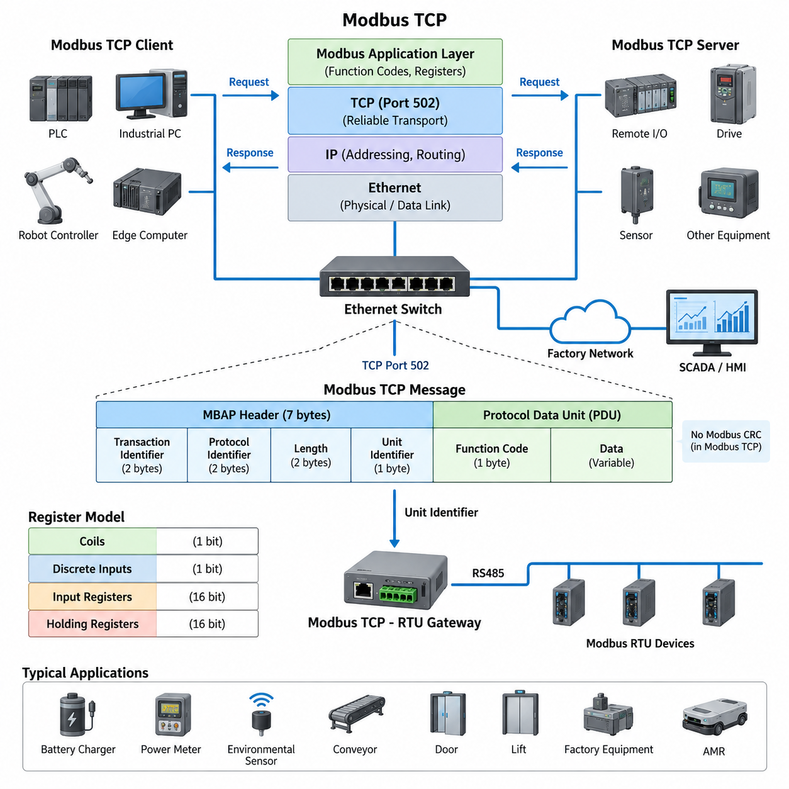
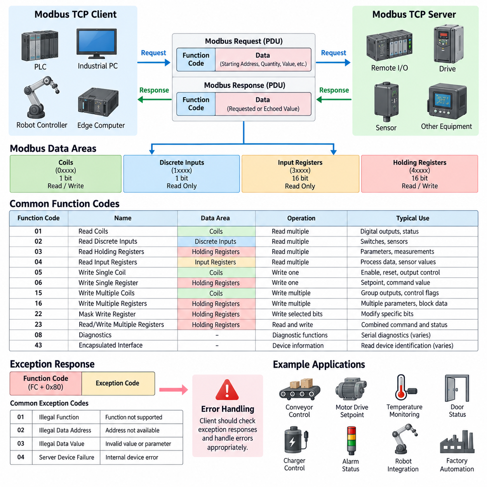
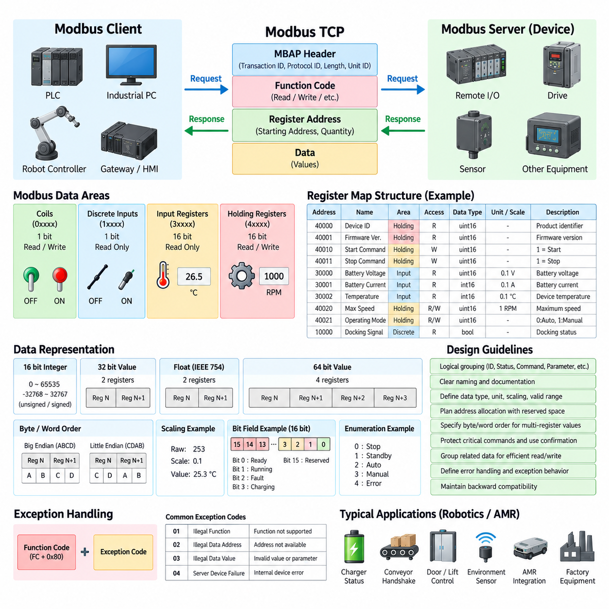
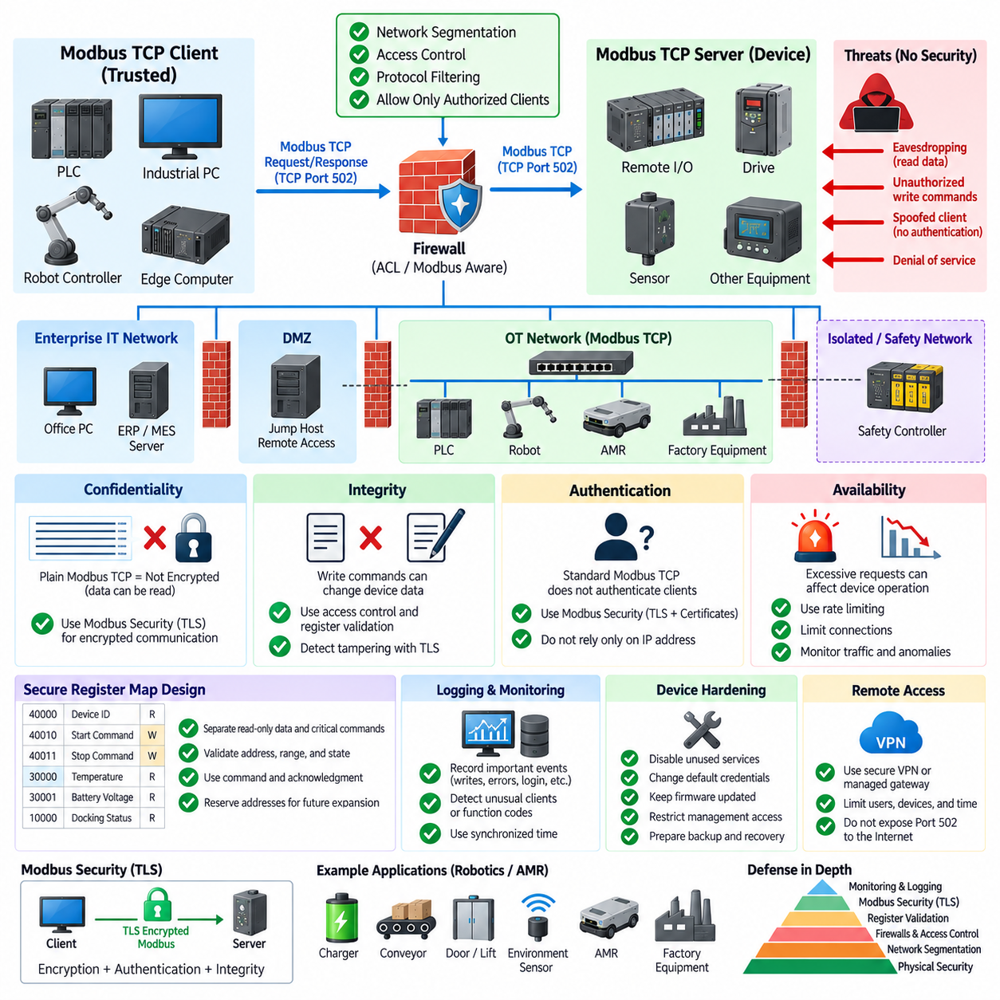
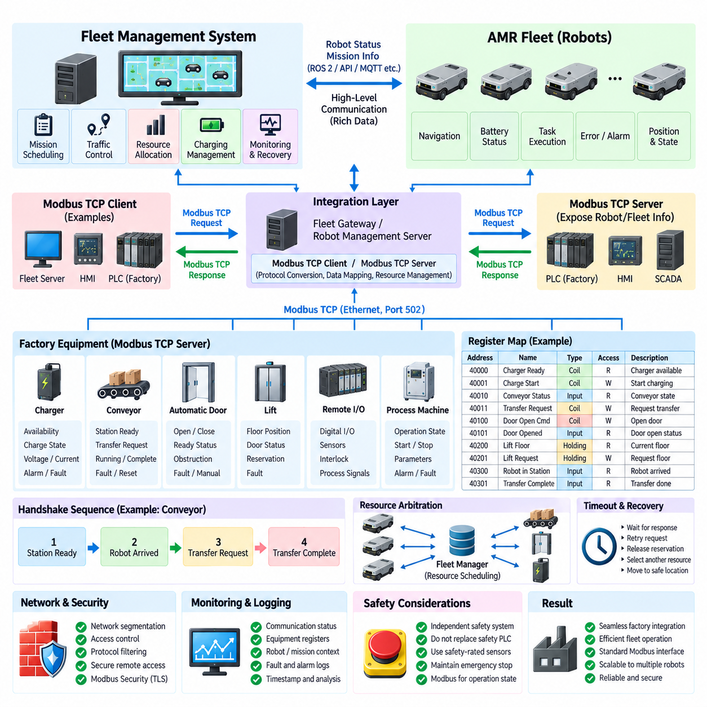

**Volume 07. Industrial Communication**

# Chapter 03. Modbus TCP

## 03.01. Modbus TCP Architecture

{width="7.268055555555556in" height="7.268055555555556in"}

Modbus TCP extends the Modbus application protocol onto standard Ethernet and TCP/IP networks, allowing industrial controllers, robots, sensors, drives, and supervisory systems to exchange structured process data through widely available network infrastructure. Instead of depending on a dedicated serial multidrop bus, each participating device communicates through an Ethernet interface and an IP address. This architecture makes Modbus suitable for larger automation systems while preserving the familiar Modbus data model.

The protocol architecture can be understood as a layered combination of the Modbus application protocol and the TCP/IP communication stack. Modbus defines the meaning of requests, responses, function codes, register addresses, and data values, while TCP provides reliable transport between network endpoints. IP handles addressing and routing, and Ethernet provides the physical and data-link mechanisms used to move frames across switches, cables, and network interfaces.

A typical Modbus TCP system follows a client-server communication model. The client initiates a transaction by sending a request describing the desired operation, such as reading holding registers or writing output values. The server receives the request, processes the specified function, accesses its internal Modbus data model, and returns a corresponding response. PLCs, industrial PCs, edge computers, and robot controllers commonly act as clients, while sensors, remote I/O modules, drives, and embedded controllers frequently operate as servers.

Communication normally uses TCP port 502, with each Modbus TCP connection represented by a standard TCP session between two IP endpoints. Because TCP establishes a connection before application data is exchanged, Modbus messages benefit from sequencing, retransmission, error detection, and flow control provided by the transport layer. Multiple devices can therefore communicate through switched Ethernet without requiring the strict physical multidrop topology associated with RS485-based Modbus RTU.

The Modbus TCP Application Data Unit consists of an MBAP header followed by the Protocol Data Unit. MBAP means Modbus Application Protocol and provides information needed to manage transactions over TCP/IP. Its fields include Transaction Identifier, Protocol Identifier, Length, and Unit Identifier. The Protocol Data Unit then contains the Modbus function code and the associated data, such as a starting register address, requested quantity, written value, or returned register contents.

The Transaction Identifier is especially important in Ethernet communication because a client may issue multiple requests and must associate each received response with the correct request. The server copies the transaction identifier from the request into its response, allowing the client to correlate transactions. The Protocol Identifier is normally zero for Modbus, while the Length field indicates the size of the remaining message and helps the receiver determine the boundaries of the application data carried by TCP.

Unlike Modbus RTU, Modbus TCP does not require the Modbus CRC field at the end of each application frame. Ethernet and TCP already provide mechanisms for detecting transmission errors, so repeating the serial Modbus CRC mechanism is unnecessary. This distinction illustrates an important architectural principle: the Modbus application semantics remain largely unchanged, while transport-specific framing mechanisms are adapted to the capabilities of the underlying communication network.

The Unit Identifier provides an architectural bridge between Ethernet and traditional Modbus serial networks. In direct communication with a native Modbus TCP server, this field may have limited significance because the destination is already identified by its IP address. When a Modbus TCP-to-RTU gateway is used, however, the Unit Identifier can identify the downstream serial device. One Ethernet gateway can therefore provide access to several Modbus RTU devices located on an RS485 segment.

At the application level, Modbus continues to organize information into logical data areas traditionally described as coils, discrete inputs, input registers, and holding registers. Coils and discrete inputs represent single-bit information, whereas input and holding registers represent 16-bit values. The actual engineering meaning of each address is determined by the device register map, which may associate registers with motor speed, current, temperature, alarm states, sensor measurements, operating commands, or configuration parameters.

Ethernet switching fundamentally changes the physical communication architecture compared with RS485 multidrop wiring. Devices can be connected in star, tree, or hierarchical network structures through industrial Ethernet switches, and communication can extend across multiple network segments when routing is permitted. This scalability is useful in factories and robotic installations where PLCs, AMRs, inspection systems, gateways, HMIs, and supervisory computers must exchange operational information over a shared Ethernet infrastructure.

A Modbus TCP client can maintain connections to several servers and periodically poll different register ranges according to application requirements. Fast-changing process variables may be read frequently, while configuration values and diagnostic information may be requested less often. Because standard Modbus communication is primarily request-response based, network loading and update latency depend strongly on polling intervals, transaction sizes, device response times, connection management, and the number of servers being accessed.

In robotics and AMR systems, Modbus TCP is particularly useful for integrating industrial equipment that does not require highly deterministic motion-control communication. An AMR edge computer or PLC can exchange status and command data with battery chargers, power meters, remote I/O, environmental sensors, conveyors, doors, lifts, or factory equipment through Ethernet. The protocol therefore often serves as an equipment-integration interface rather than the primary network for high-bandwidth perception or tightly synchronized servo control.

A practical robot architecture may separate Modbus TCP traffic from other communication domains even when they share Ethernet technology. Real-time motion networks, camera streams, LiDAR data, ROS 2 communication, fleet traffic, diagnostics, and Modbus equipment interfaces can have very different bandwidth and timing characteristics. Managed switches, VLANs, routing policies, and appropriate network segmentation can prevent low-priority polling or unexpected traffic from degrading communication paths that have stricter performance requirements.

The simplicity of Modbus TCP is one of its major engineering advantages. A device does not need to expose a complex object model to participate; it can present operational variables through a clearly documented register map and implement the required function codes. This makes integration relatively straightforward across equipment from different vendors. However, interoperability still depends on precise agreement about register addresses, data types, byte and word ordering, scaling factors, access permissions, exception handling, and update behavior.

From a system architecture perspective, Modbus TCP should therefore be regarded as a layered industrial communication mechanism rather than simply a serial protocol transported over Ethernet. Ethernet provides physical connectivity, IP provides network addressing, TCP provides reliable transport, the MBAP header manages Modbus transactions, and the Modbus PDU defines industrial operations and data access. Together, these layers allow the established Modbus register model to operate within modern PLC, factory automation, robotics, and AMR Ethernet networks.

## 03.02. Function Code Reference

{width="7.268055555555556in" height="7.268055555555556in"}

Modbus function codes define the operation that a client requests from a server and form the command vocabulary of the Modbus application protocol. Each request contains a function code followed by data required for that operation, such as a starting address, quantity, or value. The server interprets the code, accesses the corresponding data area, performs the requested operation, and returns a response containing the same function code when the transaction completes normally.

Function codes are closely related to the four traditional Modbus data areas: coils, discrete inputs, input registers, and holding registers. Coils represent single-bit read/write values, while discrete inputs represent single-bit read-only states. Input registers normally contain 16-bit read-only information, and holding registers provide 16-bit values that can generally be read or written. Device manufacturers determine the actual engineering meaning assigned to individual addresses within these logical areas.

Function Code 01, Read Coils, allows a client to read the ON or OFF states of multiple coils from a server. The request specifies the starting coil address and the number of coils to read. The response packs the resulting Boolean states into bytes, with individual bits representing individual coils. This operation is commonly used for digital outputs, command states, enable signals, relay states, and other binary variables that must be observed through the Modbus interface.

Function Code 02, Read Discrete Inputs, reads one or more discrete input states. Its request and response structure resembles Read Coils, but the addressed data is normally read-only from the Modbus client\'s perspective. Typical examples include limit switches, proximity sensors, contact inputs, safety-related status indications, and equipment-ready signals. Multiple input states are packed into response bytes, allowing many binary conditions to be transferred efficiently in a single transaction.

Function Code 03, Read Holding Registers, is one of the most widely used Modbus operations. It retrieves one or more contiguous 16-bit holding registers beginning at a specified address. Holding registers may represent configuration parameters, command values, measured quantities, counters, operating modes, or internal equipment states. Multi-register values such as 32-bit integers and floating-point numbers require an agreed representation, including register order, byte order, scaling, and signedness.

Function Code 04, Read Input Registers, retrieves 16-bit values from the input-register data area. These registers are normally treated as read-only process information and frequently represent measured or calculated values generated by a device. Temperature, voltage, current, pressure, speed, position, energy consumption, and sensor measurements can be exposed through input registers. The exact interpretation remains device-specific and must therefore be defined in the manufacturer\'s register map.

Function Code 05, Write Single Coil, commands one individual coil to an ON or OFF state. It is useful when a client needs to control a single Boolean variable such as an enable command, reset request, relay output, start signal, or actuator state. The server validates the requested address and value, updates the corresponding coil when permitted, and normally echoes the relevant request information in its response to indicate successful processing.

Function Code 06, Write Single Register, writes a single 16-bit value into one holding register. This function is commonly used for simple configuration parameters, operating modes, setpoints, command values, or control variables that fit within one register. Although the protocol transfers a raw 16-bit value, its engineering meaning depends on the register definition. For example, an integer may represent speed after multiplication by a specified scale factor.

Function Code 15, Write Multiple Coils, allows several consecutive coil states to be updated within one transaction. The request specifies the starting address, number of coils, byte count, and packed output values. This approach is more efficient than repeatedly using Write Single Coil when several related Boolean commands must change together. Industrial controllers can use it to transfer groups of output commands, operating selections, interlocks, or equipment control flags.

Function Code 16, Write Multiple Registers, writes a contiguous group of holding registers in a single request and is particularly important for structured industrial data. It can transfer multiple parameters, setpoints, command blocks, or values that occupy more than one 16-bit register. A 32-bit integer, floating-point value, or larger application structure may span several registers, making consistent definitions of register sequence and byte or word ordering essential for interoperability.

Function Code 22, Mask Write Register, modifies selected bits within a holding register without requiring the client to replace every bit explicitly. The operation applies AND and OR masks to the current register value according to the Modbus-defined processing rule. It can be useful when a single holding register contains several independent flags or control fields and the application needs to modify selected bits while preserving the remaining information.

Function Code 23, Read/Write Multiple Registers, combines a holding-register read and a holding-register write within one Modbus transaction. This can reduce communication overhead when a controller needs to update output information while simultaneously retrieving related process data. The server performs the defined write and read operations and returns the requested register contents. Such combined transactions can be useful for tightly associated command-and-status exchanges between industrial controllers and equipment.

Modbus also defines diagnostic and device-information-related functions in addition to the common process-data operations. Function Code 08 provides diagnostic capabilities primarily associated with serial Modbus implementations, while Function Code 43 supports encapsulated interface transport and can be used with mechanisms such as Read Device Identification. Actual support varies considerably between products, so an integration design should distinguish functions required by the application from optional functions implemented by a particular device.

When a server cannot execute a validly received request, it returns an exception response rather than a normal response. The returned function code has its most significant bit set, and an exception code identifies the reason for failure. Common conditions include Illegal Function, Illegal Data Address, Illegal Data Value, and Server Device Failure. Client software should explicitly process these responses instead of interpreting every received Modbus frame as successful application data.

Illegal Function indicates that the requested function is not supported by the server, while Illegal Data Address indicates that the requested coil or register range is unavailable. Illegal Data Value generally means that a request parameter is invalid for the specified operation. These distinctions are valuable during commissioning because they help engineers separate unsupported commands, incorrect register mapping, malformed requests, and internal device problems rather than treating all communication failures identically.

Function-code selection must therefore be coordinated with register-map design rather than treated as an independent protocol decision. A well-designed device interface identifies each variable\'s data area, address, access direction, data type, size, scaling, units, valid range, update behavior, and supported function codes. Clients can then distinguish measurements from commands and read-only information from writable parameters, reducing ambiguity when PLCs, industrial PCs, robots, sensors, drives, and gateways are integrated.

In Modbus TCP systems, these function codes are carried inside the Protocol Data Unit, while the MBAP header and TCP/IP layers manage transaction identification and network transport. The function-code semantics remain fundamentally Modbus-oriented regardless of Ethernet connectivity. This separation allows familiar operations such as reading registers and writing coils to be used across modern industrial Ethernet networks while maintaining compatibility with gateways and equipment based on the broader Modbus data model.

## 03.03. Register Map Design

{width="7.268055555555556in" height="7.268055555555556in"}

A Modbus register map defines how application data is organized, addressed, interpreted, and accessed through the Modbus protocol. Although Modbus provides standard logical areas such as coils, discrete inputs, input registers, and holding registers, it does not define the engineering meaning of individual addresses. Register-map design therefore becomes the contract between the device implementation and external clients such as PLCs, industrial PCs, robot controllers, gateways, and supervisory systems.

A well-designed register map begins by separating information according to its purpose and access characteristics. Binary commands that must be writable can be represented as coils, while binary status information can use discrete inputs. Measured or calculated read-only values can be assigned to input registers, and configurable parameters or command values can use holding registers. Consistent use of these logical areas makes the interface easier to understand and reduces unintended writes to status or measurement data.

Address allocation should follow a planned structure rather than assigning registers individually as new variables appear. Related information can be grouped into functional blocks such as device identification, operating status, commands, sensor measurements, configuration parameters, diagnostics, alarms, maintenance information, and communication settings. Reserving unused addresses between major blocks provides space for future expansion without forcing later firmware versions to reorganize existing addresses and break compatibility.

Modbus documentation often uses reference-style addresses such as 0xxxx for coils, 1xxxx for discrete inputs, 3xxxx for input registers, and 4xxxx for holding registers. These references should not automatically be interpreted as the literal address transmitted in a Modbus Protocol Data Unit. Implementations frequently use zero-based protocol offsets while manuals may display one-based register numbers. The register specification should explicitly state its addressing convention to prevent common off-by-one integration errors.

Each register entry should describe considerably more than its address. A useful register definition identifies the variable name, logical data area, protocol address, access permission, data type, engineering unit, scaling rule, valid range, default value, and functional description. Where applicable, the specification should also identify update rate, persistence behavior, required operating state, supported function codes, and whether writing the value immediately triggers an action or merely changes a configuration parameter.

Because a Modbus register contains 16 bits, many application values require more than one register. A 32-bit integer normally occupies two consecutive registers, while a 64-bit value requires four. Floating-point values, timestamps, counters, identifiers, and larger numerical quantities may therefore span several addresses. Multi-register variables should be allocated as contiguous blocks and documented as single logical objects so that clients do not mistakenly interpret their component registers as independent values.

Byte order and word order are critical when values occupy multiple registers. Modbus transfers each 16-bit register as two bytes, but device implementations may differ in the ordering of words used to construct 32-bit or 64-bit application values. A register map should therefore specify the exact representation rather than merely stating that a variable is an integer or floating-point value. Test examples containing known hexadecimal and engineering values are particularly useful for confirming correct interpretation during integration.

Scaling provides an alternative to floating-point representation and is widely used in industrial register maps. For example, a temperature of 25.3 degrees may be transmitted as the integer 253 with a scale factor of 0.1, while a speed value may use units of 0.01 revolutions per minute. The register definition must state both the raw representation and conversion rule so that clients can reliably transform transmitted values into physical engineering quantities.

Signedness must also be explicitly defined. A 16-bit register can represent an unsigned range from 0 to 65535 or a signed two\'s-complement range from -32768 to 32767. Without this information, negative temperatures, torque values, offsets, currents, velocities, and position errors may be interpreted incorrectly. Similar rules should be established for Boolean encoding, enumerated operating modes, bit fields, invalid-value markers, and special values representing unavailable or uninitialized measurements.

Bit-field registers can efficiently represent multiple Boolean conditions within one 16-bit holding or input register. Individual bits may indicate states such as ready, running, warning, fault, charging, communication active, emergency condition, or maintenance required. Every defined bit position should have a stable meaning, while unused bits should be marked as reserved. Clients should normally ignore reserved bits so that future device versions can introduce additional status information without changing the basic register layout.

Command registers require particular care because writing them can change physical system behavior. A command interface should clearly distinguish persistent settings from momentary actions such as start, stop, reset, acknowledge, home, or execute. Where accidental writes could be problematic, the design can use explicit command values, validation ranges, command identifiers, or command-and-acknowledgment patterns. The associated status registers should allow the client to determine whether a command was accepted, executed, rejected, or remains in progress.

Read-only status data should be organized so that related variables can be acquired efficiently using contiguous register reads. A client that requires voltage, current, state of charge, temperature, and operating status should ideally obtain these values with a small number of Read Holding Registers or Read Input Registers transactions rather than many isolated requests. Efficient grouping reduces polling overhead, TCP transactions, device processing load, and network traffic in systems containing many Modbus devices.

The same principle applies to writable data. Parameters that are commonly updated together can be placed in contiguous holding registers so that Write Multiple Registers can transfer them in one transaction. However, grouping should reflect semantic relationships rather than merely minimizing address space. Mixing unrelated configuration, safety-sensitive commands, diagnostics, and transient control data into a single writable block can make client implementation difficult and increase the consequences of an incorrect write.

Register-map design should include explicit behavior for invalid addresses, unsupported functions, out-of-range values, and writes attempted in inappropriate operating states. A server may respond with Modbus exception codes when a request cannot be processed, while application-level status registers can provide more detailed reasons. Separating protocol errors from device-specific operational errors helps engineers determine whether a problem originates in communication, register addressing, parameter validation, or equipment state.

Version compatibility becomes increasingly important when equipment remains deployed for many years. Existing register addresses and meanings should remain stable whenever possible, while new variables should occupy reserved or newly allocated regions. A device-information block can expose firmware version, hardware revision, register-map version, product identifier, and capability information. Clients can then determine which optional registers or features are available before attempting to use them.

For robotics and AMR applications, a register map may expose charger status, battery information, conveyor handshakes, docking signals, door or lift commands, remote I/O states, power measurements, environmental sensors, and factory-equipment interfaces. These variables should represent equipment-level integration rather than high-frequency servo control or large perception data. Modbus TCP is particularly effective when clearly structured operational states, commands, parameters, and measurements must be exchanged with conventional industrial equipment.

A robust register map should ultimately be treated as a stable application programming interface rather than a simple spreadsheet of addresses. Logical grouping, consistent naming, explicit data representation, controlled write access, reserved expansion space, documented error behavior, and version management allow different implementations to interpret the same data consistently. Careful register-map design therefore determines much of the practical interoperability, maintainability, and long-term reliability of a Modbus TCP integration.

## 03.04. Modbus TCP Security

{width="7.268055555555556in" height="7.268055555555556in"}

Modbus TCP was designed primarily for interoperability and simplicity in industrial automation rather than for cybersecurity. Traditional Modbus TCP communication normally provides no inherent encryption, strong authentication, or authorization mechanism for ordinary TCP port 502 traffic. A device receiving a syntactically valid request may therefore process it according to its implemented register permissions, making network architecture and external security controls essential parts of a secure deployment.

The security limitations originate partly from the historical operating assumptions of industrial control networks. Early Modbus systems were commonly deployed in physically isolated or tightly controlled environments where devices and communication paths were considered trusted. Modern factories, robots, AMRs, edge computers, remote maintenance systems, and IT/OT integration have significantly increased connectivity, so assumptions based only on physical isolation are no longer sufficient.

Confidentiality is a major concern because conventional Modbus TCP messages are transmitted without application-level encryption. An attacker capable of observing network traffic may inspect function codes, register addresses, command values, measurements, and device status information. Even when individual values appear harmless, repeated observation can reveal operating sequences, equipment behavior, production conditions, or control relationships that provide useful information for further attacks.

Integrity is equally important because Modbus commands can directly modify device data. Write Single Coil, Write Single Register, Write Multiple Coils, and Write Multiple Registers can change outputs, parameters, operating modes, or commands when supported by the server. If an unauthorized system gains network access and can communicate with a device, maliciously constructed write requests could potentially alter equipment behavior unless additional access restrictions or security mechanisms prevent them.

Authentication addresses the question of whether a communicating endpoint is genuinely an authorized system. Standard Modbus TCP communication does not normally authenticate clients through the basic request-response protocol. A server may therefore have limited ability to distinguish an approved PLC or edge computer from another host capable of reaching the same TCP service. Secure system design should consequently avoid treating possession of an IP address or network connectivity as sufficient proof of authorization.

Network segmentation is one of the most important practical protections for Modbus TCP. Industrial devices should normally reside within controlled operational technology networks rather than being directly exposed to enterprise networks or the public Internet. VLANs, industrial firewalls, routers, access-control lists, and security zones can restrict which systems are allowed to initiate Modbus connections and can reduce the number of paths through which an attacker could reach critical equipment.

A common architecture separates enterprise IT, supervisory systems, robot or AMR networks, machine-control networks, and safety-related domains according to their operational roles. Communication between zones passes through defined gateways or firewalls rather than unrestricted switching. Modbus TCP traffic can then be permitted only between explicitly required clients and servers, typically using destination addresses, TCP port 502, direction rules, and application-aware filtering where appropriate.

Industrial firewalls can provide more detailed protection than simple port filtering. Some security devices understand Modbus function codes and can enforce rules based on the requested operation. For example, a monitoring system may be permitted to use register-read functions while write functions are blocked. Such protocol-aware controls can reduce risk by applying the principle of least privilege, allowing each client only the operations necessary for its intended role.

Register-map design also contributes to security. Read-only measurements and status values should not be exposed as writable parameters, and critical commands should be separated from ordinary configuration data. Servers should validate addresses, data ranges, operating states, and supported function codes before accepting writes. Command-and-acknowledgment mechanisms, state-dependent permissions, and application-level validation can further reduce the possibility that an unexpected request immediately causes unsafe physical behavior.

Modbus Security is an extension intended to provide stronger protection for Modbus communication through modern security mechanisms. It incorporates Transport Layer Security, or TLS, to protect communication and uses certificate-based mechanisms for authentication and integrity. Secure Modbus deployments can therefore establish authenticated encrypted sessions rather than relying exclusively on trusted network boundaries. Support must be verified for each device because legacy Modbus TCP products may implement only conventional communication.

TLS can protect confidentiality by encrypting communication between endpoints and can provide integrity mechanisms that help detect unauthorized modification of transmitted information. Certificate-based authentication can also allow systems to verify the identity of communicating peers. These capabilities address important weaknesses of ordinary Modbus TCP, but certificate issuance, storage, renewal, revocation, trust configuration, firmware support, and device lifecycle management become additional engineering responsibilities.

Security should also address availability because industrial communication systems can be affected by excessive connections, malformed requests, aggressive polling, or deliberate denial-of-service traffic. Embedded Modbus servers may have limited CPU, memory, socket capacity, or transaction-processing resources. Rate limiting, connection limits, traffic monitoring, network isolation, and appropriate client polling intervals can help prevent communication overload from disrupting equipment operation.

Monitoring is particularly valuable because Modbus traffic often follows relatively predictable patterns. A PLC may repeatedly read the same register ranges and issue writes only under specific operating conditions. Network monitoring systems can therefore identify unusual clients, unexpected function codes, abnormal polling rates, new communication paths, or writes to rarely modified registers. These anomalies do not automatically prove an attack, but they provide useful indicators for investigation and operational diagnostics.

Logging should complement network monitoring by recording significant communication and application events. Important records may include authentication events where supported, configuration changes, critical register writes, rejected commands, communication failures, firmware changes, and security-policy violations. Accurate timestamps and synchronized clocks make these records more useful when engineers need to reconstruct events across PLCs, robots, gateways, edge computers, switches, and supervisory systems.

Remote access requires additional protection because exposing TCP port 502 directly through the Internet creates unnecessary risk. Remote engineering or maintenance should normally pass through controlled mechanisms such as secure VPN infrastructure, authenticated jump hosts, managed remote-access gateways, or equivalent protected channels. Access should be limited to required users, devices, time periods, and network destinations rather than providing unrestricted connectivity to the complete industrial network.

Device hardening is another layer of Modbus TCP security. Unused services and ports should be disabled where possible, default credentials should be changed, firmware should be maintained according to vendor guidance, and management interfaces should be restricted. Network configuration should prevent unnecessary routing between operational domains. Security controls should also consider recovery procedures so that configuration backups, firmware images, certificates, and register-map definitions can be restored after failures or incidents.

In robotics and AMR systems, Modbus TCP may connect edge computers or PLCs with chargers, conveyors, doors, lifts, remote I/O, power meters, and factory equipment. A compromised command path could therefore influence physical processes even if Modbus is not used for high-frequency motion control. Security architecture should consider the consequence of each writable interface and ensure that communication faults or unauthorized commands cannot bypass independent safety mechanisms.

Modbus TCP security is therefore best implemented through defense in depth rather than a single protective mechanism. Segmentation limits reachability, firewalls restrict communication, protocol-aware policies control operations, register validation protects application behavior, TLS-based Modbus Security can provide authentication and encryption, and monitoring helps detect abnormal activity. Combined with device hardening and independent functional-safety mechanisms, these layers allow Modbus TCP to be integrated more responsibly into modern industrial, robotics, and AMR networks.

## 03.05. Modbus TCP in Fleet Management

{width="7.268055555555556in" height="7.268055555555556in"}

Modbus TCP can serve as an equipment-level integration protocol within an AMR fleet management architecture, particularly when mobile robots must interact with conventional industrial infrastructure. A fleet management system normally coordinates missions, traffic, charging, and resource allocation, while Modbus TCP provides a simple register-based interface to PLCs, chargers, conveyors, doors, lifts, remote I/O, and other factory equipment involved in fleet operations.

The fleet management system should not generally use Modbus TCP as its primary high-level communication mechanism for exchanging rich robot telemetry, maps, trajectories, perception data, or complex mission information. Those functions are better handled by robotics-oriented middleware or application interfaces. Modbus TCP instead occupies a lower integration layer where compact equipment states, commands, acknowledgments, interlocks, and process variables must be exchanged reliably with industrial automation devices.

A typical architecture places the fleet manager, robot management server, or integration gateway on an Ethernet network connected to factory automation equipment. Depending on system design, the fleet software may operate as a Modbus TCP client and periodically communicate with multiple servers. PLCs, charging controllers, conveyor controllers, remote I/O modules, doors, lifts, and process machines can expose their operational information through defined coils and registers that the fleet system reads or writes.

The opposite arrangement is also possible when a fleet integration gateway exposes selected robot or fleet information as a Modbus TCP server. A factory PLC can then read fleet status registers or write predefined command registers without understanding the internal fleet-management API. This creates a protocol boundary between the robotics domain and traditional automation domain, allowing existing PLC programs to interact with AMRs through familiar Modbus function codes and register mappings.

Mission execution can use Modbus TCP when a robot task depends on the state of external equipment. For example, an AMR approaching a conveyor station may require confirmation that the conveyor is ready before docking. The fleet system can read a readiness register, reserve the station through an appropriate command, dispatch the AMR, and wait for additional handshake states before allowing material transfer. The register interface therefore becomes part of a larger mission-state sequence rather than the mission planner itself.

Conveyor integration commonly uses a handshake between the fleet or robot system and the conveyor PLC. Typical information can include station available, robot arrived, docking complete, transfer request, conveyor running, transfer complete, fault, and reset states. These variables may be represented through coils, discrete inputs, or bit fields in registers. A clearly defined state transition sequence is important because individual Boolean signals alone do not guarantee correct coordination between independently operating systems.

Automatic doors provide another common fleet-management interface. Before an AMR enters a controlled area, the fleet system can request that a door open and then verify open or ready status before authorizing the robot to continue. Additional registers may represent closed state, opening, closing, obstruction, fault, manual mode, or access permission. Navigation should not assume that sending an open command means the physical passage is immediately available; confirmation should come from independently reported equipment status.

Lift integration requires more extensive coordination because the lift is a shared resource with multiple operational states. Modbus registers can represent floor position, door status, availability, occupancy, reservation, requested destination, operating mode, and faults. The fleet manager can reserve the lift, command or request the required floor, verify door state, permit an AMR to enter, request destination movement, and finally confirm safe exit before releasing the resource for another mission.

Charging infrastructure can also be integrated through Modbus TCP. A charging controller may expose charger availability, connection state, output voltage, current, charging state, energy information, temperature, alarm conditions, and fault codes. The fleet manager can combine these values with robot battery information to select an available charger and schedule charging missions. Writable registers may provide controlled functions such as enable, reset, operating mode, or charging authorization when supported by the charger.

Fleet management requires resource arbitration when several robots can request the same physical equipment. Modbus itself does not provide a fleet-level reservation algorithm, so ownership and scheduling must be implemented by the fleet manager or another supervisory controller. A lift, charger, conveyor station, or restricted passage should normally have one authoritative resource manager that prevents conflicting commands from multiple robots or clients and maintains a consistent view of resource occupancy.

Register-map design is therefore critical for fleet integration. Equipment interfaces should distinguish commands, status, acknowledgments, alarms, measurements, and configuration information. Related values should be grouped into contiguous address blocks so that the fleet system can read them efficiently. Command registers should be separated from read-only status information, while data types, scaling, byte order, valid ranges, update behavior, and supported Modbus function codes should be documented consistently across equipment interfaces.

A robust handshake should distinguish command acceptance from physical completion. For example, writing a docking preparation command does not prove that a station is ready, and requesting a door to open does not prove that the door is open. Separate command, accepted, busy, completed, and fault states can allow the fleet manager to follow the actual progress of an operation. Transaction identifiers or application-level sequence counters can also help prevent stale status information from being interpreted as confirmation of a new request.

Timeout and recovery behavior must be defined because external equipment may fail to respond or may remain in an intermediate state. The fleet system should know how long to wait for acknowledgments and completion states before declaring an integration fault. Depending on the application, recovery may involve retrying a request, releasing a reservation, selecting another resource, stopping the affected mission, requesting operator assistance, or moving the robot to a safe waiting location.

Polling strategy affects both fleet responsiveness and network loading. Rapidly changing handshake states may require relatively frequent reads, while energy counters, temperatures, diagnostics, and maintenance information can be updated less often. Registers that are commonly required together should be grouped so they can be retrieved with a small number of transactions. Large fleets should avoid unnecessary polling from every robot when a centralized gateway or fleet server can acquire equipment state once and distribute it internally.

Network architecture becomes increasingly important as the number of robots and industrial devices grows. Managed Ethernet switches, VLANs, routing policies, and industrial firewalls can separate fleet traffic from machine-control, enterprise IT, perception, and other communication domains. Modbus TCP access can be restricted to authorized fleet servers, PLCs, or gateways rather than allowing every AMR to communicate directly with every piece of factory equipment, simplifying both security and system management.

Security is especially important because fleet-level Modbus commands may affect shared physical resources. Unauthorized writes to a door, conveyor, charger, or lift could disrupt several robots rather than a single device. Network segmentation, access control, protocol-aware filtering, device hardening, logging, and secure remote access should therefore protect the integration path. Where supported, Modbus Security with TLS can provide stronger authentication, integrity, and confidentiality than conventional Modbus TCP.

Operational monitoring should combine Modbus communication information with fleet-level context. A communication timeout alone indicates that a device did not respond, while fleet context can identify which mission, robot, station, or resource is affected. Logs should therefore correlate equipment addresses, register operations, commands, acknowledgments, fault codes, robot identifiers, mission identifiers, and timestamps so that engineers can reconstruct interactions when diagnosing intermittent integration failures.

Safety functions should remain independent from ordinary fleet-management communication where required by the system safety architecture. Modbus TCP can coordinate operational states, but a fleet command should not replace safety-rated sensors, emergency-stop circuits, safety PLCs, or certified safety networks. For example, confirmation that a door or conveyor is logically ready may support mission sequencing, while independent safety mechanisms remain responsible for preventing hazardous physical motion.

In an AMR fleet, Modbus TCP is therefore most effective as a bridge between fleet intelligence and conventional industrial equipment. The fleet manager performs mission scheduling, resource arbitration, traffic coordination, charging decisions, and recovery logic, while Modbus TCP exposes compact equipment commands and states through standardized function codes and register maps. This separation allows modern robotic fleets to interact systematically with existing factory infrastructure without forcing every industrial device to implement robotics-specific communication middleware.
