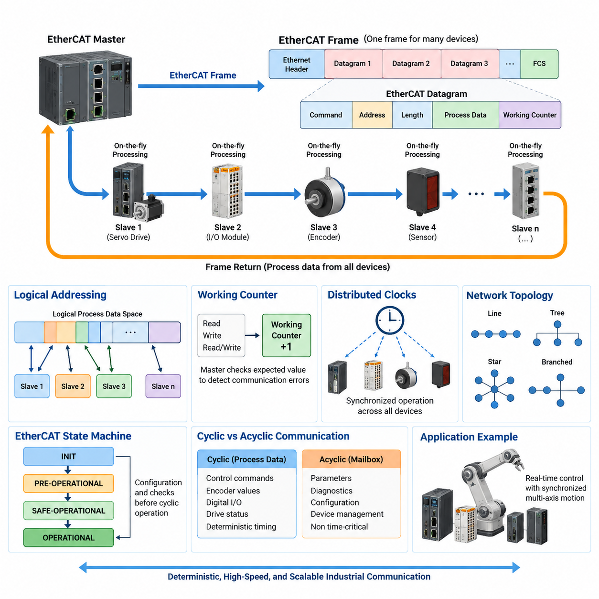
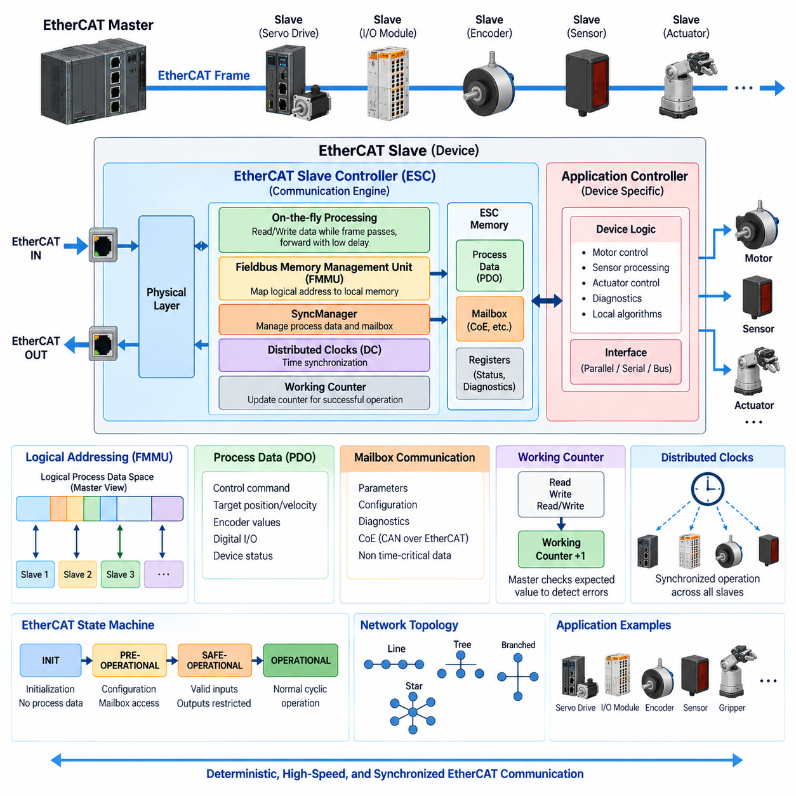
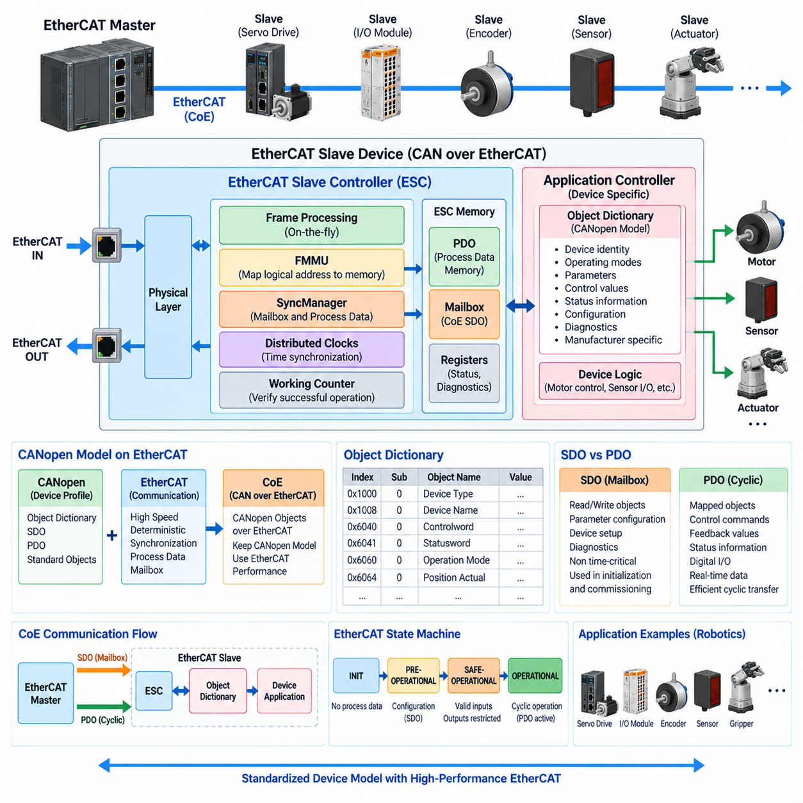
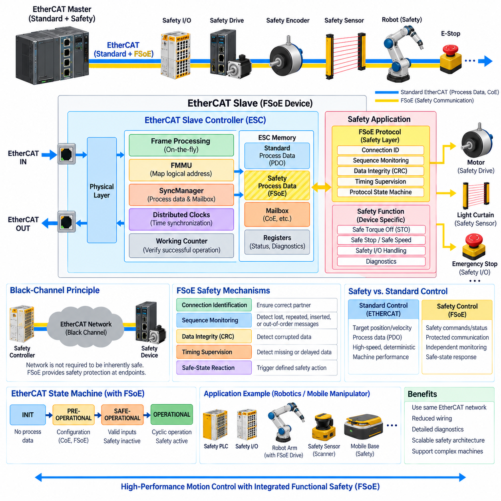
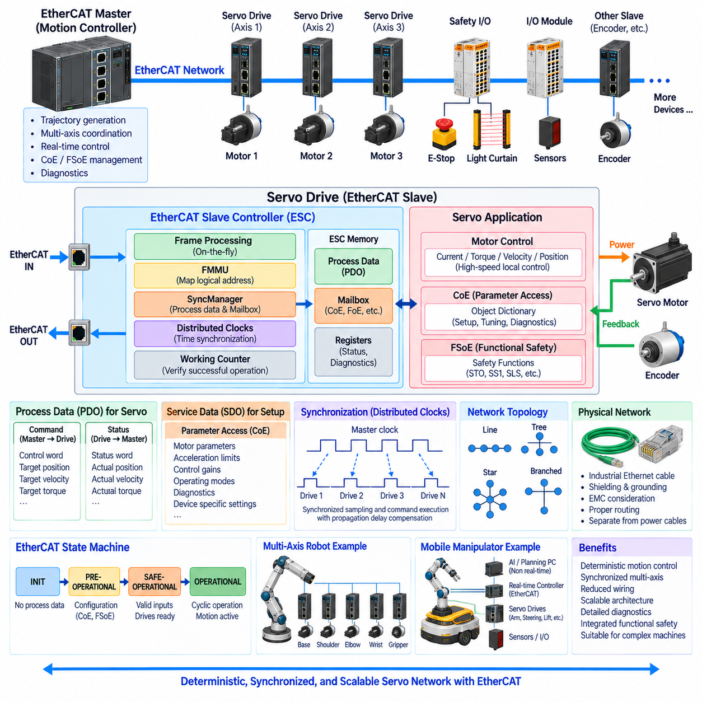

**Volume 07. Industrial Communication**

# Chapter 04. EtherCAT

## 04.01. EtherCAT Operating Principle

{width="7.268055555555556in" height="7.268055555555556in"}

EtherCAT은 제어기(controller)와 분산 장치(distributed device) 사이에서 매우 낮은 지연시간(latency)과 높은 결정론적 타이밍(deterministic timing)으로 프로세스 데이터(process data)를 교환하도록 설계된 실시간 산업용 이더넷(real-time industrial Ethernet) 기술이다. 산업용 통신(industrial communication) 구조에서는 EtherCAT 슬레이브 컨트롤러(EtherCAT Slave Controller), CAN over EtherCAT, 기능 안전(functional safety), 서보 네트워크 설계(servo-network design)와 함께 전용 EtherCAT 장에 포함된다.

EtherCAT의 기본 동작 원리(operating principle)는 기존 이더넷(Ethernet) 통신과 크게 다르다. 일반적인 이더넷 네트워크에서는 프레임(frame)을 장치가 수신하고 프로토콜 스택(protocol stack)에서 처리한 다음, 다음 목적지를 향해 또 다른 프레임을 전송할 수 있다. 반면 EtherCAT에서는 마스터(master)가 생성한 하나의 이더넷 프레임이 여러 슬레이브 장치(slave device)를 순차적으로 통과하면서 동시에 프로세스 데이터가 처리된다.

이러한 메커니즘은 일반적으로 온더플라이 처리(processing "on the fly")라고 설명된다. 각 EtherCAT 슬레이브는 통과하는 프레임을 하드웨어 수준(hardware level)에서 검사하고 자신에게 할당된 EtherCAT 데이터그램(datagram) 영역을 식별한다. 입력 정보(input information)는 해당 데이터 필드에 삽입하고, 장치로 전달되는 출력 정보(output information)는 동시에 추출할 수 있다. 따라서 각 노드에서 전체 프레임을 완전히 수신한 후 소프트웨어로 다시 전송할 필요가 없다.

EtherCAT 네트워크는 일반적으로 통신 주기(communication cycle)를 시작하는 하나의 EtherCAT 마스터에 의해 제어된다. 마스터는 하나 이상의 EtherCAT 데이터그램을 포함하는 이더넷 프레임을 구성하여 네트워크로 전송한다. 프레임이 물리적 토폴로지(physical topology)를 따라 이동하는 동안 각 슬레이브가 관련 데이터를 처리한다. 마지막 슬레이브를 통과한 프레임은 다시 마스터 방향으로 반환되면서 여러 장치와의 데이터 교환을 포함한 하나의 통신 주기를 완료한다.

이러한 아키텍처(architecture)는 매우 효율적인 대역폭 활용(bandwidth utilization)을 가능하게 한다. 각각의 서보 드라이브(servo drive), I/O 모듈(I/O module), 엔코더(encoder), 센서(sensor)에 별도의 이더넷 프레임을 생성하는 대신, 마스터는 여러 장치의 프로세스 데이터를 적은 수의 프레임에 배치할 수 있다. 따라서 이더넷 프레임 오버헤드(frame overhead)가 여러 트랜잭션(transaction)에 공유되며, 매 제어 주기마다 수십 개의 동기화된 액추에이터(actuator)와 분산 I/O를 갱신해야 하는 시스템에서 특히 중요하다.

EtherCAT 통신은 표준 이더넷 물리 계층(Ethernet physical layer) 기술을 기반으로 하지만, 프레임 처리 동작(frame-processing behavior)은 일반적인 패킷 교환 네트워킹(packet-switched networking)이 아니라 결정론적 산업 제어(deterministic industrial control)에 최적화되어 있다. EtherCAT 프레임은 전용 EtherType을 사용할 수 있으며, 프레임 내부의 EtherCAT 데이터그램은 명령(command), 주소(address), 데이터 길이(data length), 프로세스 데이터, 워킹 카운터(Working Counter)를 지정한다. 하드웨어 기반 슬레이브 처리는 범용 이더넷에서 발생할 수 있는 가변적인 소프트웨어 지연을 최소화한다.

EtherCAT의 주요 개념 중 하나는 논리 주소 지정(logical addressing)이다. 마스터는 각각의 트랜잭션을 개별 장치에 대한 독립적인 메시지로 처리하는 대신, 분산된 프로세스 데이터를 하나의 논리 주소 공간(logical address space)으로 구성할 수 있다. 슬레이브 하드웨어는 이 논리 공간의 특정 영역을 로컬 메모리(local memory)에 매핑한다. 따라서 하나의 EtherCAT 데이터그램이 네트워크를 이동하면서 여러 슬레이브의 데이터를 읽거나 쓸 수 있어 분산 프로세스 I/O를 효율적으로 표현할 수 있다.

EtherCAT은 구성(configuration), 식별(identification), 진단(diagnostics) 및 기타 장치 중심 작업을 위한 물리 주소 지정(physical addressing)도 지원한다. 초기화 과정에서 마스터는 네트워크상의 위치와 장치 특성에 따라 슬레이브를 검색하고 구성한다. 네트워크가 주기적 동작(cyclic operation)에 진입하면 프로세스 데이터 교환을 위해 논리 주소 지정을 효율적으로 사용할 수 있다. 이러한 분리는 유연한 네트워크 구성과 정상적인 기계 운전 중의 고효율 주기 통신을 동시에 가능하게 한다.

워킹 카운터(Working Counter)는 EtherCAT 동작이 예상대로 수행되었는지를 확인하는 중요한 메커니즘이다. EtherCAT 슬레이브는 특정 읽기(read), 쓰기(write), 읽기-쓰기(read-write) 명령이 성공적으로 처리되었는지에 따라 카운터를 증가시키거나 변경한다. 마스터는 반환된 값을 예상 워킹 카운터 값과 비교한다. 값이 일치하지 않으면 슬레이브 누락, 통신 장애, 잘못된 상태 또는 성공적으로 완료되지 않은 프로세스 데이터 트랜잭션을 확인할 수 있다.

EtherCAT 토폴로지(topology)는 이러한 프레임 전달 아키텍처(frame-forwarding architecture)의 또 다른 중요한 특징이다. 통신은 논리적으로 프레임이 순차적인 처리 지점을 통과하는 방식으로 동작하지만, 적절한 EtherCAT 하드웨어를 사용하면 물리적 네트워크는 라인(line), 트리(tree), 스타(star), 분기형(branched) 구조를 지원할 수 있다. 슬레이브 컨트롤러에 내장된 EtherCAT 포트는 프레임을 직접 전달하므로 일반적인 이더넷 스위치에 대한 의존성을 줄이고 산업 장비의 물리적 배치를 따르는 네트워크 구조를 구현할 수 있다.

프레임이 EtherCAT 세그먼트(segment)의 끝에 도달하면 슬레이브 인프라 내부의 물리 계층 처리를 통해 네트워크를 따라 마스터 방향으로 반환된다. 전이중 이더넷 링크(full-duplex Ethernet link)를 이용함으로써 각 노드에서 일반적인 저장 후 전달(store-and-forward) 스위칭을 수행하지 않고 이러한 전달 구조를 구현할 수 있다. 따라서 마스터 관점에서는 다수의 독립적인 요청-응답(request-response) 트랜잭션 대신 구조화된 주기적 데이터 교환을 통해 전체 분산 시스템을 처리할 수 있다.

결정론적 타이밍(deterministic timing)은 특히 모션 제어(motion control)에서 중요하다. 서보 드라이브는 위치(position), 속도(velocity), 토크(torque), 상태 정보(status information)를 정확한 시간 간격으로 교환해야 할 수 있다. EtherCAT은 슬레이브 측 프레임 처리의 상당 부분을 전용 하드웨어로 수행하여 통신 불확실성을 최소화한다. 짧고 예측 가능한 통신 지연을 통해 다축 협조 장비(coordinated multi-axis machine), 로봇(robot), 매니퓰레이터(manipulator) 및 고성능 자동화 장비에 적합한 제어 주기를 구현할 수 있다.

분산 클록(Distributed Clocks)은 EtherCAT 장치 간 동기화(synchronization)를 더욱 향상시킨다. 특정 슬레이브에는 로컬 클록(local clock)이 포함되며, 네트워크의 전파 지연(propagation delay)을 보상하면서 공통 기준 시간(common reference)에 동기화할 수 있다. 따라서 이더넷 프레임이 각 장치에 조금씩 다른 시점에 도착하더라도 물리적으로 떨어져 있는 장치에서 이벤트를 매우 근접한 시점에 발생시킬 수 있다. 이를 통해 분산된 서보 드라이브, 센서 및 I/O 모듈에서 동기화된 샘플링(sampling)과 작동(actuation)이 가능하다.

통신 주기 타이밍(communication cycle timing)과 분산 장치 동기화(distributed device synchronization)의 차이를 이해하는 것이 중요하다. 단순히 프레임을 빠르게 전송하는 것만으로 여러 액추에이터가 동시에 명령을 실행하는 것은 보장되지 않는다. EtherCAT 분산 클록은 공통 시간 기준(common temporal reference)을 제공하여 슬레이브가 동기화된 시간을 기준으로 로컬 동작을 예약할 수 있게 한다. 이는 협조 로봇 관절(coordinated robot joint), 전자 기어링(electronic gearing), 갠트리 시스템(gantry system), 동기화 측정 장비 및 정밀한 축 간 관계가 필요한 장비에서 중요하다.

EtherCAT 슬레이브 장치는 일반적으로 실시간 프레임 인식(frame recognition), 전달(forwarding), 주소 처리(address processing), 메모리 매핑(memory mapping) 및 관련 프로토콜 기능을 수행하는 EtherCAT 슬레이브 컨트롤러(EtherCAT Slave Controller, ESC)를 포함한다. 로컬 애플리케이션 프로세서(local application processor)가 모든 이더넷 비트를 소프트웨어에서 직접 검사할 필요는 없다. 대신 ESC가 관리하는 메모리를 통해 프로세스 정보를 교환하며, 이러한 하드웨어 분할(hardware partitioning)은 서로 다른 산업용 장치 사이에서도 EtherCAT이 예측 가능한 통신 동작을 유지할 수 있는 중요한 이유이다.

EtherCAT 상태 머신(state machine)은 슬레이브가 초기화에서 실제 운용 통신으로 진행하는 과정을 제어한다. 일반적인 상태에는 초기화(INIT), 사전 운용(PRE-OPERATIONAL), 안전 운용(SAFE-OPERATIONAL), 운용(OPERATIONAL)이 있다. 구성 및 메일박스 통신(mailbox communication)은 단계적으로 활성화되며, 필요한 구성과 검사가 완료된 이후에만 유효한 주기적 프로세스 데이터 통신이 허용된다. 이러한 단계적 전환은 완전히 구성되지 않은 장치가 즉시 정상적인 기계 제어에 참여하는 것을 방지한다.

주기적 프로세스 통신(cyclic process communication)과 비주기적 구성 통신(acyclic configuration communication)은 동일한 네트워크 안에서 서로 다른 역할을 수행한다. 액추에이터 명령, 엔코더 값, 디지털 I/O, 드라이브 상태와 같이 시간에 민감한 프로세스 데이터는 결정론적 타이밍으로 주기적으로 전송할 수 있다. 상대적으로 시간 민감도가 낮은 파라미터(parameter), 진단 정보, 구성 객체(configuration object), 장치 관리 정보는 메일박스 메커니즘(mailbox mechanism)을 사용할 수 있다. 이러한 분리는 엔지니어링 및 진단 트래픽이 주요 제어 루프(control loop)의 타이밍 특성을 불필요하게 결정하는 것을 방지한다.

따라서 EtherCAT을 단순히 "더 빠른 이더넷(faster Ethernet)"으로 이해해서는 안 된다. EtherCAT의 성능은 마스터 제어 통신(master-controlled communication), 온더플라이 하드웨어 처리(on-the-fly hardware processing), 효율적인 데이터그램 패킹(datagram packing), 분산 논리 주소 지정(distributed logical addressing), 예측 가능한 전파(propagation), 하드웨어 슬레이브 컨트롤러, 워킹 카운터 검증(Working Counter verification), 정밀한 클록 동기화(clock synchronization)의 결합에서 나온다. 이러한 메커니즘은 표준 이더넷 물리 기술을 결정론적 분산 제어(deterministic distributed control)에 최적화된 통신 시스템으로 변환한다.

로보틱스(robotics)에서 이러한 동작 원리는 실시간 제어기(real-time controller)와 서보 드라이브, 관절 액추에이터(joint actuator), 엔코더, 힘-토크 센서(force-torque sensor), 분산 I/O를 연결하는 계층에 특히 적합하다. 하나의 로봇에는 동일한 제어 주기 안에서 갱신되어야 하는 다수의 장치가 존재할 수 있으며, EtherCAT은 수많은 독립적인 네트워크 통신 대신 협조된 주기적 프레임 구조(coordinated cyclic frame structure)를 통해 이들의 프로세스 데이터를 전송할 수 있다.

자율이동로봇(Autonomous Mobile Robot, AMR) 또는 모바일 매니퓰레이터(mobile manipulator)에서 EtherCAT은 상위 수준의 이더넷 통신과 서로 다른 아키텍처적 역할을 담당할 수 있다. 일반 이더넷 및 TCP/IP는 엣지 컴퓨터(edge computer), 인지 컴퓨터(perception computer), 플릿 시스템(fleet system), 상위 감독 애플리케이션(supervisory application)을 연결하고, EtherCAT은 장비 수준 제어 영역(machine-level control domain) 내부에서 결정론적 통신을 제공할 수 있다. 상위 컴퓨터가 수행할 동작을 결정한다면, 실시간 제어 시스템과 EtherCAT 네트워크는 동기화된 액추에이터 및 I/O 데이터 교환을 실행한다.

궁극적으로 EtherCAT의 핵심 동작 순서는 연속적인 주기적 파이프라인(continuous cyclic pipeline)으로 이해할 수 있다. 마스터가 프로세스 데이터를 준비하고 EtherCAT 프레임을 전송하면, 각 슬레이브는 프레임이 통과하는 동안 자신에게 할당된 데이터를 읽거나 수정한다. 이후 프레임이 마스터로 반환되고 통신 유효성(communication validity)을 확인한 다음 다음 제어 주기가 시작된다. 이러한 원리에 동기화된 클록과 하드웨어 처리가 결합되어 현대 산업용 로봇과 자동화 시스템에서 확장 가능하고 고속이며 결정론적인 통신을 구현한다.

## 04.02. ESC and EtherCAT Slave

{width="7.268055555555556in" height="7.268055555555556in"}

EtherCAT 슬레이브 컨트롤러(EtherCAT Slave Controller, ESC)는 EtherCAT 슬레이브 장치(EtherCAT slave device)가 결정론적 실시간 통신(deterministic real-time communication)에 참여할 수 있도록 하는 하드웨어 구성요소(hardware component)이다. EtherCAT 아키텍처에서 ESC는 물리적 이더넷 포트(physical Ethernet port)와 로컬 애플리케이션 컨트롤러(local application controller) 사이에 위치한다. ESC는 EtherCAT 프레임을 인식하고 프레임이 통과하는 동안 관련 데이터를 처리하며, 프로세스 데이터 메모리(process-data memory)를 관리하고 매우 작고 예측 가능한 지연으로 프레임을 전달한다.

EtherCAT 슬레이브(EtherCAT slave)는 EtherCAT 마스터에 연결되는 전체 네트워크 장치(network device)를 의미하는 반면, ESC는 해당 슬레이브 내부에서 통신을 담당하는 핵심 엔진(communication engine)이다. 슬레이브는 서보 드라이브(servo drive), 원격 I/O 모듈(remote I/O module), 엔코더(encoder), 센서(sensor), 모터 컨트롤러(motor controller), 로봇 액추에이터(robotic actuator) 등이 될 수 있다. ESC 이외에도 장치는 일반적으로 특정 기계 수준 작업을 수행하는 데 필요한 애플리케이션 전자회로, 펌웨어(firmware), 인터페이스(interface), 기능 회로를 포함한다.

ESC는 EtherCAT의 특징적인 온더플라이 처리(on-the-fly processing) 메커니즘을 구현한다. 프레임이 하나의 이더넷 포트로 들어오면 ESC는 프레임이 장치를 계속 통과하는 동안 EtherCAT 명령(command)과 주소(address)를 검사한다. 관련 출력 데이터(output data)는 통과 중인 프레임에서 로컬 메모리로 복사할 수 있으며, 슬레이브에서 생성된 입력 데이터(input data)는 적절한 위치에 삽입할 수 있다. 이를 통해 각 네트워크 노드에서 기존 방식의 소프트웨어 기반 수신-처리-재전송(receive-process-retransmit) 동작을 수행할 필요가 없어진다.

대부분의 EtherCAT 슬레이브는 프레임이 하나의 포트로 들어와 두 번째 포트를 통해 다음 장치로 전달될 수 있도록 최소 두 개의 통신 포트(communication port)를 제공한다. 보다 복잡한 ESC 구현에서는 분기(branch) 또는 다양한 물리적 토폴로지(physical topology)를 위한 추가 포트를 제공할 수 있다. 프레임 전달이 전용 하드웨어에서 직접 수행되므로 EtherCAT 네트워크는 각 슬레이브 그룹 사이에 일반적인 이더넷 스위치를 설치하지 않고도 라인(line), 트리(tree), 스타형(star-like), 분기형(branched) 구조를 구성할 수 있다.

ESC에는 EtherCAT 네트워크와 슬레이브 애플리케이션 사이의 통신 경계(communication boundary)를 형성하는 내부 메모리 자원이 포함된다. 마스터에서 수신한 프로세스 데이터는 이 메모리를 통해 애플리케이션에서 사용할 수 있으며, 로컬 애플리케이션에서 생성한 정보는 ESC가 송신 EtherCAT 데이터그램(datagram)에 삽입할 수 있는 메모리 위치에 기록된다. 따라서 애플리케이션 프로세서는 이더넷 프레임을 직접 처리하는 대신 구조화된 로컬 데이터(structured local data)를 중심으로 동작한다.

ESC의 주요 기능 중 하나는 필드버스 메모리 관리 유닛(Fieldbus Memory Management Unit, FMMU)에 의해 제공된다. FMMU는 EtherCAT 마스터의 논리적 프로세스 주소 공간(logical process address space)의 일부를 슬레이브 내부의 물리적 메모리 위치에 매핑(mapping)한다. 이 메커니즘을 통해 분산 장치들이 마스터 관점에서 하나의 연속된 논리 메모리 공간(continuous logical memory space)의 일부처럼 표현될 수 있다. 따라서 마스터는 각각의 물리 장치와 별도의 트랜잭션을 수행하지 않고 하나의 데이터그램으로 여러 슬레이브와 데이터를 교환할 수 있다.

동기화 관리자(SyncManager)는 EtherCAT 슬레이브 내부에서 또 다른 중요한 메모리 관리 기능을 제공한다. SyncManager는 EtherCAT 통신 측과 로컬 애플리케이션 측 사이에서 공유 메모리 영역(shared memory area)에 대한 접근을 조정한다. 설정 방식에 따라 SyncManager는 주기적 프로세스 데이터(cyclic process data) 또는 메일박스 통신(mailbox communication)을 지원할 수 있다. 이러한 제어 메커니즘은 일관되지 않은 메모리 접근을 방지하고 네트워크 영역과 애플리케이션 영역 사이에서 구조화된 데이터 전송을 제공한다.

프로세스 데이터 객체(Process Data Object, PDO)는 정상적인 실시간 동작 중에 주기적으로 교환되는 정보를 나타낸다. 예를 들어 모터 토크 명령(commanded motor torque), 목표 속도(target velocity), 실제 관절 위치(actual joint position), 엔코더 측정값(encoder measurement), 디지털 입력(digital input), 장치 상태(device status) 등이 포함된다. PDO 데이터는 일반적으로 ESC 메모리 구조를 통해 매핑되므로 EtherCAT 마스터가 시간에 민감한 정보를 효율적으로 교환할 수 있다. ESC는 네트워크 전송을 담당하고 애플리케이션 컨트롤러는 해당 로컬 변수를 사용하거나 생성한다.

메일박스 통신(mailbox communication)은 일반적으로 모든 실시간 제어 주기마다 전송할 필요가 없는 정보를 지원한다. 장치 파라미터(device parameter), 구성 정보(configuration information), 진단 정보(diagnostics), 상위 수준 프로토콜 객체(protocol object)를 메일박스 채널을 통해 전송할 수 있다. 이를 통해 주기적 프로세스 트래픽은 결정론적 제어에 최적화된 상태를 유지하면서 시간 민감도가 낮은 통신을 독립적으로 처리할 수 있다. 예를 들어 CAN over EtherCAT(CoE)은 객체 지향 장치 구성(object-oriented device configuration)을 위해 이러한 메일박스 인프라를 사용할 수 있다.

ESC는 EtherCAT 워킹 카운터(Working Counter) 처리에도 참여한다. 슬레이브가 주소가 지정된 동작을 성공적으로 수행하면 명령 유형에 따라 적절한 워킹 카운터 처리가 적용된다. 프레임이 반환된 후 마스터는 수신된 워킹 카운터를 예상값과 비교한다. 이를 통해 단순히 이더넷 프레임이 물리적으로 반환되었다는 사실만 확인하는 것이 아니라, 의도된 슬레이브가 실제로 해당 트랜잭션을 처리했는지를 효율적으로 확인할 수 있다.

EtherCAT 슬레이브는 EtherCAT 상태 머신(EtherCAT State Machine)에 따라 동작한다. 전원이 공급된 후 슬레이브는 일반적으로 초기화(INIT) 상태에서 시작하여 사전 운용(PRE-OPERATIONAL), 안전 운용(SAFE-OPERATIONAL), 운용(OPERATIONAL) 상태로 진행할 수 있다. 장치가 이러한 상태를 진행함에 따라 서로 다른 통신 기능이 활성화된다. ESC는 상태와 관련된 통신 기능을 유지하며, 애플리케이션과 마스터는 제한 없는 주기적 프로세스 동작이 허용되기 전에 구성과 검증을 수행한다.

초기화(INIT) 상태에서는 통신 자원이 초기 상태로 설정되며 정상적인 프로세스 데이터 교환은 아직 활성화되지 않는다. 사전 운용(PRE-OPERATIONAL) 상태에서는 메일박스 교환과 같은 구성 중심 통신이 가능해져 마스터가 장치 파라미터를 설정할 수 있다. 안전 운용(SAFE-OPERATIONAL) 상태에서는 유효한 입력 처리가 가능하지만 출력은 장치 동작에 따라 제한된다. 운용(OPERATIONAL) 상태에서는 설정된 입력 및 출력 프로세스 데이터가 실시간 기계 제어에 완전히 참여하는 정상적인 주기 동작이 수행된다.

분산 클록(Distributed Clocks)은 여러 슬레이브 사이에서 정밀한 시간 동기화(time synchronization)를 제공하기 위해 ESC에 통합될 수 있다. 각각의 참여 장치는 EtherCAT 네트워크의 기준 클록(reference clock)과 동기화할 수 있는 로컬 클록(local clock)을 유지한다. 마스터는 타이밍 관계를 결정하고 전파 시간 차이(propagation difference)를 보상한다. 따라서 물리적으로 분산된 장치들은 단순히 프레임이 도착하는 순간 반응하는 것이 아니라 서로 조정된 시점에 샘플링(sampling)이나 작동(actuation)을 수행할 수 있다.

이러한 차이는 특히 서보 시스템(servo system)에서 중요하다. 신호가 케이블과 장치를 통과하여 전파되기 때문에 하나의 프레임은 서로 다른 슬레이브에 물리적으로 조금씩 다른 시간에 도달한다. 동기화된 클록이 없다면 이러한 차이가 축 사이의 타이밍 오차(timing error)가 될 수 있다. 분산 클록을 사용하면 각 서보 슬레이브가 공통의 동기화된 시간 기준에 따라 명령을 실행할 수 있어 협조 위치 제어(coordinated position control), 전자 기어링(electronic gearing), 동기화 센싱(synchronized sensing), 정밀 다축 로봇 모션(precise multi-axis robotic motion)을 지원할 수 있다.

로컬 애플리케이션 컨트롤러(local application controller)는 마이크로컨트롤러(microcontroller), 디지털 신호 프로세서(Digital Signal Processor, DSP), FPGA(Field-Programmable Gate Array), 모터 제어 프로세서(motor-control processor) 또는 다른 임베디드 컴퓨팅 장치로 구현할 수 있다. 애플리케이션 컨트롤러의 역할은 ESC와 다르다. ESC가 결정론적 EtherCAT 통신, 프레임 처리, 메모리 매핑, 동기화 및 프로토콜 수준 기능을 담당한다면 애플리케이션 컨트롤러는 모터 제어, 센서 처리, 액추에이터 진단, 로컬 제어 알고리즘과 같은 장치별 작업을 수행한다.

ESC와 애플리케이션 컨트롤러 사이의 통신에는 장치 아키텍처에 적합한 인터페이스를 사용할 수 있다. 구현 방식에 따라 애플리케이션은 병렬 메모리 인터페이스(parallel memory interface), 직렬 인터페이스(serial interface), 통합 내부 버스(integrated internal bus)를 통해 ESC 자원에 접근할 수 있다. 일부 반도체 솔루션은 EtherCAT 통신과 애플리케이션 처리 기능을 하나의 장치에 통합한다. 구현 방식과 관계없이 결정론적 네트워크 처리와 애플리케이션별 연산을 분리한다는 아키텍처적 목적은 동일하다.

슬레이브 구성(slave configuration)을 위해서는 해당 장치가 EtherCAT 시스템에서 어떻게 동작하는지를 설명하는 정보도 필요하다. 구성 정보는 통신 기능, 프로세스 데이터 매핑(process-data mapping), 동기화 옵션(synchronization option), 메일박스 지원 및 장치별 파라미터를 정의한다. 마스터는 실제 운용 네트워크 구성을 생성할 때 이러한 정보를 사용한다. 결정론적 통신은 단순한 프레임 속도뿐만 아니라 마스터와 모든 슬레이브 사이의 일관된 데이터 매핑에 의존하므로 올바른 구성이 특히 중요하다.

따라서 오류 검출(error detection)과 진단(diagnostics)은 슬레이브 동작의 필수적인 부분이다. ESC는 통신 상태(communication status), 링크 상태(link condition), 상태 정보(state information), 카운터(counter), 프로토콜 관련 오류 표시를 제공할 수 있다. 애플리케이션 컨트롤러는 이러한 네트워크 진단 정보와 과열(overtemperature), 엔코더 고장(encoder failure), 모터 오류(motor fault), 전원 전압 문제(supply-voltage problem)와 같은 장치별 정보를 결합할 수 있다. 이를 통해 마스터는 통신 문제와 제어 대상 장치 내부에서 발생한 고장을 구분할 수 있다.

로보틱스(robotics)에서 ESC-슬레이브 아키텍처(ESC-slave architecture)는 네트워크 타이밍(network timing)과 로컬 제어 타이밍(local control timing)을 효과적으로 분리한다. 로봇 관절 모듈(robot joint module)은 EtherCAT을 통해 목표 위치, 속도 또는 토크를 수신하면서 로컬 프로세서에서는 훨씬 빠른 모터 제어 루프(motor-control loop)를 실행할 수 있다. 엔코더 값과 관절 상태는 프로세스 데이터를 통해 다시 전달된다. 따라서 중앙 제어기가 모든 저수준 전기 제어를 직접 수행하지 않으면서 EtherCAT을 통해 분산 모듈을 협조 제어할 수 있다.

모바일 매니퓰레이터(mobile manipulator)에서는 여러 서보 드라이브, 그리퍼(gripper), 힘-토크 센서(force-torque sensor), 안전 관련 장치(safety-related device), 분산 I/O 모듈이 각각 EtherCAT 슬레이브로 동작할 수 있다. 마스터는 협조된 논리 표현(coordinated logical representation)을 통해 이들의 프로세스 데이터를 확인하고, 각각의 ESC는 로컬에서 결정론적 통신을 수행한다. 이를 통해 복잡한 로봇 장비를 서로 독립적인 요청-응답 통신을 수행하는 이더넷 장치들의 집합이 아니라 동기화된 분산 제어 시스템(synchronized distributed control system)으로 동작시킬 수 있다.

따라서 ESC의 핵심 역할은 이동 중인 EtherCAT 프레임과 각 슬레이브 장치의 로컬 지능(local intelligence)을 연결하는 하드웨어 브리지(hardware bridge)로 요약할 수 있다. 물리 포트(physical port)는 프레임을 수신하고 전달하며, ESC 로직은 온더플라이 처리를 수행하고, FMMU는 논리 주소를 매핑하며, SyncManager는 메모리 접근을 조정하고, 분산 클록은 시간을 동기화하며, 애플리케이션 인터페이스는 네트워크 데이터를 장치별 제어 기능과 연결한다. 이러한 기능들이 결합되어 EtherCAT 슬레이브의 기본 구조를 형성한다.

## 04.03. CoE (CAN over EtherCAT)

{width="7.268055555555556in" height="7.268055555555556in"}

CAN over EtherCAT(CoE)은 CANopen에서 유래한 통신 개념과 장치 프로파일(device profile)을 EtherCAT 네트워크에서 사용할 수 있도록 하는 EtherCAT 애플리케이션 프로토콜(application protocol)이다. 장의 구성에서 CoE는 EtherCAT 동작 원리(EtherCAT operating principle)와 EtherCAT 슬레이브 컨트롤러(EtherCAT Slave Controller) 다음에 위치하며, EtherCAT 통신 메커니즘과 CANopen 방식의 장치 구성(device configuration)을 연결하는 역할을 한다.

CAN over EtherCAT이라는 이름만 보면 완전한 CAN 프레임(CAN frame)을 단순히 이더넷을 통해 전달하는 것으로 이해하기 쉽지만, CoE는 CANopen의 주요 애플리케이션 계층 메커니즘(application-layer mechanism)을 EtherCAT 위에서 재사용하는 개념으로 이해하는 것이 더 정확하다. EtherCAT은 물리적 통신, 프레임 처리, 동기화, 고속 프로세스 데이터 전송을 제공하고, CoE는 객체 사전(Object Dictionary), 서비스 데이터 객체(Service Data Object), 장치 프로파일과 같은 CANopen 개념을 제공한다.

이러한 분리는 CANopen과 EtherCAT이 통신 문제의 서로 다른 부분을 해결하기 때문에 중요하다. CANopen은 파라미터(parameter), 통신 객체(communication object), 장치 동작(device behavior)을 표준화된 방식으로 표현하는 방법을 정의하며, EtherCAT은 고성능 결정론적 네트워크(deterministic network)를 제공한다. CoE는 이 두 가지 장점을 결합하여 구조화된 CANopen 장치 모델을 유지하면서 EtherCAT의 대역폭(bandwidth), 동기화 기능, 짧은 통신 주기(cycle time)를 활용할 수 있도록 한다.

CoE의 중심에는 장치 파라미터와 통신 정보를 구조적으로 표현하는 객체 사전(Object Dictionary)이 있다. 각각의 객체(object)는 인덱스(index)와 필요한 경우 서브인덱스(sub-index)를 통해 식별된다. 따라서 장치 식별 정보(device identity), 운전 모드(operating mode), 제어값(control value), 상태 정보(status information), 제한값(limit), 구성 설정(configuration setting), 통신 매핑(communication mapping) 등을 임의의 장치별 메모리 위치 대신 표준화된 주소 지정 모델을 통해 접근할 수 있다.

객체 사전(Object Dictionary)은 EtherCAT 마스터와 슬레이브 내부에 구현된 애플리케이션 사이의 중요한 인터페이스를 형성한다. 로컬 애플리케이션은 내부적으로 레지스터(register), 변수(variable), 제어 구조(control structure), 하드웨어별 표현을 사용할 수 있지만 외부에서 필요한 파라미터는 표준화된 객체로 제공할 수 있다. 이러한 추상화(abstraction)를 통해 엔지니어링 소프트웨어는 장치 내부의 펌웨어 아키텍처를 직접 알지 못해도 정의된 객체를 통해 구성과 진단을 수행할 수 있다.

서비스 데이터 객체(Service Data Object, SDO)는 주로 객체 사전의 파라미터 중심 접근(parameter-oriented access)에 사용된다. SDO 통신을 통해 EtherCAT 마스터는 슬레이브 내부의 개별 객체를 읽거나 쓸 수 있다. 대표적으로 모터 제한값 설정, 운전 모드 선택, 식별 정보 읽기, 제어기 파라미터 조정, 진단값 확인 또는 장치가 정상적인 주기 동작에 진입하기 전에 프로세스 데이터 매핑(process-data mapping)을 설정하는 데 사용된다.

CoE에서 SDO 통신은 일반적으로 EtherCAT 메일박스 메커니즘(mailbox mechanism)을 통해 전달된다. 메일박스 통신은 매 실시간 제어 주기마다 교환할 필요가 없는 정보를 처리하기 위한 것이다. 따라서 구성 및 진단 작업은 모든 파라미터 통신을 시간에 민감한 프로세스 데이터 경로에 포함하지 않고도 결정론적 주기 트래픽과 함께 사용할 수 있다. EtherCAT 슬레이브 컨트롤러와 애플리케이션은 메일박스 정보를 적절한 로컬 프로토콜 처리 영역으로 전달하기 위해 협력한다.

프로세스 데이터 객체(Process Data Object, PDO)는 SDO와 다른 목적을 가진다. PDO는 목표 위치(target position), 목표 속도(target velocity), 명령 토크(commanded torque), 실제 위치(actual position), 실제 속도(actual velocity), 상태 워드(status word), 디지털 I/O(digital I/O), 센서 측정값(sensor measurement)처럼 정상적인 장비 운전 중 반복적으로 교환해야 하는 데이터를 나타낸다. 각각의 값에 대해 개별 객체 트랜잭션을 수행하는 대신 선택된 객체 사전 항목을 압축된 프로세스 데이터 구조에 매핑하여 효율적인 주기 통신을 수행할 수 있다.

SDO 통신과 PDO 통신의 이러한 차이는 CoE를 이해하는 데 핵심적이다. SDO는 구성(configuration), 시운전(commissioning), 진단(diagnostics)을 위한 유연한 객체 지향 접근(object-oriented access)을 제공하고, PDO는 실제 운전 제어를 위한 효율적이고 결정론적인 데이터 전송을 제공한다. 예를 들어 서보 드라이브는 시작 과정에서 SDO를 이용해 제한값과 운전 파라미터를 구성한 다음, 정상 운전 상태에서는 PDO를 통해 목표 명령과 피드백을 지속적으로 교환할 수 있다.

PDO 매핑(PDO mapping)은 어떤 애플리케이션 객체가 주기적 프로세스 통신에 참여하고 어떤 순서로 배치되는지를 결정한다. 마스터는 구성 정보를 사용하여 객체 사전 항목과 EtherCAT 프로세스 데이터 사이의 관계를 설정할 수 있다. 설정이 완료되면 EtherCAT 슬레이브 컨트롤러는 메모리 구조를 통해 프로세스 데이터를 전송하고 애플리케이션은 대응하는 로컬 변수에 접근하므로 매 제어 주기마다 비용이 큰 객체별 트랜잭션을 수행할 필요가 없다.

CoE는 CANopen 장치 프로파일(device profile)이 서보 드라이브 및 관련 장치에 표준화된 의미 체계(standardized semantics)를 제공할 수 있기 때문에 모션 제어 시스템(motion-control system)에서 특히 중요하다. 마스터는 각각의 드라이브를 완전히 서로 다른 독자적인 인터페이스로 처리할 필요가 없다. 표준화된 제어 워드(control word), 상태 워드(status word), 운전 모드, 목표값(target value), 피드백 개념을 통해 공통 장치 제어 모델을 구성하면서 특수 기능이 필요한 경우 제조사별 객체(manufacturer-specific object)를 사용할 수 있다.

CANopen over EtherCAT은 EtherCAT의 상태(state) 및 동기화 메커니즘(synchronization mechanism)의 이점도 활용한다. 구성 중심의 CoE 데이터 교환은 적절한 초기화 단계에서 수행할 수 있으며, EtherCAT 슬레이브가 운용 상태(operational state)로 진행함에 따라 주기적 프로세스 통신이 활성화된다. 이후 분산 클록(Distributed Clocks)을 이용해 여러 서보 장치를 동기화함으로써 PDO 명령과 피드백을 물리적으로 분산된 여러 축에서 정밀하게 조정된 제어 타이밍과 연계할 수 있다.

따라서 CoE와 EtherCAT 슬레이브 컨트롤러(ESC)의 관계는 계층적 구조(layered structure)로 이해할 수 있다. ESC는 EtherCAT 프레임, 논리 주소 지정(logical addressing), FMMU 매핑, 동기화 관리자(SyncManager) 동작, 메일박스 전송, 프로세스 데이터 메모리, 워킹 카운터(Working Counter) 처리 및 필요한 경우 분산 클록을 담당한다. CoE는 이러한 메커니즘 위에서 애플리케이션 객체, 파라미터 및 CANopen 호환 장치 동작이 마스터에 어떻게 표현되고 접근되는지를 정의한다.

동기화 관리자(SyncManager)는 EtherCAT 네트워크 메모리와 로컬 애플리케이션 사이의 통신을 구성하기 때문에 특히 중요하다. 일부 SyncManager 채널은 CoE SDO 통신에 사용되는 메일박스 전송을 지원하고, 다른 채널은 매핑된 PDO 정보를 포함하는 주기적 프로세스 데이터 영역을 지원할 수 있다. 이러한 하드웨어 지원 분리(hardware-supported separation)는 슬레이브 통신 아키텍처의 다른 영역에서 구성이나 진단 트랜잭션이 수행되는 동안에도 예측 가능한 프로세스 통신을 유지하도록 돕는다.

애플리케이션 컨트롤러(application controller) 관점에서 CoE는 네트워크 통신과 장치 기능 사이에 구조화된 연결을 제공한다. 모터 제어 프로세서(motor-control processor)는 내부적으로 EtherCAT 네트워크 주기보다 훨씬 높은 주파수에서 전류(current), 속도(velocity), 위치(position) 제어 루프를 실행할 수 있다. CoE 객체는 선택된 파라미터와 운전 상태를 네트워크에 제공하며, PDO 매핑은 상위 모션 컨트롤러가 필요로 하는 실시간 명령과 피드백 변수를 전달한다.

실제 시작 절차(startup sequence)를 살펴보면 이러한 메커니즘이 어떻게 협력하는지 이해할 수 있다. EtherCAT 슬레이브를 검색한 후 마스터는 메일박스 통신을 설정하고 CoE 객체에 접근하여 장치를 식별하고 필요한 파라미터를 구성할 수 있다. 이후 PDO 매핑과 동기화 동작을 설정한다. 구성과 검증이 완료되면 슬레이브는 운용 통신 상태로 전환되고, 매핑된 프로세스 데이터가 결정론적 타이밍에 따라 주기적으로 교환된다.

진단 정보(diagnostics)도 객체 사전을 통해 구성할 수 있다. 장치별 오류 정보(device-specific error information), 통신 상태, 운전 조건(operating condition), 내부 진단값을 CoE를 통해 접근 가능한 객체로 제공할 수 있다. 이를 통해 시운전 소프트웨어나 EtherCAT 마스터는 별도의 진단 네트워크 없이 장치를 점검할 수 있다. 기계 운전 중 즉각적인 대응이 필요한 경우 실시간 고장 표시(real-time fault indicator)를 PDO에 동시에 매핑할 수도 있다.

로보틱스(robotics)에서 CoE는 여러 지능형 액추에이터 모듈(intelligent actuator module)이 일관된 제어 인터페이스를 공유해야 하는 경우 특히 유용하다. 로봇 관절용 서보 드라이브는 표준화된 구성 파라미터를 제공하면서 목표 위치, 속도, 토크, 실제 위치 및 상태를 매핑된 프로세스 데이터를 통해 교환할 수 있다. EtherCAT이 결정론적 고속 전송을 담당한다면 CoE는 전송되는 값들이 실제로 무엇을 의미하는지에 대한 구조화된 애플리케이션 수준 표현을 제공한다.

예를 들어 모바일 매니퓰레이터(mobile manipulator)에서 EtherCAT 마스터는 암 관절(arm joint), 그리퍼(gripper), 리프트 메커니즘(lift mechanism), 조향 액추에이터(steering actuator), 분산 I/O를 협조 제어할 수 있다. CoE를 사용하면 이러한 장치가 호환 가능한 객체 사전 구조를 통해 파라미터를 제공하고, EtherCAT은 실제 운전 데이터를 효율적으로 전송한다. 따라서 장치 구성과 의미적 표현(semantic representation)을 장비 전체에서 데이터를 이동시키는 고속 통신 메커니즘과 분리할 수 있다.

따라서 CoE는 CANopen이나 EtherCAT 중 하나를 대체하는 기술이 아니라 서로 보완적인 두 가지 아키텍처 개념의 통합으로 이해해야 한다. CANopen은 성숙한 객체 지향 장치 모델링(object-oriented device modeling)과 표준화된 애플리케이션 개념을 제공하고, EtherCAT은 고성능 결정론적 이더넷 통신을 제공한다. 이 둘의 결합을 통해 복잡한 산업용 장치는 구조화된 구성 인터페이스를 유지하면서 동기화된 고속 분산 제어(synchronized high-speed distributed control)에 참여할 수 있다.

결국 CoE의 핵심 아키텍처는 EtherCAT 마스터에서 EtherCAT 통신 서비스(communication service)를 거쳐 슬레이브의 객체 사전(Object Dictionary), 그리고 최종적으로 장치 애플리케이션(device application)에 연결되는 계층적 경로로 이해할 수 있다. 메일박스 기반 SDO 통신은 파라미터 접근을 제공하고, 매핑된 PDO는 주기적 실시간 데이터를 제공하며, ESC는 그 아래에서 결정론적 전송 인프라를 제공한다. 이러한 메커니즘의 결합을 통해 CoE는 표준화된 장치 의미 체계(device semantics)와 고성능 EtherCAT 제어를 연결하는 중요한 가교 역할을 한다.

## 04.04. FSoE Functional Safety

{width="7.268055555555556in" height="7.268055555555556in"}

기능 안전 오버 EtherCAT(Functional Safety over EtherCAT, FSoE)은 기반 산업용 이더넷(industrial Ethernet) 시스템의 결정론적 통신(deterministic communication) 장점을 유지하면서 EtherCAT 네트워크를 통해 안전 관련 정보(safety-related information)를 전송하도록 설계된 안전 통신 프로토콜(safety communication protocol)이다. EtherCAT 장의 구조에서 FSoE는 동작 원리(operating principle), EtherCAT 슬레이브 컨트롤러(EtherCAT Slave Controller), CAN over EtherCAT(CoE)에 이어 기능 안전(functional safety) 영역으로 통신 아키텍처를 확장한다.

FSoE의 기본 목적은 일반적인 통신 채널 자체가 본질적으로 안전하다고 가정하지 않으면서도 안전 기능(safety function)이 표준 기계 제어 데이터와 동일한 통신 인프라를 사용할 수 있도록 하는 것이다. 안전 명령(safety command)과 안전 상태 정보(safety status information)는 추가적인 프로토콜 메커니즘으로 보호되므로 기반 EtherCAT 전송 네트워크의 동작과 독립적으로 통신 오류를 검출할 수 있다.

이러한 접근 방식은 일반적으로 블랙 채널 원칙(black-channel principle)과 관련된다. 안전 종단점(safety endpoint) 사이의 통신 네트워크는 내부 동작 자체가 안전 기능의 전체 안전 무결성(safety integrity)을 제공할 필요가 없는 채널로 취급된다. EtherCAT 프레임, 슬레이브 컨트롤러, 케이블, 커넥터 및 중간 통신 메커니즘은 정보를 전달하고, 종단점의 FSoE 안전 메커니즘이 안전 관련 통신에 필요한 추가 보호 기능을 제공한다.

FSoE 시스템은 일반적으로 안전 제어기(safety controller)와 하나 이상의 안전 장치(safety device) 같은 안전 통신 참여자(safety communication participant)를 포함한다. 안전 제어기는 안전 PLC(safety PLC) 또는 인증된 안전 기능을 갖춘 다른 제어기로 구현할 수 있으며, 안전 장치는 비상 정지 모듈(emergency-stop module), 안전 I/O(safety I/O), 안전 드라이브(safety drive), 안전 엔코더(safety encoder), 라이트 커튼(light curtain), 레이저 스캐너(laser scanner), 로봇 안전 모듈(robotic safety module) 등을 포함할 수 있다. 이들은 보호된 FSoE 통신 관계를 통해 안전 데이터를 교환한다.

FSoE 안전 정보는 EtherCAT을 통해 전송되는 프로세스 데이터 통신(process-data communication) 내부에 캡슐화(encapsulation)된다. 따라서 EtherCAT 네트워크 관점에서 보호된 안전 정보는 일반적인 프로세스 데이터와 동일한 통신 시스템을 통해 전달될 수 있다. 이를 통해 완전히 별도의 물리적 안전 네트워크를 구성하지 않으면서도 표준 제어 통신과 안전 관련 통신 사이의 논리적 구분(logical distinction)을 유지할 수 있다.

안전 연결(safety connection)은 정의된 FSoE 통신 종단점 사이에서 설정된다. 각각의 연결은 수신된 정보가 다른 장치나 통신 경로가 아니라 의도된 안전 통신 관계에 속한다는 것을 보장해야 한다. 연결 식별(connection identification)과 프로토콜 상태 정보(protocol state information)는 장치가 교체되거나 통신 경로가 변경되거나 예상하지 못한 네트워크 동작이 발생했을 때 잘못된 데이터가 유효한 안전 정보로 받아들여지는 것을 방지하는 데 도움을 준다.

순서 감시(sequence monitoring)는 중요한 보호 메커니즘이다. 안전 통신에서는 반복되거나 손실되거나 삽입되거나 잘못된 순서로 전달된 메시지를 검출해야 하기 때문이다. 연속적인 안전 텔레그램(safety telegram)에는 수신기가 통신이 예상된 순서대로 진행되고 있는지를 판단할 수 있는 정보가 포함된다. 예상된 진행 순서가 위반되면 수신 측 안전 기능은 비정상 상태를 검출하고 적절한 안전 반응(safe reaction)으로 전환할 수 있다.

데이터 무결성(data integrity)은 순환 중복 검사(cyclic redundancy checking)와 같은 안전 전용 오류 검출 메커니즘을 통해 추가로 보호된다. 수신기는 보호된 정보를 유효한 안전 데이터로 받아들이기 전에 이를 검증한다. 따라서 전송 오류, 메모리 고장, 의도하지 않은 데이터 변경 또는 통신 장애로 발생한 손상을 일반적인 이더넷 프레임 검사 메커니즘에만 의존하지 않고 정의된 수준의 진단 효과(diagnostic effectiveness)로 검출할 수 있다.

타이밍 감시(timing supervision) 역시 필수적이다. 지나치게 늦게 도착한 안전 데이터는 손상된 데이터만큼 위험할 수 있기 때문이다. 따라서 FSoE 통신은 감시되는 타이밍 관계(timing relationship)를 사용하여 누락되거나 지나치게 지연된 안전 메시지를 인식할 수 있도록 한다. 예상된 시간 간격 안에 유효한 통신이 수신되지 않으면 안전 시스템은 이를 통신 고장으로 판단하고 사전에 정의된 안전 상태 응답(safe-state response)을 시작할 수 있다.

이러한 보호 메커니즘은 기능 안전에서 중요한 통신 고장 유형(communication fault class)에 대응하도록 설계된다. 가능한 고장에는 데이터 손상(corruption), 반복(repetition), 손실(loss), 삽입(insertion), 잘못된 순서(incorrect sequence), 허용할 수 없는 지연(unacceptable delay), 의도하지 않은 통신 참여자와의 통신 등이 포함된다. FSoE는 이러한 상태를 적용되는 안전 아키텍처에서 요구되는 충분한 신뢰성으로 검출할 수 있도록 안전 관련 보호 수단을 추가한다.

안전 상태(safe state)는 EtherCAT 자체가 아니라 해당 기계와 관련 위험 분석(hazard analysis)에 따라 정의된다. 어떤 기계에서는 드라이브 토크(drive torque)를 제거하는 것이 적절할 수 있고, 다른 기계에서는 제어 감속(controlled deceleration), 제한된 동작(restricted motion), 브레이크 작동(brake activation), 위험 액추에이터 비활성화가 필요할 수 있다. FSoE는 이러한 대응을 조정하는 데 필요한 안전 정보를 전달하며, 실제 안전 동작은 안전 애플리케이션(safety application)이 결정한다.

이러한 차이는 FSoE 자체만으로 전체 로봇이나 기계를 기능적으로 안전하게 만들 수 없다는 것을 의미한다. 기능 안전은 위험 식별(hazard identification), 센서, 로직(logic), 통신, 액추에이터, 진단, 아키텍처, 검증(validation), 요구되는 안전 무결성 수준(integrity level)을 포함하는 전체 안전 기능에 의해 결정된다. FSoE는 이러한 체인에서 안전 통신 부분을 담당하므로 적절하게 설계된 안전 제어기와 안전 기능을 지원하는 필드 장치(field device)와 통합되어야 한다.

표준 제어(standard control)와 안전 제어(safety control)의 분리는 특히 서보 시스템(servo system)에서 중요하다. 일반적인 EtherCAT 프로세스 데이터는 목표 위치, 속도 또는 토크를 명령할 수 있으며, 안전 관련 통신은 드라이브에 구현된 안전 기능을 요청하거나 감시할 수 있다. 일반 모션 컨트롤러(motion controller)는 장비 성능을 지속적으로 최적화하는 반면, 안전 제어기는 운전 상태가 안전 개념에서 허용된 조건을 유지하는지를 독립적으로 판단한다.

안전 기능을 지원하는 드라이브(safety-capable drive)는 반드시 모든 전력을 즉시 차단하지 않고도 모션 동작을 변경하는 기능을 구현할 수 있다. 드라이브와 안전 아키텍처에 따라 토크 생성을 중지하거나 속도를 감시하거나 움직임을 제한하거나 제어된 정지 동작(controlled stopping behavior)을 지원할 수 있다. FSoE는 안전 제어기와 안전 드라이브가 분산된 기계 아키텍처에서 이러한 기능을 조정할 수 있는 네트워크 메커니즘을 제공한다.

이 아키텍처의 주요 장점 중 하나는 배선 복잡성(wiring complexity)을 줄일 수 있다는 것이다. 기존 안전 시스템은 비상 정지, 안전 릴레이(safety relay), 가드 스위치(guard switch), 액추에이터 차단 신호를 위해 전용 하드와이어드 회로(hardwired circuit)를 사용하는 경우가 많다. 네트워크 기반 기능 안전(networked functional safety)은 필요한 진단 메커니즘을 유지하면서 이러한 분산 신호 중 많은 부분을 안전 통신으로 통합할 수 있다. 물리적 안전 설계는 여전히 필요하지만 복잡한 기계에서는 통신 구조를 더욱 확장 가능하게 만들 수 있다.

진단(diagnostics) 또한 단순한 이진 안전 배선(binary safety wiring)보다 더 많은 정보를 제공할 수 있다. 안전 제어기는 통신 고장, 장치 상태, 안전 요청(safety request) 및 안전 장치가 제공하는 기타 진단 조건을 구분할 수 있다. 이를 통해 엔지니어는 단순히 일반적인 안전 회로가 차단되었다는 사실만 확인하는 것이 아니라 분산 안전 기능의 어느 부분이 안전 반응을 발생시켰는지 식별할 수 있어 시운전(commissioning)과 문제 해결(troubleshooting)이 개선된다.

FSoE는 일반적인 EtherCAT 통신을 대체하는 것이 아니라 함께 동작한다. 표준 EtherCAT 메커니즘은 센서, 액추에이터 및 서보 드라이브를 위한 고속 주기적 프로세스 데이터(cyclic process data)를 계속 전송하고, 보호된 안전 정보는 동일한 전체 통신 인프라 안에서 전달된다. 동시에 CoE는 구성(configuration)과 장치 프로파일 메커니즘을 제공할 수 있으므로 하나의 공통 EtherCAT 네트워크에서 여러 애플리케이션 수준 기능이 함께 동작할 수 있다.

EtherCAT 슬레이브 컨트롤러(EtherCAT Slave Controller, ESC)는 계속해서 프레임 전송, 프로세스 데이터 영역 관리, 통신 전달 및 결정론적 네트워크 동작 지원을 담당한다. 안전 정보의 해석은 일반 통신 메커니즘의 상위 또는 주변에 배치된 적절하게 설계된 안전 지원 구성요소(safety-capable component)가 수행한다. 이러한 아키텍처적 분리는 표준 통신 구성요소가 모든 안전 명령의 의미를 직접 해석할 필요가 없기 때문에 블랙 채널 원칙을 지원한다.

로보틱스(robotics)에서 FSoE는 여러 분산 액추에이터와 안전 센서가 협조된 기계 보호(coordinated machine protection)에 참여해야 하는 경우 특히 중요하다. 비상 정지 장치, 안전 스캐너(safety scanner), 관절 드라이브(joint drive), 안전 I/O 및 안전 제어기가 로봇 네트워크를 통해 보호된 정보를 교환할 수 있다. 따라서 일반 EtherCAT 제어 네트워크가 정밀한 실시간 운전을 계속 지원하는 동안 안전 시스템은 위험한 움직임을 독립적으로 감시할 수 있다.

모바일 매니퓰레이터(mobile manipulator)는 이러한 관계를 명확하게 보여준다. 표준 EtherCAT 통신은 암 관절(arm joint), 조향 액추에이터(steering actuator), 그리퍼(gripper), 분산 I/O를 협조 제어할 수 있으며, FSoE는 비상 정지(emergency stopping), 보호 영역(protected zone), 드라이브 안전 기능 또는 기타 기계별 안전 조건과 관련된 안전 정보를 전달한다. 따라서 로봇은 동일한 네트워크 인프라에서 고성능 모션 통신과 논리적으로 독립된 안전 통신 계층을 결합할 수 있다.

결과적으로 이러한 아키텍처는 하나의 전송 환경(transport environment)을 공유하는 두 개의 통신 영역(communication domain)으로 이해할 수 있다. 표준 제어 영역은 성능, 동기화(synchronization), 결정론적 프로세스 데이터 교환에 중점을 두고, 안전 영역은 통신 고장을 검출하고 유효하지 않거나 누락된 안전 정보가 감지되지 않은 채 위험한 동작을 발생시키지 않도록 하는 데 중점을 둔다. 두 영역의 공존을 통해 복잡한 산업 장비는 높은 제어 성능과 체계적인 안전 감시를 동시에 구현할 수 있다.

따라서 FSoE는 단순히 또 하나의 EtherCAT 데이터 형식(data format)이 아니라 더 광범위한 기능 안전 아키텍처(functional-safety architecture) 내부의 안전 통신 계층(safety communication layer)으로 이해해야 한다. 보호된 안전 연결, 식별(identification), 순서 감시, 무결성 검사(integrity checking), 타이밍 감시, 고장 검출(fault detection), 안전 상태 반응이 함께 동작함으로써 안전 정보가 일반 EtherCAT 인프라를 통과하면서도 안전 관련 분산 제어(safety-related distributed control)에 적합한 특성을 유지할 수 있다.

## 04.05. EtherCAT Servo Network Design

{width="7.268055555555556in" height="7.268055555555556in"}

EtherCAT 서보 네트워크 설계(EtherCAT servo network design)는 EtherCAT의 결정론적 통신 원리(deterministic communication principle)를 여러 서보 드라이브(servo drive), 모터(motor), 엔코더(encoder), 센서(sensor), I/O 장치로 구성된 분산 모션 제어 시스템(distributed motion-control system)에 적용하는 것이다. 산업용 통신 구조에서 이 주제는 EtherCAT 동작 원리, EtherCAT 슬레이브 컨트롤러(EtherCAT Slave Controller), CoE, FSoE에 이어 EtherCAT 장을 완성하며, 이러한 메커니즘을 실제적인 서보 네트워크 아키텍처(servo-network architecture)로 통합한다.

일반적인 EtherCAT 서보 네트워크는 EtherCAT 마스터로 동작하는 실시간 모션 컨트롤러(real-time motion controller)와 EtherCAT 슬레이브로 동작하는 여러 서보 드라이브로 구성된다. 마스터는 모션 명령을 계산하고 전체 장비의 움직임을 조정하며, 각 서보 드라이브는 로컬 모터 제어 기능을 수행한다. 위치(position), 속도(velocity), 토크(torque), 상태(status), 피드백(feedback) 정보는 결정론적 EtherCAT 프로세스 통신을 통해 제어기와 드라이브 사이에서 주기적으로 교환된다.

네트워크 아키텍처는 중앙 집중식 모션 조정(centralized motion coordination)과 고주파 로컬 모터 제어(high-frequency local motor regulation)를 분리해야 한다. EtherCAT 마스터는 장비 제어 주기에 맞추어 궤적 기준값(trajectory reference)과 동기화된 명령을 생성하고, 각 서보 드라이브는 내부적으로 훨씬 높은 주파수에서 전류(current), 토크, 속도 또는 위치 제어를 수행할 수 있다. 따라서 EtherCAT은 모든 저수준 모터 제어 계산을 중앙 제어기에서 실행하지 않고도 분산 제어 루프(distributed control loop)를 협조시킨다.

CAN over EtherCAT(CoE)을 사용하는 경우 프로세스 데이터 객체(Process Data Object, PDO)는 주기적 서보 통신을 위한 주요 메커니즘을 제공한다. 목표 위치(target position), 목표 속도(target velocity), 목표 토크(target torque), 제어 워드(control word), 실제 위치(actual position), 실제 속도(actual velocity), 실제 토크(actual torque), 상태 워드(status word)를 프로세스 데이터에 매핑할 수 있다. 효율적인 PDO 매핑(PDO mapping)을 위해서는 실시간 운전에 필요한 정보만 주기적 통신 이미지(cyclic communication image)에 포함해야 한다.

서비스 데이터 객체(Service Data Object, SDO)는 서보 네트워크의 구성(configuration)과 시운전(commissioning)에 사용된다. 모터 특성, 가속도 제한(acceleration limit), 전류 제한(current limit), 운전 모드(operating mode), 제어 게인(control gain), 진단 정보 및 장치별 설정값은 CoE 객체 사전(Object Dictionary)을 통해 접근할 수 있다. 구성이 완료되면 시간에 민감한 모션 정보는 파라미터 중심의 SDO 트랜잭션을 반복적으로 사용하는 대신 PDO를 통해 전송된다.

서보 네트워크 타이밍(network timing)은 단순히 가능한 가장 높은 통신 속도를 선택하는 것이 아니라 요구되는 제어 주기(control cycle)를 기준으로 설계해야 한다. 설계자는 축(axis)의 수, 프로세스 데이터 크기, 제어기 계산 시간, 프레임 전파(frame propagation), 슬레이브 처리 시간, 동기화 요구사항 및 애플리케이션 동특성(application dynamics)을 고려해야 한다. 최종 EtherCAT 주기는 다음 주기가 시작되기 전에 통신과 제어 계산을 예측 가능하게 완료할 수 있는 충분한 시간 여유를 제공해야 한다.

여러 서보 축이 정밀하게 협조 동작해야 하는 경우 분산 클록(Distributed Clocks)은 핵심적인 역할을 한다. EtherCAT 프레임은 슬레이브에 순차적으로 도달하지만 동기화된 로컬 클록(local clock)을 이용하면 각 드라이브가 공통 시간 기준(common time reference)에 따라 샘플링이나 명령 실행을 수행할 수 있다. 전파 지연 보상(propagation-delay compensation)은 물리적으로 분산된 슬레이브 사이의 타이밍 차이를 줄여 서로 다른 위치에 배치된 드라이브에서도 동기화된 다축 제어를 가능하게 한다.

이러한 동기화는 협조 궤적(coordinated trajectory)에서 특히 중요하다. 예를 들어 로봇 암(robot arm)에서는 각 관절이 말단장치 위치(end-effector position)에 영향을 주므로 축 사이의 작은 타이밍 차이도 궤적 오차(trajectory error)로 이어질 수 있다. 분산 클록은 위치 측정과 명령 갱신을 서로 조정된 시점에 맞출 수 있게 하여 보간(interpolation), 전자 기어링(electronic gearing), 갠트리 제어(gantry control), 고성능 로봇 모션에 필요한 시간적 일관성(temporal consistency)을 향상시킨다.

EtherCAT 마스터는 주기적 프로세스 이미지(cyclic process image)를 구성하고 서보 슬레이브와의 통신을 스케줄링하는 역할을 담당한다. 각 주기마다 드라이브에 명령을 전송하고 현재 상태를 나타내는 피드백을 수신한다. 모션 제어 애플리케이션은 이 피드백을 사용하여 다음 명령을 계산한다. 따라서 네트워크는 반복적인 감지-계산-명령(sense-compute-command) 순서를 형성하며, 선택된 서보 제어 아키텍처에 적합하도록 충분한 결정론적 타이밍을 유지해야 한다.

각 서보 슬레이브에는 모터 제어 프로세서와 독립적으로 프레임 처리를 수행하는 EtherCAT 슬레이브 컨트롤러(EtherCAT Slave Controller, ESC)가 포함된다. ESC는 온더플라이 통신(on-the-fly communication), 논리 주소 매핑(logical-address mapping), 동기화 관리자(SyncManager) 동작, 워킹 카운터(Working Counter) 처리 및 필요한 경우 분산 클록 동기화를 수행한다. 서보 애플리케이션은 로컬 메모리 인터페이스를 통해 프로세스 데이터에 접근하고, 전용 모터 제어 하드웨어는 모터에 필요한 전기적 제어 루프를 실행한다.

ESC 통신과 서보 애플리케이션 처리를 분리하면 각 드라이브 내부의 예측하기 어려운 소프트웨어 실행에 이더넷 프레임 처리가 의존하지 않기 때문에 결정론(determinism)을 향상시킬 수 있다. ESC는 네트워크 정보를 정의된 메모리 영역으로 전달하고 로컬 프로세서는 이에 대응하는 명령값을 사용한다. 서보 애플리케이션에서 생성된 피드백은 다시 프로세스 메모리에 기록되어 EtherCAT 통신에 효율적으로 삽입된다.

네트워크 토폴로지(network topology)는 장비의 물리적 배치와 통신 요구사항을 모두 반영해야 한다. EtherCAT은 적절한 슬레이브 포트와 접속 장치(junction device)를 이용하여 라인(line), 트리(tree), 스타형(star-like), 분기형(branched) 구조를 지원할 수 있다. 라인 토폴로지는 장비를 따라 순차적으로 배치된 서보 축에 편리하고, 분기 구조는 로봇 모듈이나 분산 메커니즘의 배선을 단순화할 수 있다. 토폴로지 설계에서는 정비 접근성(service access), 케이블 라우팅(cable routing), 장치 교체 및 향후 확장도 고려해야 한다.

EtherCAT이 결정론적 프로토콜 동작을 제공하더라도 물리적 네트워크 엔지니어링(physical network engineering)은 여전히 중요하다. 산업용 이더넷 케이블, 커넥터, 차폐(shielding), 접지(grounding), 전자기 적합성(Electromagnetic Compatibility, EMC), 굽힘 요구조건 및 모터 전력 케이블 주변의 배선 경로가 통신 신뢰성에 영향을 줄 수 있다. 서보 드라이브와 모터는 중요한 전자기 노이즈 발생원이므로 통신 케이블은 독립적인 저위험 배선이 아니라 장비의 접지 및 EMC 아키텍처에 통합하여 설계해야 한다.

고장 검출(fault detection)은 네트워크 설계 초기부터 포함되어야 한다. 워킹 카운터 불일치(Working Counter mismatch), 링크 고장(link failure), 슬레이브 상태 변화, 동기화 오류 및 드라이브 진단 정보는 서로 다른 시스템 상태를 나타낸다. 마스터는 통신 고장과 과전류(overcurrent), 엔코더 고장, 과열(overtemperature), 추종 오차(following error), 모터 제어 보호 동작과 같은 애플리케이션 수준 서보 고장을 구분해야 한다. 고장의 종류에 따라 필요한 시스템 대응이 달라질 수 있기 때문이다.

EtherCAT 상태 머신(EtherCAT State Machine) 역시 서보 시스템의 기동 과정에 영향을 준다. 통신 자원, 파라미터, 프로세스 매핑 및 운전 조건이 설정되면서 슬레이브는 초기화(INIT), 사전 운용(PRE-OPERATIONAL), 안전 운용(SAFE-OPERATIONAL), 운용(OPERATIONAL) 상태를 순차적으로 진행한다. 단순히 이더넷 통신이 연결되었다는 이유만으로 액추에이터 동작을 허용해서는 안 되며, 정상적인 모션을 시작하기 전에 구성, 동기화, 드라이브 준비 상태 및 장비 수준 조건을 검증해야 한다.

서보 네트워크에서 안전 관련 통신이 필요한 경우 기능 안전 오버 EtherCAT(Functional Safety over EtherCAT, FSoE)을 통해 기능 안전(functional safety)을 통합할 수 있다. 표준 EtherCAT 프로세스 데이터는 성능 중심의 모션 명령과 피드백을 계속 전달하고, FSoE는 안전 제어기와 안전 기능을 지원하는 드라이브 또는 센서 사이에서 보호된 안전 정보를 전달할 수 있다. 이를 통해 공유 네트워크 인프라에서 일반 모션 제어와 독립적인 안전 감시를 논리적으로 분리할 수 있다.

따라서 최종적인 드라이브 아키텍처(drive architecture)는 여러 제어 계층(control layer)을 포함할 수 있다. 중앙 모션 컨트롤러는 궤적을 조정하고, EtherCAT은 결정론적 주기 통신을 제공하며, 서보 드라이브는 로컬 폐루프 제어(local closed-loop regulation)를 수행하고, 안전 제어기는 안전 관련 조건을 감시한다. 각 계층은 서로 다른 주파수와 책임으로 동작하므로 상위 궤적 계획, 네트워크 동기화, 전기적 모터 제어 및 기능 안전이 하나의 단일 제어 기능으로 결합되는 것을 방지한다.

다축 산업용 로봇(multi-axis industrial robot)의 경우 EtherCAT 마스터는 하나의 동기화된 프로세스 데이터 이미지(synchronized process-data image)를 통해 베이스(base), 숄더(shoulder), 엘보(elbow), 리스트(wrist), 말단장치 메커니즘(end-effector mechanism)의 서보 드라이브와 통신할 수 있다. 각 드라이브는 명령 변수를 수신하고 엔코더 및 상태 정보를 반환한다. 분산 클록은 축의 타이밍을 정렬하고, CoE는 표준화된 파라미터 접근을 제공하며, 필요한 경우 FSoE는 보호된 안전 통신을 제공할 수 있다.

모바일 매니퓰레이터(mobile manipulator)는 매니퓰레이터와 이동 플랫폼(mobile platform)이 서로 다른 제어 영역(control domain)을 가질 수 있기 때문에 추가적인 통합 고려사항이 필요하다. EtherCAT은 암 관절, 조향 모듈(steering module), 리프트 메커니즘(lift mechanism), 그리퍼 및 분산 I/O를 위한 결정론적 액추에이터 영역 내부에서 사용할 수 있고, 상위 수준 이더넷 통신은 실시간 제어기를 인지 컴퓨터(perception computer), 엣지 AI 컴퓨터(edge AI computer), 감독 소프트웨어(supervisory software), 플릿 관리 시스템(fleet-management system)과 연결할 수 있다.

이러한 구분은 피지컬 AI(Physical AI)와 고급 로보틱스 아키텍처(advanced robotics architecture)에서 유용하다. AI 또는 계획 컴퓨터(planning computer)는 상대적으로 느리고 결정론적이지 않은 의사결정 주파수에서 동작할 수 있지만, 서보 제어는 예측 가능한 명령 실행과 피드백 획득을 요구한다. 상위 컴퓨터는 원하는 로봇 동작, 궤적 또는 작업 목표를 결정하고, EtherCAT 서보 네트워크는 이러한 결정을 물리적 액추에이터를 통해 실행하는 데 필요한 결정론적 장비 수준 통신을 제공한다.

프로세스 데이터 구조와 네트워크 구성을 결정할 때는 확장성(scalability)도 고려해야 한다. 축이 추가되면 통신 페이로드(payload), 제어기 계산량, 진단 요구사항, 전력 분배(power distribution), 동기화 복잡성이 증가한다. 따라서 잘 설계된 EtherCAT 서보 아키텍처는 재사용 가능한 드라이브 인터페이스, 일관된 PDO 매핑, 표준화된 상태 처리, 진단 규칙 및 모듈형 토폴로지 규칙을 정의하여 전체 제어 시스템을 다시 설계하지 않고도 추가 액추에이터를 통합할 수 있도록 해야 한다.

궁극적으로 EtherCAT 서보 네트워크 설계는 통신 타이밍(communication timing), 서보 제어 분할(servo-control partitioning), 프로세스 데이터 매핑, 동기화, 토폴로지, 물리적 네트워킹, 진단 및 안전을 종합적으로 조정하는 엔지니어링 과정이다. EtherCAT은 결정론적 전송을 제공하고, ESC는 하드웨어 수준의 프레임 처리를 담당하며, CoE는 서보 파라미터와 프로세스 객체를 구조화하고, 분산 클록은 여러 축을 동기화하며, FSoE는 안전 통신을 보호할 수 있다. 이러한 메커니즘이 결합되어 동기화된 로봇 및 산업용 모션 시스템을 위한 확장 가능한 실시간 통신 백본(real-time communication backbone)을 형성한다.
