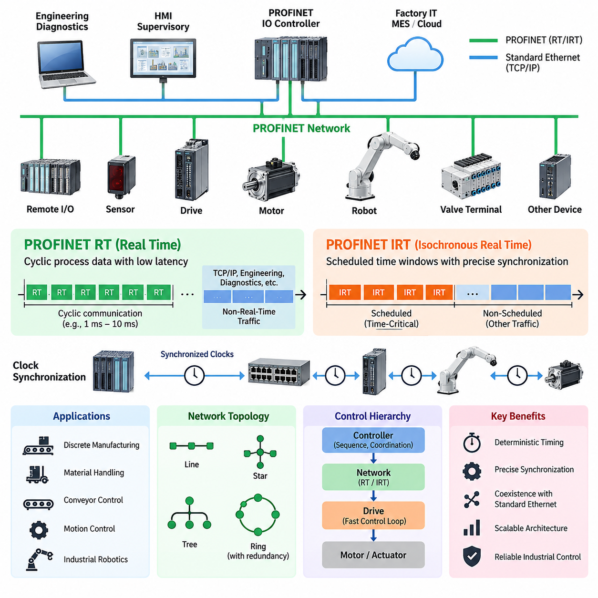
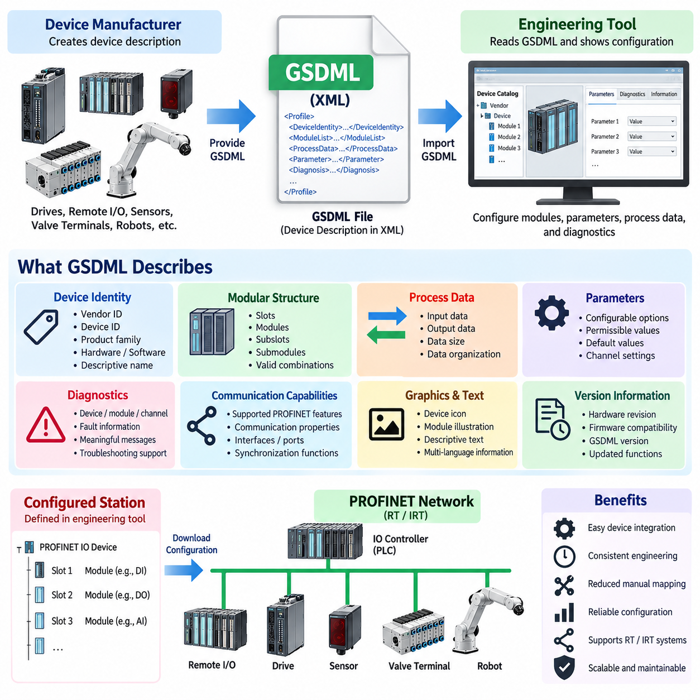
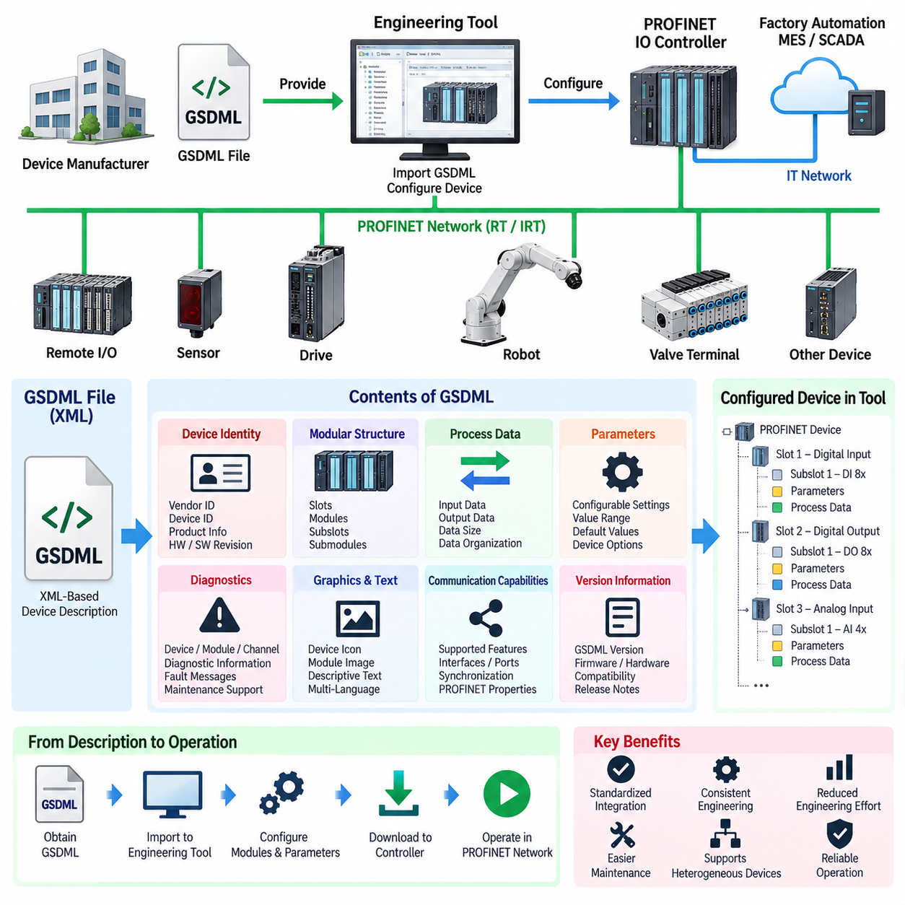
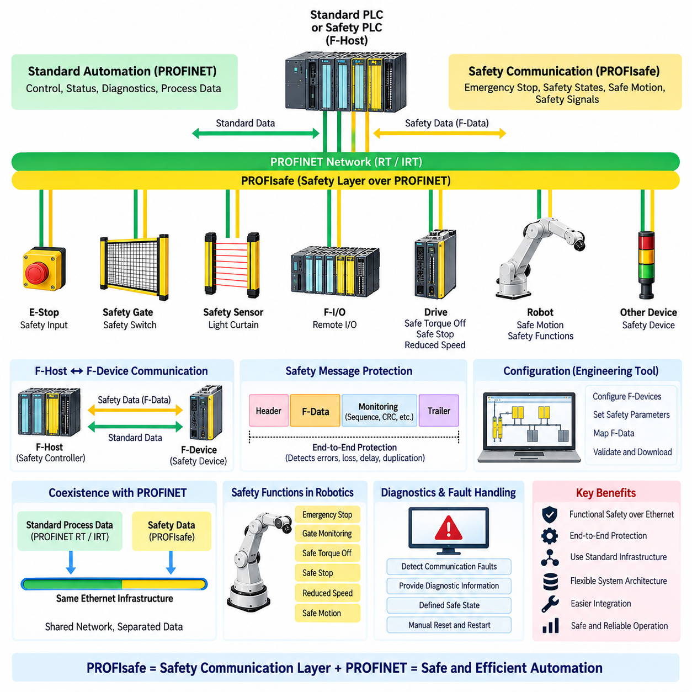
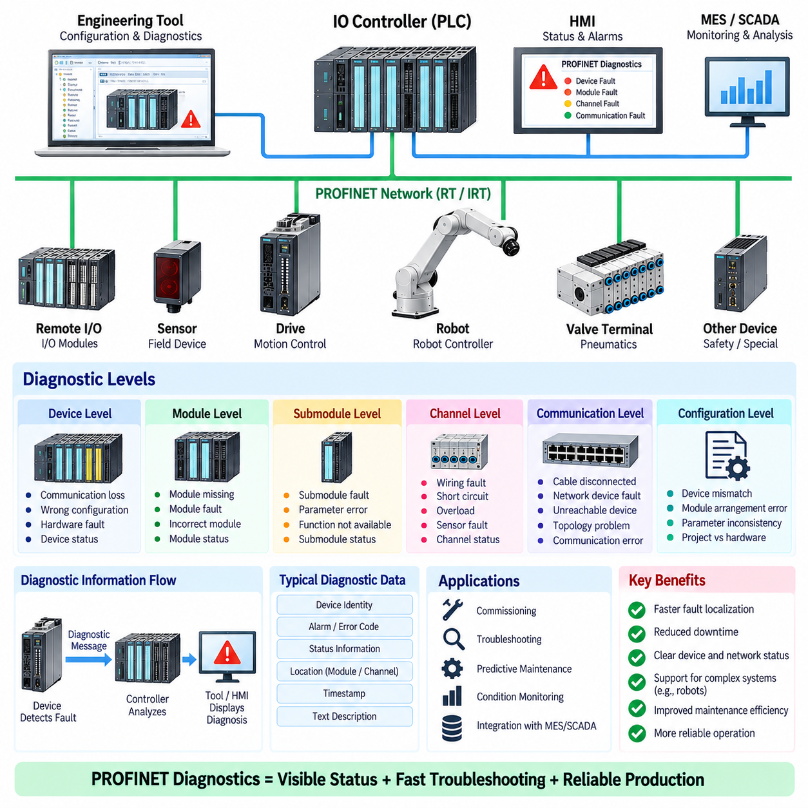
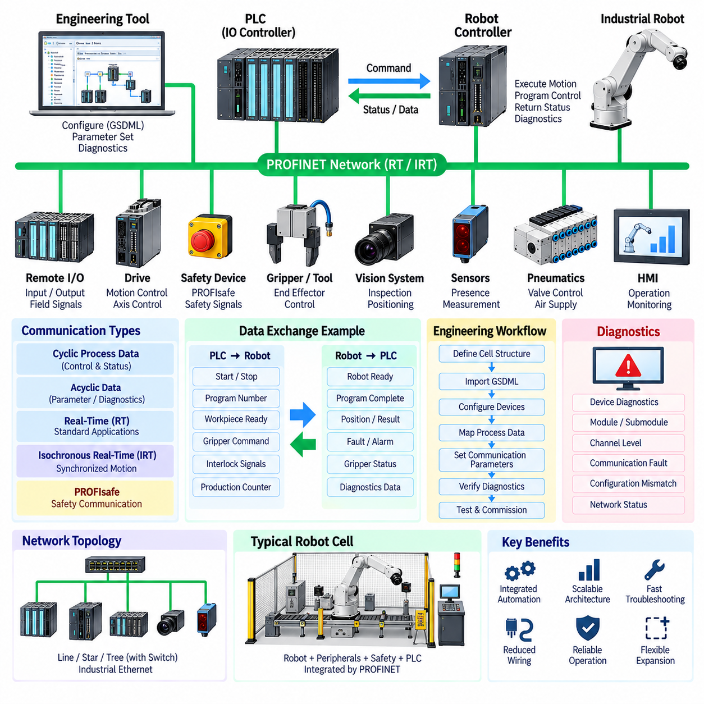

**Volume 07. Industrial Communication**


# Chapter 05. PROFINET

##  

## 05.01. PROFINET RT/IRT

{width="7.268055555555556in" height="7.268055555555556in"}

PROFINET is an Industrial Ethernet communication system designed for deterministic data exchange between controllers, distributed I/O devices, drives, robots, and other automation equipment. It uses standard Ethernet technology while adding communication mechanisms optimized for industrial control. PROFINET supports several communication classes, of which Real Time (RT) and Isochronous Real Time (IRT) address applications requiring increasingly predictable timing and synchronization.

PROFINET RT is intended for cyclic process communication in which ordinary TCP/IP processing would introduce unnecessary protocol overhead and timing variation. Real-time frames are transmitted directly through Ethernet mechanisms rather than being processed through the complete TCP/IP stack. This reduces communication latency and allows controllers to exchange process data with field devices at predictable intervals while conventional Ethernet traffic can remain on the same network.

In a typical RT system, a PROFINET IO Controller cyclically exchanges input and output data with multiple IO Devices. Sensors, remote I/O modules, valve terminals, motor controllers, and other devices continuously update their process data according to the configured communication cycle. Engineering, diagnostics, parameterization, and other non-time-critical functions can simultaneously use standard Ethernet services without requiring a physically separate communication infrastructure.

RT communication provides sufficient deterministic behavior for a broad range of factory automation tasks, including discrete manufacturing, material handling, conveyor control, distributed sensing, and general robot peripheral integration. Its timing requirements are typically less demanding than tightly synchronized multi-axis motion control. The network therefore emphasizes practical real-time performance while preserving compatibility with standard switched Ethernet infrastructure and common industrial network architectures.

PROFINET IRT extends this concept for applications where communication must occur with very low timing variation and precise synchronization. Instead of relying only on prioritized Ethernet transmission, IRT organizes communication into carefully scheduled time windows. Time-critical cyclic traffic receives reserved transmission opportunities, preventing ordinary network traffic from interfering with deterministic control communication during the designated real-time portion of each communication cycle.

The communication cycle in an IRT network can be conceptually divided into scheduled and nonscheduled regions. Highly deterministic frames associated with synchronized control are transmitted during reserved intervals, while other PROFINET traffic and conventional Ethernet communication use the remaining bandwidth. This temporal separation allows deterministic industrial communication and ordinary network services to coexist while protecting critical control messages from unpredictable queuing delays and network congestion.

Precise clock synchronization is fundamental to IRT operation. Controllers, switches, drives, and other participating devices coordinate their local timing so that communication and control actions occur according to a common time reference. Accurate synchronization reduces jitter between distributed devices and enables several actuators to update their commands at closely aligned moments. This characteristic is particularly important when mechanical motion depends on coordinated behavior across multiple servo axes.

The practical distinction between RT and IRT is therefore not simply that one network is faster than the other. RT primarily provides efficient and predictable cyclic communication for normal industrial control, whereas IRT introduces stronger temporal coordination for applications requiring tightly bounded latency and jitter. Selecting between them should consequently depend on the control-loop requirements, synchronization accuracy, topology, device capabilities, and required communication cycle rather than nominal Ethernet bandwidth alone.

IRT becomes especially valuable in motion-control systems involving coordinated servo drives, printing machinery, packaging equipment, machine tools, synchronized conveyors, and industrial robots. If several joints or axes must follow trajectories simultaneously, variation in command delivery can appear as motion error or degraded coordination. Deterministic communication scheduling and synchronized device clocks help maintain consistent relationships between trajectory generation, command transmission, drive execution, and feedback acquisition.

Network topology also influences real-time performance. PROFINET installations commonly use switched Ethernet structures arranged as line, star, tree, or combinations of these forms. Industrial devices may contain integrated switch ports, allowing convenient line structures without separate switches at every node. For demanding deterministic operation, however, network components must support the required PROFINET functions, and the engineering configuration must account for communication paths, update timing, synchronization, and topology changes.

PROFINET communication should also be understood as part of a complete automation architecture rather than as an isolated fieldbus replacement. Cyclic RT or IRT traffic handles time-sensitive process information, while additional Ethernet communication supports configuration, diagnostics, asset information, higher-level supervisory systems, and engineering access. This coexistence is one reason PROFINET can connect field-level automation with broader Ethernet-based factory infrastructures while retaining deterministic control capabilities.

For robotics, the choice of communication class depends strongly on where PROFINET is positioned in the control hierarchy. RT is appropriate for exchanging robot status, interlocks, peripheral commands, gripper signals, station handshakes, and general PLC data. IRT is more relevant when network communication participates directly in synchronized motion or tightly coordinated machine processes. Internal high-frequency motor-current or torque loops may still remain inside dedicated servo drives even when IRT coordinates higher-level motion.

This separation of control responsibilities is important because deterministic networking does not eliminate the need for local control. A servo drive can execute fast current, velocity, and position functions locally while receiving synchronized references through the industrial network. The controller therefore manages coordinated machine behavior, the network delivers information within controlled timing boundaries, and the drive performs lower-level actuation. The resulting hierarchy distributes computation according to required response time.

Engineering an RT or IRT system consequently requires more than selecting Ethernet cables and connecting compatible devices. Update times, synchronization requirements, network load, topology, switch behavior, device capabilities, diagnostic requirements, and failure responses must be considered together. Excessively demanding timing increases configuration complexity without necessarily improving machine performance, while insufficient determinism can introduce unacceptable variation into coordinated control processes.

PROFINET RT and IRT ultimately represent two levels of deterministic Industrial Ethernet behavior within the same automation ecosystem. RT provides practical real-time cyclic communication for most controller-to-device exchanges, while IRT adds synchronized scheduling for applications where timing consistency becomes part of control performance itself. This layered approach allows engineers to apply deterministic communication selectively, matching network behavior to the physical dynamics and synchronization requirements of the industrial system.

PROFINET은 컨트롤러(Controller), 분산 입출력 장치(Distributed I/O Device), 드라이브(Drive), 로봇(Robot) 및 기타 자동화 장비 사이에서 결정론적 데이터 교환(Deterministic Data Exchange)을 수행하도록 설계된 산업용 이더넷(Industrial Ethernet) 통신 시스템이다. 표준 이더넷(Ethernet) 기술을 사용하면서 산업 제어(Industrial Control)에 최적화된 통신 메커니즘을 추가한다. PROFINET은 여러 통신 클래스를 지원하며, 그중 실시간(Real Time, RT)과 등시성 실시간(Isochronous Real Time, IRT)은 점차 높은 수준의 예측 가능한 타이밍(Timing)과 동기화(Synchronization)가 필요한 응용 분야를 대상으로 한다.

PROFINET RT는 일반적인 TCP/IP 처리가 불필요한 프로토콜 오버헤드(Protocol Overhead)와 타이밍 변동(Timing Variation)을 발생시킬 수 있는 주기적 공정 통신(Cyclic Process Communication)을 위해 설계되었다. 실시간 프레임(Real-Time Frame)은 전체 TCP/IP 스택(Stack)을 거치지 않고 이더넷 메커니즘을 통해 직접 전송된다. 이를 통해 통신 지연시간(Communication Latency)을 줄이고, 일반적인 이더넷 트래픽(Ethernet Traffic)이 동일한 네트워크에 존재하는 상황에서도 컨트롤러와 필드 장치(Field Device)가 예측 가능한 주기로 공정 데이터(Process Data)를 교환할 수 있다.

일반적인 RT 시스템에서 PROFINET IO 컨트롤러(IO Controller)는 여러 IO 장치(IO Device)와 입력 및 출력 데이터를 주기적으로 교환한다. 센서(Sensor), 원격 입출력 모듈(Remote I/O Module), 밸브 터미널(Valve Terminal), 모터 컨트롤러(Motor Controller) 및 기타 장치는 설정된 통신 주기(Communication Cycle)에 따라 공정 데이터를 지속적으로 갱신한다. 동시에 엔지니어링(Engineering), 진단(Diagnostics), 파라미터 설정(Parameterization) 및 기타 비실시간 기능은 별도의 물리적 통신 인프라 없이 표준 이더넷 서비스를 사용할 수 있다.

RT 통신은 이산 제조(Discrete Manufacturing), 자재 운반(Material Handling), 컨베이어 제어(Conveyor Control), 분산 센싱(Distributed Sensing), 일반적인 로봇 주변장치 통합(Robot Peripheral Integration)을 포함한 광범위한 공장 자동화(Factory Automation) 작업에 충분한 결정론적 동작(Deterministic Behavior)을 제공한다. 이러한 응용 분야의 타이밍 요구사항은 긴밀하게 동기화된 다축 모션 제어(Multi-Axis Motion Control)보다 일반적으로 낮다. 따라서 RT 네트워크는 표준 스위치드 이더넷(Switched Ethernet) 인프라 및 일반적인 산업 네트워크 구조와의 호환성을 유지하면서 실용적인 실시간 성능을 제공하는 데 중점을 둔다.

PROFINET IRT는 통신이 매우 낮은 타이밍 변동과 정밀한 동기화를 요구하는 응용 분야를 위해 이러한 개념을 확장한다. IRT는 단순히 우선순위가 지정된 이더넷 전송(Prioritized Ethernet Transmission)에 의존하는 대신, 통신을 정밀하게 스케줄링된 시간 구간(Scheduled Time Window)으로 구성한다. 시간 임계 주기 트래픽(Time-Critical Cyclic Traffic)은 예약된 전송 기회를 사용하므로 일반 네트워크 트래픽이 지정된 실시간 통신 구간에서 결정론적 제어 통신을 방해하는 것을 방지할 수 있다.

IRT 네트워크의 통신 주기(Communication Cycle)는 개념적으로 스케줄링 영역(Scheduled Region)과 비스케줄링 영역(Nonscheduled Region)으로 구분할 수 있다. 동기화 제어와 관련된 높은 결정론성을 요구하는 프레임은 예약된 시간 구간에서 전송되고, 다른 PROFINET 트래픽과 일반적인 이더넷 통신은 나머지 대역폭(Bandwidth)을 사용한다. 이러한 시간적 분리(Temporal Separation)를 통해 결정론적 산업 통신과 일반 네트워크 서비스가 공존하면서도 중요한 제어 메시지를 예측하기 어려운 큐잉 지연(Queuing Delay)과 네트워크 혼잡(Network Congestion)으로부터 보호할 수 있다.

정밀한 클록 동기화(Clock Synchronization)는 IRT 동작의 핵심 요소이다. 컨트롤러, 스위치(Switch), 드라이브 및 기타 참여 장치는 공통 시간 기준(Common Time Reference)에 따라 통신과 제어 동작이 이루어지도록 각 장치의 로컬 타이밍(Local Timing)을 조정한다. 정확한 동기화는 분산 장치 사이의 지터(Jitter)를 감소시키고 여러 액추에이터(Actuator)가 거의 동일한 시점에 명령을 갱신할 수 있도록 한다. 이러한 특성은 여러 서보 축(Servo Axis)의 협조 동작에 기계적 움직임이 의존하는 경우 특히 중요하다.

따라서 RT와 IRT의 실질적인 차이는 단순히 어느 네트워크가 더 빠른가의 문제가 아니다. RT는 일반적인 산업 제어를 위한 효율적이고 예측 가능한 주기 통신을 제공하는 데 중점을 두는 반면, IRT는 엄격하게 제한된 지연시간(Latency)과 지터가 필요한 응용 분야를 위해 보다 강력한 시간적 조정(Temporal Coordination)을 제공한다. 따라서 두 방식의 선택은 단순한 이더넷 대역폭이 아니라 제어 루프(Control Loop) 요구사항, 동기화 정확도(Synchronization Accuracy), 토폴로지(Topology), 장치 성능 및 요구 통신 주기를 기준으로 이루어져야 한다.

IRT는 특히 협조 서보 드라이브(Coordinated Servo Drive), 인쇄 기계(Printing Machinery), 포장 장비(Packaging Equipment), 공작기계(Machine Tool), 동기화 컨베이어(Synchronized Conveyor), 산업용 로봇(Industrial Robot)과 같은 모션 제어(Motion Control) 시스템에서 중요한 가치를 가진다. 여러 조인트(Joint) 또는 축(Axis)이 동시에 궤적(Trajectory)을 추종해야 하는 경우 명령 전달의 변동은 모션 오차(Motion Error) 또는 협조 성능 저하로 나타날 수 있다. 결정론적 통신 스케줄링과 동기화된 장치 클록은 궤적 생성, 명령 전송, 드라이브 실행 및 피드백 획득(Feedback Acquisition) 사이의 일관된 관계를 유지하도록 지원한다.

네트워크 토폴로지(Network Topology) 역시 실시간 성능에 영향을 미친다. PROFINET 설비는 일반적으로 라인(Line), 스타(Star), 트리(Tree) 또는 이들의 조합으로 구성된 스위치드 이더넷 구조를 사용한다. 산업용 장치는 통합 스위치 포트(Integrated Switch Port)를 포함할 수 있으므로 모든 노드(Node)에 별도의 스위치를 설치하지 않고도 편리한 라인 구조를 구성할 수 있다. 그러나 높은 수준의 결정론적 동작을 위해서는 네트워크 구성요소가 필요한 PROFINET 기능을 지원해야 하며, 엔지니어링 설정에서는 통신 경로, 갱신 타이밍(Update Timing), 동기화 및 토폴로지 변경을 함께 고려해야 한다.

PROFINET 통신은 독립적인 필드버스(Fieldbus) 대체 기술이라기보다 전체 자동화 아키텍처(Automation Architecture)의 일부로 이해해야 한다. 주기적 RT 또는 IRT 트래픽은 시간에 민감한 공정 정보를 처리하는 반면, 추가적인 이더넷 통신은 설정(Configuration), 진단, 자산 정보(Asset Information), 상위 수준 감시 시스템(Supervisory System) 및 엔지니어링 접근을 지원한다. 이러한 공존 능력은 PROFINET이 결정론적 제어 기능을 유지하면서 필드 수준 자동화(Field-Level Automation)를 보다 광범위한 이더넷 기반 공장 인프라와 연결할 수 있는 중요한 이유이다.

로보틱스(Robotics)에서 통신 클래스의 선택은 PROFINET이 제어 계층(Control Hierarchy)의 어느 위치에 배치되는지에 크게 좌우된다. RT는 로봇 상태(Robot Status), 인터록(Interlock), 주변장치 명령, 그리퍼 신호(Gripper Signal), 스테이션 핸드셰이크(Station Handshake), 일반적인 PLC 데이터 교환에 적합하다. 반면 IRT는 네트워크 통신이 동기화 모션(Synchronized Motion)이나 긴밀하게 협조된 기계 공정에 직접 참여하는 경우 더욱 적합하다. IRT가 상위 수준의 모션을 조정하더라도 내부의 고주파 모터 전류 또는 토크 루프(Torque Loop)는 전용 서보 드라이브 내부에서 계속 수행될 수 있다.

이러한 제어 책임(Control Responsibility)의 분리는 결정론적 네트워킹(Deterministic Networking)이 로컬 제어(Local Control)의 필요성을 제거하지 않는다는 점에서 중요하다. 서보 드라이브는 산업 네트워크를 통해 동기화된 기준 명령(Synchronized Reference)을 수신하면서 빠른 전류, 속도 및 위치 제어 기능을 로컬에서 수행할 수 있다. 따라서 컨트롤러는 협조된 기계 동작을 관리하고, 네트워크는 제어된 타이밍 범위 안에서 정보를 전달하며, 드라이브는 하위 수준의 액추에이션(Actuation)을 수행한다. 이러한 계층 구조는 요구되는 응답시간(Response Time)에 따라 연산과 제어 기능을 적절히 분산한다.

따라서 RT 또는 IRT 시스템의 엔지니어링은 단순히 이더넷 케이블(Ethernet Cable)을 선택하고 호환 장치를 연결하는 것 이상의 작업을 요구한다. 갱신 주기(Update Time), 동기화 요구사항, 네트워크 부하(Network Load), 토폴로지, 스위치 동작, 장치 기능, 진단 요구사항 및 고장 대응(Failure Response)을 함께 고려해야 한다. 필요 이상으로 엄격한 타이밍 요구사항은 실제 기계 성능을 개선하지 않으면서 설정 복잡성만 증가시킬 수 있으며, 반대로 결정성이 부족하면 협조 제어 공정에 허용할 수 없는 변동이 발생할 수 있다.

결국 PROFINET RT와 IRT는 동일한 자동화 생태계(Automation Ecosystem) 안에서 서로 다른 수준의 결정론적 산업용 이더넷 동작을 제공한다. RT는 대부분의 컨트롤러와 장치 사이의 데이터 교환에 적합한 실용적인 실시간 주기 통신을 제공하며, IRT는 타이밍 일관성(Timing Consistency) 자체가 제어 성능의 일부가 되는 응용 분야를 위해 동기화된 스케줄링(Synchronized Scheduling)을 추가한다. 이러한 계층적 접근을 통해 엔지니어는 산업 시스템의 물리적 동특성(Physical Dynamics)과 동기화 요구사항에 맞추어 결정론적 통신을 선택적으로 적용할 수 있다.

##  

## 05.02. GSDML Device Description

{width="7.268055555555556in" height="7.268055555555556in"}

{width="7.268055555555556in" height="7.268055555555556in"}

GSDML, or General Station Description Markup Language, is the standardized device-description format used to integrate PROFINET IO devices into engineering systems. It provides a machine-readable representation of a device's communication capabilities, modular structure, identification information, parameters, diagnostics, and process-data organization. Within the PROFINET chapter structure, GSDML therefore forms the engineering bridge between RT/IRT communication concepts and actual device configuration.

A GSDML description is implemented as an XML-based file that follows a defined PROFINET schema. Instead of requiring an engineering tool to contain proprietary knowledge about every sensor, remote I/O station, drive, valve terminal, or robot interface, the manufacturer supplies a GSDML file describing the device. The engineering software interprets this information and presents the available configuration choices to the automation engineer in a consistent form.

The file normally contains device identity information that allows the engineering environment to distinguish a particular product and its supported variants. Vendor identification, device identification, product family information, hardware and software references, and descriptive names can be represented within the device model. This information helps ensure that the configured PROFINET station corresponds to the intended physical device and provides a foundation for device discovery, configuration, replacement, and maintenance.

One of the most important functions of GSDML is describing the modular structure of a PROFINET IO Device. Many industrial devices are not represented as one fixed block of process data. A remote I/O station, for example, may contain different combinations of digital input, digital output, analog input, analog output, communication, and specialty modules. GSDML defines which modules and submodules are available and how they can be assembled within the supported device configuration.

This modular representation corresponds closely to the PROFINET device model. An IO Device can contain slots populated by modules, while modules can contain subslots associated with submodules. Input and output data are ultimately associated with these configured elements. The engineering system uses the GSDML definitions to determine which combinations are valid, where modules may be inserted, what process data they exchange, and how the resulting station configuration should be represented to the IO Controller.

Process-data definitions are especially important because the controller must understand the size, direction, and organization of cyclic information exchanged with each device. GSDML can describe input data delivered from the device to the controller and output data transmitted from the controller to the device. Engineering tools use these definitions to construct the configured IO data layout, allowing PLC variables and application logic to be associated with the physical signals and functions exposed by the device.

GSDML also provides parameter descriptions required to adapt a device to a particular application. A configurable sensor may expose measurement modes, thresholds, filtering behavior, or operating options, while a distributed I/O module may require channel-specific settings. Rather than embedding these choices directly into the engineering software, the device description defines the supported parameters, their permissible values, default values, and related information so that configuration can be performed systematically.

Diagnostic information is another significant part of device description. Industrial automation requires faults to be represented in a way that supports commissioning, troubleshooting, and maintenance. GSDML can provide information that allows engineering systems to interpret device-, module-, submodule-, or channel-related diagnostic conditions. This enables a raw device condition to be presented as meaningful engineering information and helps technicians identify whether a problem originates from communication, configuration, wiring, channels, or equipment.

The GSDML file can additionally reference graphical and textual resources used by the engineering environment. Device icons, module illustrations, descriptive text, and language-dependent information can make configuration easier to understand. These resources do not control the physical communication itself, but they improve the engineering representation of the device and reduce dependence on manually interpreting product documentation when constructing or diagnosing a PROFINET station.

Device capabilities related to communication are also represented through the description. The engineering system must know which PROFINET features and communication properties a device supports before generating a valid network configuration. Depending on the device and GSDML version, relevant capabilities can include communication relationships, cyclic data characteristics, supported interfaces and ports, synchronization-related functions, and other PROFINET-specific properties required for correct controller-device operation.

This relationship becomes particularly important when RT and IRT requirements are considered. A GSDML file does not itself create deterministic communication; instead, it informs the engineering environment about the capabilities that can participate in the configured PROFINET system. The controller, devices, network infrastructure, topology, timing configuration, and supported communication features must still work together. GSDML provides the structured device knowledge needed to create and validate that engineering configuration.

In practical commissioning, the device manufacturer supplies the appropriate GSDML package, which is imported into a compatible PROFINET engineering environment. The device then becomes available in the engineering catalog, where the user can select the product, configure modules and submodules, assign parameters, define process-data relationships, and integrate the station into the controller project. The resulting engineering configuration is subsequently transferred to the automation system for operation.

Version management is important because device functionality and GSDML specifications can evolve over time. Hardware revisions, firmware changes, newly supported functions, or updated PROFINET features may require corresponding device-description revisions. Engineers should therefore verify compatibility among the physical device, firmware, GSDML version, engineering software, and controller environment instead of assuming that any file carrying the same product family name will describe every possible device revision correctly.

For robotics, GSDML becomes particularly useful at the boundary between a robot system and factory automation equipment. A robot controller, gripper interface, remote I/O station, drive system, or peripheral device can expose standardized process data and parameters to a PLC through its PROFINET description. The PLC engineer can configure these interfaces through the same engineering workflow used for other factory devices, reducing the need for manually constructed communication mappings.

GSDML should therefore be viewed as a formal contract between a PROFINET device and the engineering ecosystem rather than merely as an installation file. It describes what the device is, how it is structurally organized, what data it exchanges, which parameters can be configured, which diagnostics can be interpreted, and which communication capabilities are available. By standardizing this description, PROFINET enables heterogeneous industrial devices to be integrated into controller projects through a consistent and scalable engineering process.

GSDML(General Station Description Markup Language)은 PROFINET IO 장치를 엔지니어링 시스템(Engineering System)에 통합하기 위해 사용되는 표준화된 장치 기술 형식(Device-Description Format)이다. 장치의 통신 기능(Communication Capability), 모듈 구조(Modular Structure), 식별 정보(Identification Information), 파라미터(Parameter), 진단(Diagnostics), 공정 데이터 구성(Process-Data Organization)을 기계 판독 가능한 형태(Machine-Readable Representation)로 제공한다. 따라서 PROFINET 구조에서 GSDML은 RT/IRT 통신 개념과 실제 장치 설정(Device Configuration)을 연결하는 엔지니어링 가교 역할을 한다.

GSDML 기술 정보는 정의된 PROFINET 스키마(Schema)를 따르는 XML 기반 파일(XML-Based File)로 구현된다. 엔지니어링 도구가 모든 센서(Sensor), 원격 입출력 스테이션(Remote I/O Station), 드라이브(Drive), 밸브 터미널(Valve Terminal), 로봇 인터페이스(Robot Interface)에 대한 제조사별 정보를 자체적으로 포함하는 대신, 제조사가 해당 장치를 설명하는 GSDML 파일을 제공한다. 엔지니어링 소프트웨어는 이 정보를 해석하여 자동화 엔지니어에게 사용 가능한 설정 항목을 일관된 형태로 제공한다.

파일에는 일반적으로 엔지니어링 환경에서 특정 제품과 지원되는 제품 변형(Variant)을 구별할 수 있도록 장치 식별 정보(Device Identity Information)가 포함된다. 공급업체 식별자(Vendor Identification), 장치 식별자(Device Identification), 제품군 정보(Product Family Information), 하드웨어 및 소프트웨어 참조 정보, 설명용 이름 등을 장치 모델에 표현할 수 있다. 이러한 정보는 설정된 PROFINET 스테이션이 실제 의도한 물리 장치와 일치하도록 하고 장치 검색, 설정, 교체 및 유지보수의 기반을 제공한다.

GSDML의 가장 중요한 기능 중 하나는 PROFINET IO 장치(IO Device)의 모듈 구조(Modular Structure)를 기술하는 것이다. 많은 산업용 장치는 하나의 고정된 공정 데이터 블록(Process Data Block)으로 표현되지 않는다. 예를 들어 원격 입출력 스테이션은 디지털 입력(Digital Input), 디지털 출력(Digital Output), 아날로그 입력(Analog Input), 아날로그 출력(Analog Output), 통신 및 특수 기능 모듈의 다양한 조합으로 구성될 수 있다. GSDML은 사용 가능한 모듈(Module)과 서브모듈(Submodule), 그리고 지원되는 장치 구성에서 이들을 어떻게 조합할 수 있는지를 정의한다.

이러한 모듈 표현(Modular Representation)은 PROFINET 장치 모델(Device Model)과 밀접하게 대응된다. IO 장치는 모듈이 배치되는 슬롯(Slot)을 포함할 수 있으며, 모듈은 서브모듈과 연계되는 서브슬롯(Subslot)을 포함할 수 있다. 최종적으로 입력 및 출력 데이터는 이러한 설정 요소와 연결된다. 엔지니어링 시스템은 GSDML 정의를 이용하여 어떤 조합이 유효한지, 모듈을 어디에 삽입할 수 있는지, 어떤 공정 데이터를 교환하는지, 그리고 결과적인 스테이션 구성을 IO 컨트롤러(IO Controller)에 어떻게 표현할지를 결정한다.

공정 데이터 정의(Process-Data Definition)는 컨트롤러가 각 장치와 주기적으로 교환하는 정보의 크기(Size), 방향(Direction), 구성(Organization)을 이해해야 하므로 특히 중요하다. GSDML은 장치에서 컨트롤러로 전달되는 입력 데이터(Input Data)와 컨트롤러에서 장치로 전송되는 출력 데이터(Output Data)를 기술할 수 있다. 엔지니어링 도구는 이러한 정의를 이용해 설정된 IO 데이터 레이아웃(IO Data Layout)을 구성하며, 이를 통해 PLC 변수(PLC Variable)와 응용 로직(Application Logic)을 장치가 제공하는 실제 신호 및 기능과 연결할 수 있다.

GSDML은 특정 응용 분야에 맞도록 장치를 조정하는 데 필요한 파라미터 기술(Parameter Description)도 제공한다. 설정 가능한 센서는 측정 모드(Measurement Mode), 임계값(Threshold), 필터링 동작(Filtering Behavior), 운용 옵션(Operating Option)을 제공할 수 있으며, 분산 입출력 모듈은 채널별 설정(Channel-Specific Setting)을 요구할 수 있다. 이러한 선택 사항을 엔지니어링 소프트웨어에 직접 내장하는 대신 장치 기술 정보에서 지원되는 파라미터, 허용 값(Permissible Value), 기본값(Default Value) 및 관련 정보를 정의하여 체계적인 설정이 가능하도록 한다.

진단 정보(Diagnostic Information) 역시 장치 기술에서 중요한 부분을 차지한다. 산업 자동화에서는 시운전(Commissioning), 문제 해결(Troubleshooting), 유지보수(Maintenance)를 지원할 수 있는 형태로 고장(Fault)을 표현해야 한다. GSDML은 엔지니어링 시스템이 장치, 모듈, 서브모듈 또는 채널과 관련된 진단 상태(Diagnostic Condition)를 해석할 수 있도록 정보를 제공한다. 이를 통해 장치의 원시 상태(Raw Device Condition)를 의미 있는 엔지니어링 정보로 표현하고, 문제가 통신, 설정, 배선(Wiring), 채널 또는 장비 중 어디에서 발생했는지를 기술자가 파악하도록 지원한다.

GSDML 파일은 엔지니어링 환경에서 사용되는 그래픽 및 텍스트 리소스(Graphical and Textual Resource)를 추가로 참조할 수 있다. 장치 아이콘(Device Icon), 모듈 그림(Module Illustration), 설명 텍스트(Descriptive Text), 언어별 정보(Language-Dependent Information)는 장치 설정을 더욱 쉽게 이해하도록 한다. 이러한 리소스가 실제 물리적 통신을 제어하는 것은 아니지만 장치의 엔지니어링 표현을 개선하고, PROFINET 스테이션을 구성하거나 진단할 때 제품 문서를 수동으로 해석해야 하는 부담을 줄여준다.

통신과 관련된 장치 기능(Device Capability) 역시 장치 기술 정보를 통해 표현된다. 엔지니어링 시스템은 유효한 네트워크 구성을 생성하기 전에 장치가 어떤 PROFINET 기능과 통신 특성(Communication Property)을 지원하는지 알아야 한다. 장치 및 GSDML 버전(Version)에 따라 통신 관계(Communication Relationship), 주기 데이터 특성(Cyclic Data Characteristic), 지원 인터페이스와 포트(Port), 동기화 관련 기능(Synchronization-Related Function) 및 올바른 컨트롤러-장치 동작에 필요한 기타 PROFINET 고유 특성이 포함될 수 있다.

이러한 관계는 RT와 IRT 요구사항을 고려할 때 특히 중요해진다. GSDML 파일 자체가 결정론적 통신(Deterministic Communication)을 생성하는 것은 아니며, 설정된 PROFINET 시스템에 참여할 수 있는 장치 기능을 엔지니어링 환경에 알려주는 역할을 한다. 컨트롤러, 장치, 네트워크 인프라(Network Infrastructure), 토폴로지(Topology), 타이밍 설정(Timing Configuration), 지원 통신 기능이 함께 동작해야 한다. GSDML은 이러한 엔지니어링 구성을 생성하고 검증하는 데 필요한 구조화된 장치 정보(Structured Device Knowledge)를 제공한다.

실제 시운전 과정에서 장치 제조사는 적절한 GSDML 패키지(Package)를 제공하며, 이는 호환 가능한 PROFINET 엔지니어링 환경으로 가져오기(Import)된다. 이후 장치는 엔지니어링 카탈로그(Engineering Catalog)에서 사용할 수 있게 되고, 사용자는 제품을 선택하여 모듈과 서브모듈을 구성하고, 파라미터를 지정하며, 공정 데이터 관계(Process-Data Relationship)를 정의하고, 해당 스테이션을 컨트롤러 프로젝트(Controller Project)에 통합할 수 있다. 이렇게 완성된 엔지니어링 구성은 이후 실제 운용을 위해 자동화 시스템으로 전송된다.

장치 기능과 GSDML 규격은 시간이 지나면서 발전할 수 있으므로 버전 관리(Version Management)가 중요하다. 하드웨어 개정(Hardware Revision), 펌웨어 변경(Firmware Change), 새롭게 지원되는 기능 또는 업데이트된 PROFINET 기능에 따라 장치 기술 정보도 함께 변경되어야 할 수 있다. 따라서 엔지니어는 동일한 제품군 이름을 가진 파일이 모든 장치 개정판을 정확하게 설명한다고 가정하기보다 실제 장치, 펌웨어, GSDML 버전, 엔지니어링 소프트웨어 및 컨트롤러 환경 사이의 호환성(Compatibility)을 확인해야 한다.

로보틱스(Robotics) 분야에서 GSDML은 로봇 시스템과 공장 자동화 장비 사이의 경계에서 특히 유용하다. 로봇 컨트롤러(Robot Controller), 그리퍼 인터페이스(Gripper Interface), 원격 입출력 스테이션, 드라이브 시스템 또는 주변장치(Peripheral Device)는 PROFINET 장치 기술 정보를 통해 표준화된 공정 데이터와 파라미터를 PLC에 제공할 수 있다. PLC 엔지니어는 다른 공장 장치를 설정하는 것과 동일한 엔지니어링 작업 흐름(Engineering Workflow)을 통해 이러한 인터페이스를 구성할 수 있으므로 수작업으로 통신 매핑(Communication Mapping)을 작성해야 하는 필요성을 줄일 수 있다.

따라서 GSDML은 단순한 설치 파일(Installation File)이 아니라 PROFINET 장치와 엔지니어링 생태계(Engineering Ecosystem) 사이의 공식적인 계약(Formal Contract)으로 이해하는 것이 적절하다. GSDML은 장치가 무엇인지, 구조적으로 어떻게 구성되는지, 어떤 데이터를 교환하는지, 어떤 파라미터를 설정할 수 있는지, 어떤 진단 정보를 해석할 수 있는지, 그리고 어떤 통신 기능을 사용할 수 있는지를 기술한다. 이러한 장치 기술을 표준화함으로써 PROFINET은 서로 다른 산업용 장치들을 일관되고 확장 가능한 엔지니어링 프로세스(Engineering Process)를 통해 컨트롤러 프로젝트에 통합할 수 있도록 한다.

##  

## 05.03. PROFIsafe Safety Protocol

{width="7.268055555555556in" height="7.268055555555556in"}

PROFIsafe is the functional safety communication protocol used with PROFINET to transmit safety-related information over the same industrial Ethernet infrastructure that carries standard automation data. Its purpose is not to replace the underlying PROFINET communication, but to add mechanisms that allow safety functions to detect communication errors and place the controlled machine or robot into a defined safe state. It therefore provides a safety layer above the standard communication system.

PROFIsafe is designed around the separation between standard automation communication and safety communication. Normal PROFINET data can continue to carry control, status, and diagnostic information, while PROFIsafe transfers safety-critical signals such as emergency-stop commands, protective-device states, and safe operating conditions. This approach allows standard and safety-related functions to share network infrastructure while maintaining the additional integrity mechanisms required for safety communication.

A central concept in PROFIsafe is the communication relationship between the F-Host and F-Device. The F-Host is typically a safety controller or safety-related control function that evaluates safety logic, while the F-Device is a field device capable of processing safety-related data. Examples include fail-safe remote I/O, safety sensors, safety switches, drives, and other devices used in machine safety systems. The safety application exchanges defined F-data through this relationship.

PROFIsafe does not assume that the underlying network is inherently safe. Ethernet frames may be delayed, repeated, lost, inserted, or delivered to an incorrect logical destination. PROFIsafe therefore incorporates mechanisms that allow the receiving safety function to recognize communication faults. Monitoring information, sequence-related information, and safety-specific protection mechanisms help distinguish valid safety messages from corrupted, duplicated, delayed, or incorrectly associated messages.

A key principle is that safety is achieved through end-to-end protection rather than by making every component of the communication path intrinsically safety-rated. The safety message is protected between the safety application endpoints, while intermediate network components primarily provide communication transport. This allows PROFIsafe to operate across standard PROFINET infrastructure and supports flexible network architectures without requiring every Ethernet switch or communication segment to become part of the safety function.

PROFIsafe uses safety-oriented data structures and monitoring mechanisms to maintain communication integrity. A safety receiver can verify whether received information belongs to the expected communication relationship and whether it arrived within an acceptable timing condition. If the expected safety information is missing or invalid, the safety application can react according to its configured safety logic. The resulting behavior is normally designed around a defined safe state rather than continued operation with uncertain safety information.

Configuration is an important part of a PROFIsafe system because safety communication must be associated with the correct logical safety functions and physical devices. Safety parameters identify communication relationships and define how safety devices participate in the safety system. Engineering tools are used to configure the safety controller, F-Devices, safety parameters, and corresponding process data. Correct configuration and verification are therefore essential parts of commissioning and safety validation.

PROFIsafe can coexist with PROFINET RT and, where supported, PROFINET IRT communication. Standard cyclic process data may be exchanged through normal PROFINET mechanisms, while safety-related information is handled through the PROFIsafe layer. The distinction is important because deterministic communication performance and functional safety are related but different engineering concerns. A network can provide predictable communication timing, but safety integrity still requires independent mechanisms for detecting communication and application-level faults.

In industrial robotics, PROFIsafe can connect safety functions between a safety PLC, robot controller, drives, distributed I/O, and protective devices. Emergency-stop inputs, gate switches, enabling devices, safe motion commands, and other safety-related signals can be exchanged through the industrial network. For example, a safety controller may detect an opened protective gate and transmit the corresponding safety command to a robot or drive system. The receiving system then performs its configured safe response.

The relationship between PROFIsafe and safe motion is particularly important in modern robot and machine architectures. A safety system may need to control functions such as safe torque off, safe stop, reduced speed, or other safety-related operating conditions. PROFIsafe can transport the corresponding safety information, while the drive or robot controller implements the actual safety function. The communication protocol therefore forms part of the safety architecture rather than independently performing the physical shutdown or motion-control function.

Diagnostics and fault handling must be considered together with PROFIsafe communication. A fault can originate from the safety device, communication path, configuration, timing condition, or safety application. When a safety communication error is detected, the system should provide sufficient diagnostic information for maintenance personnel to determine the cause while ensuring that diagnostic activity does not compromise the safety function. Recovery from a safety fault should also follow the defined reset and restart philosophy rather than automatically returning the machine to unrestricted operation.

PROFIsafe should therefore be understood as a safety communication layer integrated with the broader PROFINET architecture. PROFINET provides the industrial Ethernet communication infrastructure, while PROFIsafe adds end-to-end mechanisms and safety-oriented configuration needed for functional safety communication. In a complete robot or factory automation system, the safety PLC, F-Devices, drives, robot controllers, network infrastructure, safety logic, and physical safety functions must be engineered as one coherent safety architecture.

PROFIsafe는 표준 자동화 데이터가 전달되는 동일한 산업용 이더넷 인프라를 통해 안전 관련 정보를 전송하기 위해 PROFINET과 함께 사용되는 기능 안전 통신 프로토콜(Functional Safety Communication Protocol)이다. PROFIsafe의 목적은 기본 PROFINET 통신을 대체하는 것이 아니라, 통신 오류를 검출하고 제어되는 기계 또는 로봇을 정의된 안전 상태(Safe State)로 전환할 수 있도록 하는 메커니즘을 추가하는 것이다. 따라서 PROFIsafe는 표준 통신 시스템 상위에 위치하는 안전 계층(Safety Layer)을 제공한다.

PROFIsafe는 표준 자동화 통신과 안전 통신을 분리하는 것을 기본 개념으로 한다. 일반적인 PROFINET 데이터는 제어, 상태 및 진단 정보를 계속 전달할 수 있으며, PROFIsafe는 비상 정지(Emergency Stop) 명령, 보호 장치(Protective Device) 상태 및 안전 운전 조건(Safe Operating Condition)과 같은 안전 관련 신호를 전달한다. 이러한 구조를 통해 표준 기능과 안전 관련 기능이 동일한 네트워크 인프라를 공유하면서도 안전 통신에 필요한 추가적인 무결성 메커니즘(Integrity Mechanism)을 유지할 수 있다.

PROFIsafe의 핵심 개념 중 하나는 F-Host와 F-Device 사이의 통신 관계이다. F-Host는 일반적으로 안전 컨트롤러(Safety Controller) 또는 안전 관련 제어 기능(Safety-Related Control Function)으로서 안전 로직(Safety Logic)을 평가하며, F-Device는 안전 관련 데이터를 처리할 수 있는 필드 장치(Field Device)이다. 예로는 페일세이프 원격 입출력(Fail-Safe Remote I/O), 안전 센서(Safety Sensor), 안전 스위치(Safety Switch), 드라이브(Drive) 및 기계 안전 시스템에 사용되는 기타 장치가 있다. 안전 응용 프로그램(Safety Application)은 이러한 관계를 통해 정의된 F-Data를 교환한다.

PROFIsafe는 기본 네트워크 자체가 본질적으로 안전하다고 가정하지 않는다. 이더넷 프레임(Ethernet Frame)은 지연되거나, 반복되거나, 손실되거나, 삽입되거나, 잘못된 논리적 목적지(Logical Destination)로 전달될 수 있다. 따라서 PROFIsafe는 수신 측 안전 기능이 통신 오류를 인식할 수 있도록 하는 메커니즘을 포함한다. 모니터링 정보(Monitoring Information), 순서 관련 정보(Sequence-Related Information) 및 안전 전용 보호 메커니즘(Safety-Specific Protection Mechanism)은 수신된 안전 메시지가 손상되었거나, 중복되었거나, 지연되었거나, 잘못된 관계와 연결된 메시지인지 구별하는 데 도움을 준다.

핵심 원칙은 모든 통신 구성요소를 본질적으로 안전 등급으로 만드는 것이 아니라 종단 간 보호(End-to-End Protection)를 통해 안전성을 확보하는 것이다. 안전 메시지는 안전 응용 프로그램의 종단점(Safety Application Endpoint) 사이에서 보호되며, 중간 네트워크 구성요소는 주로 통신 전송 기능을 제공한다. 따라서 PROFIsafe는 표준 PROFINET 인프라를 통해 동작할 수 있으며, 모든 이더넷 스위치(Ethernet Switch)나 통신 구간이 안전 기능의 일부가 될 필요 없이 유연한 네트워크 아키텍처를 지원한다.

PROFIsafe는 통신 무결성을 유지하기 위해 안전 중심의 데이터 구조(Safety-Oriented Data Structure)와 모니터링 메커니즘(Monitoring Mechanism)을 사용한다. 안전 수신기는 수신된 정보가 예상된 통신 관계에 속하는지, 그리고 허용 가능한 타이밍 조건(Timing Condition) 안에 도착했는지를 확인할 수 있다. 예상되는 안전 정보가 누락되거나 유효하지 않은 경우 안전 응용 프로그램은 설정된 안전 로직에 따라 대응할 수 있다. 이러한 동작은 일반적으로 안전 정보가 불확실한 상태에서 계속 운전하는 것이 아니라 정의된 안전 상태로 전환하도록 설계된다.

설정(Configuration)은 PROFIsafe 시스템에서 중요한 부분이다. 안전 통신은 올바른 논리적 안전 기능(Logical Safety Function)과 물리적 장치(Physical Device)에 연결되어야 하기 때문이다. 안전 파라미터(Safety Parameter)는 통신 관계를 식별하고 안전 장치가 안전 시스템에 어떻게 참여하는지를 정의한다. 엔지니어링 도구(Engineering Tool)는 안전 컨트롤러, F-Device, 안전 파라미터 및 관련 공정 데이터를 설정하는 데 사용된다. 따라서 올바른 설정과 검증(Verification)은 시운전(Commissioning)과 안전 검증(Safety Validation)의 필수적인 부분이다.

PROFIsafe는 PROFINET RT 및 지원되는 경우 PROFINET IRT 통신과 공존할 수 있다. 표준 주기 공정 데이터(Standard Cyclic Process Data)는 일반적인 PROFINET 메커니즘을 통해 교환되고, 안전 관련 정보는 PROFIsafe 계층을 통해 처리된다. 이 구분은 결정론적 통신 성능(Deterministic Communication Performance)과 기능 안전(Functional Safety)이 서로 관련되어 있지만 서로 다른 엔지니어링 문제라는 점에서 중요하다. 네트워크가 예측 가능한 통신 타이밍을 제공할 수 있더라도 안전 무결성(Safety Integrity)을 확보하려면 통신 및 응용 프로그램 수준의 오류를 검출하기 위한 독립적인 메커니즘이 필요하다.

산업용 로봇(Industrial Robotics)에서는 PROFIsafe를 통해 안전 PLC, 로봇 컨트롤러, 드라이브, 분산 입출력(Distributed I/O) 및 보호 장치 사이의 안전 기능을 연결할 수 있다. 비상 정지 입력(Emergency-Stop Input), 게이트 스위치(Gate Switch), 활성화 장치(Enabling Device), 안전 모션 명령(Safe Motion Command) 및 기타 안전 관련 신호를 산업 네트워크를 통해 교환할 수 있다. 예를 들어 안전 컨트롤러가 보호 게이트의 개방을 감지하면 해당 안전 명령을 로봇 또는 드라이브 시스템으로 전달할 수 있다. 수신 시스템은 이후 설정된 안전 대응(Safe Response)을 수행한다.

PROFIsafe와 안전 모션(Safe Motion)의 관계는 현대적인 로봇 및 기계 아키텍처에서 특히 중요하다. 안전 시스템은 안전 토크 오프(Safe Torque Off, STO), 안전 정지(Safe Stop), 감속 속도(Reduced Speed) 또는 기타 안전 관련 운전 조건을 제어해야 할 수 있다. PROFIsafe는 이러한 안전 정보를 전달할 수 있으며, 드라이브 또는 로봇 컨트롤러는 실제 안전 기능을 구현한다. 따라서 통신 프로토콜 자체가 물리적인 차단이나 모션 제어 기능을 독립적으로 수행하는 것이 아니라, 전체 안전 아키텍처(Safety Architecture)의 일부로 기능한다.

진단(Diagnostics)과 오류 처리(Fault Handling)는 PROFIsafe 통신과 함께 고려되어야 한다. 오류는 안전 장치, 통신 경로, 설정, 타이밍 조건 또는 안전 응용 프로그램에서 발생할 수 있다. 안전 통신 오류가 검출되면 시스템은 유지보수 담당자가 원인을 판단할 수 있도록 충분한 진단 정보를 제공해야 하며, 동시에 진단 활동이 안전 기능을 저해해서는 안 된다. 안전 오류로부터 복구하는 과정 역시 정의된 리셋 및 재시작 정책(Reset and Restart Philosophy)을 따라야 하며, 기계를 자동으로 제한 없는 운전 상태로 복귀시켜서는 안 된다.

따라서 PROFIsafe는 보다 넓은 PROFINET 아키텍처에 통합된 안전 통신 계층(Safety Communication Layer)으로 이해하는 것이 적절하다. PROFINET은 산업용 이더넷 통신 인프라를 제공하고, PROFIsafe는 기능 안전 통신에 필요한 종단 간 메커니즘과 안전 중심 설정을 추가한다. 완전한 로봇 또는 공장 자동화 시스템에서는 안전 PLC, F-Device, 드라이브, 로봇 컨트롤러, 네트워크 인프라, 안전 로직 및 물리적 안전 기능이 하나의 일관된 안전 아키텍처로 함께 설계되어야 한다.

##  

## 05.04. PROFINET Diagnostics

{width="7.268055555555556in" height="7.268055555555556in"}

PROFINET diagnostics provides mechanisms for identifying, reporting, and analyzing communication and device conditions within a PROFINET network. It extends ordinary process communication by making device health and network status visible to the engineering and maintenance environment. Diagnostics can help determine whether a problem originates from a controller, IO Device, module, submodule, communication path, configuration, or physical connection, thereby reducing the time required to restore normal automation operation.

A PROFINET IO system continuously exchanges cyclic process data between an IO Controller and connected IO Devices. When communication or device conditions deviate from the configured state, diagnostic information can be generated and made available to the controller and engineering system. The diagnostic mechanism therefore connects real-time automation behavior with maintenance activities. Instead of observing only an unsuccessful process response, an engineer can use diagnostic information to identify the device or functional area associated with the abnormal condition.

Device-level diagnostics provide information about the overall condition of an IO Device. Typical conditions can include communication loss, incorrect device configuration, unavailable modules, hardware faults, or other device-specific problems. The engineering environment can associate these conditions with the corresponding station and present them to the operator or maintenance engineer. This device-oriented view is particularly useful during commissioning because it helps verify that the physical network configuration matches the intended project configuration.

Module and submodule diagnostics provide more detailed information when a device contains a modular structure. A remote I/O station, for example, may contain several input and output modules, each serving different physical channels. If one module develops a fault while the remainder of the station continues operating, diagnostics can identify the affected module or submodule rather than treating the entire station as a single undifferentiated failure. This hierarchical diagnostic model supports more precise troubleshooting and maintenance.

Channel-level diagnostics can provide an even finer level of fault localization. Individual input or output channels may experience conditions such as wiring problems, short circuits, overloads, sensor faults, or other application-specific abnormalities. When supported by the device, channel-related diagnostic information allows maintenance personnel to move from a general station fault toward the physical signal or connection that requires inspection. This can significantly reduce unnecessary replacement of healthy modules or devices.

PROFINET diagnostics are also closely related to configuration consistency. An IO Controller expects a particular device identity, module arrangement, and communication configuration. If the actual device does not correspond to the configured project, communication may fail or a diagnostic condition may be reported. Configuration diagnostics therefore help identify mismatches between engineering data and the installed hardware, which is especially important when devices are replaced, machines are expanded, or hardware revisions are introduced.

Communication diagnostics examine problems affecting the exchange of information between the controller and field devices. A device may become unreachable because of a disconnected cable, power loss, network component failure, incorrect configuration, or another communication problem. Diagnostic information can help distinguish communication availability problems from application-level process faults. This distinction is important because replacing a sensor or modifying PLC logic will not resolve a failure caused by a physical network interruption.

PROFINET network diagnostics can also support analysis of Ethernet infrastructure and communication paths. Industrial networks may contain switches, multiple ports, line segments, and different topology arrangements. A fault in one connection can affect downstream devices and create symptoms that appear at several stations. Network-oriented diagnostic information can therefore help engineers trace the communication path and identify where the abnormal condition begins instead of assuming that every affected device has independently failed.

Diagnostics are particularly important during commissioning. After a PROFINET system is physically assembled, engineers must verify device recognition, module configuration, communication status, process-data exchange, and network connectivity. Diagnostic functions provide feedback during this process and can expose configuration or wiring problems before the machine enters normal production. This makes diagnostics not only a maintenance function but also an important engineering and validation capability.

In an operating factory, diagnostic information supports predictive and condition-based maintenance by making abnormal device conditions visible before they necessarily become complete functional failures. Repeated communication interruptions, device warnings, or module-specific abnormalities can indicate developing problems in wiring, connectors, power supply, network infrastructure, or field devices. When diagnostic information is collected over time, maintenance teams can use it to identify recurring failure patterns and improve the reliability of the automation system.

PROFINET diagnostics also support the relationship between local automation and higher-level maintenance systems. A PLC or engineering tool can interpret device conditions locally, while supervisory or factory systems may collect selected diagnostic information for operational monitoring. The same industrial network can therefore support process communication and maintenance visibility. This becomes increasingly valuable as industrial systems integrate production control, asset management, remote service, and digital maintenance functions.

For industrial robots, PROFINET diagnostics can be used to monitor communication between the PLC, robot controller, drives, remote I/O, sensors, and other peripheral devices. A robot cell may contain many interconnected components, so a single communication problem can produce multiple secondary symptoms. Diagnostic information helps isolate the original fault by identifying which device, module, channel, or communication relationship first entered an abnormal state. This supports faster troubleshooting without unnecessarily changing robot programs or replacing functional equipment.

Effective diagnostic engineering requires a clear distinction between fault detection, fault localization, and fault recovery. Detecting an abnormal condition indicates that something has deviated from the expected state, while localization determines where the problem is likely to exist. Recovery then requires an appropriate corrective action such as restoring power, repairing wiring, correcting configuration, replacing a device, or resetting the system. PROFINET diagnostics primarily provides the information needed for detection and localization; the appropriate recovery procedure remains part of the overall machine engineering and maintenance strategy.

PROFINET diagnostics should therefore be regarded as an integral part of the communication architecture rather than an optional troubleshooting feature. Device, module, submodule, channel, configuration, and network information can be combined to create a structured view of system health. When integrated with engineering tools, PLC logic, maintenance procedures, and higher-level monitoring, diagnostics enables faster commissioning, more effective fault localization, reduced maintenance effort, and more reliable operation of industrial automation and robotic systems.

PROFINET 진단(PROFINET Diagnostics)은 PROFINET 네트워크에서 통신 및 장치 상태를 식별하고, 보고하며, 분석하기 위한 메커니즘을 제공한다. 이는 장치 상태(Device Health)와 네트워크 상태(Network Status)를 엔지니어링 및 유지보수 환경에서 확인할 수 있도록 함으로써 일반적인 공정 통신(Process Communication)을 확장한다. 진단 기능은 문제가 컨트롤러(Controller), IO 장치(IO Device), 모듈(Module), 서브모듈(Submodule), 통신 경로(Communication Path), 설정(Configuration) 또는 물리적 연결(Physical Connection) 중 어디에서 발생했는지를 판단하는 데 도움을 주며, 이를 통해 정상적인 자동화 운전을 복구하는 데 필요한 시간을 줄일 수 있다.

PROFINET IO 시스템은 IO 컨트롤러(IO Controller)와 연결된 IO 장치(IO Device) 사이에서 주기적인 공정 데이터(Cyclic Process Data)를 지속적으로 교환한다. 통신 또는 장치 상태가 설정된 상태에서 벗어나면 진단 정보(Diagnostic Information)가 생성되어 컨트롤러와 엔지니어링 시스템에서 이용할 수 있다. 따라서 진단 메커니즘은 실시간 자동화 동작(Real-Time Automation Behavior)과 유지보수 활동(Maintenance Activity)을 연결한다. 엔지니어는 단순히 공정 응답이 실패했다는 사실만 관찰하는 것이 아니라, 진단 정보를 이용하여 비정상 상태와 관련된 장치 또는 기능 영역을 식별할 수 있다.

장치 수준 진단(Device-Level Diagnostics)은 IO 장치의 전체적인 상태에 대한 정보를 제공한다. 일반적인 상태에는 통신 손실(Communication Loss), 잘못된 장치 설정(Incorrect Device Configuration), 사용할 수 없는 모듈(Unavailable Module), 하드웨어 고장(Hardware Fault) 또는 장치별 기타 문제가 포함될 수 있다. 엔지니어링 환경은 이러한 상태를 해당 스테이션(Station)과 연결하여 운영자 또는 유지보수 엔지니어에게 표시할 수 있다. 이러한 장치 중심의 관점(Device-Oriented View)은 시운전(Commissioning) 과정에서 특히 유용하며, 실제 물리 네트워크 구성(Physical Network Configuration)이 의도한 프로젝트 구성(Project Configuration)과 일치하는지 확인하는 데 도움을 준다.

모듈 및 서브모듈 진단(Module and Submodule Diagnostics)은 장치가 모듈식 구조(Modular Structure)를 가지고 있을 때 더욱 상세한 정보를 제공한다. 예를 들어 원격 I/O 스테이션(Remote I/O Station)은 각각 서로 다른 물리적 채널(Physical Channel)을 담당하는 여러 입력 및 출력 모듈을 포함할 수 있다. 전체 스테이션은 계속 동작하는 상태에서 하나의 모듈에 고장이 발생한 경우, 진단 기능은 전체 스테이션을 구분되지 않은 하나의 고장으로 처리하는 대신 문제가 발생한 모듈 또는 서브모듈을 식별할 수 있다. 이러한 계층적 진단 모델(Hierarchical Diagnostic Model)은 보다 정확한 문제 해결(Troubleshooting)과 유지보수를 지원한다.

채널 수준 진단(Channel-Level Diagnostics)은 더욱 세밀한 고장 위치 파악(Fault Localization)을 제공할 수 있다. 개별 입력 또는 출력 채널에서는 배선 문제(Wiring Problem), 단락(Short Circuit), 과부하(Overload), 센서 고장(Sensor Fault) 또는 기타 응용 분야별 이상 상태가 발생할 수 있다. 장치가 이를 지원하는 경우 채널 관련 진단 정보(Channel-Related Diagnostic Information)를 이용하면 유지보수 담당자는 일반적인 스테이션 고장에서 실제 점검이 필요한 물리적 신호 또는 연결부까지 문제 범위를 좁혀갈 수 있다. 이를 통해 정상적인 모듈이나 장치를 불필요하게 교체하는 것을 크게 줄일 수 있다.

PROFINET 진단은 설정 일관성(Configuration Consistency)과도 밀접하게 관련된다. IO 컨트롤러는 특정 장치 식별 정보(Device Identity), 모듈 구성(Module Arrangement) 및 통신 설정(Communication Configuration)을 기대한다. 실제 장치가 프로젝트에서 설정된 내용과 일치하지 않으면 통신이 실패하거나 진단 상태가 보고될 수 있다. 따라서 설정 진단(Configuration Diagnostics)은 엔지니어링 데이터와 설치된 하드웨어 사이의 불일치를 식별하는 데 도움을 주며, 장치 교체, 기계 확장 또는 하드웨어 개정(Hardware Revision)이 이루어질 때 특히 중요하다.

통신 진단(Communication Diagnostics)은 컨트롤러와 필드 장치(Field Device) 사이의 정보 교환에 영향을 주는 문제를 분석한다. 케이블 분리, 전원 손실, 네트워크 구성요소 고장, 잘못된 설정 또는 기타 통신 문제로 인해 장치에 접근할 수 없게 될 수 있다. 진단 정보는 통신 가용성 문제(Communication Availability Problem)와 응용 프로그램 수준의 공정 고장(Application-Level Process Fault)을 구분하는 데 도움을 줄 수 있다. 이러한 구분은 물리적인 네트워크 단절로 인해 발생한 고장을 센서를 교체하거나 PLC 로직을 수정해서 해결할 수 없기 때문에 중요하다.

PROFINET 네트워크 진단(PROFINET Network Diagnostics)은 이더넷 인프라(Ethernet Infrastructure)와 통신 경로(Communication Path)의 분석도 지원할 수 있다. 산업 네트워크에는 스위치(Switch), 여러 포트(Port), 여러 네트워크 구간(Line Segment) 및 다양한 토폴로지(Topology)가 포함될 수 있다. 하나의 연결에서 발생한 고장이 여러 스테이션에 영향을 주면서 여러 장치에서 문제가 발생한 것처럼 보이는 증상을 만들 수 있다. 따라서 네트워크 중심의 진단 정보(Network-Oriented Diagnostic Information)는 엔지니어가 통신 경로를 추적하고 비정상 상태가 시작되는 지점을 식별하도록 지원하며, 영향을 받은 모든 장치가 독립적으로 고장났다고 판단하는 것을 방지한다.

진단 기능은 시운전 과정에서 특히 중요하다. PROFINET 시스템이 물리적으로 구성된 후 엔지니어는 장치 인식(Device Recognition), 모듈 설정, 통신 상태, 공정 데이터 교환 및 네트워크 연결성을 확인해야 한다. 진단 기능은 이러한 과정에서 피드백을 제공하고, 기계가 정상 생산에 투입되기 전에 설정 또는 배선 문제를 발견할 수 있도록 한다. 따라서 진단은 단순한 유지보수 기능이 아니라 중요한 엔지니어링 및 검증 기능(Engineering and Validation Capability)이기도 하다.

운영 중인 공장에서는 진단 정보를 통해 비정상적인 장치 상태를 완전한 기능 고장으로 발전하기 전에 확인할 수 있으므로 예지보전(Predictive Maintenance)과 상태 기반 유지보수(Condition-Based Maintenance)를 지원할 수 있다. 반복적인 통신 중단, 장치 경고 또는 특정 모듈에서 반복되는 이상 상태는 배선, 커넥터(Connector), 전원 공급(Power Supply), 네트워크 인프라 또는 필드 장치에서 문제가 발전하고 있음을 나타낼 수 있다. 진단 정보가 시간에 따라 축적되면 유지보수 팀은 반복되는 고장 패턴을 식별하고 자동화 시스템의 신뢰성을 향상시킬 수 있다.

PROFINET 진단은 로컬 자동화(Local Automation)와 상위 수준의 유지보수 시스템(Higher-Level Maintenance System) 사이의 관계도 지원한다. PLC 또는 엔지니어링 도구는 장치 상태를 로컬에서 해석할 수 있으며, 상위 감독 시스템(Supervisory System) 또는 공장 시스템은 선택된 진단 정보를 운영 모니터링(Operational Monitoring)을 위해 수집할 수 있다. 따라서 동일한 산업 네트워크가 공정 통신과 유지보수 가시성(Maintenance Visibility)을 동시에 지원할 수 있다. 이는 생산 제어(Production Control), 자산 관리(Asset Management), 원격 서비스(Remote Service) 및 디지털 유지보수(Digital Maintenance)가 통합되는 산업 시스템에서 점점 더 중요해진다.

산업용 로봇(Industrial Robot)에서는 PROFINET 진단을 통해 PLC, 로봇 컨트롤러(Robot Controller), 드라이브(Drive), 원격 I/O, 센서 및 기타 주변장치 사이의 통신을 모니터링할 수 있다. 하나의 로봇 셀(Robot Cell)에는 많은 상호 연결된 구성요소가 포함될 수 있으므로 하나의 통신 문제가 여러 개의 2차적인 이상 증상을 발생시킬 수 있다. 진단 정보는 어떤 장치, 모듈, 채널 또는 통신 관계가 최초로 비정상 상태에 진입했는지를 식별하여 원래의 고장을 분리하는 데 도움을 준다. 이를 통해 로봇 프로그램을 불필요하게 변경하거나 정상적인 장비를 교체하지 않고도 보다 신속한 문제 해결이 가능하다.

효과적인 진단 엔지니어링(Effective Diagnostic Engineering)을 위해서는 고장 검출(Fault Detection), 고장 위치 파악(Fault Localization), 고장 복구(Fault Recovery)를 명확하게 구분해야 한다. 비정상 상태를 검출한다는 것은 예상된 상태에서 무언가가 벗어났음을 의미하며, 위치 파악은 문제가 존재할 가능성이 높은 지점을 결정하는 과정이다. 이후 복구에는 전원 복구, 배선 수리, 설정 수정, 장치 교체 또는 시스템 리셋과 같은 적절한 조치가 필요하다. PROFINET 진단은 주로 검출과 위치 파악에 필요한 정보를 제공하며, 적절한 복구 절차는 전체 기계 엔지니어링 및 유지보수 전략의 일부로 구성되어야 한다.

따라서 PROFINET 진단은 선택적인 문제 해결 기능(Optional Troubleshooting Feature)이 아니라 통신 아키텍처의 필수적인 부분(Integral Part of the Communication Architecture)으로 이해해야 한다. 장치, 모듈, 서브모듈, 채널, 설정 및 네트워크 정보를 결합하면 시스템 상태(System Health)를 구조적으로 파악할 수 있다. 이를 엔지니어링 도구, PLC 로직, 유지보수 절차 및 상위 수준 모니터링과 통합하면 진단 기능은 더욱 신속한 시운전, 효과적인 고장 위치 파악, 유지보수 노력 감소 및 산업 자동화와 로봇 시스템의 높은 신뢰성 운전을 가능하게 한다.

##  

## 05.05. PROFINET in Industrial Robot

{width="7.268055555555556in" height="7.268055555555556in"}

PROFINET provides an industrial Ethernet communication foundation for integrating industrial robots with PLCs, drives, remote I/O, sensors, safety devices, and other factory automation equipment. In a robot cell, it can carry cyclic control data, robot status, peripheral signals, diagnostics, and coordination information through a common network. Its value is not limited to replacing a traditional fieldbus; it provides a scalable communication structure in which robot control and factory automation can exchange information within a consistent engineering environment.

A typical PROFINET robot cell contains an IO Controller, often implemented by a PLC, and one or more IO Devices such as a robot controller, drive, remote I/O station, or intelligent peripheral. The controller exchanges configured input and output data with these devices cyclically. Robot commands, operating states, program-related signals, gripper conditions, interlocks, and production status can therefore be represented as structured process data. This creates a clear interface between the robot application and the surrounding machine-control system.

The robot controller generally remains responsible for executing the robot\'s motion program and internal servo functions, while the PLC manages machine-level sequencing and coordination. PROFINET provides the communication interface between these control domains. The PLC can request a robot operation, monitor whether the robot is ready, confirm completion, and coordinate the next machine action. The robot can return status, fault, position-related information, and operation results. This separation prevents the PLC from unnecessarily taking over functions that belong inside the robot controller.

For many robot-cell applications, PROFINET RT provides sufficient real-time performance. Cyclic data can be exchanged with predictable update behavior for signals that coordinate machine operation without requiring tightly synchronized multi-axis motion across the entire network. Typical examples include start and stop commands, robot-ready status, program selection, workpiece presence, gripper commands, station interlocks, and production counters. The required update cycle should be selected according to the actual control requirement rather than assuming that the shortest possible cycle is always preferable.

When synchronized motion or demanding servo coordination is required, PROFINET IRT can provide more precise temporal behavior. IRT introduces scheduled communication and synchronized clocks so that time-critical data can be exchanged with controlled timing and reduced jitter. In a robot system, this can be relevant when coordinated axes, external motion devices, or synchronized machine processes depend on closely aligned communication. Nevertheless, the internal high-frequency control loops of robot joints and servo drives normally remain within their dedicated controllers rather than being replaced by network communication.

PROFINET also supports the integration of robot peripherals through distributed I/O and intelligent devices. Grippers, pneumatic valves, sensors, vision systems, tooling interfaces, conveyor equipment, and other peripheral components can participate in the same industrial communication architecture. A robot cell can therefore combine robot control, material handling, sensing, and machine sequencing through a common network. This reduces the need for numerous independent point-to-point interfaces and makes the overall electrical and communication architecture easier to organize.

Safety functions can be integrated through PROFIsafe over the PROFINET infrastructure. Safety-related signals such as emergency-stop conditions, protective-door states, enabling functions, safe motion commands, and other safety information can be exchanged between safety controllers and compatible safety devices. Standard PROFINET data and safety-related PROFIsafe data can share the same physical Ethernet infrastructure while maintaining their different functional roles. The actual safety function remains implemented by the appropriate safety controller, robot controller, drive, or safety device.

GSDML plays an important role when PROFINET devices are integrated into the robot-cell engineering environment. The GSDML description provides the engineering system with information about device identity, modules, submodules, process data, parameters, diagnostics, and supported communication capabilities. A robot controller or peripheral device can therefore be represented in the engineering tool as a defined PROFINET station. This allows engineers to configure the communication interface systematically instead of manually defining every device characteristic and data structure.

Diagnostics are particularly valuable in complex robot cells because many devices may depend on the same communication infrastructure. PROFINET diagnostics can identify device, module, submodule, channel, communication, and configuration problems. For example, a disconnected network cable, missing I/O module, incorrect configuration, or channel-level fault can be distinguished from a robot application problem. This improves commissioning and maintenance because engineers can locate the source of an abnormal condition before modifying robot programs or replacing functioning equipment.

The engineering workflow should begin with a clear definition of the robot-cell communication boundary. The PLC, robot controller, drives, remote I/O, safety devices, sensors, and peripheral equipment should be assigned appropriate communication responsibilities. GSDML files are then imported into the engineering environment, devices and modules are configured, process data are mapped, communication parameters are established, and diagnostics are verified. After configuration, the complete cell should be tested under normal, abnormal, startup, shutdown, and recovery conditions to confirm that communication behavior matches the intended machine sequence.

Network topology and physical implementation are also important for reliable robot operation. PROFINET can use line, star, tree, or combined topologies depending on device capabilities and system requirements. Industrial Ethernet switches, integrated device ports, cable routing, shielding, grounding, and connector quality can all influence communication reliability. Robot cells can contain moving cables, motors, drives, and electrically noisy equipment, so the communication architecture should be considered together with EMC, mechanical routing, serviceability, and environmental requirements.

PROFINET in an industrial robot should therefore be understood as a communication layer connecting robot-level control with machine-level automation rather than as the robot\'s internal motion-control mechanism. RT provides practical cyclic communication, IRT supports applications requiring stronger timing coordination, PROFIsafe adds safety communication, GSDML supports standardized engineering, and diagnostics support commissioning and maintenance. Together, these functions allow robot controllers, PLCs, drives, sensors, safety systems, and peripheral equipment to operate as an integrated industrial automation system with a consistent and scalable communication architecture.

PROFINET은 산업용 로봇(Industrial Robot)을 PLC, 드라이브(Drive), 원격 I/O(Remote I/O), 센서(Sensor), 안전 장치(Safety Device) 및 기타 공장 자동화 장비(Factory Automation Equipment)와 통합하기 위한 산업용 이더넷(Industrial Ethernet) 통신 기반을 제공한다. 로봇 셀(Robot Cell)에서는 주기적인 제어 데이터(Cyclic Control Data), 로봇 상태(Robot Status), 주변장치 신호(Peripheral Signal), 진단(Diagnostics) 및 협조 제어 정보(Coordination Information)를 하나의 공통 네트워크를 통해 전달할 수 있다. PROFINET의 가치는 기존 필드버스(Fieldbus)를 대체하는 데만 있는 것이 아니라, 로봇 제어와 공장 자동화 시스템이 일관된 엔지니어링 환경(Engineering Environment)에서 정보를 교환할 수 있는 확장 가능한 통신 구조(Scalable Communication Structure)를 제공하는 데 있다.

일반적인 PROFINET 로봇 셀에는 일반적으로 PLC로 구현되는 IO 컨트롤러(IO Controller)와 로봇 컨트롤러(Robot Controller), 드라이브, 원격 I/O 스테이션 또는 지능형 주변장치(Intelligent Peripheral)와 같은 하나 이상의 IO 장치(IO Device)가 포함된다. 컨트롤러는 이러한 장치들과 설정된 입력 및 출력 데이터를 주기적으로 교환한다. 따라서 로봇 명령(Robot Command), 운전 상태(Operating State), 프로그램 관련 신호(Program-Related Signal), 그리퍼 상태(Gripper Condition), 인터록(Interlock) 및 생산 상태(Production Status)를 구조화된 공정 데이터(Process Data)로 표현할 수 있다. 이를 통해 로봇 응용 프로그램과 주변 기계 제어 시스템 사이에 명확한 인터페이스를 구성할 수 있다.

로봇 컨트롤러는 일반적으로 로봇의 모션 프로그램(Motion Program)과 내부 서보 기능(Internal Servo Function)을 실행하는 역할을 담당하며, PLC는 기계 수준의 시퀀싱(Machine-Level Sequencing)과 협조 제어(Coordination)를 관리한다. PROFINET은 이러한 두 제어 영역(Control Domain) 사이의 통신 인터페이스를 제공한다. PLC는 로봇 동작을 요청하고, 로봇이 준비되었는지를 모니터링하며, 작업 완료를 확인하고, 다음 기계 동작을 조정할 수 있다. 로봇은 상태(Status), 고장(Fault), 위치 관련 정보(Position-Related Information) 및 작업 결과(Operation Result)를 반환할 수 있다. 이러한 분리를 통해 PLC가 로봇 컨트롤러 내부에 속하는 기능을 불필요하게 직접 수행하는 것을 방지할 수 있다.

많은 로봇 셀 응용 분야에서는 PROFINET RT가 충분한 실시간 성능(Real-Time Performance)을 제공한다. 전체 네트워크에서 긴밀하게 동기화된 다축 모션(Multi-Axis Motion)을 요구하지 않는 제어 신호의 경우, 기계 동작을 협조하기 위한 주기 데이터를 예측 가능한 갱신 동작(Update Behavior)으로 교환할 수 있다. 대표적인 예로 시작 및 정지 명령(Start and Stop Command), 로봇 준비 상태(Robot-Ready Status), 프로그램 선택(Program Selection), 작업물 존재 여부(Workpiece Presence), 그리퍼 명령, 스테이션 인터록 및 생산 카운터(Production Counter)가 있다. 요구되는 통신 주기는 실제 제어 요구사항을 기준으로 선택해야 하며, 가능한 한 짧은 주기가 항상 더 바람직하다고 가정해서는 안 된다.

동기화된 모션(Synchronized Motion)이나 높은 수준의 서보 협조 제어(Servo Coordination)가 필요한 경우에는 PROFINET IRT가 보다 정밀한 시간 동작(Temporal Behavior)을 제공할 수 있다. IRT는 스케줄링된 통신(Scheduled Communication)과 동기화된 클록(Synchronized Clock)을 사용하여 시간에 민감한 데이터를 제어된 타이밍과 감소된 지터(Reduced Jitter)로 교환할 수 있도록 한다. 로봇 시스템에서는 여러 축, 외부 모션 장치 또는 동기화된 기계 공정이 긴밀하게 정렬된 통신에 의존하는 경우 이러한 기능이 중요할 수 있다. 그러나 로봇 조인트와 서보 드라이브의 내부 고주파 제어 루프(High-Frequency Control Loop)는 일반적으로 네트워크 통신으로 대체되지 않고 전용 컨트롤러 내부에서 계속 수행된다.

PROFINET은 분산 I/O와 지능형 장치를 통한 로봇 주변장치(Robot Peripheral) 통합도 지원한다. 그리퍼, 공압 밸브(Pneumatic Valve), 센서, 비전 시스템(Vision System), 툴링 인터페이스(Tooling Interface), 컨베이어 장비(Conveyor Equipment) 및 기타 주변장치가 동일한 산업용 통신 아키텍처에 참여할 수 있다. 따라서 하나의 로봇 셀에서 로봇 제어, 자재 운반(Material Handling), 센싱(Sensing) 및 기계 시퀀싱을 공통 네트워크를 통해 결합할 수 있다. 이를 통해 다수의 독립적인 점대점 인터페이스(Point-to-Point Interface)에 대한 필요성을 줄이고 전체 전기 및 통신 아키텍처를 보다 체계적으로 구성할 수 있다.

안전 기능(Safety Function)은 PROFINET 인프라를 통한 PROFIsafe를 사용하여 통합할 수 있다. 비상 정지 조건(Emergency-Stop Condition), 보호 도어 상태(Protective-Door State), 활성화 기능(Enabling Function), 안전 모션 명령(Safe Motion Command) 및 기타 안전 정보를 안전 컨트롤러(Safety Controller)와 호환 가능한 안전 장치 사이에서 교환할 수 있다. 표준 PROFINET 데이터와 안전 관련 PROFIsafe 데이터는 동일한 물리적 이더넷 인프라(Physical Ethernet Infrastructure)를 공유하면서도 서로 다른 기능적 역할을 유지할 수 있다. 실제 안전 기능은 적절한 안전 컨트롤러, 로봇 컨트롤러, 드라이브 또는 안전 장치에 의해 구현된다.

GSDML은 PROFINET 장치를 로봇 셀의 엔지니어링 환경에 통합할 때 중요한 역할을 한다. GSDML 기술 파일(GSDML Description)은 엔지니어링 시스템에 장치 식별(Device Identity), 모듈(Module), 서브모듈(Submodule), 공정 데이터(Process Data), 파라미터(Parameter), 진단(Diagnostics) 및 지원되는 통신 기능(Communication Capability)에 대한 정보를 제공한다. 따라서 로봇 컨트롤러 또는 주변장치를 엔지니어링 도구에서 정의된 PROFINET 스테이션(PROFINET Station)으로 표현할 수 있다. 이를 통해 엔지니어는 각 장치의 특성과 데이터 구조를 수작업으로 정의하지 않고도 통신 인터페이스를 체계적으로 설정할 수 있다.

진단(Diagnostics)은 많은 장치가 동일한 통신 인프라에 의존하는 복잡한 로봇 셀에서 특히 중요하다. PROFINET 진단은 장치(Device), 모듈(Module), 서브모듈(Submodule), 채널(Channel), 통신(Communication) 및 설정(Configuration) 문제를 식별할 수 있다. 예를 들어 네트워크 케이블 단선 또는 분리, I/O 모듈 누락, 잘못된 설정 또는 채널 수준 고장을 로봇 응용 프로그램 자체의 문제와 구분할 수 있다. 이는 엔지니어가 로봇 프로그램을 수정하거나 정상적으로 동작하는 장비를 교체하기 전에 문제의 원인을 파악할 수 있도록 하므로 시운전과 유지보수 성능을 향상시킨다.

엔지니어링 작업 흐름(Engineering Workflow)은 로봇 셀의 통신 경계(Communication Boundary)를 명확하게 정의하는 것에서 시작해야 한다. PLC, 로봇 컨트롤러, 드라이브, 원격 I/O, 안전 장치, 센서 및 주변장치는 각각 적절한 통신 책임(Communication Responsibility)을 할당받아야 한다. 이후 GSDML 파일을 엔지니어링 환경으로 가져오고(Import), 장치와 모듈을 설정하며, 공정 데이터를 매핑하고(Process-Data Mapping), 통신 파라미터를 설정하며, 진단 기능을 검증한다. 설정이 완료된 후에는 전체 셀을 정상, 비정상, 시작, 정지 및 복구 조건에서 시험하여 통신 동작이 의도한 기계 시퀀스와 일치하는지 확인해야 한다.

네트워크 토폴로지(Network Topology)와 물리적 구현(Physical Implementation) 역시 신뢰성 높은 로봇 운전을 위해 중요하다. PROFINET은 장치 기능과 시스템 요구사항에 따라 라인(Line), 스타(Star), 트리(Tree) 또는 이들을 조합한 토폴로지를 사용할 수 있다. 산업용 이더넷 스위치, 장치에 통합된 포트(Integrated Device Port), 케이블 배선(Cable Routing), 차폐(Shielding), 접지(Grounding) 및 커넥터 품질(Connector Quality)은 모두 통신 신뢰성에 영향을 줄 수 있다. 로봇 셀에는 움직이는 케이블, 모터, 드라이브 및 전기적 노이즈가 큰 장비가 포함될 수 있으므로 통신 아키텍처는 EMC, 기계적 배선, 정비성(Serviceability) 및 환경 요구사항과 함께 고려되어야 한다.

산업용 로봇에서 PROFINET은 로봇의 내부 모션 제어 메커니즘이라기보다 로봇 수준 제어(Robot-Level Control)와 기계 수준 자동화(Machine-Level Automation)를 연결하는 통신 계층(Communication Layer)으로 이해해야 한다. RT는 실용적인 주기 통신(Cyclic Communication)을 제공하고, IRT는 보다 높은 수준의 시간 동기화가 필요한 응용 분야를 지원하며, PROFIsafe는 안전 통신(Safety Communication)을 추가하고, GSDML은 표준화된 엔지니어링을 지원하며, 진단 기능은 시운전과 유지보수를 지원한다. 이러한 기능을 함께 활용하면 로봇 컨트롤러, PLC, 드라이브, 센서, 안전 시스템 및 주변장치가 일관되고 확장 가능한 통신 아키텍처를 기반으로 하나의 통합된 산업 자동화 시스템(Integrated Industrial Automation System)으로 동작할 수 있다.
