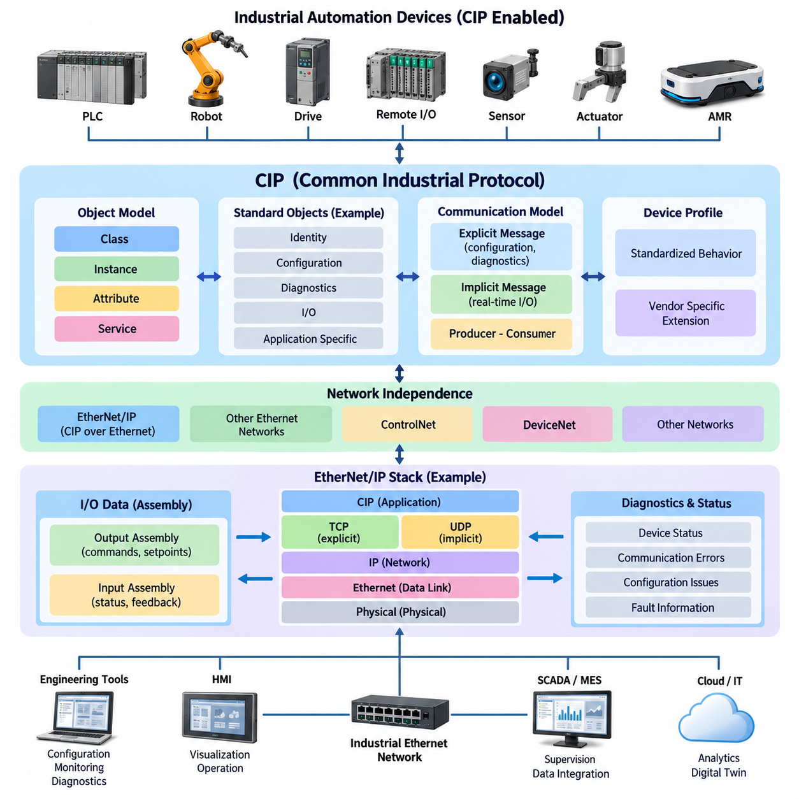
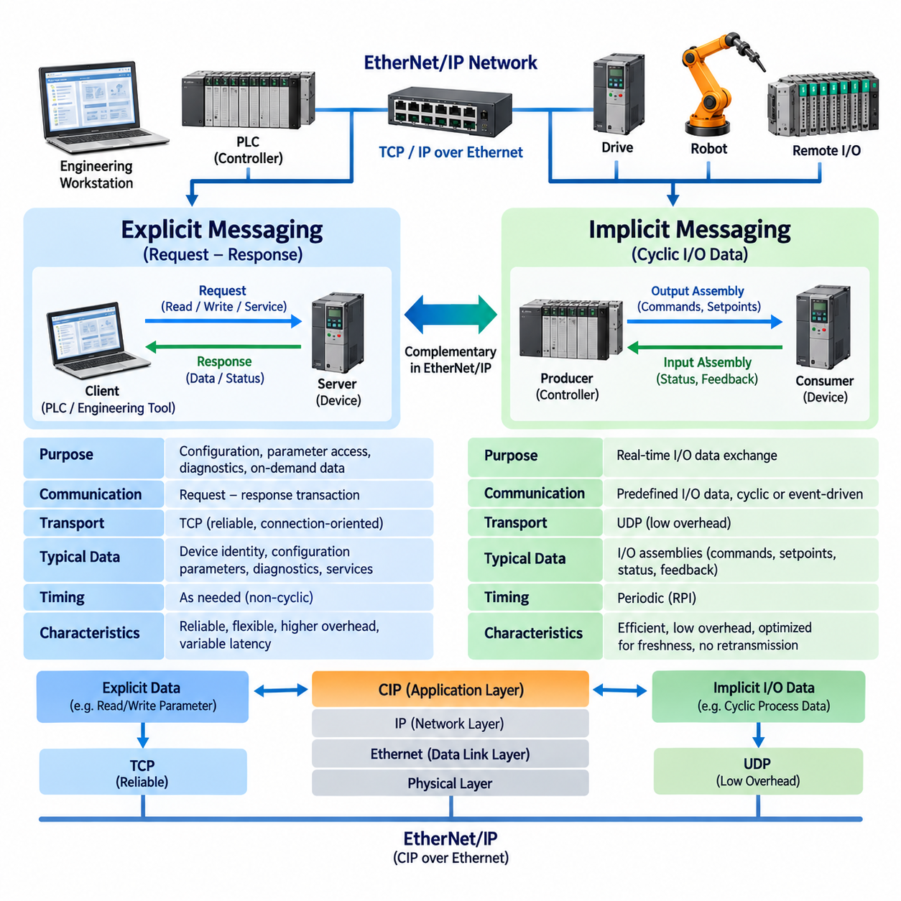
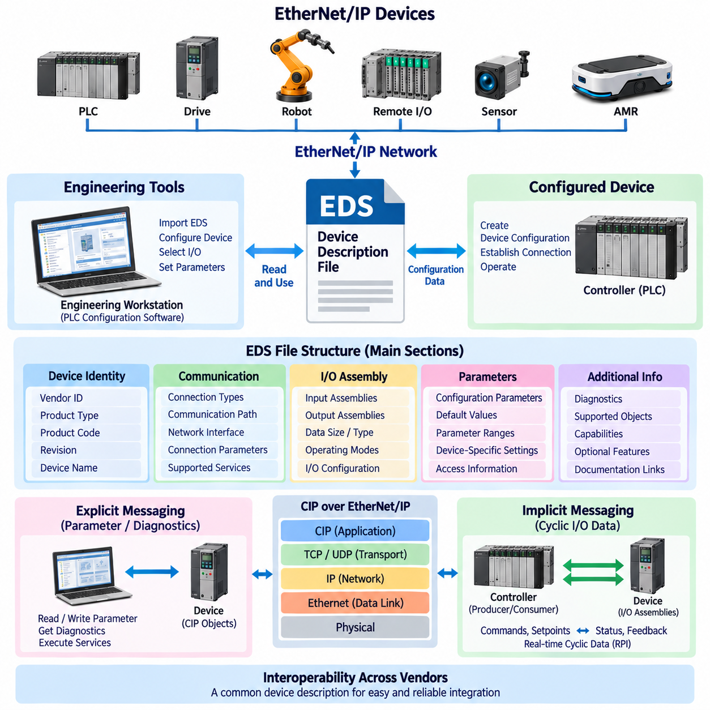
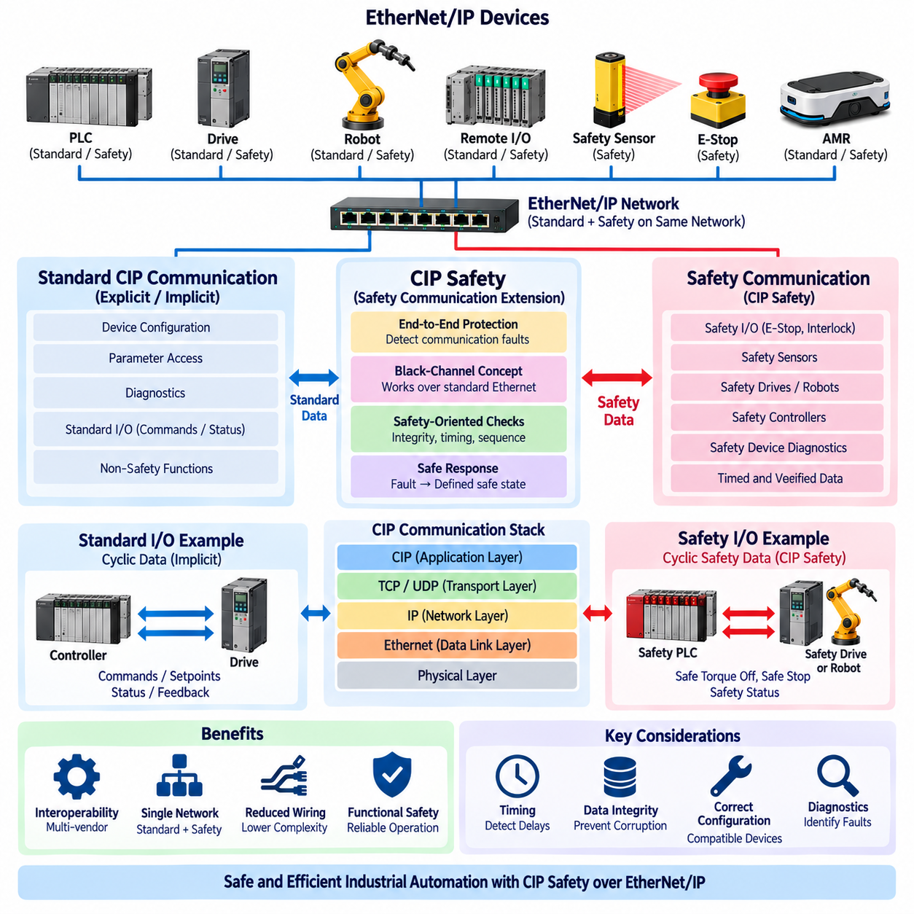
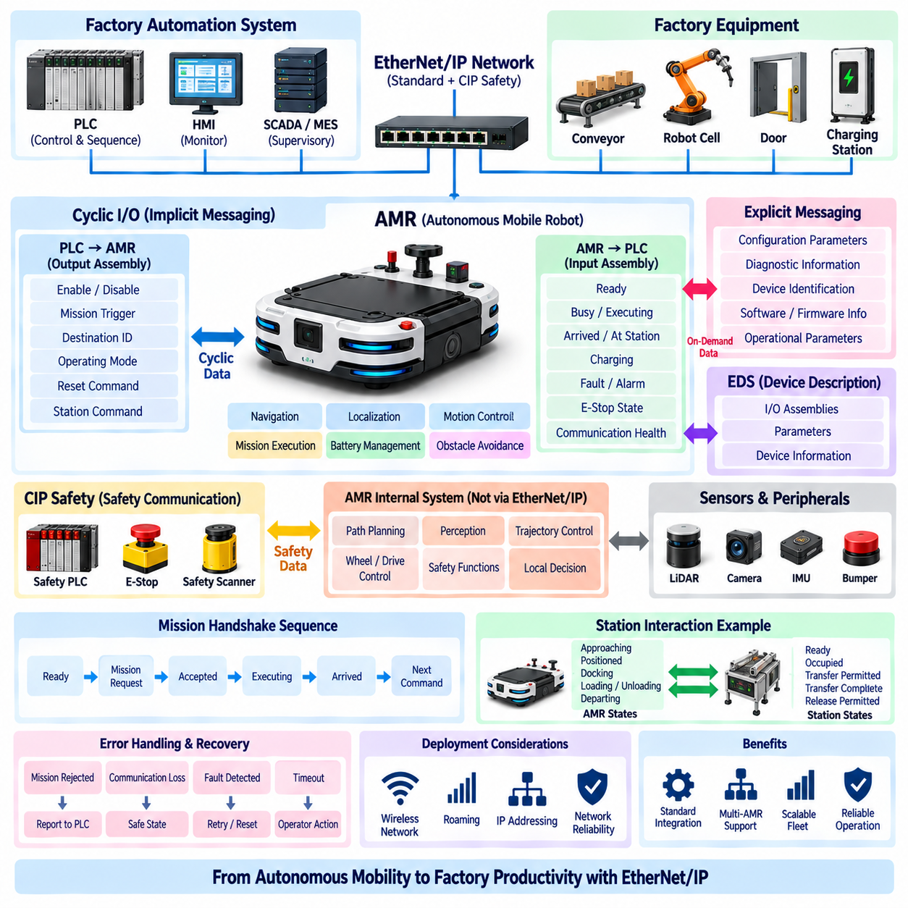

**Volume 07. Industrial Communication**

# Chapter 06. EtherNet/IP

## 06.01. CIP (Common Industrial Protocol)

{width="7.268055555555556in" height="7.268055555555556in"}

공통 산업 프로토콜(Common Industrial Protocol, CIP)은 컨트롤러(controller), 센서(sensor), 액추에이터(actuator), 드라이브(drive), 로봇(robot) 및 기타 자동화 장치(automation device)가 정보를 교환하는 일관된 방법을 제공하도록 설계된 응용 계층(application layer) 산업 통신 프레임워크(industrial communication framework)이다. 첨부된 산업 통신 구조에서 CIP는 EtherNet/IP의 개념적 기반을 형성하며, 명시적 및 암시적 메시징(explicit and implicit messaging), EDS 파일(EDS file), CIP Safety, AMR 통합(AMR integration) 등의 후속 주제로 연결된다.

CIP는 산업 데이터(industrial data)의 의미와 구성을 해당 데이터를 전송하는 데 사용되는 물리적 네트워크(physical network)로부터 분리한다. 단순히 비트(bit)나 이더넷 프레임(Ethernet frame)이 장치 사이에서 어떻게 이동하는지만 정의하는 것이 아니라, 자동화 정보(automation information)가 어떻게 표현되고 주소화되며 접근되고 해석되는지를 규정한다. 이러한 분리를 통해 서로 다른 네트워크 기술에서도 일관된 장치 동작을 유지하면서 공통 응용 모델(common application model)을 사용할 수 있다.

CIP의 기본적인 특징은 객체 지향 장치 모델(object-oriented device model)이다. CIP를 지원하는 장치는 자신의 기능과 정보를 단순한 레지스터(register) 집합이 아니라 객체(object)의 집합으로 표현한다. 각각의 객체는 식별(identity), 통신 구성(communication configuration), 파라미터(parameter), 진단(diagnostics), 디지털 입출력(discrete I/O), 아날로그 데이터(analog data), 응용 특화 동작(application-specific behavior) 등 장치 기능의 특정 측면을 나타낸다.

이러한 객체 모델(object model)에서 정보는 클래스(class), 인스턴스(instance), 속성(attribute), 서비스(service)를 통해 구성된다. 클래스는 특정 유형의 객체를 정의하고, 인스턴스는 장치 내부에 존재하는 해당 클래스의 실제 객체 하나를 의미한다. 속성은 객체와 관련된 실제 특성이나 상태 정보를 포함하며, 서비스는 속성 읽기, 파라미터 변경, 기능 리셋(reset)과 같이 객체에 요청할 수 있는 동작을 정의한다.

이러한 구성 방식은 산업 정보(industrial information)에 대한 구조화된 주소 지정 메커니즘(structured addressing mechanism)을 제공한다. 모든 컨트롤러가 임의의 메모리 배치(memory layout)를 이해해야 하는 대신, CIP 통신에서는 대상 객체와 그 객체에 관련된 특정 정보 또는 동작을 식별할 수 있다. 따라서 표준화된 객체 정의(standardized object definition)는 서로 다른 제조업체의 장치가 공통적으로 이해할 수 있는 구조를 통해 주요 기능을 제공하도록 하여 상호운용성(interoperability)을 향상시킨다.

식별 객체(Identity Object)는 표준화된 CIP 모델링(modeling)의 중요한 예이다. 식별 객체는 네트워크 참여자가 장치를 식별하고 특성을 파악할 수 있도록 제조업체(vendor), 장치 유형(device type), 제품 식별(product identification), 리비전(revision), 동작 상태(operating status)와 관련된 정보를 제공한다. 엔지니어링 도구(engineering tool)와 컨트롤러는 시운전(commissioning), 구성(configuration), 진단(diagnostics), 장치 교체 과정에서 이러한 표준화된 정보를 활용할 수 있다.

CIP는 또한 교환되는 정보의 목적에 따라 통신 관계(communication relationship)를 구분한다. 구성 파라미터(configuration parameter), 진단 정보(diagnostic information), 간헐적 명령(occasional command)은 지속적으로 갱신되는 제어 신호(control signal)와 서로 다른 통신 요구사항을 가진다. 이러한 구분은 CIP 서비스가 요청-응답 통신(request-response communication)과 실시간 자동화 데이터(real-time automation data)를 위한 주기적 또는 이벤트 기반 교환(cyclic or event-driven exchange)을 모두 지원하는 EtherNet/IP에서 특히 중요하다.

CIP는 통신에 참여하는 장치 사이에 설정된 관계가 필요한 경우 연결 지향 모델(connection-oriented model)을 사용한다. 연결(connection)은 정보가 어떻게 교환될 것인지를 정의하고 통신 관계와 관련된 파라미터를 제공한다. 이러한 개념을 통해 통신 장치는 주기적인 제어 정보가 교환되기 전에 필요한 자원(resource)과 데이터 전송 조건(data-transfer expectation)을 설정할 수 있으므로 예측 가능한 산업 시스템 동작을 지원한다.

주기적 제어 응용(cyclic control application)에서 CIP는 일반적으로 어셈블리(assembly)를 통해 입출력 정보(I/O information)를 표현한다. 어셈블리 객체(Assembly Object)는 여러 응용 데이터를 정의된 구조로 묶어 장치 사이에서 효율적으로 전송할 수 있도록 한다. 예를 들어 모터 드라이브(motor drive)는 명령 워드(command word)와 기준값(reference value)을 출력 어셈블리(output assembly)에 구성하고, 상태 워드(status word), 실제 속도(actual velocity), 전류(current), 고장 정보(fault information)를 입력 어셈블리(input assembly)를 통해 반환할 수 있다.

이러한 어셈블리 기반 접근법(assembly-based approach)은 PLC 제어 자동화(PLC-controlled automation)에서 특히 유용하다. 컨트롤러가 개별 파라미터를 반복적으로 요청하는 대신 교환되는 정보를 구조화된 프로세스 데이터(process data)로 처리할 수 있기 때문이다. 통신이 구성된 이후 입력 및 출력 어셈블리는 컨트롤러 로직(controller logic)과 필드 장치(field device) 사이의 효율적인 인터페이스를 제공한다. 구체적인 구조는 장치에 따라 달라질 수 있으므로 시스템 통합 과정에서 이를 정확하게 이해해야 한다.

CIP 통신에는 생산자-소비자 개념(producer-consumer concept)도 포함된다. 전통적인 통신은 하나의 장치가 특정 수신 장치 하나에 정보를 직접 전송하는 방식을 사용하는 경우가 많다. 생산자-소비자 아키텍처(producer-consumer architecture)에서는 생산자(producer)가 정보를 생성하고 하나 이상의 관심 있는 참여자가 이를 소비자(consumer)로서 사용할 수 있다. 이러한 모델은 동일한 상태 정보를 여러 컨트롤러나 상위 관리 기능에서 활용해야 하는 자동화 시스템에 적합하다.

네트워크 독립적인 응용 의미 체계(network-independent application semantics)는 CIP가 다양한 산업 네트워크를 지원할 수 있는 중요한 이유 중 하나이다. 응용 객체(application object)와 서비스는 정보가 무엇을 의미하는지를 정의하고, 기반 네트워크(underlying network)는 해당 정보가 어떻게 전송되는지를 결정한다. EtherNet/IP는 표준 이더넷(Ethernet)과 TCP/IP 및 UDP/IP 프로토콜 스위트(protocol suite) 위에 CIP를 적용하여 산업 장치가 널리 사용되는 이더넷 인프라를 활용하면서 자동화 중심의 의미 체계(automation-oriented semantics)를 유지할 수 있도록 한다.

EtherNet/IP에서 TCP는 일반적으로 신뢰성 있는 연결 지향 전송(reliable connection-oriented transport)이 필요한 통신에 사용되며, UDP는 지속적으로 갱신되는 정보에서 이미 오래된 패킷을 재전송하는 것보다 최신 데이터를 적시에 전달하는 것이 중요한 주기적 입출력 교환(cyclic I/O exchange)에 특히 적합하다. CIP는 이더넷(Ethernet), IP, TCP 또는 UDP를 대체하는 것이 아니라 이러한 전송 메커니즘 위에서 산업 통신 동작을 정의한다.

장치 상호운용성(device interoperability)을 확보하려면 패킷(packet)을 성공적으로 전송하는 것뿐만 아니라 응용 데이터(application data)의 의미, 형식, 방향 및 예상 동작에 대해서도 장치 사이에 일치된 정의가 필요하다. 두 개의 이더넷 장치가 전기적 및 IP 계층에서 정상적으로 통신하더라도 자동화 시스템으로 함께 동작하지 못할 수 있다. CIP는 표준화된 통신 객체, 서비스, 연결 개념 및 장치 프로파일(device profile)을 정의함으로써 이러한 상위 계층의 문제를 해결한다.

장치 프로파일(device profile)은 특정 산업 장비 범주에 대해 예상되는 동작을 정의함으로써 이러한 원리를 확장한다. 프로파일은 유사한 기능을 수행하는 장치의 공통 특성을 정의할 수 있으며, 컨트롤러와 엔지니어링 도구가 장치를 더욱 일관된 방식으로 다룰 수 있도록 한다. 제조업체 고유 기능(vendor-specific function)은 그대로 존재할 수 있지만, 장치 모델의 표준화된 부분은 구성과 운용을 위한 공통 기반을 제공한다.

따라서 CIP는 표준화된 기능(standardized functionality)과 제조업체별 확장(vendor-specific extension)을 모두 지원한다. 표준 객체(standard object)는 공통 동작을 위한 상호운용 가능한 메커니즘을 제공하며, 추가적인 객체나 속성을 이용하여 특수한 장치 기능을 표현할 수 있다. 효과적인 시스템 통합(system integration)을 위해서는 다양한 호환 장치에서 공통적으로 기대할 수 있는 표준 동작과 제조업체의 문서 및 구성 도구에 의존하는 고유 동작을 구분해야 한다.

CIP는 장치 상태(device state)와 통신 관련 오류(communication-related error)를 보고하기 위한 메커니즘도 제공한다. 진단 정보가 구조화된 응용 모델 안에서 표현되므로 컨트롤러와 엔지니어링 시스템은 단순한 링크 연결 상태보다 의미 있는 정보를 얻을 수 있다. 네트워크 통신이 정상적으로 유지되더라도 응용 객체는 구성 문제, 장치 고장, 잘못된 요청, 사용할 수 없는 자원 등 유지보수가 필요한 상태를 보고할 수 있다.

로보틱스(robotics)와 공장 자동화(factory automation)에서는 이러한 구조화된 진단 기능(structured diagnostic capability)이 중요하다. 통신 상태(communication health)와 장비 상태(machine health)는 동일한 개념이 아니기 때문이다. 로봇 컨트롤러(robot controller), 서보 드라이브(servo drive), 그리퍼(gripper), 원격 입출력 모듈(remote I/O module), AMR 인터페이스(AMR interface)는 이더넷을 통해 접근 가능한 상태를 유지하면서도 실제 응용 기능을 수행하지 못할 수 있다. CIP 객체와 상태 정보는 상위 제어 로직이 통신 장애와 장비 또는 프로세스 수준의 고장을 구분하도록 지원한다.

따라서 CIP는 단순히 입출력 값(I/O value)을 전달하는 프로토콜 이상의 개념으로 이해해야 한다. CIP는 장치(device), 장치 내부의 기능 객체(functional object), 접근 가능한 속성(attribute), 지원 서비스(service), 통신 관계(communication relationship), 응용 데이터(application data)를 정의하는 공통 산업 정보 아키텍처(common industrial information architecture)를 제공한다. EtherNet/IP는 이러한 아키텍처를 이더넷 기반 산업 네트워크에서 활용하여 기존 자동화 시스템의 의미 체계와 현대적인 스위치 기반 네트워크 인프라를 연결한다.

계층화된 엔지니어링 관점(layered engineering view)에서 이더넷(Ethernet)은 물리 계층 및 데이터 링크 계층(physical and data-link layer)의 기반을 제공하고, IP는 네트워크 주소 지정과 라우팅(network addressing and routing)을 담당하며, TCP 또는 UDP는 전송 동작(transport behavior)을 제공한다. 그 위에서 CIP는 산업 응용 의미 체계(industrial application semantics)를 담당한다. 이러한 구분은 케이블이나 스위치 문제, IP 구성 오류, 전송 계층 장애, CIP 연결 문제, 응용 객체 오류를 서로 다른 진단 계층으로 구분하는 데 유용하다.

PLC 제어 공장(PLC-controlled factory)에 통합되는 자율이동로봇(Autonomous Mobile Robot, AMR)이나 산업용 로봇(industrial robot)의 경우 CIP는 운용 명령(operational command), 상태 정보(status information), 인터록(interlock), 프로세스 값(process value), 진단 정보(diagnostic information)를 교환하는 공통 응용 프레임워크를 제공할 수 있다. 이후 세부적인 통신 동작은 명시적 메시징과 암시적 메시징(explicit versus implicit messaging), EDS 장치 설명(EDS device description), CIP Safety 및 AMR 통합(AMR integration)과 같은 후속 EtherNet/IP 주제를 통해 구체화된다.

## 06.02. Explicit vs Implicit Message

{width="7.268055555555556in" height="7.268055555555556in"}

명시적 메시징(Explicit Messaging)과 암시적 메시징(Implicit Messaging)은 EtherNet/IP 시스템에서 사용되는 상호 보완적인 CIP 통신 메커니즘(communication mechanism)이다. 두 방식은 산업 자동화(industrial automation)에서 서로 다른 목적을 담당한다. 명시적 메시징은 주로 구성(configuration), 파라미터 접근(parameter access), 진단(diagnostics), 요청-응답 트랜잭션(request-response transaction)에 사용되며, 암시적 메시징은 시간에 민감한 입출력 데이터(I/O data)의 주기적 또는 이벤트 기반 교환(cyclic or event-driven exchange)에 최적화되어 있다.

명시적 메시징(Explicit Messaging)은 명확하게 식별되는 요청(request)과 응답(response)을 기반으로 동작한다. 클라이언트 장치(client device)는 접근하려는 CIP 객체(object), 인스턴스(instance), 속성(attribute) 또는 서비스(service)를 지정하여 요청을 전송하고, 대상 장치(target device)는 이를 처리한 후 해당 응답을 반환한다. 각각의 트랜잭션에 요청된 동작을 설명하는 정보가 포함되므로 장치의 객체 모델(object model)에 있는 개별 요소에 유연하게 접근할 수 있다.

대표적인 명시적 메시지(Explicit Message) 동작에는 구성 파라미터(configuration parameter) 읽기, 운용 설정(operating setting) 변경, 진단 정보(diagnostic information) 검색, 장치 식별 정보(device identity information) 확인, 특정 CIP 서비스(CIP service) 실행 등이 포함된다. 예를 들어 엔지니어링 워크스테이션(engineering workstation)은 드라이브의 펌웨어 리비전(firmware revision)을 요청할 수 있으며, PLC는 진단 속성을 읽거나 운용 파라미터를 변경할 수 있다. 이러한 트랜잭션은 고정된 제어 주기로 지속되는 것이 아니라 필요한 시점에 수행된다.

명시적 메시징은 EtherNet/IP에서 일반적으로 TCP 전송(TCP transport)과 연관된다. TCP는 순서 제어(sequencing), 확인 응답(acknowledgment), 재전송(retransmission), 오류 복구(error recovery) 메커니즘을 제공하는 신뢰성 있는 연결 지향 전송(reliable connection-oriented transport) 방식이다. 이러한 특성은 파라미터 쓰기 명령이 손실되거나 불완전한 구성 정보가 전달되는 경우 장치가 의도하지 않은 상태에 놓일 수 있기 때문에 구성 및 진단 트랜잭션에서 중요하다.

그러나 높은 신뢰성(reliability)이 모든 산업 데이터 교환에 명시적 메시징이 적합하다는 것을 의미하지는 않는다. TCP 처리, 요청-응답 트랜잭션, 프로토콜 정보는 추가적인 오버헤드(overhead)와 가변적인 지연 시간(variable latency)을 발생시킬 수 있다. 모터 속도 피드백(motor velocity feedback)이나 지속적으로 변화하는 센서 값(sensor value)의 경우 이전 패킷을 재전송하는 동안 이미 새로운 프로세스 값(process value)이 생성될 수 있으므로 오래된 데이터의 재전송은 실질적인 가치가 낮을 수 있다.

암시적 메시징(Implicit Messaging)은 이러한 요구를 해결하기 위해 의미와 구조가 사전에 설정된 응용 데이터(application data)를 효율적으로 전송하는 데 중점을 둔다. 매번 모든 객체 동작을 설명하는 대신 통신 장치 사이에서 필요한 문맥(context)을 사전에 설정한다. 연결(connection)이 구성되면 전송되는 데이터는 이미 합의된 입출력 어셈블리(I/O assembly)와 연결 파라미터(connection parameter)에 따라 해석될 수 있다.

따라서 암시적(implicit)이라는 표현은 데이터가 정의되지 않았거나 숨겨져 있다는 의미가 아니다. 메시지를 해석하는 데 필요한 상당 부분의 정보가 이전에 설정된 연결 관계(previously established connection)에 암시되어 있다는 의미이다. 수신 장치(receiver)는 전달되는 바이트(byte)가 무엇을 의미하는지, 어디에 적용해야 하는지, 어떻게 처리해야 하는지를 이미 알고 있다. 이를 통해 실시간 입출력 교환(real-time I/O exchange) 과정에서 반복적으로 발생하는 통신 오버헤드를 줄일 수 있다.

암시적 메시징은 일반적으로 컨트롤러-장치(controller-to-device) 및 장치-컨트롤러(device-to-controller) 간 입출력 통신에 사용된다. PLC는 명령 비트(command bit), 운전 모드(operating mode), 속도 기준값(velocity reference), 액추에이터 설정값(actuator setpoint)을 드라이브나 로봇 인터페이스에 지속적으로 전송할 수 있다. 동시에 장치는 상태 비트(status bit), 측정 속도(measured velocity), 위치 정보(position information), 운전 상태(operating state), 센서 값, 고장 정보(fault indication)를 입력 데이터(input data)를 통해 반환할 수 있다.

어셈블리 객체(Assembly Object)는 이러한 메커니즘과 밀접하게 관련된다. 출력 어셈블리(Output Assembly)는 컨트롤러에서 필드 장치(field device)로 전달되는 명령과 설정값을 하나의 데이터 구조로 묶을 수 있으며, 입력 어셈블리(Input Assembly)는 필드 장치에서 반환되는 상태와 피드백(feedback)을 묶을 수 있다. 각각의 변수를 별도의 명시적 읽기와 쓰기로 처리하는 대신 암시적 메시징을 이용하여 사전에 정의된 프로세스 데이터(process data)를 효율적으로 교환한다.

EtherNet/IP는 이러한 시간 민감형 입출력 통신(time-sensitive I/O communication)에 일반적으로 UDP를 사용한다. UDP에는 TCP에서 제공하는 재전송과 확인 응답 메커니즘이 없기 때문에 전송 오버헤드(transport overhead)를 줄일 수 있다. 지속적으로 데이터가 갱신되는 제어 응용(control application)에서는 이전 제어 주기의 오래된 값을 복구하기 위해 통신을 지연시키는 것보다 다음 주기의 최신 값을 수신하는 것이 더 유용한 경우가 많다.

따라서 암시적 입출력 통신(Implicit I/O Communication)은 모든 개별 패킷의 전달을 보장하는 것보다 데이터의 최신성(freshness)과 예측 가능한 반복 전송(predictable repetition)을 중심으로 설계된다. 하나의 주기적 패킷(cyclic packet)이 손실되더라도 다음 패킷에서 갱신된 프로세스 정보를 받을 수 있다. 그러나 과도한 패킷 손실(packet loss), 통신 시간 초과(communication timeout), 연결 손실(connection loss)은 반드시 감지해야 한다. 유효한 제어 또는 피드백 데이터 없이 계속 운전하면 허용할 수 없는 장비 상태가 발생할 수 있기 때문이다.

요청 패킷 간격(Requested Packet Interval, RPI)은 EtherNet/IP 암시적 통신에서 중요한 파라미터이다. RPI는 입출력 정보를 생성하거나 소비하는 데 관련된 요청 시간 간격을 지정한다. 적절한 RPI를 선정하려면 제어 응답 요구사항(control-response requirement), 네트워크 대역폭(network bandwidth), 장치 처리 능력(device processing capability), 컨트롤러 부하(controller loading), 활성 통신 연결 수를 종합적으로 고려해야 한다.

불필요하게 짧은 RPI는 실제 장비 성능을 향상시키지 못하면서 네트워크 트래픽(network traffic)과 처리 부하(processing load)를 증가시킬 수 있다. 반대로 지나치게 긴 RPI는 피드백을 오래된 상태(stale state)로 만들고 시스템 응답성을 저하시킬 수 있다. 따라서 통신 갱신 주기(communication update rate)는 단순히 장치가 지원하는 최소값으로 설정하는 것이 아니라 제어 대상 프로세스의 동특성(process dynamics)에 따라 선정해야 한다.

CIP의 생산자-소비자 모델(producer-consumer model)은 효율적인 암시적 통신을 더욱 지원한다. 생산 장치(producing device)는 하나 이상의 관심 있는 참여자가 소비할 수 있는 응용 정보를 생성할 수 있다. 이는 개별적인 점대점 요청(point-to-point request)을 반복적으로 수행하는 방식과 개념적으로 다르며, 여러 자동화 구성요소가 동일한 주기적 갱신 정보(periodically updated information)를 필요로 하는 경우 특히 유용하다.

따라서 명시적 메시징과 암시적 메시징은 서로 경쟁하는 대안이 아니라 상호 협력하는 통신 메커니즘으로 이해해야 한다. 명시적 통신은 장치를 설정하고(configure), 구성하며, 상태를 확인하고, 진단하는 데 사용할 수 있으며, 암시적 통신은 정상적인 장비 운전 중 반복적으로 필요한 프로세스 데이터를 전달할 수 있다. 실제 EtherNet/IP 시스템에서는 서로 다른 종류의 정보를 처리하기 위해 두 방식이 동시에 사용되는 경우가 많다.

PLC에 연결된 서보 드라이브(servo drive)를 예로 들 수 있다. 시운전(commissioning) 과정에서는 명시적 메시지를 사용하여 드라이브를 식별하고, 구성 파라미터를 확인하며, 진단 속성을 검색하고, 필요한 설정을 변경할 수 있다. 장비가 정상적으로 운전되는 동안에는 암시적 메시지를 통해 활성화 명령(enable command), 운전 모드, 토크 또는 속도 기준값, 실제 위치(actual position), 측정 속도, 드라이브 상태 및 운전 피드백을 지속적으로 교환할 수 있다.

산업용 로봇(industrial robot)과 자율이동로봇(Autonomous Mobile Robot, AMR)에서도 유사한 패턴이 적용된다. 명시적 메시징은 구성, 식별, 진단 질의(diagnostic query), 운용 파라미터 및 비주기적 명령(non-periodic command)을 지원할 수 있다. 암시적 메시징은 준비(ready), 작업 중(busy), 미션 활성(mission active), 도킹 완료(docking complete), 고장(fault), 해당되는 경우 안전 관련 상태(safety-related status), 명령 확인(command acknowledgment), PLC 자동화에 필요한 프로세스 핸드셰이크(process handshake) 정보와 같은 반복적인 인터페이스 신호를 지원할 수 있다.

그러나 빠른 암시적 통신이 존재한다고 해서 결정론적 모션 제어(deterministic motion control)가 자동으로 보장되는 것은 아니다. 종단 간 타이밍(end-to-end timing)은 컨트롤러 태스크 스케줄링(controller task scheduling), 장치 처리 시간, 스위치 동작(switch behavior), 네트워크 사용률(network utilization), 토폴로지(topology), 갱신 주기(update interval), 응용 아키텍처(application architecture)의 영향을 함께 받는다. 따라서 엔지니어는 전송 메커니즘만으로 실시간 성능을 판단하지 말고 전체 제어 루프(control loop)를 평가해야 한다.

네트워크 설계(network design)에서는 두 메시징 방식이 만들어내는 서로 다른 트래픽 패턴(traffic pattern)도 고려해야 한다. 명시적 트래픽(explicit traffic)은 일반적으로 간헐적이고 트랜잭션 중심(transaction-oriented)인 반면, 암시적 트래픽(implicit traffic)은 많은 장치에서 지속적이고 주기적으로 발생할 수 있다. 따라서 짧은 RPI 연결을 다수 사용하는 대규모 자동화 시스템에서는 각각의 입출력 패킷이 작더라도 상당한 수준의 반복 네트워크 트래픽이 발생할 수 있다.

진단(diagnostics) 과정에서는 전송 통신(transport communication)과 응용 통신(application communication)을 구분해야 한다. 이더넷 링크(Ethernet link)가 물리적으로 정상 상태를 유지하면서 암시적 입출력 연결이 시간 초과될 수 있으며, 주기적인 프로세스 통신이 실패한 이후에도 명시적 진단 접근은 정상적으로 유지될 수 있다. 이러한 분리는 유지보수 소프트웨어(maintenance software)가 장치와 계속 통신하면서 정상적인 입출력 연결이 중단된 원인을 조사할 수 있게 해주므로 매우 유용하다.

엔지니어링 관점에서 명시적 메시징은 "어떤 파라미터를 읽거나 변경해야 하는가?" 또는 "이 객체가 어떤 서비스를 수행해야 하는가?"와 같은 요구사항에 대응한다. 반면 암시적 메시징은 "이 장치들 사이에서 어떤 사전 정의된 프로세스 데이터가 지속적으로 전달되어야 하는가?"라는 다른 요구사항을 처리한다. 이러한 차이를 이해하면 EtherNet/IP 구성(configuration), 고장 진단(troubleshooting), 대역폭 계획(bandwidth planning), PLC 인터페이스 설계(interface design)를 훨씬 명확하게 수행할 수 있다.

잘 설계된 EtherNet/IP 아키텍처는 정보의 운용 특성(operational characteristics)에 적합한 통신 메커니즘을 선택하여 데이터를 배치한다. 구성 및 진단 정보는 일반적으로 유연하고 신뢰성 있는 명시적 트랜잭션(explicit transaction)에 적합하며, 빈번하게 갱신되는 제어 및 상태 정보는 효율적인 암시적 입출력 교환(implicit I/O exchange)에 적합하다. 두 메커니즘을 함께 사용함으로써 CIP는 동일한 네트워크 아키텍처 안에서 상세한 장치 관리(device management)와 지속적인 산업 자동화 운전(industrial automation operation)을 동시에 지원할 수 있다.

## 06.03. EDS File Structure

{width="7.268055555555556in" height="7.268055555555556in"}

전자 데이터 시트(Electronic Data Sheet, EDS)는 EtherNet/IP 시스템에서 네트워크 장치(network device)에 대한 구조화된 정보를 엔지니어링 소프트웨어(engineering software)와 컨트롤러(controller)에 제공하기 위해 사용되는 표준화된 장치 설명 파일(standardized device-description file)이다. 첨부된 아키텍처에서 EDS 파일 구조(EDS File Structure)는 CIP와 명시적 및 암시적 메시징(explicit versus implicit messaging) 이후, CIP Safety와 AMR 통합(AMR integration) 이전에 위치한다. 이러한 위치는 EDS가 CIP 장치 모델(CIP device model)과 EtherNet/IP 장치를 통합하는 데 사용되는 엔지니어링 도구(engineering tool) 사이에서 실질적인 구성 인터페이스(configuration interface) 역할을 한다는 점을 보여준다.

EDS 파일은 EtherNet/IP 장치가 엔지니어링 환경(engineering environment)에서 어떻게 인식되고, 구성되고, 표현되어야 하는지를 설명한다. 엔지니어가 모든 장치 특성을 수동으로 입력하도록 요구하는 대신 EDS는 장치의 통신 기능(communication capability), 지원 객체(supported object), 파라미터(parameter), 입출력 어셈블리(I/O assembly) 등에 대한 기계 판독 가능한 정보(machine-readable information)를 제공한다. 엔지니어링 도구는 이러한 정보를 사용하여 적절한 장치 구성을 생성할 수 있으며, 시스템 통합(system integration) 과정에서 발생할 수 있는 구성 오류(configuration error)를 줄일 수 있다.

EDS 내부의 정보는 임의의 응용 데이터(application data)가 아니라 구조화된 섹션(structured section)과 키-값 정의(key-value definition) 형태로 구성된다. 일반적으로 제조업체 식별 정보(vendor identity), 제품 유형(product type), 제품 코드(product code), 리비전(revision), 장치 이름(device name), 통신 특성(communication characteristic), 지원되는 네트워크 인터페이스(network interface) 등이 포함된다. 이러한 필드를 통해 구성 소프트웨어(configuration software)는 서로 다른 장치를 구별하고 선택된 장치에 적절한 통신 및 구성 정보를 연결할 수 있다.

장치 식별 정보(device identity information)는 EtherNet/IP 네트워크에 유사한 기능을 가진 여러 장치가 존재할 수 있기 때문에 특히 중요하다. EDS는 엔지니어링 도구가 어떤 제조업체(vendor)와 제품(product)을 구성하고 있는지, 그리고 어떤 리비전(revision)이나 장치 특성(device characteristic)이 적용되는지를 판단할 수 있도록 지원한다. 시운전(commissioning) 과정에서는 이러한 식별 정보를 실제 장치의 식별 정보와 비교하여 잘못된 장치가 선택되었거나 호환되지 않는 리비전이 사용되고 있는지를 정상 운전 전에 확인할 수도 있다.

EDS는 장치의 통신 관련 특성(communication-related characteristic)도 설명할 수 있다. 여기에는 지원되는 연결 유형(connection type), 통신 경로(communication path), 입력 및 출력 어셈블리(input and output assembly), 연결 파라미터(connection parameter), EtherNet/IP 통신을 설정하는 데 필요한 기타 정보가 포함될 수 있다. 엔지니어링 소프트웨어는 이러한 정의를 사용하여 컨트롤러와 대상 장치(target device)를 연결하는 구성을 생성한다.

EDS와 CIP 객체(CIP object)의 관계를 이해하는 것은 아키텍처를 이해하는 데 중요하다. CIP는 클래스(class), 인스턴스(instance), 속성(attribute), 서비스(service)를 사용하는 객체 지향 통신 모델(object-oriented communication model)을 정의하는 반면, EDS는 특정 장치가 이러한 기능을 어떻게 제공하고 사용하는지를 소프트웨어가 이해할 수 있도록 지원하는 엔지니어링 정보를 제공한다. 따라서 EDS는 CIP를 대체하는 것이 아니라, 엔지니어링 소프트웨어가 CIP 통신 모델을 구성할 때 사용할 수 있는 형태로 장치를 설명한다.

입출력 어셈블리 정보(I/O assembly information)도 장치 구성에서 중요한 부분이다. 장치는 상태 및 피드백 정보를 포함하는 입력 어셈블리(input assembly)와 명령 및 설정값을 포함하는 출력 어셈블리(output assembly)를 제공할 수 있다. EDS는 사용 가능한 어셈블리 구조(assembly structure)와 관련 통신 옵션을 식별할 수 있도록 하여 컨트롤러 구성이 적절한 데이터 인터페이스(data interface)를 선택할 수 있게 한다. 이는 장치가 여러 운전 모드(operating mode)나 서로 다른 입출력 데이터 구조(I/O data layout)를 지원할 때 특히 중요하다.

EDS는 암시적 메시징(implicit messaging)을 구성할 때 특히 유용하다. 암시적 통신(implicit communication)은 각각의 요청을 반복적으로 설명하는 대신 사전에 정의된 입출력 데이터 구조(predefined I/O data structure)와 연결 파라미터(connection parameter)에 의존한다. 따라서 엔지니어링 소프트웨어는 주기적 입출력 통신(cyclic I/O communication)이 시작되기 전에 어떤 어셈블리가 존재하는지, 그 크기와 방향은 무엇인지, 그리고 어떤 통신 관계(communication relationship)를 장치가 지원하는지를 알아야 한다. EDS 정보는 이러한 구성 지식을 제공하는 데 도움을 준다.

EDS 정보는 명시적 메시징(explicit messaging) 구성에도 활용될 수 있다. 명시적 메시지는 장치 파라미터(device parameter), 진단 정보(diagnostics), 구성 속성(configuration attribute), CIP 서비스(CIP service)에 접근할 수 있다. 실제 CIP 요청(request)과 응답(response)은 프로토콜 정의에 따라 수행되지만, 엔지니어링 도구가 장치별 파라미터와 지원 기능을 엔지니어에게 의미 있는 형태로 표시하기 위해서는 장치 특화 정보(device-specific information)가 필요하다. 따라서 EDS는 명시적 통신을 둘러싼 구성 및 장치 탐색 과정(configuration and discovery process)에 기여할 수 있다.

EDS 기반 구성(EDS-based configuration)의 주요 장점은 상호운용성(interoperability)이다. 서로 다른 제조업체의 EtherNet/IP 장치라도 장치 설명이 요구되는 형식을 따르고 실제 기능을 정확하게 표현한다면 동일한 엔지니어링 환경에 통합할 수 있다. EDS는 장치 정보를 구성 소프트웨어에 전달하는 공통 메커니즘을 제공하고, 기반이 되는 CIP 모델은 표준화된 통신 의미 체계(communication semantics)를 제공한다.

그러나 EDS를 물리적 장치(physical device)의 완전한 표현으로 간주해서는 안 된다. EDS는 기본적으로 엔지니어링 및 구성 설명(engineering and configuration description)을 위한 것이다. 장치 펌웨어(device firmware), 전기적 특성(electrical characteristic), 기계적 동작(mechanical behavior), 안전 기능(safety function), 응용 특화 제한(application-specific limitation), 상세 운용 절차(detailed operating procedure) 등은 추가적인 제조업체 문서(manufacturer documentation)가 필요할 수 있다. 따라서 엔지니어는 EDS를 장치 매뉴얼(device manual), 펌웨어 정보(firmware information), 네트워크 구성(network configuration), 시스템 수준 요구사항(system-level requirement)과 함께 사용해야 한다.

버전 관리(version management)도 중요하다. 장치 설명(device description)은 실제 장치와 일치하는 상태를 유지해야 하기 때문이다. 펌웨어, 제품 리비전, 지원되는 어셈블리, 파라미터 정의, 통신 기능이 변경되면 기존 구성의 유효성에 영향을 줄 수 있다. EDS가 설치된 실제 장치와 일치하지 않으면 엔지니어링 도구가 잘못된 구성 선택지를 표시하거나 의도된 통신 관계(communication relationship)를 설정하지 못할 수 있다.

따라서 시운전 과정에서 EDS는 하나의 구성 체인(configuration chain)의 일부로 볼 수 있다. 엔지니어링 도구가 장치 설명을 불러오고, 엔지니어가 필요한 장치와 통신 옵션을 선택하며, 컨트롤러 구성이 생성되고, EtherNet/IP 네트워크가 필요한 CIP 연결(CIP connection)을 설정한다. 구성이 올바르지 않다면 엔지니어는 문제가 장치 식별(device identity), EDS 정보, IP 구성(IP configuration), 연결 파라미터, 어셈블리 선택(assembly selection), 장치 자체 중 어디에서 발생했는지를 확인해야 한다.

산업용 로봇(industrial robot)과 AMR의 경우 PLC와 표준화된 운용 정보를 교환해야 할 때 EDS 기반 구성이 특히 유용하다. AMR 인터페이스는 명령(command), 상태 신호(status signal), 미션 정보(mission information), 고장 상태(fault state), 핸드셰이크 데이터(handshake data)를 사전에 정의된 어셈블리를 통해 제공할 수 있다. EDS는 PLC 엔지니어링 환경이 이러한 인터페이스를 이해할 수 있도록 지원하므로 AMR을 보다 큰 EtherNet/IP 자동화 아키텍처에 통합할 수 있다.

EDS는 또한 제조업체별 구현(vendor-specific implementation)과 시스템 수준 통합(system-level integration) 사이의 유용한 경계를 제공한다. 장치 제조업체는 특화된 기능(specialized function)을 정의하면서 장치 설명을 통해 필요한 구성 및 통신 정보를 제공할 수 있다. 시스템 통합자는 장치의 모든 내부 구현 세부사항을 이해하지 않고도 장치를 구성할 수 있으며, 이는 필요한 기능이 EDS에 올바르게 표현되고 실제 펌웨어에서 지원되는 경우 가능하다.

따라서 EDS의 엔지니어링 가치는 단순히 컴퓨터에 저장되는 파일이라는 데 있지 않다. EDS의 중요성은 실제 EtherNet/IP 장치를 엔지니어링 소프트웨어에서 사용하는 구성 모델(configuration model)에 연결한다는 데 있다. CIP는 산업 정보가 어떻게 표현되고 교환되는지를 정의하고, EDS는 엔지니어링 환경이 특정 장치와 필요한 통신 관계, 어셈블리, 파라미터를 탐색하고 구성하도록 지원한다.

완전한 EtherNet/IP 워크플로(workflow)에서 EDS는 장치 기능(device capability)과 네트워크 엔지니어링(network engineering)을 연결하는 구성 지원 요소(configuration enabler)로 이해할 수 있다. EDS는 장치 식별, 파라미터 구성, 입출력 어셈블리 선택, 연결 설정, 상호운용성을 지원하며, 명시적 및 암시적 메시징은 운용 중 실제 통신 메커니즘을 제공한다. 따라서 EDS는 개념적인 CIP 계층과 이후의 CIP Safety 및 AMR과 산업 자동화 시스템에서의 EtherNet/IP 통합 주제를 연결하는 중요한 실질적 구성요소이다.

## 06.04. CIP Safety

{width="7.268055555555556in" height="7.268055555555556in"}

CIP Safety는 산업 자동화 장치(industrial automation device) 사이에서 안전 관련 정보(safety-related information)를 교환하기 위해 설계된 공통 산업 프로토콜(Common Industrial Protocol, CIP)의 안전 통신 확장(safety communication extension)이다. 첨부된 구조에서 CIP Safety는 CIP, 명시적 및 암시적 메시징(explicit and implicit messaging), EDS 기반 장치 구성(EDS-based device configuration)의 기초 이후에 위치하며, AMR을 위한 EtherNet/IP 통합(EtherNet/IP integration) 이전에 위치한다. 이러한 위치는 CIP 기반 자동화 네트워크(automation network)에 기능 안전 통신(functional safety communication)을 추가하는 역할을 반영한다.

CIP Safety는 일반적인 제어 및 진단 정보에 사용되는 표준 CIP 통신 메커니즘(standard CIP communication mechanism)을 대체하지 않는다. 대신 안전 관련 데이터(safety-related data)를 교환하면서 안전하지 않은 제어 판단(unsafe control decision)으로 이어질 수 있는 통신 오류(communication error)를 검출할 수 있도록 추가적인 안전 메커니즘(safety mechanism)을 제공한다. 따라서 표준 프로세스 통신(process communication)과 안전 통신(safety communication)은 함께 존재할 수 있으며, 각각의 정보 유형은 그 기능에 적합한 요구사항을 따른다.

CIP Safety의 핵심 개념은 안전 데이터(safety data)의 종단 간 보호(end-to-end protection)이다. 안전 기능(safety function)은 기반 통신 네트워크(underlying communication network)에 일반적인 구성요소(ordinary component)가 포함되어 있더라도 보호된 상태를 유지해야 한다. 이러한 접근 방식은 일반적으로 블랙 채널 개념(black-channel concept)으로 설명되며, 안전 프로토콜(safety protocol)이 기반 전송 방식이 이더넷(Ethernet)인지 또는 지원되는 다른 네트워크 기술인지와 관계없이 관련 통신 오류를 검출할 수 있는 메커니즘을 제공한다.

안전 통신(safety communication)은 단순한 패킷 전달(packet delivery) 이상의 문제를 다루어야 한다. 안전 수신기(safety receiver)는 수신된 정보가 진본(authentic)이고 적시에 전달되었으며(timely), 의도된 통신 관계(intended communication relationship)에 올바르게 연결되어 있고, 이전 전송에서 사용된 정보가 우발적으로 재사용되지 않았다는 것을 신뢰할 수 있어야 한다. 따라서 CIP Safety는 전송되는 데이터에 안전 중심의 검사(safety-oriented check)와 통신 규칙(communication rule)을 추가하여 손상된 데이터(corrupted data), 지연된 데이터(delayed data), 중복 데이터(duplicated data), 누락된 데이터(missing data), 잘못 연결된 정보(incorrectly associated information)를 검출할 수 있도록 한다.

타이밍(timing)은 안전 통신에서 특히 중요하다. 안전 메시지(safety message)가 허용된 시간보다 늦게 도착하면 메시지의 모든 비트가 기술적으로 정확하더라도 안전하지 않을 수 있다. 따라서 CIP Safety는 시간 관련 감시(time-related monitoring)를 적용하여 통신 지연(communication delay)이나 연결 중단(connection interruption)이 발생하면 안전 기능(safety function)이 정의된 안전 상태(safe state)로 전환하도록 하며, 잠재적으로 오래된 안전 정보(stale safety information)에 계속 의존하지 않도록 한다.

데이터 무결성(data integrity) 역시 핵심 요구사항이다. 일반적인 산업 통신(industrial communication)에서는 이후의 주기적 패킷(cyclic packet)이 더 최신의 값을 제공할 수 있기 때문에 일부 패킷 손실(packet loss)이 허용될 수 있다. 그러나 안전 시스템(safety system)은 손상되거나 잘못 해석된 정보가 위험한 상태(hazardous condition)를 만들 수 있는지도 고려해야 한다. 따라서 안전 통신은 안전 데이터의 오류를 검출하기 위한 전용 무결성 메커니즘(dedicated integrity mechanism)을 사용하며, 유효하지 않은 정보가 유효한 안전 명령(safety command)이나 상태(status)로 받아들여지는 것을 방지한다.

CIP Safety는 안전 컨트롤러(safety controller), 안전 I/O(safety I/O), 비상정지 인터페이스(emergency-stop interface), 안전 센서(safety sensor), 드라이브(drive) 및 기타 안전 기능을 지원하는 자동화 장치(safety-capable automation device) 사이의 안전 관련 통신을 지원할 수 있다. 실제 안전 기능(actual safety function)은 적절한 안전 장치(safety device)와 제어 로직(control logic)에 의해 구현되며, CIP Safety는 안전 정보(safety information)를 전송하고 감시할 수 있는 통신 메커니즘을 제공한다.

산업용 로봇(industrial robot)이나 AMR 아키텍처에서는 표준 I/O(standard I/O)와 안전 I/O(safety I/O)의 차이를 이해하는 것이 중요하다. 일반 EtherNet/IP 연결은 운용 명령(operational command), 상태 정보(status information), 미션 데이터(mission data), 진단 정보(diagnostics)를 전달할 수 있는 반면, 안전 연결(safety connection)은 비상정지(emergency stop), 보호 정지(protective stop), 활성화 조건(enabling condition), 안전 인터록(safety interlock) 또는 기타 정의된 안전 기능과 관련된 정보를 전달할 수 있다. 두 통신이 동일한 물리적 이더넷 인프라를 사용한다고 해서 서로 동일하거나 상호 교환 가능한 것으로 취급해서는 안 된다.

CIP Safety는 따라서 CIP와 EtherNet/IP에서 소개된 생산자-소비자 모델(producer-consumer model) 및 연결 지향 개념(connection-oriented concept)과 밀접하게 관련된다. 안전 데이터(safety data)는 설정된 통신 관계(established communication relationship)를 통해 교환될 수 있지만, 해당 데이터에는 추가적인 안전 감시(safety supervision)가 적용된다. 수신 측 안전 기능(receiving safety function)은 통신이 계속 유효한지를 지속적으로 평가한다. 필요한 안전 조건(safety condition)이 더 이상 충족되지 않으면 시스템은 사전에 정의된 안전 반응(safe reaction)을 시작할 수 있다.

공통 네트워크 인프라(common network infrastructure)를 사용하는 것은 시스템 아키텍처(system architecture)를 단순화할 수 있다. 전체 아키텍처와 적용 가능한 안전 요구사항(applicable safety requirement)이 허용하는 경우 표준 통신과 안전 통신은 케이블(cable), 스위치(switch), 네트워크 인터페이스(network interface)와 같은 동일한 물리적 이더넷 구성요소를 공유할 수 있다. 이를 통해 배선 복잡성(wiring complexity)을 줄이고 완전히 별도의 물리적 통신 네트워크 없이 현대적인 네트워크 기반 자동화 시스템에 안전 기능을 통합할 수 있다.

그러나 동일한 물리적 네트워크를 공유한다고 해서 일반 이더넷 통신(ordinary Ethernet communication)이 자동으로 안전 등급(safety-rated)을 획득하는 것은 아니다. 안전 특성(safety property)은 전체 안전 통신 메커니즘(complete safety communication mechanism), 인증된 안전 구성요소(certified safety component), 시스템 아키텍처(system architecture)에서 비롯된다. 따라서 엔지니어는 안전 컨트롤러, 통신 종단점(communication endpoint), 네트워크 구성, 안전 장치, 진단, 타이밍 및 최종 안전 반응을 포함하는 전체 안전 경로(complete safety path)를 평가해야 한다.

CIP Safety는 또한 세심한 구성(configuration)과 장치 호환성(device compatibility)을 요구한다. 안전 기능을 지원하는 장치는 적절한 안전 기능과 통신 특성(communication characteristic)을 제공해야 하며, 엔지니어링 환경(engineering environment)은 이에 대응하는 안전 연결(safety connection)을 올바르게 구성해야 한다. EDS 관련 엔지니어링 데이터(EDS-related engineering data)를 포함한 장치 설명과 구성 정보는 통합을 지원하지만, 안전 구성(safety configuration)은 적용 가능한 안전 엔지니어링 프로세스(safety engineering process)에 따라 별도로 관리되어야 한다.

진단(diagnostics)은 안전 통신에서 특히 중요하다. 안전 통신 오류(safety communication fault)가 단순한 일반 네트워크 오류(ordinary network error)로만 표시되어서는 안 되기 때문이다. 시스템은 통신 손실(loss of communication), 유효하지 않은 안전 데이터(invalid safety data), 타이밍 위반(timing violation), 구성 문제(configuration problem), 안전 장치 고장(safety-device fault) 등을 구분할 필요가 있다. 이러한 진단 상태(diagnostic state)는 유지보수 담당자가 안전 기능이 안전 상태(safe state)로 전환된 이유를 파악하고 문제가 통신, 구성 또는 물리적 안전 시스템 중 어디에서 발생했는지를 판단하도록 지원한다.

산업용 로봇의 경우 CIP Safety는 안전 컨트롤러와 안전 기능을 지원하는 로봇 또는 드라이브 시스템 사이에 통신 경로(communication path)를 제공할 수 있다. 표준 EtherNet/IP 채널은 로봇 운용(robot operation)을 조정할 수 있으며, CIP Safety는 보호 정지(protective stop)나 허용된 운전 상태(permitted operating state)와 같은 안전 관련 조건을 감시할 수 있다. 실제 안전 기능은 로봇 컨트롤러(robot controller), 안전 장치(safety device), 시스템 아키텍처 및 적용 가능한 안전 요구사항에 따라 결정된다.

AMR에서도 동일한 원리가 중요하다. AMR이 더 큰 자동화 시설(automated facility) 내부에서 운용될 경우 표준 EtherNet/IP 통신은 미션 명령(mission command), 운용 상태(operating status), 도킹 정보(docking information), PLC 핸드셰이크(PLC handshake)를 교환할 수 있으며, 안전 통신은 비상정지, 보호 장치(protective device), 안전 컨트롤러 또는 기타 안전 기능을 지원하는 구성요소와 관련된 정의된 안전 기능을 지원할 수 있다. 미션 제어(mission control)와 안전 제어(safety control)는 아키텍처 수준에서 명확하게 분리되어 있어야 한다.

따라서 CIP Safety는 단순히 더 빠르거나 더 신뢰성이 높은 EtherNet/IP 버전으로 이해해서는 안 된다. CIP Safety는 안전 기능을 저해할 수 있는 통신 상태를 검출하고, 검출된 오류가 적절한 안전 반응으로 이어지도록 하는 메커니즘을 제공하는 안전 계층(safety layer)이다. 이러한 차이를 이해하는 것은 네트워크 기반 산업용 로봇, AMR 및 공장 자동화 시스템을 설계할 때 매우 중요하다.

완전한 EtherNet/IP 아키텍처에서 CIP는 공통 산업 통신 모델(common industrial communication model)을 제공하고, 명시적 및 암시적 메시징은 서로 다른 통신 메커니즘을 제공하며, EDS는 장치 구성을 지원하고, CIP Safety는 안전 관련 통신 기능(safety-related communication capability)을 추가한다. 이러한 요소들은 하나의 공통 산업 네트워크 위에서 함께 존재할 수 있지만 각각의 엔지니어링 책임(engineering responsibility)은 서로 다르다. 따라서 견고한 시스템 설계에서는 일반 자동화 제어(automation control), 진단(diagnostics), 안전 기능(safety function)을 명확하게 분리하면서도 하나의 통합된 시스템 아키텍처 안에서 서로 연계해야 한다.

## 06.05. EtherNet/IP in AMR Integration

{width="7.268055555555556in" height="7.268055555555556in"}

자율이동로봇(Autonomous Mobile Robot, AMR)의 EtherNet/IP 통합(EtherNet/IP integration)은 EtherNet/IP 프로토콜(protocol)과 공통 산업 프로토콜(Common Industrial Protocol, CIP)을 통해 AMR을 PLC 기반 산업 자동화 시스템(PLC-based industrial automation system)에 연결하는 과정이다. 첨부된 구조에서 이 주제는 CIP, 명시적 및 암시적 메시징(explicit versus implicit messaging), EDS 파일 구조(EDS file structure), CIP Safety 이후에 위치하며 EtherNet/IP 부분의 응용 계층적 완성(application-level culmination)에 해당한다. 주요 목적은 AMR의 운용 기능(operational function)을 공장 제어(factory control), 장비 인터페이스(equipment interface), 자동화 시퀀스(automation sequence)와 연결하는 것이다.

EtherNet/IP를 통해 통합되는 AMR은 단순히 이더넷 네트워크에 연결된 이동형 컴퓨터(mobile computer)가 아니라 산업 자동화 장치(industrial automation device)로 취급해야 한다. AMR은 내부적으로 내비게이션(navigation), 위치 추정(localization), 모션 제어(motion control), 배터리 관리(battery management), 장애물 처리(obstacle handling), 미션 실행(mission execution), 진단(diagnostics) 기능을 가지고 있으며, 공장 PLC는 기계(machine), 컨베이어(conveyor), 도어(door), 스테이션(station), 프로세스 시퀀스(process sequence)를 조정하는 역할을 담당한다. EtherNet/IP는 이러한 두 제어 영역(control domain)이 명확하게 정의된 운용 정보를 교환할 수 있도록 인터페이스를 제공한다.

가장 중요한 통합 원칙은 미션 수준 동작(mission-level behavior)과 장비 수준 제어(machine-level control)를 분리하는 것이다. AMR의 내부 자율 시스템(autonomy system)은 목적지까지 이동하는 방법, 장애물을 회피하는 방법, 이동 동작을 수행하는 방법을 결정한다. PLC는 일반적으로 개별 바퀴의 속도(wheel velocity)나 위치 추정 계산(localization calculation)을 직접 제어할 필요가 없다. 대신 PLC는 미션 요청(mission request), 목적지 식별자(destination identifier), 준비 상태(ready), 운용 상태(operating status), 도착 조건(arrival condition), 고장(fault), 확인 응답(acknowledgment)과 같은 상위 수준 명령 및 상태를 교환한다. 이러한 분리는 AMR의 자율성을 유지하면서 공장 수준의 조정을 가능하게 한다.

암시적 메시징(implicit messaging)은 AMR 인터페이스 정보를 지속적으로 교환하는 데 특히 적합하다. 사전에 정의된 I/O 어셈블리(I/O assembly)는 PLC에서 AMR로 전달되는 활성화 명령(enable command), 미션 트리거(mission trigger), 스테이션 식별자(station identifier), 운용 모드(operating mode), 리셋 요청(reset request) 등을 포함할 수 있다. 이에 대응하는 입력 어셈블리(input assembly)는 준비(ready), 사용 중(busy), 실행 중(executing), 도착(arrived), 충전 중(charging), 고장(faulted), 비상정지 상태(emergency-stop state), 통신 상태(communication health) 등의 AMR 상태를 포함할 수 있다. 이러한 신호는 반복적으로 교환되므로 데이터의 최신성(freshness)과 통신 감시(communication supervision)가 전체 자동화 시퀀스에 중요하다.

명시적 메시징(explicit messaging)은 지속적으로 교환할 필요가 없는 정보를 처리할 때 주기적 I/O 인터페이스(cyclic I/O interface)를 보완할 수 있다. 예를 들어 PLC 또는 엔지니어링 시스템(engineering system)은 구성 파라미터(configuration parameter), 진단 정보(diagnostic information), 장치 식별 정보(device identification), 소프트웨어 정보(software information), 일부 운용 파라미터를 요청할 수 있다. 이를 통해 AMR 인터페이스는 모든 정보를 지속적으로 전송되는 I/O 어셈블리에 포함하지 않아도 된다. 자주 변경되는 제어 및 상태 정보는 주기적 I/O에 유지하고, 상대적으로 드물게 접근하는 정보는 명시적 통신으로 처리할 수 있다.

실제 AMR 인터페이스는 네트워크 케이블이나 IP 주소에서 시작하는 것이 아니라 인터페이스 정의(interface definition)에서 시작해야 한다. 엔지니어링 팀은 PLC가 어떤 명령을 수행할 수 있는지, AMR이 어떤 상태를 보고하는지, 어떤 상태가 상호 확인되어야 하는지, 각각의 상태 전환(state transition)을 허용하는 조건이 무엇인지를 정의해야 한다. 각 명령은 명확한 의미를 가져야 하며, 중요한 모든 명령에는 관찰 가능한 응답(observable response)이 있어야 한다. 이를 통해 공장 자동화 시스템과 자율 로봇 사이에 제어된 핸드셰이크(controlled handshake)를 구성할 수 있다.

일반적인 미션 핸드셰이크(mission handshake)는 AMR이 사용 가능(available)하고 준비(ready)되었음을 보고하는 것에서 시작할 수 있다. PLC 또는 상위 제어기(supervisory controller)는 미션 요청과 목적지 정보를 제공한다. AMR은 이를 수락했음을 확인하고, 활성(active) 또는 사용 중(busy) 상태로 전환한 다음 내부 내비게이션 시스템을 사용하여 미션을 실행한다. 요청된 목적지 또는 스테이션 조건에 도달하면 AMR은 도착(arrival) 또는 작업 완료(task completion)를 보고한다. 이후 PLC는 공장 시퀀스를 계속 진행하거나 다음 명령을 내리거나 AMR에 스테이션을 떠나도록 요청할 수 있다.

핸드셰이크는 성공적인 시퀀스뿐만 아니라 비정상 상태(abnormal condition)도 정의해야 한다. AMR은 사용할 수 없거나, 이미 다른 작업을 수행하고 있거나, 충전 중이거나, 고장 상태이거나, 요청된 스테이션에 접근할 수 없는 경우 미션을 거부할 수 있다. 또한 통신 손실(loss of communication)과 응용 수준의 거부(application-level rejection)는 구분해야 한다. 견고한 인터페이스(robust interface)는 시간 초과 동작(timeout behavior), 리셋 조건(reset condition), 명령 확인(command acknowledgment), 고장 보고(fault reporting), 복구 상태(recovery state)를 정의하여 PLC가 응답을 무한정 기다리는 상태가 발생하지 않도록 해야 한다.

AMR이 공장 장비와 직접 상호작용하는 경우 통합은 더욱 복잡해진다. 하나의 스테이션에는 컨베이어, 리프트(lift), 자동문(automatic door), 충전 시스템(charging system), 로봇 셀(robotic cell), 검사 장비(inspection machine)가 포함될 수 있다. 이러한 경우 EtherNet/IP는 AMR과 스테이션 PLC 사이의 조정을 지원할 수 있지만, 어떤 시스템이 각 동작의 주체인지 명확하게 정의해야 한다. 예를 들어 AMR은 스테이션에 도착했음을 보고하고 스테이션 PLC가 컨베이어 시퀀스를 제어할 수 있다. AMR이 물리적으로 도착했다는 사실만으로 스테이션이 자동으로 준비되었다고 판단해서는 안 된다.

따라서 스테이션 수준 핸드셰이킹(station-level handshaking)은 AMR 인터페이스의 중요한 확장 요소이다. AMR은 접근 중(approaching), 위치 정렬(positioned), 도킹 중(docking), 도킹 완료(docked), 적재 중(loading), 하역 중(unloading), 출발 중(departing)과 같은 상태를 전달할 수 있으며, 스테이션은 준비(ready), 점유(occupied), 이송 허가(transfer permitted), 이송 완료(transfer complete), 출발 허가(release permitted)와 같은 조건을 전달할 수 있다. 이를 통해 이동형 자율 시스템(mobile autonomy)과 고정형 자동화 시스템(fixed automation) 사이의 제어된 상호작용을 구성할 수 있다. 실제 신호는 응용 분야에 따라 달라지지만 각 상태와 명령의 소유 주체는 항상 명확해야 한다.

물리적 이더넷 네트워크(physical Ethernet network) 역시 통합 아키텍처의 일부로 고려해야 한다. AMR은 운용 환경에 따라 산업용 스위치(industrial switch), 무선 이더넷 인프라(wireless Ethernet infrastructure), 액세스 포인트(access point) 또는 기타 네트워크 구성요소를 통해 통신할 수 있다. 이동성은 AMR이 물리적인 위치를 변경하면서도 논리적인 네트워크 통신을 유지해야 한다는 추가적인 고려사항을 만든다. 따라서 네트워크 커버리지(network coverage), 로밍 동작(roaming behavior), 지연 시간(latency), 패킷 손실(packet loss), 주소 지정(addressing), 이중화(redundancy), 간섭(interference)은 EtherNet/IP 구성 자체가 올바르더라도 통신 가용성(communication availability)에 영향을 줄 수 있다.

네트워크 통신은 AMR 내부의 모션 제어 루프(motion-control loop)와 혼동해서는 안 된다. PLC와 AMR 사이의 EtherNet/IP 연결은 일반적으로 자동화 인터페이스(automation interface)이며 AMR의 저수준 모터 제어(low-level motor control)를 대신하는 수단이 아니다. 바퀴 또는 액추에이터 제어는 AMR 내부의 실시간 제어 아키텍처(real-time control architecture)에 유지하고, EtherNet/IP는 상위 수준의 명령과 상태를 전달할 수 있다. 이러한 분리를 통해 공장 수준 PLC 통신이 AMR의 고주파 제어 루프(high-frequency control loop)와 불필요하게 결합되는 것을 방지할 수 있다.

이러한 구분은 자율 내비게이션(autonomous navigation)에서 특히 중요하다. AMR은 자체적으로 위치 추정(localization), 인지(perception), 경로 계획(path planning), 장애물 회피(obstacle avoidance), 궤적 제어(trajectory control)를 온보드 아키텍처(onboard architecture)에 적합한 주기로 수행할 수 있다. PLC는 일반적으로 그 결과로 생성된 운용 상태와 필요한 명령만 필요로 한다. 예를 들어 PLC는 AMR에 특정 스테이션으로 이동하도록 요청할 수 있지만 실제 궤적을 계산하지는 않는다. AMR은 자체적으로 실제 경로를 결정하고 인지 및 내비게이션 시스템에 따라 지속적으로 경로를 조정한다.

CIP Safety는 일반적인 AMR 운용 통신(operational communication)과 별도로 취급해야 한다. 표준 EtherNet/IP는 미션 명령, 운용 상태, 스테이션 핸드셰이크, 진단 정보를 전달할 수 있지만 안전 관련 기능(safety-related function)은 적절한 안전 통신(safety communication)과 안전 아키텍처(safety architecture)를 필요로 한다. 비상정지(emergency stop), 보호 정지(protective stop), 안전 스캐너 상태(safety scanner status), 안전 드라이브 기능(safe drive function), 기타 안전 관련 조건은 단순한 일반 상태 비트(ordinary status bit)로 표현해서는 안 되며 적용 가능한 안전 설계에 따라 구현해야 한다.

EDS 파일(EDS file)은 AMR 통합에서도 실질적인 역할을 한다. AMR이 EtherNet/IP 인터페이스를 제공하는 경우 엔지니어링 환경은 적절한 장치 설명(device description)을 사용하여 사용 가능한 통신 어셈블리, 파라미터 및 구성 정보를 이해할 수 있다. EDS는 AMR의 자율 동작을 정의하는 것이 아니라 PLC 엔지니어링 환경이 통신 인터페이스를 올바르게 구성하도록 지원한다. 따라서 실제 AMR 인터페이스 사양은 EDS 및 설치된 소프트웨어와 펌웨어의 구성과 일치해야 한다.

여러 AMR을 통합할 때는 주소 지정(addressing)과 데이터 매핑(data mapping)을 세심하게 관리해야 한다. 각각의 AMR은 식별 가능한 네트워크 엔드포인트(network endpoint)를 가져야 하며 PLC 애플리케이션은 개별 로봇과 그 운용 상태를 구분할 수 있어야 한다. 여러 대의 AMR을 운용하는 플릿(fleet)에서는 각각의 로봇을 서로 완전히 다른 특수 사례로 처리하는 인터페이스를 피해야 한다. 공통 명령 및 상태 구조(common command and status structure), 일관된 상태 정의(consistent state definition), 표준화된 진단 동작(standardized diagnostic behavior)은 플릿 확장을 훨씬 쉽게 만든다.

플릿 응용(fleet application)에서는 EtherNet/IP가 공장 제어 계층(factory control layer)과 개별 AMR 사이의 인터페이스 역할을 할 수 있으며, 상위 수준의 플릿 관리(fleet management)가 작업 할당(task allocation)과 조정을 결정할 수 있다. 시스템 아키텍처에 따라 PLC는 개별 AMR 또는 AMR 관리 시스템(AMR management system)과 통신할 수 있다. 여기에는 중요한 아키텍처 경계가 존재한다. EtherNet/IP는 필요한 산업 제어 인터페이스(industrial control interface)를 제공하고, 플릿 수준의 스케줄링(scheduling), 교통 관리(traffic management), 미션 최적화(mission optimization)는 적절한 AMR 또는 플릿 관리 계층에 유지하는 것이 바람직하다.

진단(diagnostics)은 인터페이스 설계의 초기 단계부터 포함해야 한다. 유용한 AMR 인터페이스는 통신 고장(communication failure), 로봇 고장(robot fault), 미션 거부(mission rejection), 경로 차단(blocked path), 스테이션 사용 불가(station unavailable), 배터리 부족(low battery), 충전 상태(charging state), 안전 정지(safety stop), 정상 완료(normal completion)를 구분할 수 있어야 한다. 이러한 구분이 없으면 PLC는 단지 AMR이 응답하지 않는다는 사실만 알게 되며 문제가 네트워크, 로봇, 스테이션 또는 생산 프로세스 중 어디에서 발생했는지 판단하기 어렵다.

시간 초과 처리(timeout handling) 역시 중요한 엔지니어링 고려사항이다. PLC는 예상한 AMR 응답이 없다는 사실을 미션 완료로 해석해서는 안 된다. 통신 감시(communication supervision)는 명령이 응답 없이 유지될 수 있는 시간을 정의하고 시간 초과 이후 어떤 상태로 전환되는지를 정의해야 한다. 복구 동작(recovery behavior)도 정의해야 한다. 응용 분야에 따라 시스템은 통신 트랜잭션을 재시도하거나, 미션을 취소하거나, 스테이션을 안전 상태로 전환하거나, 운전자 개입(operator intervention)을 요청하거나, 다른 AMR에 작업을 이관할 수 있다.

AMR 통합은 시작(startup)과 재시작(restart) 동작도 고려해야 한다. PLC 재시작, 네트워크 중단, AMR 재부팅 또는 통신 복구 이후 두 시스템은 현재 상태에 대한 일관된 이해를 다시 확립해야 한다. 이전에 활성화되어 있던 명령이 통신 연결이 복구되었다는 이유만으로 새로운 명령으로 자동 해석되어서는 안 된다. 따라서 초기화(initialization), 상태 동기화(state synchronization), 명령 확인(command acknowledgment), 제어된 복구(controlled recovery)는 견고한 EtherNet/IP 인터페이스의 중요한 요소이다.

잘 설계된 인터페이스는 모호한 명령 동작(ambiguous command behavior)도 방지해야 한다. 시작(start), 정지(stop), 리셋(reset), 활성화(enable), 취소(cancel), 미션 요청(mission request)과 같은 명령은 명확한 활성화 조건(activation condition)과 확인 규칙(acknowledgment rule)을 가져야 한다. 하나의 비트(bit)로 명령을 표현하는 경우 인터페이스 사양은 해당 명령이 레벨 기반(level-based)인지 에지 기반(edge-based)인지, 그리고 신호가 계속 활성 상태로 유지될 때 수신 시스템이 어떻게 반응하는지를 정의해야 한다. 이러한 세부사항은 PLC 스캔 주기(PLC scan cycle), 네트워크 갱신 주기(network update cycle), AMR 응용 주기(AMR application cycle)가 서로 다른 속도로 동작할 때 매우 중요해질 수 있다.

성능 요구사항(performance requirement)은 EtherNet/IP가 AMR 내부 제어 시스템과 동일한 속도로 동작해야 한다고 가정하지 말고 실제 응용 분야에 따라 정의해야 한다. 미션 수준 명령은 밀리초 수준의 갱신을 요구하지 않을 수 있지만, 스테이션 인터록(station interlock)이나 빠르게 변화하는 운용 상태는 더 빈번한 감시가 필요할 수 있다. 따라서 선택되는 통신 갱신 주기(communication update interval)는 교환되는 정보의 동특성(dynamics)과 그 정보가 잘못되었을 때의 결과에 따라 결정해야 한다.

최종 통합은 여러 수준에서 검증해야 한다. 먼저 네트워크 연결(network connectivity)과 장치 식별(device identification)을 확인해야 한다. 다음으로 EDS 기반 구성(EDS-based configuration)과 I/O 어셈블리 매핑(I/O assembly mapping)을 검증해야 한다. 명시적 통신은 구성 및 진단 접근(configuration and diagnostic access)을 대상으로 시험하고, 암시적 통신은 주기적 명령과 상태(cyclic commands and status)를 대상으로 시험해야 한다. 이후 실제 운용 시나리오에서 미션 핸드셰이크, 스테이션 상호작용, 통신 손실, AMR 고장, 복구 및 안전 관련 조건을 검증해야 한다.

전체적인 목적은 단순히 AMR이 PLC와 통신하도록 만드는 것이 아니라 자율 이동(autonomous mobility)과 공장 자동화(factory automation) 사이에 예측 가능한 산업 인터페이스(predictable industrial interface)를 만드는 것이다. EtherNet/IP는 통신 기반(communication foundation)을 제공하고, CIP는 응용 모델(application model)을 정의하며, EDS는 구성을 지원하고, 명시적 및 암시적 메시징은 상호 보완적인 데이터 전송 메커니즘(data-transfer mechanism)을 제공하며, CIP Safety는 안전 관련 통신(safety-related communication)을 담당한다. 이러한 요소를 명확하게 정의된 AMR 상태, 명령, 핸드셰이크, 진단 및 복구 동작과 결합하면 AMR은 PLC 기반 산업 자동화 시스템에 안정적으로 통합된 구성요소로 동작할 수 있다.
