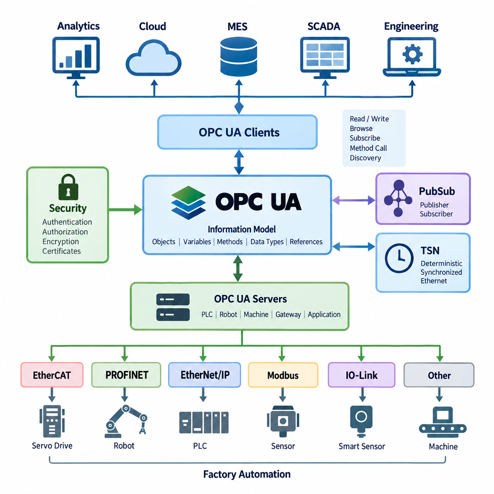
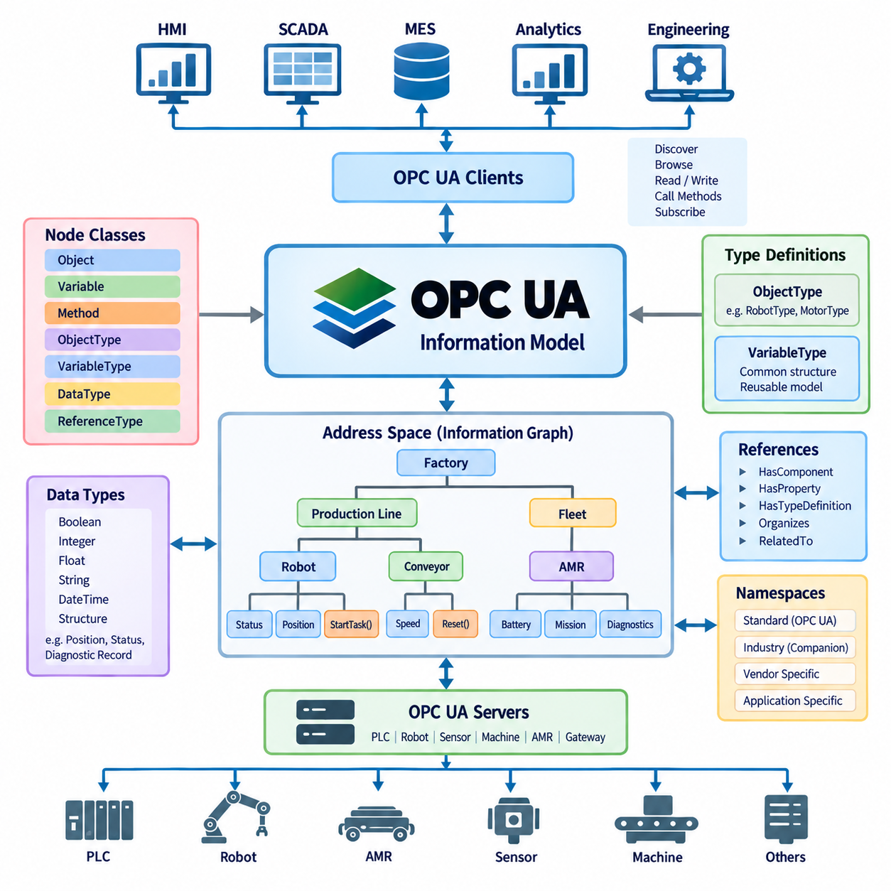
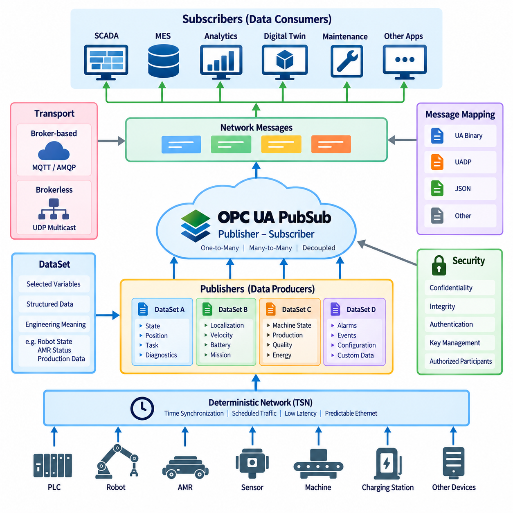
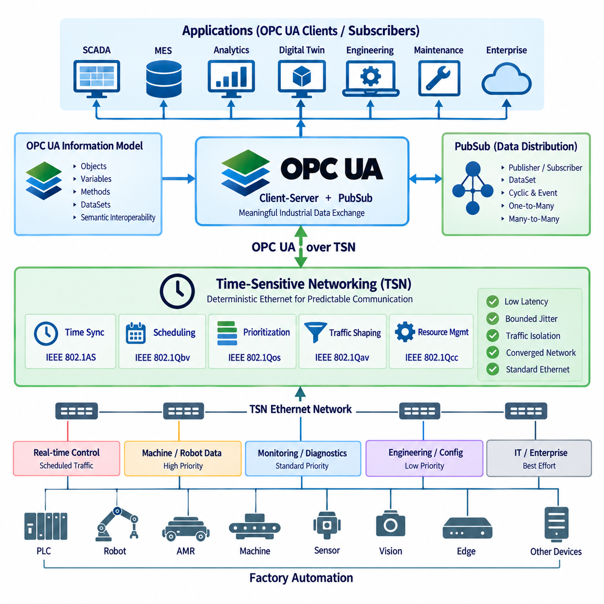
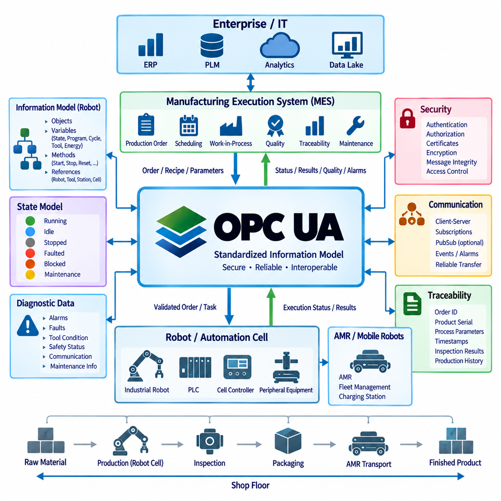

**Volume 07. Industrial Communication**

# Chapter 07. OPC UA

## 07.01. OPC UA Architecture

{width="7.268055555555556in" height="7.268055555555556in"}

OPC UA, or Open Platform Communications Unified Architecture, is an industrial communication architecture designed to provide secure, platform-independent, and semantically meaningful communication between devices, controllers, software applications, and enterprise systems. Unlike traditional protocols that mainly exchange raw values or fixed registers, OPC UA represents industrial data together with its meaning, structure, relationships, and metadata. This makes it suitable for connecting PLCs, robots, sensors, SCADA systems, MES platforms, and higher-level information systems across heterogeneous industrial environments.

The central concept of OPC UA architecture is a client-server communication model in which an OPC UA Server exposes industrial information and an OPC UA Client consumes or interacts with that information. A server may represent a PLC, robot controller, machine, gateway, or industrial application, while a client may be an HMI, SCADA system, MES, engineering workstation, or analytics application. The architecture separates application logic from communication details, allowing systems implemented on different operating systems, processors, and programming environments to communicate through a common framework.

OPC UA organizes accessible information through an address space rather than treating communication simply as a collection of independent variables. Objects, variables, methods, data types, references, and other nodes can be arranged into a structured model. For example, a robot can be represented as an object containing operating state, position, alarm status, program information, and control methods. Relationships between these elements can also be represented explicitly. This structure allows applications to understand not only the value of data but also what the data represents and how it relates to other elements.

The information model is one of the most important architectural differences between OPC UA and simpler industrial protocols. A conventional register-based protocol may provide a value such as a motor speed without describing its engineering unit, physical meaning, source, or relationship to the motor. OPC UA can represent the motor as an object and define speed as a variable associated with that object, including data type, engineering meaning, access permissions, and relationships to other components. This semantic representation supports reusable and extensible industrial information models across different machines and vendors.

OPC UA communication is also designed around a layered architecture that separates the application-level information model from the underlying communication mechanisms. Applications can exchange information through established OPC UA services for discovery, session management, browsing, reading, writing, subscriptions, method invocation, and other operations. This separation allows the same conceptual industrial information to be transported through different communication approaches while preserving a consistent application model. Consequently, OPC UA can serve as a bridge between device-level automation and higher-level software systems.

Security is an integral part of OPC UA architecture rather than an optional feature added outside the communication model. OPC UA provides mechanisms for application authentication, user authentication, authorization, message integrity, confidentiality, and secure communication. Certificates can be used to establish application identities and trust relationships, while security policies define how messages are protected. In an industrial network, these capabilities are important because communication may cross multiple network zones connecting machines, engineering systems, factory servers, and enterprise applications.

OPC UA also supports a subscription-based mechanism that is particularly useful for industrial monitoring. Instead of repeatedly polling every variable, a client can establish a subscription and receive notifications when monitored values or conditions change. This approach can reduce unnecessary communication and provide more efficient event-driven data exchange. For a robot or AMR, for example, operating state, battery status, fault conditions, mission status, and production information can be monitored continuously while the application receives updates according to configured sampling and reporting behavior.

The architecture can be extended beyond traditional client-server communication through OPC UA PubSub, which provides a publisher-subscriber communication model. In this model, publishers distribute information to multiple subscribers without requiring every receiver to maintain an individual client-server session with the data source. This becomes useful when the same industrial information must be distributed to many systems, devices, or processing nodes. PubSub therefore provides an architectural path toward scalable industrial data distribution and can support applications involving large numbers of devices and consumers.

OPC UA over TSN extends the architectural concept toward deterministic industrial Ethernet environments. Time-Sensitive Networking, or TSN, provides mechanisms for predictable and synchronized Ethernet communication, while OPC UA provides the information and communication model above the transport infrastructure. The combination can therefore connect semantic industrial information with increasingly deterministic network behavior. This is especially relevant to future automation architectures in which robots, controllers, sensors, and distributed computing systems require both meaningful data models and controlled communication timing.

In robotics and factory automation, OPC UA is particularly valuable as an integration layer rather than necessarily replacing every lower-level control protocol. A robot may use EtherCAT, PROFINET, EtherNet/IP, CAN, or another real-time mechanism for actuator and controller communication, while OPC UA exposes selected operational information to higher-level systems. Robot status, production state, diagnostics, task information, energy data, and equipment metadata can therefore be integrated with PLC, SCADA, MES, WMS, and manufacturing applications without forcing every system to use the same low-level control protocol.

For AMR and Physical AI systems, this distinction becomes especially important. Real-time motion control and safety functions may remain within dedicated controllers and deterministic communication networks, while OPC UA can provide a structured interface between the robot system and the surrounding factory or operational environment. Mission status, robot availability, charging state, alarms, work orders, inspection results, and equipment states can be represented as structured information. This allows an AMR fleet to participate in broader factory workflows without placing high-level enterprise communication directly inside the low-level motion-control loop.

The architectural role of OPC UA therefore extends from machine connectivity toward industrial information integration. At the device and controller level, specialized protocols provide deterministic control and sensor or actuator communication. At the integration level, OPC UA can expose those systems through a common semantic model. Above that layer, SCADA, MES, WMS, analytics, digital twins, and enterprise applications can consume and correlate the information. This creates a layered communication architecture in which real-time control, industrial data exchange, and business-level information processing remain logically separated while still being interoperable.

In a modern factory, OPC UA can consequently act as an important bridge between Operational Technology and Information Technology. A machine does not need to expose its internal implementation details directly to an enterprise application; instead, the OPC UA information model defines what the machine means, what information it provides, and how that information is accessed. This approach supports vendor interoperability, system integration, diagnostics, digitalization, and future expansion. Within the broader Industrial Communication architecture, OPC UA therefore represents a transition from simple signal exchange toward secure, structured, semantic, and scalable industrial information communication.

## 07.02. Information Model Design

{width="7.268055555555556in" height="7.268055555555556in"}

OPC UA information model design defines how industrial data is represented as structured, meaningful, and machine-interpretable information rather than as isolated variables or register addresses. The model provides a common semantic layer between physical equipment and software applications. Machines, robots, sensors, controllers, production resources, and their operating properties can therefore be represented consistently, allowing OPC UA clients to discover both the available data and the meaning associated with that data.

The foundation of the OPC UA information model is the Address Space, which contains interconnected Nodes representing the elements of an industrial system. Each Node has a defined NodeClass that describes its purpose, such as Object, Variable, Method, ObjectType, VariableType, DataType, or ReferenceType. Instead of presenting information as a flat table of values, the Address Space organizes these Nodes into relationships that describe equipment structure, properties, capabilities, and operational dependencies.

Objects represent logical or physical entities within the information model. A robot, motor, battery, production cell, sensor, conveyor, or AMR can be modeled as an Object containing related Variables, Methods, and subordinate Objects. For example, an AMR Object may contain battery state, operating mode, localization status, mission state, velocity, and diagnostic information. This object-oriented representation allows industrial equipment to be described in a form that closely corresponds to its actual engineering structure.

Variables represent values associated with Objects and other elements of the model. A Variable can contain a process value such as temperature, speed, current, position, pressure, battery state of charge, or operating status. However, OPC UA can associate the value with additional information such as its DataType, access characteristics, engineering units, and semantic context. Consequently, a client does not need to interpret an unexplained numerical register solely from external documentation to understand what the value represents.

Methods represent callable functions or operations associated with an Object. While Variables describe the state of a system, Methods provide a standardized way to represent actions that can be requested through the information model. A robot model might expose Methods such as Reset, StartTask, StopTask, or AcknowledgeFault, depending on the application design. Input and output arguments can also be defined, enabling the operation and its required parameters to become part of the machine-readable interface.

References connect Nodes and establish the semantic relationships that form the OPC UA information graph. References can indicate hierarchical relationships such as HasComponent or HasProperty, as well as type relationships and other associations. Through References, a client can navigate from a factory to a production line, from the line to a robot cell, from the cell to a robot, and from the robot to its components and variables. The resulting structure behaves more like an industrial knowledge graph than a simple collection of communication addresses.

Type definitions are essential for producing reusable and consistent information models. ObjectTypes and VariableTypes define templates from which individual instances can be created. Instead of independently defining every robot or motor, an engineering organization can define a standard RobotType or MotorType containing required components, properties, and behaviors. Individual machines can then be instantiated from these types while retaining common semantics, greatly reducing inconsistency between equipment instances and software interfaces.

DataTypes determine how values are represented and interpreted. OPC UA supports fundamental data types and allows structured types to represent more complex industrial information. Proper DataType design is important because industrial applications frequently require more than simple Boolean or integer values. Positions, operating states, diagnostic records, production results, quality information, and equipment configurations may contain multiple related fields that should remain logically grouped when exchanged between systems.

Namespaces provide a mechanism for separating identifiers belonging to different information-model authorities while allowing them to coexist within the same Address Space. Standard OPC UA definitions can therefore be combined with industry-specific, vendor-specific, and application-specific models without requiring every identifier to belong to a single global naming scheme. Good namespace design helps maintain model ownership, versioning, extensibility, and interoperability as industrial systems grow and multiple organizations contribute information definitions.

Node identification must also be designed carefully because software applications require stable ways to locate information. Each Node is identified by a NodeId within its namespace, while BrowseNames and DisplayNames support navigation and human-readable presentation. NodeIds should remain sufficiently stable for application integration, whereas display-oriented names may change for localization or engineering convenience. Separating persistent identification from visual naming reduces coupling between machine interfaces and user-interface conventions.

A well-designed information model should represent engineering meaning rather than merely reproduce the internal memory structure of a PLC or controller. Copying thousands of controller registers directly into an OPC UA Address Space may provide connectivity but does not automatically create semantic interoperability. The model should instead identify meaningful equipment entities, their states, capabilities, relationships, commands, and diagnostic information. This transforms device-specific data into an interface that higher-level applications can understand consistently.

Companion Specifications extend this principle by defining standardized information models for particular industries, equipment categories, or application domains. When equipment follows an agreed model, clients can recognize common structures without requiring a completely different integration implementation for every vendor. Vendor-specific extensions can still be added where necessary, but standardized concepts should be reused whenever possible. This balance between common definitions and controlled extension is central to scalable OPC UA information-model engineering.

For robotics, an information model can organize data around the robot as an operational resource rather than around individual communication registers. Robot identity, controller state, operating mode, position information, task status, alarms, energy information, and maintenance data can be associated with meaningful Objects and Variables. Methods can represent permitted operations, while References describe relationships between the robot, tools, controllers, sensors, and surrounding production resources. This provides a semantic interface between robot control and factory integration.

For AMR systems, the model can similarly represent each mobile robot as a structured asset containing mission state, localization quality, battery condition, charging state, payload status, availability, faults, and operational capabilities. Fleet-level Objects can represent groups of robots, charging resources, stations, or operational zones. The OPC UA model does not need to replace the real-time navigation or motion-control network; instead, it exposes selected operational information in a structured form for PLC, SCADA, MES, WMS, analytics, and other factory systems.

Information model design therefore determines whether OPC UA is used merely as another data transport mechanism or as a true semantic integration architecture. Effective models combine stable identification, reusable types, explicit relationships, meaningful variables, controlled methods, appropriate namespaces, and standardized definitions. When these principles are applied consistently, industrial equipment becomes discoverable and interpretable through software, creating a scalable information foundation for factory automation, robotics, digital twins, IT/OT integration, and increasingly connected Physical AI systems.

## 07.03. OPC UA PubSub

{width="7.268055555555556in" height="7.268055555555556in"}

OPC UA PubSub extends the OPC UA communication architecture with a publisher-subscriber model designed for efficient one-to-many and many-to-many data distribution. Unlike the traditional client-server model, where a client establishes a session with a server and requests information through services, PubSub separates data producers from data consumers. Publishers distribute structured information without needing to know which subscribers receive it, enabling scalable communication across industrial devices, software systems, and distributed automation environments.

The fundamental architectural principle of PubSub is decoupling. A Publisher generates and transmits DataSets containing selected information, while Subscribers receive and process the DataSets relevant to their applications. Publishers and Subscribers do not require direct application-level relationships with each other. This separation reduces communication dependencies and allows new consumers to be added without redesigning the original data source, which is particularly useful in factories containing many machines, robots, monitoring systems, and analytics applications.

A DataSet is the logical collection of information that a Publisher makes available for distribution. Its fields may originate from Variables in an OPC UA Address Space or from application-specific data sources. For example, a robot DataSet could contain operating mode, task state, position, energy status, and diagnostic information. An AMR DataSet might contain localization state, velocity, battery state of charge, mission status, and fault information. Grouping related values into DataSets creates meaningful communication units instead of transmitting unrelated individual values.

PublishedDataSets define the information selected for publication, while DataSetWriters prepare that information for transmission as DataSetMessages. Multiple DataSetWriters can operate within a WriterGroup, allowing related messages to share communication configuration and timing characteristics. The resulting NetworkMessages contain the information needed for distribution through the selected transport mechanism. This layered structure separates the semantic content being published from the configuration used to encode, schedule, and transmit that content.

On the receiving side, a Subscriber uses ReaderGroups and DataSetReaders to identify and process relevant published information. A DataSetReader determines which incoming DataSetMessages should be accepted and how their fields are interpreted or mapped into the receiving application. This filtering mechanism allows multiple Subscribers to consume different portions of a common communication stream. A monitoring application, robot controller, digital twin, and analytics system may therefore receive different information from the same publishing infrastructure.

OPC UA PubSub supports different transport and message-mapping approaches to address different industrial communication requirements. Broker-based communication can use messaging infrastructure in which Publishers send information through an intermediary and Subscribers receive selected messages. Brokerless communication can distribute messages directly over network transports such as UDP-based mechanisms. The appropriate approach depends on system topology, scalability, determinism, network infrastructure, and the relationship between data producers and consumers.

The PubSub architecture separates transport from message representation so that the information model is not tightly bound to a single network technology. OPC UA defines message mappings that determine how PubSub information is encoded for transmission. Binary encoding can provide compact and efficient communication suitable for industrial environments, while other mappings can support integration with broader messaging infrastructures. This separation allows the same logical information to be distributed across different communication environments without redesigning its semantic meaning.

One important advantage of PubSub is efficient multicast-style information distribution. In a client-server architecture, a server may need to maintain multiple sessions and deliver similar information independently to many clients. With PubSub, the same published information can be distributed so that multiple Subscribers consume it without requiring a separate application transaction for every receiver. This characteristic is valuable for production monitoring, synchronized machine information, fleet status distribution, industrial analytics, and large-scale factory data collection.

PubSub communication can also support cyclic and event-oriented data distribution. Periodic information such as machine state, robot position, production status, or AMR telemetry may be published at configured intervals, while other information can be associated with changing operational conditions. Engineering decisions must therefore consider publishing interval, message size, network bandwidth, data freshness, and subscriber processing requirements. Excessively frequent publication can consume network resources, while slow publication may provide outdated information to dependent applications.

Security remains important because PubSub communication may distribute operational information to many receivers across industrial networks. OPC UA PubSub provides mechanisms intended to protect message confidentiality, integrity, and authenticity according to the selected security configuration. Group-oriented communication introduces different security considerations from individual client-server sessions because multiple authorized participants may share communication resources. Key management, trust configuration, participant authorization, and network segmentation therefore become important parts of practical PubSub deployment.

PubSub does not eliminate the OPC UA client-server architecture. Instead, both models can coexist and serve different purposes within the same system. Client-server communication remains useful for discovery, configuration, browsing, diagnostics, reading and writing individual values, and invoking Methods. PubSub is well suited to repeated distribution of selected operational information to multiple consumers. A system can therefore use client-server services for configuration and management while using PubSub for efficient runtime data distribution.

For robotics, PubSub provides an effective mechanism for distributing operational information from robots or robot cells to multiple factory applications. Robot state, production progress, diagnostic conditions, energy information, tool status, or quality results can be published once and consumed by SCADA, MES, digital twins, maintenance systems, and analytics applications. The robot control loop can remain on a dedicated real-time network while PubSub provides a scalable information-distribution layer above the low-level control architecture.

In an AMR environment, individual robots, fleet controllers, charging stations, and factory systems can participate as Publishers or Subscribers according to their roles. An AMR may publish mission state, battery condition, localization quality, availability, and faults, while fleet or manufacturing applications subscribe to the required information. Conversely, operational systems may publish production or logistics information consumed by fleet-level software. This creates loosely coupled information flows between mobile robots and surrounding factory infrastructure.

OPC UA PubSub becomes particularly significant when combined with deterministic Ethernet technologies such as Time-Sensitive Networking. PubSub provides the structured data-distribution model, while TSN can provide network mechanisms for controlled latency, traffic scheduling, synchronization, and predictable Ethernet behavior. This combination supports architectures in which semantic industrial information must move between distributed devices with increasingly strict timing requirements, although actual deterministic performance depends on the complete network and system configuration.

Effective PubSub engineering therefore requires more than simply selecting a Publisher and Subscriber. Designers must define meaningful DataSets, publication timing, WriterGroups and ReaderGroups, message encoding, transport mechanisms, subscriber filtering, security configuration, and network capacity. When these elements are coordinated with the OPC UA information model, PubSub provides a scalable communication layer connecting industrial equipment, robots, AMRs, controllers, edge systems, MES, analytics, and digital twins while preserving semantic interoperability across the automation architecture.

## 07.04. OPC UA over TSN

{width="7.268055555555556in" height="7.268055555555556in"}

OPC UA over TSN combines the semantic communication capabilities of OPC UA with the deterministic Ethernet mechanisms provided by Time-Sensitive Networking. OPC UA defines how industrial information is modeled, identified, and exchanged, while TSN controls how Ethernet traffic is synchronized, scheduled, and prioritized. Together, they provide an architectural approach for transporting structured industrial information across converged Ethernet networks with increasingly predictable timing behavior.

Traditional Ethernet provides high bandwidth and broad interoperability, but ordinary best-effort communication cannot guarantee that critical industrial messages will arrive within a predictable time window. Network congestion, competing traffic, and switch queuing can introduce variable latency and jitter. TSN addresses these limitations by adding standardized mechanisms for time synchronization, traffic scheduling, prioritization, and resource management while preserving compatibility with Ethernet infrastructure.

The architectural relationship between OPC UA and TSN is based on separation of responsibilities. OPC UA operates primarily at the information and application communication level, describing Objects, Variables, DataSets, and their semantic relationships. TSN operates at the network level and manages when Ethernet frames can use network resources. OPC UA therefore does not become a deterministic network by itself, and TSN does not define industrial information semantics. Their combination connects meaningful industrial data with controlled network delivery.

OPC UA PubSub is particularly important in this architecture because it provides a publisher-subscriber communication model suitable for cyclic and distributed industrial data exchange. Publishers generate DataSets and distribute them as messages, while Subscribers consume the information relevant to their applications. When PubSub traffic is transported through a properly engineered TSN network, selected communication streams can receive controlled transmission opportunities, allowing data distribution to become more predictable than conventional best-effort Ethernet communication.

Time synchronization is a fundamental capability for coordinated TSN operation. Devices participating in scheduled communication require a sufficiently consistent understanding of network time so that transmission and reception activities can be coordinated. IEEE 802.1AS is commonly associated with generalized Precision Time Protocol mechanisms used within TSN environments. Synchronized time can also support distributed industrial applications in which measurements, control information, and events from multiple devices must be correlated according to accurate timestamps.

Traffic scheduling allows time-critical communication to be separated from less critical Ethernet traffic. IEEE 802.1Qbv defines time-aware scheduling mechanisms that can control transmission queues according to configured time windows. Critical traffic can therefore be given scheduled access to network links, while engineering downloads, diagnostics, video, enterprise traffic, or other less time-sensitive communication uses other available transmission opportunities. Proper scheduling can reduce contention and improve predictability for selected industrial data streams.

Traffic prioritization and shaping complement scheduled transmission by managing how different classes of Ethernet traffic share network resources. Industrial networks may simultaneously carry control information, robot status, sensor data, machine diagnostics, camera streams, configuration traffic, and enterprise communication. TSN mechanisms allow engineers to differentiate these traffic classes and manage their network behavior according to application requirements. Deterministic performance therefore depends on network-wide traffic engineering rather than simply enabling a single protocol option.

A major architectural benefit of OPC UA over TSN is the possibility of network convergence. Traditional factories often use separate networks for motion control, machine communication, monitoring, and enterprise connectivity because their timing and reliability requirements differ. A carefully designed TSN-enabled Ethernet infrastructure can allow multiple traffic classes to coexist while maintaining differentiated communication behavior. OPC UA can then provide a common information architecture across devices and systems without requiring all applications to have identical timing requirements.

This convergence does not mean that every OPC UA message becomes hard real-time communication. Client-server operations such as browsing, configuration, diagnostics, and occasional data access generally have different timing requirements from cyclic PubSub traffic. The network architecture should classify communication according to actual application needs. Time-critical PubSub streams may receive scheduled resources, while configuration or monitoring traffic can continue to operate with less restrictive service characteristics on the same physical Ethernet infrastructure.

End-to-end determinism requires more than deterministic network transmission. Application execution time, operating-system scheduling, protocol-stack behavior, device processing, switch configuration, synchronization accuracy, and network topology all contribute to total latency and jitter. A TSN-capable switch alone cannot guarantee deterministic application behavior. Engineers must therefore analyze the complete path from data generation at the Publisher through network transmission to processing at the Subscriber when establishing real-time performance requirements.

For industrial robots, OPC UA over TSN can support communication between distributed controllers, machine components, monitoring systems, and higher-level automation applications where predictable information exchange is required. Low-level servo control may still use dedicated motion networks where appropriate, while OPC UA PubSub over TSN can support coordinated machine information, state distribution, production synchronization, or controller-to-controller communication. The architecture therefore complements rather than automatically replaces existing specialized real-time control technologies.

In AMR and mobile robotics environments, the technology can be applied most directly to deterministic wired infrastructure surrounding production cells, charging stations, docking interfaces, edge computers, and factory controllers. Mobile robots themselves may transition between wired and wireless communication domains, where timing characteristics can differ significantly. OPC UA can maintain consistent information semantics across these domains, while deterministic guarantees must be evaluated separately according to the capabilities and configuration of each underlying network segment.

OPC UA over TSN is also relevant to IT/OT convergence because the underlying Ethernet infrastructure can carry both operational and information-oriented traffic while maintaining controlled separation between traffic classes. Production equipment, edge systems, MES, SCADA, engineering tools, and analytics platforms can participate in a more unified network architecture. Semantic interoperability is provided by OPC UA, while TSN contributes mechanisms for predictable communication behavior where required by operational applications.

Network engineering becomes especially important as the number of Publishers, Subscribers, and communication streams increases. Engineers must consider topology, link capacity, synchronization domains, traffic classes, stream requirements, scheduling, redundancy, switch capabilities, and failure behavior. Bandwidth alone is insufficient because deterministic communication depends on whether network resources are available at the required time. Configuration and validation must therefore consider both average utilization and worst-case communication conditions.

Security and determinism must also be designed together. OPC UA provides mechanisms for authentication, authorization, message protection, and application trust, while industrial network architecture can provide segmentation and controlled communication paths. Security processing introduces computational and communication overhead that must be included in timing analysis. A robust architecture must therefore achieve acceptable confidentiality and integrity without assuming that deterministic timing eliminates cybersecurity requirements or that security mechanisms have no effect on performance.

OPC UA over TSN ultimately represents an architectural direction toward semantic, converged, and increasingly deterministic industrial Ethernet. OPC UA describes what industrial information means and how applications exchange it, PubSub enables scalable distribution between producers and consumers, and TSN manages how selected Ethernet traffic receives predictable network treatment. When engineered as an end-to-end system, this combination can provide a communication foundation for advanced factory automation, distributed robotics, edge computing, digital twins, and connected Physical AI systems.

## 07.05. OPC UA in Robot MES Integration

{width="7.268055555555556in" height="7.268055555555556in"}

OPC UA provides a structured integration layer between industrial robots and Manufacturing Execution Systems by translating robot-level operational data into standardized, semantically meaningful information. The robot controller can expose production state, operating mode, task progress, alarms, quality information, energy data, and equipment status through an OPC UA Server, while the MES accesses this information through an OPC UA Client or corresponding integration service. This creates a clear boundary between machine control and manufacturing management.

The robot and MES normally operate at different functional levels and time scales. A robot controller performs motion execution, interlocking, tool control, and other machine-level operations, while the MES coordinates production orders, resources, work-in-process, quality records, and manufacturing history. OPC UA does not merge these responsibilities. Instead, it provides a standardized interface through which selected information can cross the automation hierarchy without exposing internal real-time control mechanisms directly to enterprise software.

An OPC UA information model defines the semantic contract between the robot and MES. A robot can be represented as an Object containing Variables for operating state, program state, cycle count, task identifier, tool condition, fault status, and other relevant information. Methods may represent permitted operations, while References describe relationships between robots, tools, stations, production cells, and processes. The MES therefore interacts with structured manufacturing resources rather than undocumented controller registers or proprietary data structures.

Production-order integration illustrates the typical information flow from MES to robot automation. The MES may provide an order identifier, product type, quantity, recipe reference, process parameters, or scheduling information to the automation layer. A PLC, cell controller, robot management application, or gateway can validate and translate this information before execution. The robot then performs the assigned operation using its local control logic, while OPC UA communicates the corresponding task state and production context between the participating systems.

The reverse information flow reports execution results from the robot environment to the MES. Typical information includes task acceptance, start and completion states, produced quantity, cycle time, interruption conditions, alarm information, inspection results, and completion status. The MES can associate these values with production orders and manufacturing records. This creates traceability between what the manufacturing system requested and what the robot cell actually executed without requiring the MES to participate directly in the robot motion-control cycle.

State modeling is especially important because MES and robot controllers may use different internal definitions for running, idle, stopped, faulted, blocked, or maintenance conditions. OPC UA can provide a normalized state representation at the integration boundary. The information model should define the meaning of each exposed state and the permitted transitions between states. A consistent state model reduces ambiguous interpretation and allows production applications to evaluate equipment availability and process progress across different robot types and vendors.

Command handling should be designed differently from continuous control. MES commands normally represent manufacturing intent, such as requesting a job, selecting a production order, changing a recipe, or authorizing a process stage. Low-level commands for joint position, servo torque, emergency stopping, or high-frequency motion control should remain within appropriate robot and safety-control systems. This separation prevents enterprise communication from becoming part of timing-critical control loops and preserves clear responsibility between manufacturing orchestration and machine execution.

A handshake mechanism can coordinate transactions that require confirmation between MES and robot automation. For example, the MES can issue a production request, the automation layer can acknowledge receipt, validate equipment readiness, accept or reject the request, execute the operation, and finally report completion or failure. Transaction identifiers and timestamps help correlate commands and results. Explicit states are preferable to relying on a single Boolean flag because communication delays, retries, restarts, and partial failures must be handled predictably.

Subscriptions allow MES-related applications to monitor robot information without continuously polling every variable. An OPC UA Client can subscribe to selected state, production, diagnostic, or quality Variables and receive notifications when monitored information changes. This reduces unnecessary network traffic and supports event-oriented integration. High-volume or broadly distributed information can also be handled through OPC UA PubSub where appropriate, while client-server services remain useful for configuration, browsing, commands, and detailed diagnostic access.

Traceability is a major benefit of integrating robots with MES. Production information can associate robot execution with work-order identifiers, product serial numbers, process parameters, tool information, timestamps, inspection results, and quality outcomes. The robot does not necessarily need to store the complete manufacturing genealogy locally. Instead, it provides reliable execution data and identifiers that allow the MES to construct production history. This separation keeps robot control focused while supporting manufacturing accountability and quality analysis.

Diagnostic integration enables the MES and surrounding factory systems to distinguish production problems from equipment problems. Robot faults, controller alarms, tool conditions, communication failures, safety-related operating states, and maintenance indicators can be represented through structured OPC UA information. The MES may use this information to suspend an operation, redirect production, record downtime, or initiate maintenance workflows. Detailed engineering diagnostics can remain available to SCADA or maintenance applications without requiring every diagnostic element to become part of MES logic.

Security must be designed across the robot-MES boundary because commands and production information can affect physical manufacturing operations. OPC UA supports application authentication, user authentication, authorization, certificates, message integrity, and encrypted communication. Access permissions should distinguish monitoring from command authority so that a reporting application cannot automatically perform control operations. Network segmentation and controlled gateways can further separate robot cells, manufacturing networks, and enterprise systems while allowing required information flows.

Reliability also requires explicit handling of communication loss and system restart. A robot should not depend on continuous MES connectivity for every internal control action after a valid production task has been accepted unless the process specifically requires it. The integration design should define what happens when communication is interrupted, whether the current operation continues, how results are buffered, and how state is reconciled after reconnection. Duplicate requests and uncertain completion states must be detectable through transaction-aware logic.

In an AMR-integrated factory, OPC UA can extend the same principles beyond stationary robots. The MES may initiate manufacturing or logistics requirements, while WMS, fleet management, PLC, and AMR systems coordinate material movement and workstation availability. OPC UA can expose mission state, docking readiness, payload status, battery condition, station state, and task completion as structured information. The AMR navigation and motion-control systems remain independent from MES timing, while operational status participates in the broader manufacturing workflow.

Robot-MES integration therefore works best when OPC UA is treated as a semantic integration architecture rather than merely an Ethernet connection between two systems. The robot layer retains deterministic control, safety, and machine execution, while the MES retains production planning, tracking, genealogy, and manufacturing coordination. OPC UA provides the structured information model, services, security, subscriptions, and optional PubSub mechanisms connecting these domains, creating a scalable foundation for factory automation, digital twins, flexible manufacturing, and Physical AI production systems.
