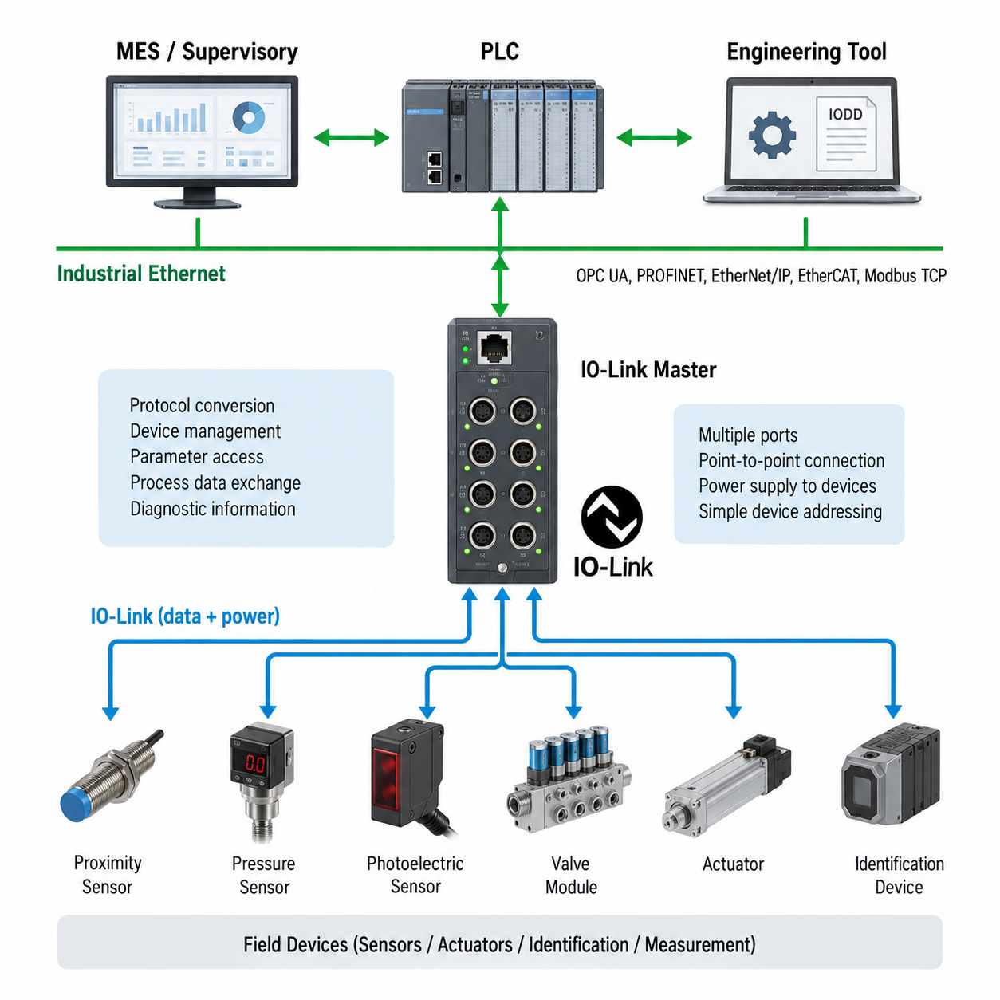
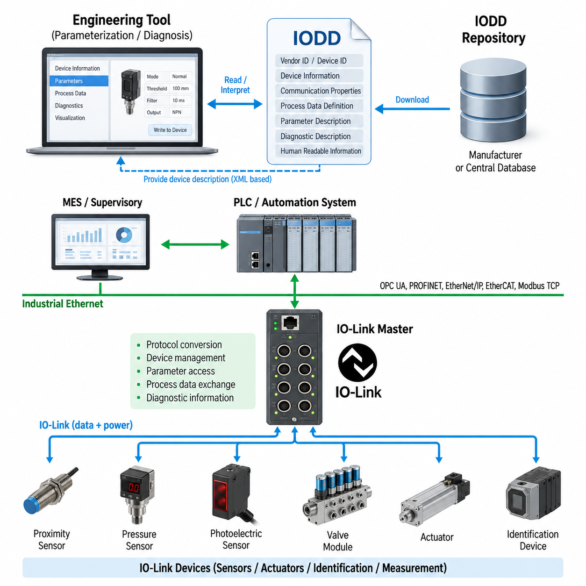
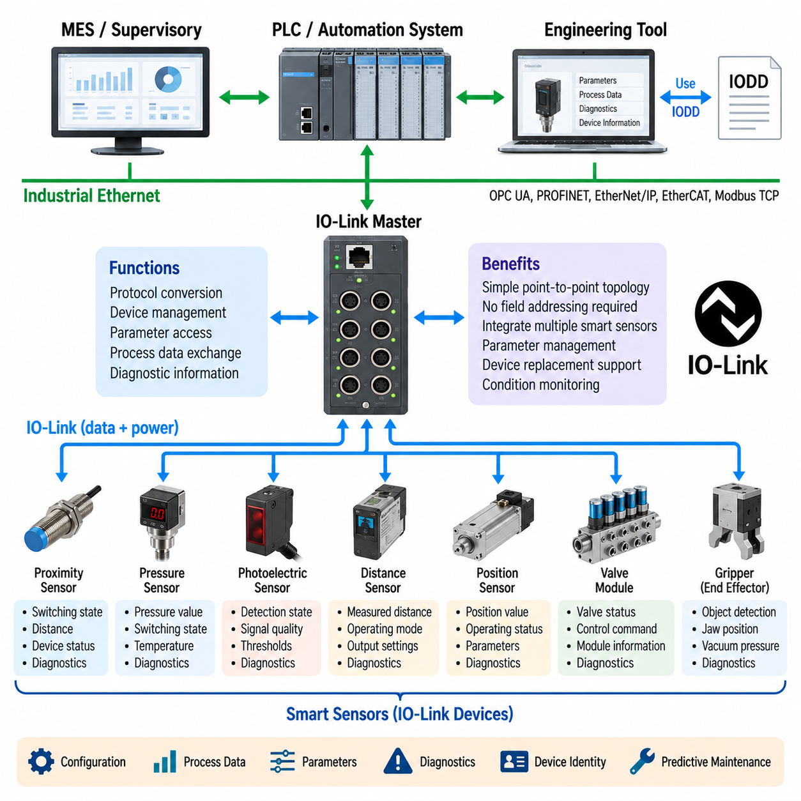
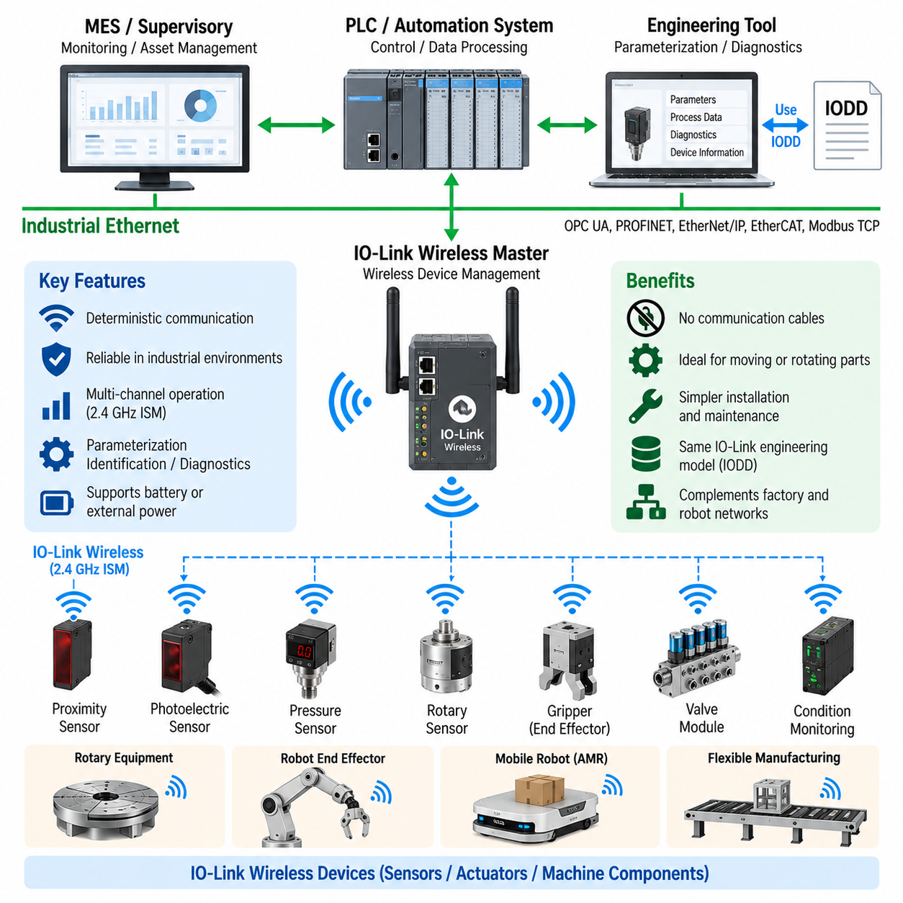
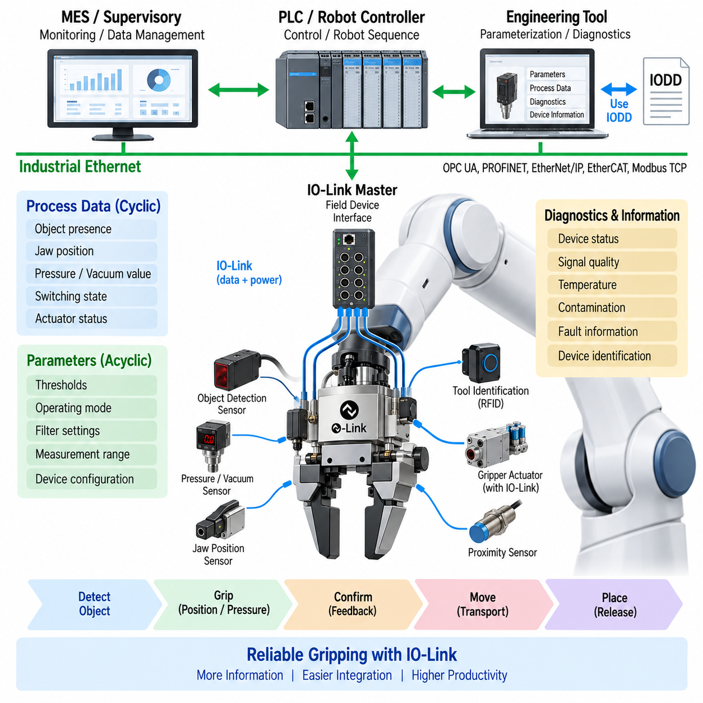

**Volume 07. Industrial Communication**

# Chapter 08. IO-Link

## 08.01. IO-Link Master/Device Architecture

{width="7.268055555555556in" height="7.268055555555556in"}

IO-Link 마스터--디바이스 아키텍처(IO-Link Master--Device Architecture)는 센서(sensor), 액추에이터(actuator), 식별 장치(identification device), 소형 측정 모듈(compact measurement module)과 같은 지능형 필드 디바이스(intelligent field device)를 상위 자동화 네트워크(higher-level automation network)에 연결하기 위해 설계된 점대점(point-to-point) 산업용 통신 구조이다. 산업용 통신(Industrial Communication) 구조에서 IO-Link는 OPC UA 다음이면서 PLC 통합(PLC Integration) 이전에 위치하며, 개별 디바이스와 제어기 측 통신 인프라 사이에서 필드 레벨 인터페이스(field-level interface)를 제공한다. 따라서 IO-Link의 역할은 이더넷 기반 산업용 네트워크(Ethernet-based industrial network)를 대체하는 것이 아니라 이를 보완하는 것이다.

IO-Link 마스터(IO-Link Master)는 IO-Link 디바이스(IO-Link Device)와 상위 자동화 시스템(higher-level automation system) 사이의 핵심 인터페이스이다. 하나의 마스터(Master)는 일반적으로 여러 개의 독립적인 포트(port)를 제공하며, 각각의 포트는 전용 케이블을 통해 하나의 IO-Link 디바이스와 연결된다. 마스터는 통신, 디바이스 설정(device configuration), 프로세스 데이터(process data) 교환, 파라미터(parameter) 접근 및 진단 정보(diagnostic information)를 관리한다. 상위 측에서는 적절한 통합 방식을 사용하여 PLC 또는 산업용 이더넷 시스템과 통신함으로써, 디바이스 레벨 통신(device-level communication)과 제어기 레벨 네트워크(controller-level network)를 분리한다.

IO-Link 디바이스(IO-Link Device)는 일반적인 바이너리(binary) 또는 아날로그(analog) 디바이스보다 많은 정보를 제공하는 지능형 센서(smart sensor) 또는 액추에이터인 경우가 많다. 단순한 스위칭 상태(switching state)나 측정 전압(measured voltage)만 전달하는 대신, 디바이스는 프로세스 값(process value), 설정 파라미터(configuration parameter), 식별 정보(identification information), 진단 정보(diagnostic information), 그리고 디바이스별 데이터(device-specific data)를 교환할 수 있다. 이러한 구조를 통해 자동화 제어기는 현재 측정값뿐만 아니라 디바이스 상태, 설정 및 비정상적인 동작 조건에 관한 정보도 얻을 수 있다.

마스터와 디바이스 사이의 통신은 표준화된 점대점 연결(point-to-point connection)을 사용한다. 각 포트는 하나의 개별 통신 관계를 나타내므로, 멀티드롭 필드버스 네트워크(multidrop fieldbus network)에서 발생할 수 있는 주소 및 네트워크 관리의 복잡성을 줄일 수 있다. 또한 물리적 연결(physical connection)을 통해 연결된 필드 디바이스에 전원을 공급할 수 있어, 통신과 디바이스 전원(device power)을 동일한 인터페이스에 통합할 수 있다. 이는 기계, 로봇, 컨베이어 및 기타 산업 설비 주변에 분산 설치되는 센서와 액추에이터에 특히 유용하다.

마스터(Master)는 중요한 프로토콜 변환(protocol conversion) 및 관리 기능을 수행한다. 디바이스 측에서는 IO-Link 통신을 처리하고 디바이스별 파라미터를 관리하는 반면, 제어기 측에서는 수집된 정보를 산업용 자동화 네트워크(industrial automation network)를 통해 제공한다. 따라서 PLC는 각각의 센서에 대한 세부적인 통신 절차를 직접 구현할 필요가 없다. 마스터는 디바이스 레벨 통신을 추상화(abstraction)하고 일관된 인터페이스를 제공함으로써, 다양한 센서를 더 큰 PLC 또는 공장 제어 아키텍처(factory-control architecture)에 통합할 수 있도록 한다.

IO-Link의 주요 아키텍처적 장점 중 하나는 주기적 프로세스 데이터(cyclic process data)와 비주기적 파라미터 또는 진단 정보(acyclic parameter or diagnostic information)를 분리하는 것이다. 프로세스 데이터는 정상적인 동작 중 반복적으로 교환되어 제어기가 최신 측정값 또는 명령을 지속적으로 수신할 수 있도록 한다. 반면 파라미터 및 진단 정보는 설정(configuration), 시운전(commissioning), 유지보수(maintenance) 또는 고장 분석(fault analysis)이 필요할 때 접근할 수 있다. 이러한 구분은 단순한 온/오프 신호(on/off signal)보다 훨씬 많은 정보를 포함하는 지능형 필드 디바이스에 IO-Link를 적합하게 만든다.

디바이스 식별(device identification)과 설정(configuration) 역시 이 아키텍처의 중요한 부분이다. IO-Link 디바이스가 연결되면 마스터는 디바이스 정보를 이용하여 필요한 설정과 통신 파라미터를 확인하고 구성할 수 있다. 디바이스 설명(device description)은 이 장의 다음 주제에서 다루는 IODD 메커니즘(IODD mechanism)을 통해 표현된다. IODD는 디바이스의 식별 정보(identity), 파라미터(parameters), 프로세스 데이터(process data), 진단 정보(diagnostics) 및 지원 기능(supported functions)에 대한 표준화된 정보를 제공하여 엔지니어링 도구(engineering tool)가 연결된 디바이스를 이해하고 설정할 수 있도록 한다.

로보틱스 관점에서 IO-Link 마스터는 기계 또는 로봇 셀(robotic cell) 주변에 분산된 센서와 액추에이터를 집중적으로 연결하는 인터페이스로 사용할 수 있다. 근접 센서(proximity sensor), 압력 센서(pressure sensor), 위치 센서(position sensor), 광전 센서(photoelectric sensor), 밸브 모듈(valve module) 및 기타 지능형 필드 컴포넌트(intelligent field component)를 마스터 포트에 연결할 수 있다. 이후 로봇 또는 PLC는 각 필드 디바이스마다 별도의 통신 인터페이스를 요구하지 않고 자동화 네트워크를 통해 해당 디바이스의 동작 데이터를 접근할 수 있다.

디바이스 진단(diagnostics)은 필드 디바이스의 수가 증가할수록 더욱 중요해진다. 일반적인 센서에서 고장이 발생하면 단순히 신호가 사라진 것으로 나타날 수 있기 때문에, 문제가 센서 자체인지, 케이블(cable)인지, 커넥터(connector)인지, 전원 공급 장치(power supply)인지 또는 기계적인 상태(mechanical condition)인지 판단하기 어려울 수 있다. IO-Link는 추가적인 진단 및 식별 정보를 제공할 수 있으므로 제어 시스템(control system)이나 유지보수 애플리케이션(maintenance application)이 디바이스 수준의 상태를 구분하고 보다 신속한 문제 해결(troubleshooting)을 수행할 수 있도록 지원한다.

이 아키텍처는 단순한 신호 수집(signal acquisition)에서 보다 지능적인 디바이스 통합(smart device integration)으로 전환하는 것을 지원한다. 센서는 측정 데이터와 함께 설정 및 진단 정보를 제공할 수 있으며, 마스터는 이러한 디바이스와 상위 수준의 자동화 환경 사이에서 제어된 게이트웨이(controlled gateway) 역할을 수행한다. 그 결과 IO-Link는 필드 디바이스 연결(field-device connectivity)을 담당하고, 산업용 이더넷 또는 다른 제어기 네트워크는 상위 수준의 제어 통신(higher-level control communication)을 담당하며, PLC, MES 또는 감독 소프트웨어(supervisory software)는 그 결과 생성된 정보를 활용하는 계층화된 통신 구조(layered communication architecture)를 구성할 수 있다.

물리적 AI(Physical AI)와 로보틱스 시스템의 관점에서 이러한 구조는 지능형 인지(intelligent perception) 및 고수준 컴퓨팅(high-level computing)이 기존의 산업용 디바이스와 함께 동작해야 하는 경우에 유용하다. 로봇은 복잡한 인지를 위해 카메라(camera), LiDAR 및 AI 컴퓨팅을 사용할 수 있지만, 동시에 근접 센서(proximity sensor), 리미트 센서(limit sensor), 공압 밸브(pneumatic valve) 및 소형 액추에이터(compact actuator)에 의존하여 기계와 상호작용할 수 있다. 따라서 IO-Link는 이러한 기존 및 지능형 컴포넌트를 PLC와 전체 자동화 아키텍처에 연결하는 실용적인 필드 디바이스 계층(field-device layer)을 제공하며, 모든 디바이스를 독립적인 이더넷 노드(independent Ethernet node)로 구성하지 않고도 지능적인 필드 통합을 가능하게 한다.

## 08.02. IODD Device Description

{width="7.268055555555556in" height="7.268055555555556in"}

IODD(IO Device Description)는 IO-Link 디바이스(IO-Link Device)의 기능과 특성을 표현하기 위해 사용되는 표준화된 전자 디바이스 설명(standardized electronic device description)이다. IO-Link 아키텍처(IO-Link Architecture)에서 물리적 디바이스(physical device)는 IO-Link 마스터(IO-Link Master)와 데이터를 교환하고, IODD는 엔지니어링 소프트웨어(engineering software)가 해당 디바이스를 이해하는 데 필요한 정보를 제공한다. 따라서 IODD는 디바이스 하드웨어(device hardware), 설정 도구(configuration tool), 자동화 엔지니어링(automation engineering)을 연결하는 기계 판독형 설명(machine-readable description) 역할을 한다.

IODD는 특정 IO-Link 디바이스 유형(IO-Link Device type)을 구조화되고 제조사 독립적인 방식(vendor-independent manner)으로 설명하면서도 제조사별 특성(manufacturer-specific characteristics)을 유지한다. 여기에는 제조사 식별 정보(vendor identification), 디바이스 식별 정보(device identification), 제품 명칭(product designation), 통신 특성(communication properties), 파라미터(parameters), 프로세스 데이터(process data), 진단 정의(diagnostic definitions), 지원 디바이스 기능(supported device functions) 등의 정보가 포함된다. 엔지니어링 도구(engineering tool)는 각 센서 또는 액추에이터의 모든 파라미터와 데이터 필드를 사용자가 수동으로 정의하는 대신 이러한 정보를 해석할 수 있다.

디바이스 식별(device identification)은 자동화 시스템(automation system)이 IO-Link 마스터 포트(IO-Link Master port)에 어떤 물리적 컴포넌트가 연결되어 있는지 판단해야 하기 때문에 매우 중요하다. 식별 정보를 통해 엔지니어링 및 유지보수 도구(engineering and maintenance tool)는 연결된 디바이스를 올바른 설명 정보와 연계할 수 있다. 제조사 ID(Vendor ID)와 디바이스 ID(Device ID)는 이러한 관계를 위한 중요한 기준을 제공하며, 추가적인 제품 정보는 시운전(commissioning)과 유지보수 과정에서 디바이스 제품군(device family), 변형 모델(variant), 동작 특성(operational characteristics)을 구분하는 데 도움을 준다.

IODD는 마스터(Master)와 디바이스(Device) 사이의 상호작용에 필요한 통신 특성(communication characteristics)도 설명한다. 이러한 정의를 통해 설정 소프트웨어(configuration software)는 디바이스가 접근 가능한 정보를 어떻게 구성하고 있으며 어떤 통신 기능을 지원하는지 이해할 수 있다. 마스터는 실제 IO-Link 통신을 수행하는 반면, IODD는 엔지니어링 애플리케이션(engineering application)이 디바이스 데이터를 정확하게 해석하고 사용자에게 의미 있는 설정 옵션(configuration option)을 제공하는 데 필요한 의미적 설명(semantic description)을 제공한다.

프로세스 데이터 정의(process data definition)는 정상적인 기계 동작 중 주기적으로 교환되는 정보를 설명한다. 디바이스에 따라 이 정보는 스위칭 상태(switching state), 거리(distance), 압력(pressure), 온도(temperature), 위치(position), 품질 지표(quality indicator), 액추에이터 명령(actuator command), 또는 여러 값의 조합을 나타낼 수 있다. IODD는 이러한 값들이 프로세스 데이터 구조(process-data structure) 내에서 어떻게 구성되는지 정의하여, 엔지니어링 도구와 제어기 설정(controller configuration)이 통신 페이로드(communication payload)를 단순히 의미를 알 수 없는 비트의 연속으로 처리하지 않고 각각의 필드를 정확하게 해석할 수 있도록 한다.

파라미터 설명(parameter description)은 일반적으로 실시간 프로세스 데이터(real-time process data)처럼 지속적으로 교환되지 않고 비주기적으로 접근되는 정보를 다룬다. 파라미터는 측정 범위(measurement range), 스위칭 임계값(switching threshold), 동작 모드(operating mode), 필터링 동작(filtering behavior), 타이밍 값(timing value), 출력 특성(output characteristic), 또는 애플리케이션별 기능(application-specific function)을 제어할 수 있다. IODD는 이러한 파라미터를 데이터 유형(data type), 허용값(permitted value), 범위(range), 설명 정보(descriptive information)와 함께 정의하여 독점적인 레지스터 구조(proprietary register layout)에 대한 지식 없이도 체계적인 디바이스 설정을 가능하게 한다.

사람이 읽을 수 있는 정보(human-readable information)를 제공하는 것도 IODD의 중요한 기능이다. 원시 숫자로 구성된 파라미터 식별자(parameter identifier)는 엔지니어가 시운전 과정에서 해석하기 어렵지만, 엔지니어링 도구는 디바이스 설명(device description)을 사용하여 의미 있는 이름(name), 단위(unit), 값 범위(value range), 선택 항목(selection), 설명문(explanatory text)을 표시할 수 있다. 이를 통해 저수준 디바이스 통신(low-level device communication)이 이해하기 쉬운 엔지니어링 인터페이스(engineering interface)로 변환되며, 지능형 센서와 액추에이터를 설정하거나 진단할 때 별도의 매뉴얼에 대한 의존성을 줄일 수 있다.

진단 설명(diagnostic description)은 디바이스에서 생성되는 이벤트(event)와 상태(condition)를 일관된 방식으로 해석할 수 있도록 한다. 지능형 센서(smart sensor)는 신호 품질 저하(signal-quality degradation), 오염(contamination), 온도 한계(temperature limit), 측정 문제(measurement problem), 내부 디바이스 고장(internal device fault)과 같은 상태를 감지할 수 있다. IODD를 이용하면 단순히 식별되지 않은 오류값을 보고하는 대신, 엔지니어링 또는 유지보수 소프트웨어가 진단 코드(diagnostic code)를 의미 있는 상태와 연결하여 문제 해결(troubleshooting)과 예방 유지보수(preventive maintenance)를 지원하는 형태로 제공할 수 있다.

IODD 정보는 일반적으로 구조화된 XML 기반 디바이스 설명 데이터(XML-based device-description data)와 엔지니어링 도구에서 요구하는 관련 리소스(associated resources)를 사용하여 표현된다. 이러한 기계 판독형 구조(machine-readable structure)를 통해 서로 다른 자동화 환경의 소프트웨어가 디바이스 정보를 체계적으로 처리할 수 있다. IODD 자체는 런타임 통신 프로토콜(runtime communication protocol)이 아니며, 특정 디바이스가 제공하는 정보를 어떻게 해석하고, 설정하고, 표시하며, 엔지니어링 수명주기(engineering lifecycle) 전체에서 유지관리해야 하는지를 정의함으로써 IO-Link 통신을 보완한다.

따라서 IODD, IO-Link 마스터(IO-Link Master), IO-Link 디바이스(IO-Link Device)의 관계는 설명(description)과 통신(communication)의 분리라는 관점에서 이해할 수 있다. 디바이스는 센싱(sensing) 또는 액추에이션(actuation)을 수행하고 데이터를 제공하며, 마스터는 물리적 통신 채널(physical communication channel)을 설정하고 관리한다. IODD는 사용 가능한 정보의 의미와 구조를 설명한다. 이러한 요소들이 결합되어 각 센서 인터페이스를 수동으로 엔지니어링하는 방식보다 훨씬 확장성이 높은 재사용 가능한 디바이스 통합 모델(reusable device-integration model)을 구성한다.

이러한 표준화된 설명(standardized description)은 디바이스 교체(device replacement) 및 유지보수 작업 흐름(maintenance workflow)도 지원한다. 필드 디바이스(field device)를 교체해야 하는 경우 식별 정보와 파라미터 정보를 이용하여 자동화 환경이 교체 디바이스를 확인하고 필요한 설정을 복원할 수 있다. 이를 마스터 측 파라미터 관리 기능(Master-side parameter management capability)과 결합하면 특히 여러 IO-Link 마스터 포트에 유사한 센서나 액추에이터가 다수 분산된 기계에서 수동 설정 작업과 설정 오류(configuration error)를 줄일 수 있다.

로보틱스(robotics)에서 IODD 기반 엔지니어링(IODD-based engineering)은 현대 로봇이 주요 모션 제어 네트워크(motion-control network)와 인지 네트워크(perception network) 외에도 수많은 지능형 주변 디바이스(intelligent peripheral device)를 포함하기 때문에 유용하다. 그리퍼(gripper), 진공 시스템(vacuum system), 압력 센서(pressure sensor), 근접 센서(proximity sensor), 광전 센서(photoelectric sensor), 위치 검출기(position detector), 밸브 모듈(valve module), 상태 모니터링 디바이스(condition-monitoring device)는 각각 서로 다른 파라미터와 진단 정보를 제공할 수 있다. 이들의 IODD는 이러한 이기종 컴포넌트(heterogeneous component)를 일관된 자동화 엔지니어링 환경에 통합하기 위한 공통 설명 메커니즘(common descriptive mechanism)을 제공한다.

예를 들어 지능형 그리퍼(intelligent gripper)에서 IO-Link 프로세스 데이터(process data)는 그립 상태(gripping status), 물체 감지(object detection), 위치 정보(position information), 액추에이터 상태(actuator state)를 나타낼 수 있으며, 비주기적 파라미터(acyclic parameter)는 임계값(threshold), 동작 모드(operating mode), 디바이스 동작(device behavior)을 정의할 수 있다. 진단 이벤트(diagnostic event)는 비정상 상태 또는 유지보수 요구사항에 대한 정보를 제공할 수 있다. IODD는 이러한 서로 다른 정보 범주가 어떻게 표현되는지를 설명하여 모든 디바이스별 해석 로직(device-specific interpretation logic)을 PLC 애플리케이션 로직(PLC application logic)에 직접 포함하지 않고도 엔지니어링 시스템이 이를 일관되게 제공할 수 있도록 한다.

공장 레벨(factory level)에서 IODD 기반 디바이스 설명은 단순한 전기 신호(simple electrical signal)에서 정보가 풍부한 필드 디바이스(information-rich field device)로 전환하는 데 기여한다. 기존 센서 인터페이스(conventional sensor interface)가 주로 하나의 값이나 상태를 전달하는 것과 달리, IO-Link 디바이스는 식별 정보(identity), 설정(configuration), 측정값(measurement), 상태(status), 진단 정보(diagnostic information)를 제공할 수 있다. IODD는 이러한 데이터에 정의된 엔지니어링 의미(engineering meaning)를 부여하여 상위 시스템이 시운전, 유지보수, 자산 관리(asset management), 자동화 통합(automation integration)을 위해 필드 디바이스 정보를 더욱 효과적으로 활용할 수 있도록 한다.

전체 산업용 통신 아키텍처(industrial communication architecture)에서 IODD는 PLC 통합(PLC integration) 및 상위 공장 정보 시스템(higher-level factory information system) 아래의 디바이스 설명 계층(device-description layer)에 위치한다. IO-Link가 개별 필드 디바이스에 대한 통신 경로(communication path)를 제공한다면, IODD는 해당 디바이스를 이해하는 데 필요한 구조화된 지식(structured knowledge)을 제공한다. 이러한 조합은 스마트 센서 통합(smart sensor integration)을 위한 중요한 기반을 형성하며, 이후 로봇 및 산업 자동화 시스템에서 IO-Link 디바이스를 정보가 풍부한 컴포넌트(information-rich component)로 활용하는 다음 아키텍처 주제로 자연스럽게 연결된다.

## 08.03. Smart Sensor Integration

{width="7.268055555555556in" height="7.268055555555556in"}

스마트 센서 통합(Smart Sensor Integration)은 측정(measurement), 로컬 처리(local processing), 설정(configuration), 식별(identification), 진단(diagnostics)을 필드 디바이스(field device) 내부에 결합함으로써 산업용 센싱(industrial sensing)을 단순한 전기 신호 수집(electrical signal acquisition) 이상으로 확장한다. IO-Link 아키텍처(IO-Link Architecture)에서 스마트 센서(smart sensor)는 표준화된 점대점 연결(point-to-point connection)을 통해 IO-Link 마스터(IO-Link Master)와 통신한다. 이를 통해 자동화 시스템은 동작에 필요한 프로세스 데이터(process data)뿐만 아니라 센서의 상태와 설정을 설명하는 상세 정보도 얻을 수 있다.

기존 센서(conventional sensor)는 바이너리 스위칭 신호(binary switching signal) 또는 0--10 V나 4--20 mA와 같은 아날로그 측정값(analog measurement)만 제공할 수 있다. 스마트 센서는 기본 측정 기능을 유지하면서 디바이스 식별 정보(device identity), 측정 품질(measurement quality), 동작 상태(operating status), 임계값 설정(threshold setting), 온도(temperature), 진단 이벤트(diagnostic event), 유지보수 지표(maintenance indicator)와 같은 디지털 정보를 추가할 수 있다. 이러한 풍부한 인터페이스는 센서를 수동적인 신호 소스(passive signal source)에서 자동화 아키텍처 내의 능동적인 정보 컴포넌트(active information component)로 변화시킨다.

IO-Link 마스터(IO-Link Master)는 이러한 스마트 센서를 PLC 또는 산업용 네트워크(industrial network)에 통합하는 데 필요한 통신 브리지(communication bridge)를 제공한다. 각각의 센서는 일반적으로 개별 마스터 포트(Master port)에 연결되어 필드 레벨 네트워크 주소 지정(field-level network addressing)이 필요하지 않은 단순한 점대점 토폴로지(point-to-point topology)를 구성한다. 마스터는 센서와 프로세스 데이터 및 서비스 정보(service information)를 교환한 후 관련 정보를 상위 제어기(higher-level controller)로 매핑하여, 서로 다른 종류의 여러 센서를 공통 인프라(common infrastructure)를 통해 관리할 수 있도록 한다.

프로세스 데이터(process data)는 기계 동작 중 지속적으로 필요한 정보를 의미한다. 거리 센서(distance sensor)의 경우 측정 거리와 스위칭 상태(switching state)를 포함할 수 있고, 압력 센서(pressure sensor)는 압력과 상태 정보를 포함할 수 있으며, 위치 센서(position sensor)는 변위(displacement) 또는 감지된 위치를 나타낼 수 있다. 이러한 정보가 디지털 방식으로 전송되기 때문에 제어기는 PLC 입력 모듈(PLC input module)의 아날로그 신호 스케일링(analog signal scaling)과 변환에만 의존하지 않고 구조화된 값(structured value)을 수신할 수 있다.

스마트 센서 통합은 디바이스 동작을 정의하는 비주기적 파라미터(acyclic parameter)에 대한 접근도 제공한다. 스위칭 임계값(switching threshold), 측정 범위(measurement range), 필터링 파라미터(filtering parameter), 동작 모드(operating mode), 응답 특성(response characteristic), 애플리케이션별 설정(application-specific setting)을 통신 인터페이스를 통해 변경할 수 있다. 이를 통해 센서 설정은 설치 또는 유지보수 시 각각의 물리적 센서에서 수동으로 조정하는 작업이 아니라 기계 엔지니어링 프로세스(machine engineering process)의 일부가 될 수 있다.

IODD(IO Device Description)는 엔지니어링 도구(engineering tool)가 이러한 파라미터와 프로세스 데이터 정의(process-data definition)를 이해하는 데 필요한 구조화된 설명(structured description)을 제공한다. IODD는 디바이스 식별 정보(device identity), 통신 특성(communication properties), 사용 가능한 파라미터(parameters), 진단 정보(diagnostic information), 사람이 읽을 수 있는 표현(human-readable representation)을 설명한다. 따라서 동일한 IO-Link 통신 아키텍처에서 서로 다른 제조사의 센서를 지원하면서도 엔지니어링 소프트웨어는 각 디바이스에 적합한 IODD를 이용하여 해당 디바이스를 정확하게 해석할 수 있다.

파라미터 관리(parameter management)는 기계에 많은 센서가 포함되거나 유지보수 과정에서 디바이스를 교체해야 할 때 특히 유용하다. 기술자가 모든 설정을 수동으로 다시 입력하는 대신 자동화 환경은 저장된 설정 정보(configuration information)를 이용하여 필요한 파라미터의 복원을 지원할 수 있다. 또한 디바이스 식별 정보(device identification)를 통해 기계가 정상 동작으로 복귀하기 전에 교체된 컴포넌트가 예상된 디바이스 유형(device type)과 일치하는지 확인하는 데 도움을 줄 수 있다.

진단(diagnostics)은 스마트 센서 통합의 또 다른 주요 장점이다. 센서는 측정값뿐만 아니라 신호 품질(signal quality), 오염(contamination), 온도(temperature), 동작 한계(operating limit), 내부 고장(internal fault), 기타 디바이스별 이벤트(device-specific event)와 관련된 상태를 보고할 수 있다. 이러한 진단 데이터는 IO-Link 통신 경로를 통해 전달되고 엔지니어링 또는 유지보수 시스템에서 해석될 수 있으므로, 단순히 입력 신호가 없거나 잘못된 상태로만 나타나는 기존 방식보다 훨씬 많은 정보를 제공한다.

상태 정보(condition information)는 예방 유지보수(preventive maintenance)와 상태 기반 유지보수(condition-based maintenance) 전략을 지원할 수 있다. 예를 들어 오염으로 인해 신호 품질이 점차 저하되는 광학 센서(optical sensor)는 완전히 고장 나기 전까지 계속 동작할 수 있다. 센서가 적절한 진단 지표(diagnostic indicator)를 제공한다면 유지보수 시스템은 이러한 성능 저하를 인식하고 생산이 중단되기 전에 청소 또는 점검을 계획할 수 있다. 따라서 스마트 센싱(smart sensing)은 필드 레벨 진단(field-level diagnostics)을 보다 광범위한 설비 유지보수 활동과 연결한다.

디지털 통신(digital communication)은 아날로그 측정 인터페이스(analog measurement interface)와 관련된 일부 한계도 줄여준다. 아날로그 센서 값은 스케일링 오류(scaling error), 변환 단계(conversion stage), 또는 센서 출력과 제어기 입력 사이의 해석 차이에 영향을 받을 수 있다. 디지털 방식으로 표현된 프로세스 값(process value)은 관련 상태 정보와 함께 전송될 수 있다. 그러나 신뢰성 있는 동작을 위해서는 여전히 올바른 배선(wiring), 접지(grounding), 전자기 적합성(electromagnetic compatibility), 전원 품질(power quality), 센서 설치(sensor installation)가 필수적이다.

기계 레벨(machine level)에서 스마트 센서는 컨베이어(conveyor), 로봇 셀(robotic cell), 그리퍼(gripper), 고정구(fixture), 툴링(tooling), 공압 시스템(pneumatic system), 모바일 플랫폼(mobile platform) 주변에 분산 배치될 수 있다. 근접 센서(proximity sensor), 광전 센서(photoelectric sensor), 압력 센서(pressure sensor), 온도 센서(temperature sensor), 거리 센서(distance sensor), 위치 센서(position sensor), 상태 모니터링 센서(condition-monitoring sensor)를 장비 가까이에 배치된 IO-Link 마스터에 연결할 수 있다. 이러한 분산 아키텍처(distributed architecture)는 긴 개별 신호 배선을 줄이는 동시에 센서 통신을 전략적으로 배치된 필드 레벨 인터페이스 모듈(field-level interface module)에 집중시킬 수 있다.

로봇 시스템(robotic system)에서 스마트 센서 통합은 특히 엔드 이펙터(end effector)와 주변 장비(peripheral equipment)에 유용하다. 그리퍼는 물체 감지(object detection), 조(jaw) 위치 감지, 진공 압력 모니터링(vacuum pressure monitoring), 툴 식별(tool identification), 공압 상태(pneumatic status) 정보가 필요할 수 있다. 이러한 요소를 서로 관련 없는 개별 신호(discrete signal)로 처리하는 대신 IO-Link는 로봇 제어기(robot controller) 또는 PLC가 프로세스 값, 파라미터, 식별 정보 및 진단 정보를 획득할 수 있는 공통 디바이스 레벨 통신 메커니즘(device-level communication mechanism)을 제공한다.

동일한 아키텍처는 고대역폭 인지 시스템(high-bandwidth perception system)과 경쟁하는 것이 아니라 이를 보완할 수 있다. 카메라(camera), LiDAR, 레이더(radar), 고급 비전 프로세서(advanced vision processor)는 이더넷(Ethernet) 또는 특수한 고속 인터페이스(high-speed interface)를 요구할 수 있지만, 근접 센서, 압력 센서, 스위치(switch), 밸브(valve), 소형 액추에이터(compact actuator)는 서로 다른 대역폭 및 통합 요구사항을 가진다. IO-Link는 이러한 컴포넌트에 적합한 필드 디바이스 계층(field-device layer)을 제공하고, 산업용 이더넷(Industrial Ethernet)은 마스터를 더 넓은 제어기 및 공장 네트워크(factory network)에 연결한다.

스마트 센서 데이터는 즉각적인 PLC 제어를 넘어 다양한 용도로 활용될 수 있다. 디바이스 식별 정보, 동작 상태, 진단 이벤트, 상태 지표(condition indicator)는 필요에 따라 자동화 아키텍처를 통해 감독 시스템(supervisory system), 유지보수 시스템(maintenance system), 자산 관리 시스템(asset-management system), 제조 시스템(manufacturing system)으로 전달될 수 있다. 따라서 IO-Link 계층은 물리적 엣지(physical edge)에서 정보 소스(information source) 역할을 하며, 상위 산업용 통신 기술은 선택된 정보가 보다 광범위한 공장 애플리케이션으로 전달될 수 있는 경로를 제공한다.

자율이동로봇(AMR, Autonomous Mobile Robot)과 기타 물리적 AI 시스템(Physical AI system)에서 스마트 센서는 정교한 AI 인지(AI perception)를 사용할 때에도 필요한 기계 레벨 기능(machine-level function)을 지원할 수 있다. 로컬 근접 감지(local proximity detection), 메커니즘 위치 확인(mechanism position confirmation), 압력 모니터링, 페이로드 처리(payload handling), 도킹 확인(docking confirmation), 액추에이터 피드백(actuator feedback), 장비 진단(equipment diagnostics)을 소형 필드 디바이스로 구현할 수 있다. 이러한 신호는 카메라와 AI 기반 센싱(AI-based sensing)에서 생성되는 확률적 인지(probabilistic perception)를 보완하는 결정론적 장비 정보(deterministic equipment information)를 제공한다.

따라서 스마트 센서 통합(Smart Sensor Integration)은 신호 중심 자동화(signal-oriented automation)에서 정보 중심 필드 아키텍처(information-oriented field architecture)로 전환하는 중요한 단계를 나타낸다. 센서는 더 이상 단순한 전기 입력(electrical input)이 아니라 정의된 식별 정보와 의미(semantics)를 가지며 설정 및 진단이 가능한 디지털 컴포넌트(digital component)가 된다. IO-Link는 통신 경로를 제공하고, 마스터(Master)는 자동화 네트워크와의 통합을 담당하며, IODD는 생성된 정보를 엔지니어링 수명주기(engineering lifecycle) 전체에서 일관되게 해석하는 데 필요한 디바이스 설명(device description)을 제공한다.

## 08.04. IO-Link Wireless

{width="7.268055555555556in" height="7.268055555555556in"}

IO-Link 무선(IO-Link Wireless)은 IO-Link의 디바이스 통신 개념을 유선 점대점 연결(wired point-to-point connection)에서 결정론적 무선 통신 환경(deterministic wireless communication environment)으로 확장한 기술이다. 케이블이 움직임을 제한하거나 기계적 마모를 증가시키고 설치를 복잡하게 만드는 산업용 센서(sensor), 액추에이터(actuator), 기계 컴포넌트(machine component)를 대상으로 한다. IO-Link 장의 구조에서 이는 마스터--디바이스 아키텍처(Master--Device Architecture), IODD 설명(IODD Description), 스마트 센서 통합(Smart Sensor Integration)에 이어 동일한 필드 디바이스 철학(field-device philosophy)을 무선 환경으로 확장한다.

기존의 유선 IO-Link 시스템에서는 각각의 디바이스가 전용 물리적 연결(dedicated physical connection)을 통해 IO-Link 마스터(IO-Link Master)와 통신한다. IO-Link 무선은 이러한 통신 케이블을 무선 링크(radio link)로 대체하면서 자동화 인프라와 지능형 필드 디바이스(intelligent field device) 사이의 논리적 관계를 유지한다. 그 목적은 단순히 일반적인 무선 연결을 제공하는 것이 아니라 예측 가능한 데이터 교환, 설정(configuration), 식별(identification), 진단(diagnostics)과 같은 산업용 디바이스 통신 특성을 유지하는 것이다.

무선 아키텍처에는 여러 무선 필드 디바이스와의 통신을 조정하는 IO-Link 무선 마스터(IO-Link Wireless Master)가 도입된다. 마스터는 유선 IO-Link 마스터와 유사하게 무선 디바이스 영역(wireless device domain)과 상위 자동화 네트워크 사이의 브리지(bridge) 역할을 한다. 제어기 측에서는 PLC 및 산업용 네트워크 인프라와 연결될 수 있으며, 필드 측에서는 무선 통신, 디바이스 연결(device association), 주기적 데이터 교환(cyclic data exchange), 파라미터 접근(parameter access), 진단 정보를 관리한다.

주요 설계 요구사항 중 하나는 결정론적 통신(deterministic communication)이다. 산업 자동화는 일반 소비자용 무선 네트워크에서 허용되는 예측하기 어려운 지연(latency)이나 경쟁 기반 동작(contention behavior)에 일반적으로 의존할 수 없다. 따라서 IO-Link 무선은 제어된 타이밍(controlled timing)과 조정된 접근 메커니즘(coordinated access mechanism)에 따라 무선 통신을 구성한다. 마스터가 통신 기회를 제어함으로써 연결된 디바이스는 무선 채널에 임의로 접근하기 위해 경쟁하는 대신 정의된 통신 주기(communication cycle) 내에서 프로세스 정보를 교환할 수 있다.

산업용 무선 환경에는 간섭(interference), 반사(reflection), 차폐 구조(shielding structure), 모터(motor), 드라이브(drive), 용접 장비(welding equipment), 기타 통신 시스템이 존재할 수 있으므로 신뢰성(reliability) 역시 중요하다. 따라서 무선 통신은 전용 케이블에서는 동일한 방식으로 발생하지 않는 패킷 손실(packet loss)과 일시적인 통신 장애를 고려해야 한다. 적절한 전송 관리(transmission management), 채널 사용(channel usage), 타이밍 조정(timing coordination), 재전송 메커니즘(retransmission mechanism)은 변화하는 공장 환경에서 신뢰성 있는 디바이스 통신을 유지하는 데 기여한다.

IO-Link 무선은 2.4 GHz ISM 주파수 대역(2.4 GHz ISM frequency range)에서 동작하며, 많은 산업 환경에서 별도의 허가 주파수(licensed spectrum) 없이 구축할 수 있다. 이 주파수 대역은 Wi-Fi 및 블루투스(Bluetooth)와 같은 기술에서도 사용되므로 공존성(coexistence)이 중요한 엔지니어링 고려사항이 된다. 주변에서 다른 무선 시스템이 동작하더라도 요구되는 통신 성능을 유지하도록 무선 시스템을 설계해야 하므로 무선 계획(radio planning)은 산업용 네트워크 엔지니어링의 일부가 된다.

공유 무선 환경에서 견고성(robustness)을 향상시키기 위해서는 다중 통신 채널(multiple communication channels)의 개념이 중요하다. 하나의 주파수 조건에 지속적으로 의존하는 대신 무선 통신은 조정된 채널 자원(coordinated channel resources)을 활용하여 국부적인 간섭(localized interference)의 영향을 줄일 수 있다. 이러한 방식은 기계가 동작하거나 모바일 장비가 이동하고 주변 무선 시스템의 트래픽 패턴(traffic pattern)이 변화함에 따라 전자기 환경이 달라질 수 있는 공장에서 특히 유용하다.

디바이스 설정(device configuration)은 기존 IO-Link 엔지니어링 모델(engineering model)과 밀접한 관계를 유지한다. 무선 디바이스 역시 프로세스 데이터(process data), 파라미터(parameters), 식별 정보(identification information), 진단 정보를 제공할 수 있으며, IODD 기반 디바이스 설명(IODD-based device description)은 엔지니어링 도구에 이러한 기능에 관한 정보를 제공한다. 따라서 물리적 통신 매체(physical communication medium)가 케이블에서 무선으로 변경되더라도 지능형 IO-Link 필드 디바이스를 위해 구축된 구조화된 디바이스 정보 모델(structured device-information model)을 그대로 활용할 수 있다.

통신 케이블 제거는 움직이거나 회전하는 기계 요소(moving or rotating machine element)에서 특히 유용하다. 회전 테이블(rotary table), 로봇 툴(robotic tool), 교환식 고정구(exchangeable fixture), 그리퍼(gripper), 이동 캐리어(moving carrier), 핸들링 장비(handling equipment)에 설치된 센서는 지속적으로 굽혀지는 케이블을 사용하여 연결하기 어려울 수 있다. 케이블 체인(cable chain), 슬립 링(slip ring), 복잡한 배선 메커니즘은 비용과 잠재적인 고장 지점을 증가시키므로, 애플리케이션 요구사항과 전원 아키텍처가 이를 지원하는 경우 무선 통신을 통해 이러한 제약을 줄일 수 있다.

그러나 무선 통신이 디바이스 전원(device power)의 필요성까지 자동으로 제거하는 것은 아니다. 유선 IO-Link 연결은 통신과 전력을 모두 전달할 수 있지만, 무선 필드 디바이스는 별도의 전원을 필요로 한다. 애플리케이션에 따라 배터리(battery), 로컬 전원 연결(local power connection), 에너지 저장 장치(energy storage), 에너지 하베스팅(energy harvesting) 방식 등을 사용할 수 있다. 따라서 무선 아키텍처 설계에서는 데이터 케이블을 제거하면 디바이스 전체가 완전히 무선화된다고 가정하지 않고 통신과 전원을 서로 별도의 엔지니어링 문제로 고려해야 한다.

배터리 구동 디바이스(battery-powered device)는 동작 시간(operating time), 유지보수 주기(maintenance interval), 통신 활동(communication activity), 에너지 소비(energy consumption)에 대한 추가적인 고려가 필요하다. 빈번하게 통신하거나 상당한 로컬 처리(local processing)를 수행하는 센서는 단순한 저듀티사이클 디바이스(low-duty-cycle device)보다 많은 에너지를 소비할 수 있다. 따라서 통신 주기 요구사항과 사용 가능한 전력 사이의 균형이 필요하며, 회전하거나 이동하거나 접근하기 어려운 장비에서는 배터리 교체 및 충전 전략이 무선 성능만큼 중요해질 수 있다.

로봇 애플리케이션(robotic application)에서 IO-Link 무선은 기존 케이블이 패키징(packaging)이나 내구성 문제를 발생시키는 움직이는 메커니즘에 장착된 센서와 액추에이터를 지원할 수 있다. 로봇 엔드 이펙터(robotic end effector)는 물체 감지(object detection), 압력 감지(pressure sensing), 위치 감지(position sensing), 툴 식별(tool identification), 상태 모니터링(condition monitoring) 기능을 포함할 수 있다. 무선 연결은 특히 툴을 빈번하게 교체하거나 지속적인 기계 운동이 통신 케이블에 반복적인 응력을 가하는 경우 이러한 주변 디바이스와 자동화 시스템 사이의 통신 경로를 단순화할 수 있다.

모바일 플랫폼(mobile platform) 역시 유용한 적용 영역이다. 자율이동로봇(AMR, Autonomous Mobile Robot), 자동 운반 장치(automated carrier), 이동식 고정구(movable fixture), 운송 시스템(transport system)은 이동 장비 또는 임시 작업장에 분산된 지능형 센서와 상호작용할 수 있다. 무선 필드 디바이스 통신은 구조화된 프로세스 데이터와 진단 정보를 유지하면서 고정된 물리적 연결에 대한 의존성을 줄일 수 있다. 따라서 상위 수준의 로봇 내비게이션(robot navigation), 플릿 조정(fleet coordination), 감독 기능(supervisory function)에 사용되는 이더넷(Ethernet), Wi-Fi 또는 기타 통신 시스템을 보완할 수 있다.

IO-Link 무선은 범용 로봇 무선 네트워킹(general-purpose robot wireless networking)과 구분해야 한다. 이 기술은 카메라(camera), LiDAR 포인트 클라우드(point cloud), 비디오 스트림(video stream), AI 모델 데이터와 같은 고대역폭 정보를 위한 네트워크라기보다 센서, 액추에이터 및 관련 기계 컴포넌트를 위한 필드 디바이스 통신 기술(field-device communication technology)이다. 대용량 인지 및 컴퓨팅 트래픽에는 일반적으로 다른 네트워크 기술이 필요하며, IO-Link 무선은 상대적으로 데이터량은 작지만 동작상 중요한 디바이스 레벨 정보(device-level information)를 처리한다.

따라서 시스템 통합(system integration)은 계층 구조를 유지한다. 스마트 센서와 액추에이터는 IO-Link 무선 영역을 통해 통신하고, 무선 마스터(Wireless Master)는 이러한 디바이스를 통합하고 관리하며, PLC 또는 자동화 제어기(automation controller)는 상위 산업용 네트워크를 통해 필요한 정보에 접근한다. 이후 감독 및 제조 시스템(supervisory and manufacturing system)은 선택된 상태, 진단 또는 자산 정보(asset information)를 전달받을 수 있다. 이를 통해 필드 디바이스 연결(field-device connectivity), 기계 제어(machine control), 공장 레벨 정보 교환(factory-level information exchange)이 서로 분리된 구조를 유지한다.

물리적 AI 시스템(Physical AI system)에서 이러한 아키텍처는 정교한 AI 기반 동작(AI-driven behavior)과 기존 기계 레벨 센싱(machine-level sensing)을 연결하는 유용한 인터페이스를 제공할 수 있다. AI 인지(AI perception)는 객체, 지형(terrain), 사람의 활동을 추정할 수 있는 반면, IO-Link 무선 디바이스는 툴 존재 여부(tool presence), 압력, 메커니즘 위치(mechanism position), 근접 상태(proximity), 액추에이터 상태(actuator condition)와 같은 결정론적 장비 상태(deterministic equipment state)를 보고할 수 있다. 이러한 정보 소스를 결합하면 지능형 로봇이 움직이는 컴포넌트의 배선 제약을 줄이면서도 신뢰성 있는 기계 인터페이스를 유지할 수 있다.

따라서 IO-Link 무선(IO-Link Wireless)은 유선 IO-Link에서 도입된 스마트 디바이스 아키텍처(smart-device architecture)를 더 큰 기계적 자유도(mechanical freedom)와 설치 유연성(installation flexibility)이 필요한 애플리케이션으로 확장한다. 그 가치는 구조화된 디바이스 데이터(structured device data), 파라미터 설정(parameterization), 식별, 진단 기능과 조정된 산업용 무선 통신(coordinated industrial wireless communication)을 결합하는 데 있다. 이러한 아키텍처는 통신 신뢰성과 물리적 이동성이 동시에 요구되는 로보틱스(robotics), 유연 생산(flexible manufacturing), 회전 기계(rotating machinery), 교환식 툴링(interchangeable tooling), 모바일 자동화(mobile automation)에 특히 적합하다.

## 08.05. IO-Link in Gripper Sensor

{width="7.268055555555556in" height="7.268055555555556in"}

IO-Link는 지능형 센서(intelligent sensor)와 액추에이터(actuator)를 로봇 그리퍼(robotic gripper)에 통합하기 위한 실용적인 디바이스 레벨 통신 아키텍처(device-level communication architecture)를 제공한다. 현대적인 그리퍼에는 조 위치 센서(jaw-position sensor), 근접 감지기(proximity detector), 압력 또는 진공 센서(pressure or vacuum sensor), 물체 존재 센서(object-presence sensor), 식별 기능(identification function), 액추에이터 피드백(actuator feedback)이 포함될 수 있다. 이러한 기능을 개별 디지털 또는 아날로그 신호로만 연결하는 대신, IO-Link를 사용하면 표준화된 인터페이스를 통해 구조화된 프로세스 데이터(process data), 파라미터(parameter), 식별 정보(identification), 진단 정보(diagnostics)를 교환할 수 있다.

일반적인 로봇 아키텍처(robotic architecture)에서 그리퍼는 매니퓰레이터(manipulator)의 끝단에 장착되며, IO-Link 마스터(IO-Link Master)는 필드 디바이스(field device)를 PLC, 로봇 제어기(robot controller), 또는 산업용 네트워크(industrial network)에 연결한다. 그리퍼 주변에 배치된 센서는 IO-Link 포트를 통해 통신하고, 마스터는 관련 정보를 제어 시스템으로 전달하기 전에 이를 집중시킨다. 이를 통해 세부적인 필드 디바이스 통신을 상위 수준의 로봇 시퀀싱(robot sequencing), 모션 제어(motion control), 공장 통신(factory communication)으로부터 분리할 수 있다.

물체 감지(object detection)는 그리퍼 주변에서 수행되는 기본적인 센싱 기능(sensing function) 중 하나이다. 근접 센서(proximity sensor) 또는 광전 센서(photoelectric sensor)는 작업물(workpiece)이 그립 영역(gripping region)에 진입했는지 나타낼 수 있으며, 추가적인 센싱을 통해 조(jaw)가 닫힌 후에도 물체가 계속 존재하는지 확인할 수 있다. IO-Link를 사용하면 이러한 정보를 센서 상태(sensor status) 및 진단 정보와 함께 프로세스 데이터로 표현할 수 있으므로 기존의 단순한 바이너리 입력(binary input)보다 더 많은 상황 정보를 제공한다.

조 위치 정보(jaw-position information)는 그립 상태(gripping condition)를 나타내는 또 다른 중요한 지표를 제공할 수 있다. 위치 센싱(position sensing)을 통해 그리퍼가 열린 상태, 완전히 닫힌 상태, 또는 물체를 잡은 상태에 해당하는 중간 위치를 구분할 수 있다. 제어기는 이러한 위치 정보를 물체 감지 정보 및 명령된 그리퍼 상태(commanded gripper state)와 결합할 수 있다. 이러한 정보는 그립 동작이 올바르게 완료되었는지, 실제 기계적 응답(mechanical response)이 요청된 조작 동작(manipulation action)과 일치하는지 판단하는 데 도움을 준다.

공압 및 진공 그리퍼(pneumatic and vacuum gripper)는 압력 센싱(pressure sensing)을 그립 시스템 상태(gripping-system condition)의 직접적인 지표로 사용할 수 있다. 진공 그리퍼(vacuum gripper)에서는 측정된 압력을 통해 물체를 유지하기에 충분한 진공이 형성되었는지 판단할 수 있다. 압력 센서는 IO-Link를 통해 실제 측정값, 스위칭 상태(switching status), 동작 상태(operating condition), 진단 정보를 제공할 수 있으므로 제어기는 정상적인 그립과 불충분한 진공, 누설(leakage), 기타 비정상 상태를 구분할 수 있다.

주기적 프로세스 데이터(cyclic process data)는 로봇 동작 중 지속적으로 사용할 수 있어야 하는 정보에 사용된다. 물체 존재 상태(object-presence state), 조 위치, 압력값, 진공 상태(vacuum status), 스위칭 상태, 액추에이터 상태(actuator condition)는 연결된 디바이스의 기능에 따라 프로세스 정보로 전달될 수 있다. 로봇 또는 PLC는 이러한 값을 제어 시퀀스(control sequence)에 사용하여 그립, 리프팅(lifting), 운반(transportation), 배치(placement), 해제(release) 동작을 계속 진행할 수 있는지 판단할 수 있다.

비주기적 통신(acyclic communication)은 지속적으로 교환할 필요가 없는 파라미터에 대한 접근을 제공한다. 센서 임계값(sensor threshold), 필터링 설정(filtering setting), 동작 모드(operating mode), 측정 범위(measurement range), 스위칭 동작(switching behavior), 디바이스별 설정(device-specific configuration)을 IO-Link 인터페이스를 통해 조정할 수 있다. 이는 동일한 그리퍼 또는 센서 구성이 서로 다른 감지 임계값이나 동작 특성을 요구하는 다양한 작업물을 처리하는 유연한 로봇 셀(flexible robotic cell)에서 특히 유용하다.

IODD(IO Device Description)는 엔지니어링 소프트웨어(engineering software)가 연결된 각각의 그리퍼 센서 또는 액추에이터를 이해하는 데 필요한 구조화된 정보(structured information)를 제공한다. IODD는 디바이스 식별 정보(device identity), 파라미터, 프로세스 데이터 구성(process-data organization), 진단 정보, 사람이 읽을 수 있는 정보(human-readable information)를 설명할 수 있다. 따라서 엔지니어링 도구는 기술자가 독점적인 데이터 구조(proprietary data structure)를 해석하거나 모든 디바이스의 파라미터 정의를 별도로 수동 관리할 필요 없이 의미 있는 설정 옵션(configuration option)을 제공할 수 있다.

디바이스 식별(device identification)은 그리퍼, 툴(tool), 센서 모듈(sensor module)을 교환할 때 유용하다. 자동화 시스템은 식별 정보를 사용하여 어떤 호환 디바이스가 연결되어 있는지 그리고 예상된 설정(configuration)이 존재하는지 확인할 수 있다. 자동 툴 체인저(automatic tool changer)가 적용된 로봇 셀에서는 이러한 기능을 통해 동작을 시작하기 전에 주변 장비(peripheral equipment)를 확인할 수 있으며, 제어기가 잘못된 디바이스 설정으로 동작할 가능성을 줄일 수 있다.

진단(diagnostics)은 그리퍼 센싱 시스템(gripper sensing system)의 즉각적인 프로세스 상태뿐만 아니라 시스템 건전성(health)에 관한 정보도 제공한다. 센서는 주요 프로세스 값 외에도 오염(contamination), 신호 품질 저하(reduced signal quality), 온도 상태(temperature condition), 내부 고장(internal fault), 측정 문제(measurement problem)를 보고할 수 있다. 따라서 유지보수 소프트웨어(maintenance software)는 물체가 존재하지 않는 것과 같은 정상적인 프로세스 상태와 신뢰성 있는 물체 감지를 방해하는 센서 문제를 구분할 수 있다.

이러한 구분은 로봇이 모든 센서 신호의 손실을 동일한 물리적 사건으로 해석해서는 안 되기 때문에 중요하다. 물체 감지 신호가 사라지는 원인은 물체가 존재하지 않거나, 정렬(alignment)이 올바르지 않거나, 광학 표면(optical surface)이 오염되었거나, 센서가 고장 났기 때문일 수 있다. 추가적인 IO-Link 상태 및 진단 정보는 제어 계층(control layer)과 유지보수 계층(maintenance layer)이 이러한 상태를 구분하고 적절하게 대응하는 데 필요한 근거를 제공할 수 있다.

파라미터 저장 및 복원(parameter storage and restoration)은 유지보수 과정에서 그리퍼 센서를 교체하는 작업을 단순화할 수 있다. 센서를 교체할 경우 기존에 정의된 설정 정보를 이용하여 IO-Link 인프라를 통해 필요한 동작 파라미터의 복원을 지원할 수 있다. 이는 접근하기 어려울 수 있고 물리적 외형은 유사하지만 서로 다른 설정을 요구하는 여러 센서가 포함될 수 있는 엔드 이펙터(end effector)에서 수동 조정 작업을 줄여준다.

IO-Link는 적절한 마스터 또는 인터페이스 모듈(interface module) 주변에 지능형 필드 디바이스 연결을 집중시킴으로써 그리퍼 배선 아키텍처(wiring architecture)를 단순화할 수도 있다. 수많은 독립적인 아날로그 및 디지털 신호를 장거리로 배선하는 대신, 디바이스 레벨 정보를 상위 자동화 네트워크로 전달하기 전에 통합할 수 있다. 정확한 물리적 구성은 로봇 및 그리퍼 설계에 따라 달라지지만, 아키텍처의 목적은 상세한 디바이스 정보를 유지하면서 인터페이스 복잡성(interface complexity)을 줄이는 것이다.

움직이는 로봇 메커니즘(moving robotic mechanism)에서는 케이블 라우팅(cable routing)이 여전히 중요한 엔지니어링 고려사항이다. 유선 IO-Link 구현에서는 로봇 손목(robot wrist)과 엔드 이펙터 인터페이스에서 반복적인 굽힘(bending), 비틀림(torsion), 커넥터 고정(connector retention), 전자기 적합성(electromagnetic compatibility), 기계적 보호(mechanical protection)를 고려해야 한다. 케이블 움직임이 특히 어려운 경우 IO-Link 무선(IO-Link Wireless)을 대체 통신 방식으로 사용할 수 있지만, 이 경우 전원 공급, 무선 신뢰성(radio reliability), 지연(latency), 환경 조건을 별도로 고려해야 한다.

그리퍼 정보는 보다 광범위한 PLC--로봇 핸드셰이크(PLC--robot handshake)에 통합될 수 있다. 로봇이 그립 동작을 명령하면 그리퍼 서브시스템(gripper subsystem)은 물체 감지, 액추에이터 상태, 위치, 압력, 완료 정보(completion information)를 보고할 수 있다. PLC 또는 로봇 제어기는 이러한 신호를 사용하여 시퀀스를 계속 진행할지, 재시도(retry)할지, 정지할지, 또는 진단 이벤트를 생성할지 결정할 수 있다. 따라서 IO-Link는 상위 수준의 시퀀스 로직(sequence logic)을 대체하지 않으면서 상세한 디바이스 정보를 제공한다.

물리적 AI 시스템(Physical AI system)에서 그리퍼 센서는 AI 기반 인지(AI-based perception)와 결정론적 기계 상호작용(deterministic machine interaction)을 연결하는 중요한 역할을 한다. 비전 모델(vision model)은 물체의 자세(object pose)를 추정하고 그립 지점(grasp point)을 선택할 수 있지만, 물리적 시스템은 여전히 그리퍼가 예상된 상태에 도달하고 실제로 물체를 획득했는지 확인해야 한다. 위치, 압력, 근접 상태, 액추에이터 피드백은 AI가 생성한 조작 결정(manipulation decision)이 실행된 이후 엔드 이펙터에서 직접적인 물리적 증거를 제공할 수 있다.

이를 통해 인지(perception)에서 물리적 검증(physical verification)으로 이어지는 폐쇄형 정보 경로(closed information path)가 형성된다. 비전 또는 AI가 물체를 식별하고 조작을 계획하면 로봇이 모션을 실행하고 그리퍼가 그립을 수행하며, IO-Link에 연결된 디바이스가 그 결과로 발생한 기계적 상태를 보고한다. 예상된 압력, 위치 또는 물체 존재 조건이 달성되지 않으면 로봇은 그립이 완료되지 않은 것으로 판단하고 적절한 복구(recovery), 재시도 또는 고장 처리(fault-handling) 시퀀스를 시작할 수 있다.

따라서 그리퍼 센싱에서의 IO-Link 통합(IO-Link Integration in Gripper Sensing)은 스마트 센서 통신(smart sensor communication), IODD 기반 엔지니어링(IODD-based engineering), 파라미터 관리(parameter management), 진단, 로봇 레벨 프로세스 피드백(robot-level process feedback)을 일관된 필드 디바이스 아키텍처 내에서 결합한다. 이를 통해 그리퍼는 기존의 개별 신호 인터페이스(discrete interface)보다 풍부한 정보를 제공하면서 기존 PLC 및 산업 자동화 시스템과 연결될 수 있다. 이러한 특성으로 인해 IO-Link는 유연한 로봇 핸들링(flexible robotic handling), 지능형 엔드 이펙터(intelligent end effector), 자동 툴 시스템(automated tool system), 그리고 점차 정보가 풍부해지는 물리적 AI 기계(Physical AI machine)에 특히 적합하다.
