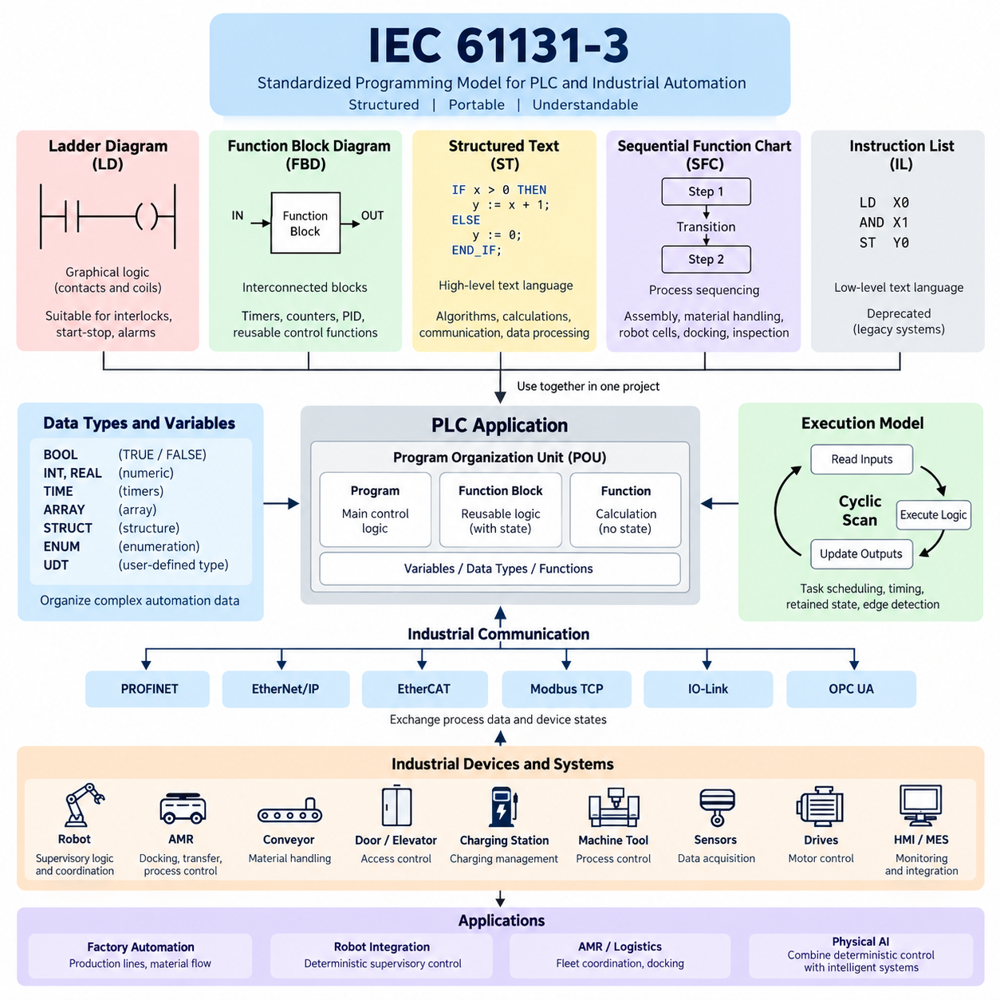
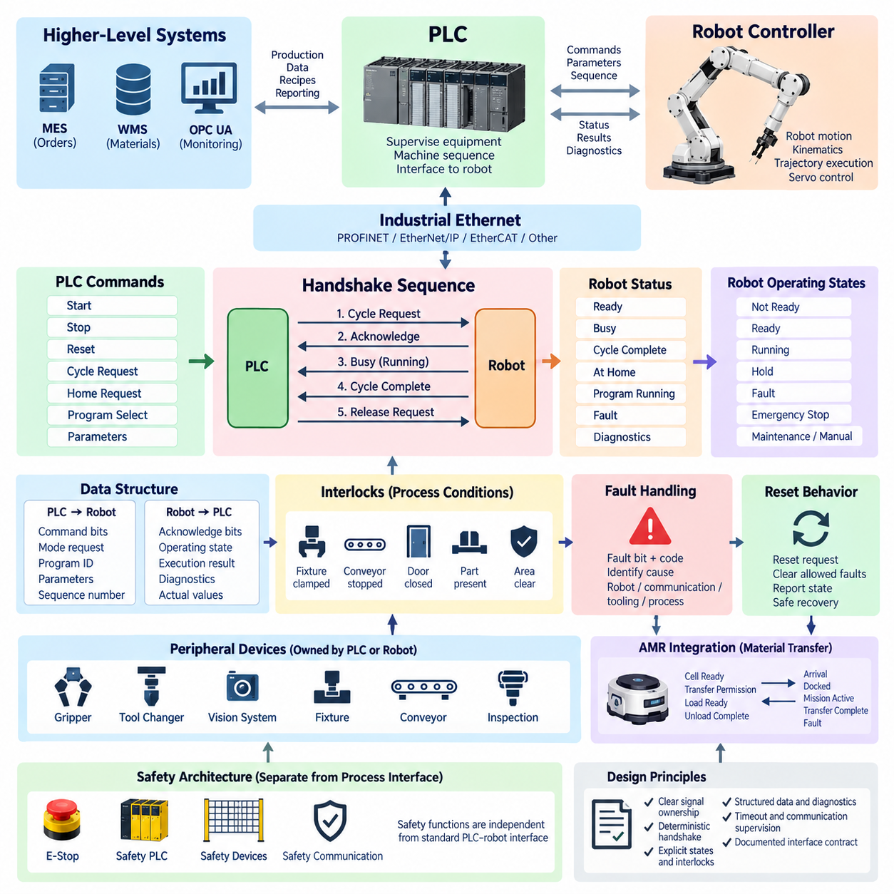
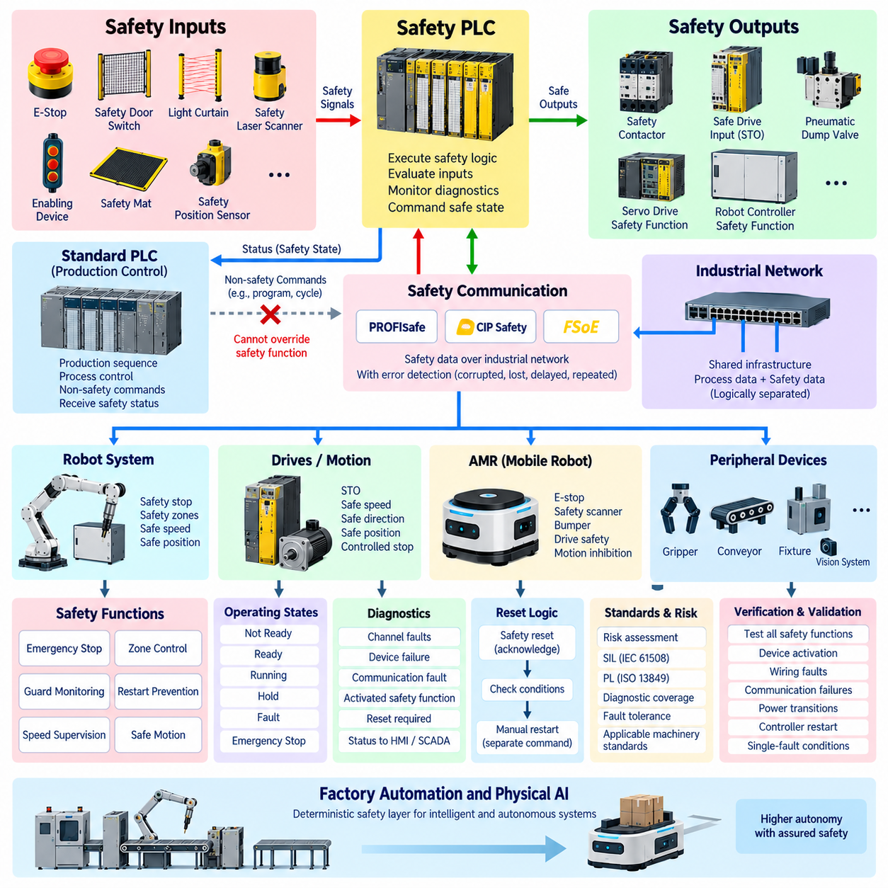
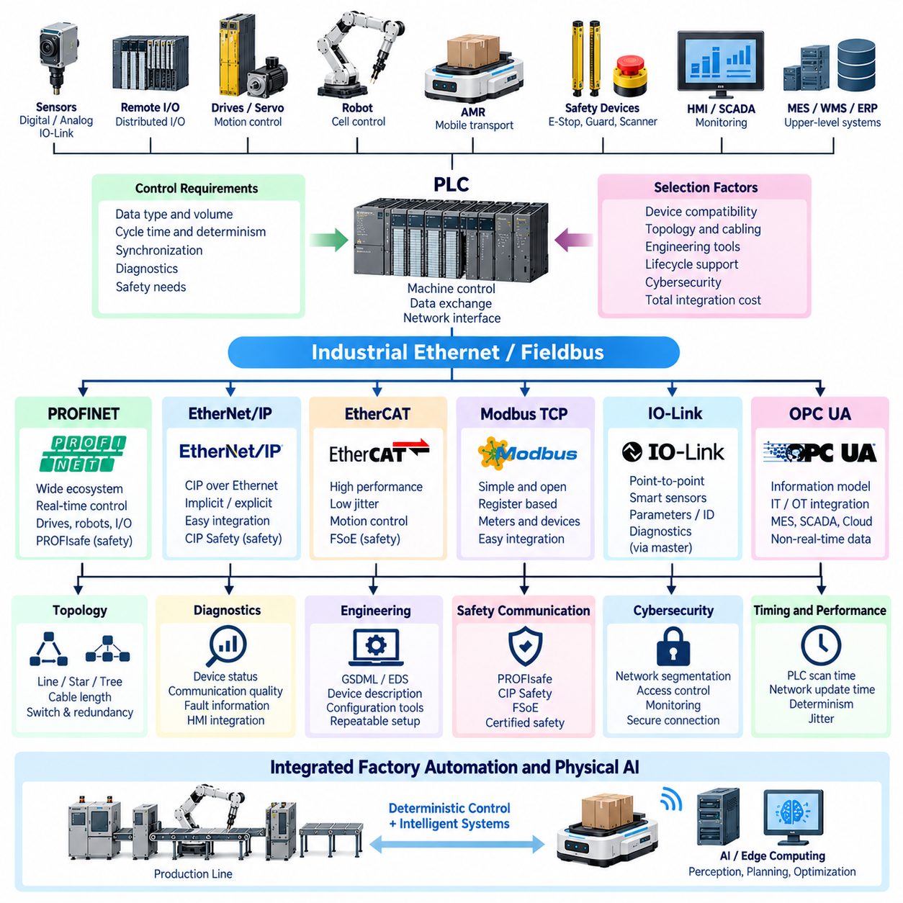
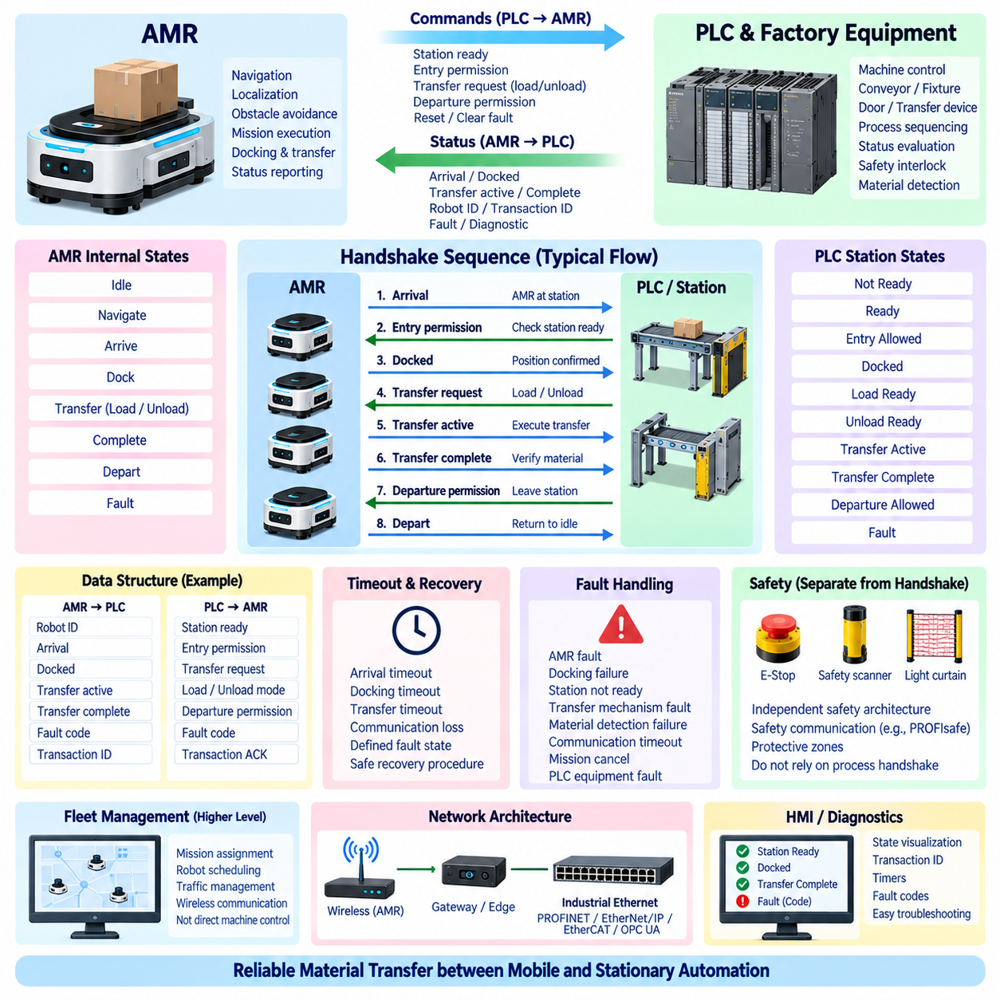

**Volume 07. Industrial Communication**


# Chapter 09. PLC Integration

##  

## 09.01. IEC 61131-3 Languages

{width="7.268055555555556in" height="7.268055555555556in"}

IEC 61131-3 defines a standardized programming model for programmable logic controllers and related industrial automation systems. Its purpose is to make control software more structured, portable, and understandable across different PLC platforms. Rather than prescribing one programming notation, the standard establishes several complementary languages that allow engineers to express logic according to the nature of the control problem.

The IEC 61131-3 language model is particularly important in PLC integration because industrial control applications combine discrete logic, sequencing, numerical processing, timing, state management, and equipment coordination. A single representation is rarely ideal for every task. The standard therefore provides graphical and textual approaches that can coexist within the same automation project while following common concepts for variables, data types, functions, and program organization.

Ladder Diagram, commonly abbreviated as LD, represents control logic through graphical networks resembling traditional electrical relay circuits. Contacts describe logical conditions and coils typically represent resulting states or outputs. Because signals are evaluated through visually connected paths, technicians familiar with electrical schematics can understand machine interlocks, start-stop circuits, sensor conditions, alarms, and actuator commands without interpreting conventional software syntax.

Function Block Diagram, or FBD, represents control functions as interconnected blocks through which signals and data flow. Each block performs a defined operation, while connections describe relationships between inputs and outputs. FBD is well suited to applications containing reusable control functions such as timers, counters, PID controllers, signal conditioning, motor functions, valve control, analog processing, and equipment modules that naturally form interconnected functional networks.

Structured Text, abbreviated ST, is a high-level textual language designed for control algorithms that become cumbersome when represented graphically. Its syntax supports expressions, assignments, conditional statements, loops, function calls, and structured data processing. ST is therefore effective for mathematical calculations, coordinate transformations, state evaluation, communication processing, parameter management, array operations, and other algorithm-oriented functions used in increasingly software-intensive automation systems.

Sequential Function Chart, or SFC, provides a structured representation of processes that progress through identifiable operating stages. A sequence is organized around steps, transitions, and associated actions, allowing engineers to describe when a machine enters a state and what condition permits movement to the next state. This approach is useful for assembly sequences, material handling, robot cells, charging operations, docking procedures, inspection cycles, and coordinated production processes.

IEC 61131-3 has historically also included Instruction List, or IL, as a low-level textual programming language resembling assembly-style instructions. IL was useful on earlier PLC systems with limited computational resources, but modern automation engineering generally favors more structured representations. Consequently, IL has been deprecated in newer editions of the standard, while LD, FBD, ST, and SFC form the practically important language set for contemporary PLC development.

These languages should not be regarded as competing alternatives that require an entire project to use only one representation. A PLC application can use LD for straightforward interlocks, FBD for reusable control blocks, ST for complex algorithms, and SFC for machine sequencing. This mixed-language approach allows each control problem to be represented in the form that most clearly expresses its behavior while maintaining an integrated PLC application architecture.

A central concept supporting this integration is the Program Organization Unit, commonly called a POU. Programs, function blocks, and functions provide different forms of reusable software organization. Functions generally calculate outputs from supplied inputs, while function blocks can preserve internal state between executions. Programs coordinate larger application behavior. These constructs encourage engineers to separate hardware handling, reusable device logic, sequence control, communication, and supervisory functions.

IEC 61131-3 also standardizes fundamental software concepts such as variables and data types. Boolean values represent logical states, integer and real types support numerical processing, and time-related types support timers and sequence management. Arrays, structures, enumerations, and user-defined types can organize increasingly complex automation data. Stronger data organization becomes particularly valuable when PLC applications exchange structured information with robots, drives, sensors, HMIs, gateways, and manufacturing systems.

PLC execution is generally cyclic. Inputs are acquired, application logic is executed according to configured tasks, and resulting outputs are updated. IEC 61131-3 programming must therefore be understood together with scan-cycle behavior and task scheduling. Logic that appears sequential in source representation operates within this repetitive execution model, making execution order, timing, retained state, edge detection, and deterministic response important considerations in real industrial control applications.

Timers and counters illustrate how the standardized language model connects software abstraction with physical automation behavior. On-delay and off-delay timers can represent temporal requirements, while counters track repeated events such as produced parts or completed cycles. These elements can be used directly in graphical languages or incorporated into more complex software structures, enabling engineers to represent both logical conditions and time-dependent behavior within a consistent PLC environment.

In robot integration, IEC 61131-3 languages frequently implement the deterministic supervisory logic surrounding robot controllers rather than replacing the robot\'s own motion-control software. PLC logic may validate safety-related prerequisites, request robot operations, monitor busy and completion states, supervise fixtures, control conveyors, and coordinate upstream or downstream equipment. The robot controller can then concentrate on trajectory generation, kinematics, servo control, and manufacturer-specific motion functions.

This division becomes especially useful in AMR and factory automation systems. A PLC may coordinate doors, conveyors, elevators, charging stations, machine tools, or material-transfer equipment, while an AMR controller performs localization, planning, navigation, and obstacle avoidance. Communication interfaces connect these domains, but IEC 61131-3 logic provides deterministic machine-side conditions such as permission to enter, transfer readiness, docking confirmation, process completion, and fault recovery.

Industrial communication therefore interacts closely with PLC programming. PROFINET, EtherNet/IP, EtherCAT, Modbus TCP, IO-Link, and OPC UA may deliver process variables and device states to the PLC application, but the communication protocol itself does not define the machine\'s operational logic. IEC 61131-3 programs interpret those values, apply control conditions, generate commands, and coordinate equipment behavior, forming the software layer between networked industrial devices and the required automation sequence.

Effective IEC 61131-3 engineering requires more than knowing individual language syntax. Engineers must define clear variable naming, interface boundaries, state ownership, fault behavior, initialization, timeout handling, and recovery mechanisms. Reusable function blocks should encapsulate device behavior, while higher-level sequences should avoid unnecessary dependence on low-level hardware details. Such separation improves testing, commissioning, maintenance, and migration when equipment or network interfaces change.

For Physical AI and advanced robotics, IEC 61131-3 remains relevant because intelligent systems still interact with deterministic industrial infrastructure. AI may perform perception, prediction, planning, or adaptive decision-making, while PLC software enforces explicit operational conditions and coordinates conventional automation equipment. The resulting architecture combines probabilistic intelligence with deterministic control, allowing advanced robots to participate safely and predictably in established factory processes and industrial communication environments.

IEC 61131-3은 프로그래머블 로직 컨트롤러(Programmable Logic Controller, PLC)와 관련 산업 자동화 시스템을 위한 표준화된 프로그래밍 모델(Programming Model)을 정의합니다. 이 표준의 목적은 서로 다른 PLC 플랫폼에서도 제어 소프트웨어(Control Software)를 보다 구조적이고 이식 가능하며 이해하기 쉽게 만드는 것입니다. 하나의 프로그래밍 표기법만 규정하는 대신, 제어 문제의 특성에 따라 엔지니어가 로직(Logic)을 표현할 수 있도록 여러 상호 보완적인 언어를 제공합니다.

IEC 61131-3 언어 모델(Language Model)은 산업 제어 애플리케이션(Industrial Control Application)이 이산 로직(Discrete Logic), 시퀀싱(Sequencing), 수치 처리(Numerical Processing), 타이밍(Timing), 상태 관리(State Management), 장비 조정(Equipment Coordination)을 함께 다루기 때문에 PLC 통합에서 특히 중요합니다. 모든 작업에 하나의 표현 방식이 적합한 것은 아니므로, 공통적인 변수, 데이터 타입, 함수 및 프로그램 구성 개념을 따르면서 동일한 자동화 프로젝트에서 함께 사용할 수 있는 그래픽 및 텍스트 기반 접근법을 제공합니다.

래더 다이어그램(Ladder Diagram, LD)은 전통적인 전기 릴레이 회로(Electrical Relay Circuit)와 유사한 그래픽 네트워크를 통해 제어 로직을 표현합니다. 접점(Contact)은 논리 조건을 나타내며 코일(Coil)은 일반적으로 그에 따른 상태 또는 출력을 나타냅니다. 신호가 시각적으로 연결된 경로를 따라 평가되기 때문에 전기 회로도에 익숙한 기술자는 일반적인 소프트웨어 문법을 해석하지 않고도 기계 인터록(Interlock), 시작·정지 회로, 센서 조건, 경보 및 액추에이터 명령을 이해할 수 있습니다.

펑션 블록 다이어그램(Function Block Diagram, FBD)은 신호와 데이터가 흐르는 상호 연결된 블록을 이용하여 제어 기능을 표현합니다. 각각의 블록은 정의된 연산을 수행하고 연결선은 입력과 출력 사이의 관계를 나타냅니다. FBD는 타이머(Timer), 카운터(Counter), PID 제어기(PID Controller), 신호 조정(Signal Conditioning), 모터 기능, 밸브 제어, 아날로그 처리 및 장비 모듈과 같이 상호 연결된 기능 네트워크 형태로 자연스럽게 구성되는 재사용 가능한 제어 기능에 적합합니다.

구조적 텍스트(Structured Text, ST)는 그래픽 방식으로 표현할 경우 복잡해지는 제어 알고리즘(Control Algorithm)을 위해 설계된 고수준 텍스트 언어입니다. 표현식, 대입문, 조건문, 반복문, 함수 호출 및 구조화된 데이터 처리를 지원합니다. 따라서 ST는 수학 계산, 좌표 변환(Coordinate Transformation), 상태 평가, 통신 처리, 파라미터 관리, 배열 연산 및 소프트웨어 중심으로 발전하는 자동화 시스템에서 요구되는 다양한 알고리즘 기반 기능에 효과적입니다.

순차 기능 차트(Sequential Function Chart, SFC)는 식별 가능한 운전 단계들을 따라 진행되는 프로세스를 구조적으로 표현합니다. 시퀀스(Sequence)는 스텝(Step), 전이(Transition), 관련 동작(Action)을 중심으로 구성되어 기계가 특정 상태에 진입하는 시점과 다음 상태로 이동하기 위한 조건을 표현할 수 있습니다. 이러한 방식은 조립 시퀀스, 자재 취급, 로봇 셀(Robot Cell), 충전 작업, 도킹 절차, 검사 사이클 및 조정된 생산 공정에 유용합니다.

IEC 61131-3은 역사적으로 어셈블리 스타일(Assembly-Style)의 명령과 유사한 저수준 텍스트 프로그래밍 언어인 명령어 리스트(Instruction List, IL)도 포함했습니다. IL은 계산 자원이 제한된 초기 PLC 시스템에서 유용했지만 현대 자동화 엔지니어링에서는 보다 구조화된 표현 방식을 선호합니다. 이에 따라 새로운 버전의 표준에서는 IL이 폐기 예정(Deprecated)으로 분류되었으며, LD, FBD, ST 및 SFC가 현대 PLC 개발에서 실질적으로 중요한 언어 체계를 구성합니다.

이러한 언어들은 하나의 프로젝트 전체에서 오직 한 가지 표현 방식만 선택해야 하는 경쟁 관계의 대안으로 이해해서는 안 됩니다. 하나의 PLC 애플리케이션에서 단순한 인터록에는 LD, 재사용 가능한 제어 블록에는 FBD, 복잡한 알고리즘에는 ST, 기계 시퀀싱에는 SFC를 사용할 수 있습니다. 이러한 혼합 언어 접근법(Mixed-Language Approach)은 통합된 PLC 애플리케이션 아키텍처를 유지하면서 각각의 제어 문제를 가장 명확하게 표현할 수 있게 합니다.

이러한 통합을 지원하는 핵심 개념은 프로그램 구성 단위(Program Organization Unit, POU)입니다. 프로그램(Program), 펑션 블록(Function Block), 함수(Function)는 서로 다른 형태의 재사용 가능한 소프트웨어 구조를 제공합니다. 함수는 일반적으로 주어진 입력으로부터 출력을 계산하며, 펑션 블록은 실행 사이에 내부 상태를 유지할 수 있습니다. 프로그램은 보다 큰 규모의 애플리케이션 동작을 조정하며, 이러한 구조를 통해 하드웨어 처리, 재사용 가능한 장치 로직, 시퀀스 제어, 통신 및 감독 기능을 분리할 수 있습니다.

IEC 61131-3은 변수(Variable)와 데이터 타입(Data Type)과 같은 기본적인 소프트웨어 개념도 표준화합니다. 불리언(Boolean) 값은 논리 상태를 표현하고 정수 및 실수 타입은 수치 처리를 지원하며 시간 관련 타입은 타이머와 시퀀스 관리에 사용됩니다. 배열(Array), 구조체(Structure), 열거형(Enumeration), 사용자 정의 타입(User-Defined Type)을 이용하면 복잡한 자동화 데이터를 체계적으로 구성할 수 있으며, 이는 PLC가 로봇, 드라이브, 센서, HMI, 게이트웨이 및 제조 시스템과 구조화된 정보를 교환할 때 특히 중요합니다.

PLC 실행은 일반적으로 주기적(Cyclic)으로 이루어집니다. 입력을 획득하고 설정된 태스크(Task)에 따라 애플리케이션 로직을 실행한 후 결과 출력을 갱신합니다. 따라서 IEC 61131-3 프로그래밍은 스캔 사이클(Scan Cycle) 동작 및 태스크 스케줄링(Task Scheduling)과 함께 이해해야 합니다. 소스 코드에서 순차적으로 보이는 로직도 반복 실행 모델 안에서 동작하므로 실행 순서, 타이밍, 유지 상태(Retained State), 에지 검출(Edge Detection), 결정론적 응답(Deterministic Response)이 실제 산업 제어에서 중요한 요소가 됩니다.

타이머(Timer)와 카운터(Counter)는 표준화된 언어 모델이 소프트웨어 추상화와 실제 자동화 동작을 어떻게 연결하는지를 보여주는 대표적인 사례입니다. 온 딜레이 타이머(On-Delay Timer)와 오프 딜레이 타이머(Off-Delay Timer)는 시간적 요구사항을 표현하고 카운터는 생산된 부품이나 완료된 사이클과 같은 반복 이벤트를 추적합니다. 이러한 요소는 그래픽 언어에서 직접 사용하거나 복잡한 소프트웨어 구조에 포함할 수 있어 논리 조건과 시간 의존적 동작을 일관된 PLC 환경에서 표현할 수 있습니다.

로봇 통합(Robot Integration)에서 IEC 61131-3 언어는 일반적으로 로봇 자체의 모션 제어 소프트웨어(Motion-Control Software)를 대체하기보다 로봇 컨트롤러 주변의 결정론적 감독 로직(Deterministic Supervisory Logic)을 구현합니다. PLC 로직은 안전 관련 전제조건을 확인하고, 로봇 작업을 요청하며, 동작 중 및 완료 상태를 감시하고, 지그와 컨베이어를 관리하며, 상류 및 하류 장비를 조정할 수 있습니다. 로봇 컨트롤러는 궤적 생성, 운동학, 서보 제어 및 제조사별 모션 기능에 집중할 수 있습니다.

이러한 역할 분담은 자율이동로봇(Autonomous Mobile Robot, AMR)과 공장 자동화(Factory Automation) 시스템에서 특히 유용합니다. PLC는 도어, 컨베이어, 엘리베이터, 충전 스테이션, 공작기계 또는 자재 이송 장비를 조정하고, AMR 컨트롤러는 위치 추정(Localization), 경로 계획(Planning), 내비게이션(Navigation), 장애물 회피를 수행할 수 있습니다. 통신 인터페이스가 두 영역을 연결하고 IEC 61131-3 로직은 진입 허가, 이송 준비, 도킹 확인, 공정 완료 및 고장 복구와 같은 결정론적인 기계 측 조건을 제공합니다.

따라서 산업 통신(Industrial Communication)은 PLC 프로그래밍과 밀접하게 상호작용합니다. 프로피넷(PROFINET), 이더넷/IP(EtherNet/IP), 이더캣(EtherCAT), 모드버스 TCP(Modbus TCP), IO-Link 및 OPC UA는 공정 변수와 장치 상태를 PLC 애플리케이션에 전달할 수 있지만 통신 프로토콜 자체가 기계의 운전 로직을 정의하지는 않습니다. IEC 61131-3 프로그램은 이러한 값을 해석하고 제어 조건을 적용하며 명령을 생성하고 장비 동작을 조정함으로써 네트워크 기반 산업 장치와 요구되는 자동화 시퀀스 사이의 소프트웨어 계층을 형성합니다.

효과적인 IEC 61131-3 엔지니어링에는 개별 언어의 문법을 이해하는 것 이상의 능력이 필요합니다. 엔지니어는 명확한 변수 명명 규칙, 인터페이스 경계, 상태 소유권(State Ownership), 고장 동작, 초기화, 타임아웃 처리 및 복구 메커니즘을 정의해야 합니다. 재사용 가능한 펑션 블록은 장치 동작을 캡슐화하고 상위 수준 시퀀스는 저수준 하드웨어 세부사항에 불필요하게 의존하지 않아야 하며, 이러한 분리는 시험, 시운전, 유지보수 및 장비나 네트워크 인터페이스 변경 시의 마이그레이션(Migration)을 용이하게 합니다.

피지컬 AI(Physical AI)와 첨단 로보틱스(Advanced Robotics)에서도 IEC 61131-3은 중요한 의미를 갖습니다. 지능형 시스템 역시 결정론적인 산업 인프라(Deterministic Industrial Infrastructure)와 상호작용해야 하기 때문입니다. AI는 인지(Perception), 예측(Prediction), 계획(Planning), 적응형 의사결정(Adaptive Decision-Making)을 수행할 수 있으며, PLC 소프트웨어는 명시적인 운전 조건을 적용하고 기존 자동화 장비를 조정합니다. 이러한 아키텍처는 확률적 지능(Probabilistic Intelligence)과 결정론적 제어(Deterministic Control)를 결합하여 첨단 로봇이 기존 공장 공정과 산업 통신 환경에 안전하고 예측 가능한 방식으로 참여할 수 있도록 합니다.

##  

## 09.02. PLC Robot Interface Design

{width="7.268055555555556in" height="7.268055555555556in"}

A PLC--robot interface defines the structured communication boundary between a programmable logic controller and an industrial robot controller. The PLC normally supervises production equipment and coordinates machine-level sequences, while the robot controller manages robot-specific motion, kinematics, trajectory execution, and servo functions. A well-designed interface separates these responsibilities while providing deterministic commands, status information, and fault handling.

The interface should be designed around explicit ownership of each signal. Commands such as Start, Stop, Reset, Cycle Request, Home Request, or Program Select are normally generated by the PLC, while signals such as Ready, Busy, Cycle Complete, At Home, Fault, or Program Running originate from the robot controller. Clearly defining the producer and consumer of every signal prevents conflicting commands and simplifies commissioning and diagnostics.

A basic robot handshake uses command and acknowledgement signals rather than relying on a single transient trigger. For example, the PLC asserts a Cycle Request only after confirming that the robot is ready and all external conditions are satisfied. The robot acknowledges the request, begins execution, reports Busy, and eventually indicates Cycle Complete. The PLC then removes the request and waits for the interface to return to its defined idle condition before starting another cycle.

Handshake design should account for timing differences between PLC scan cycles, industrial networks, and robot controller execution. A short pulse may disappear before the receiving controller detects it, particularly when communication updates are slower than local control cycles. Level-based request and acknowledgement signals are therefore often preferable. Signals remain asserted until the corresponding state transition is confirmed, producing communication that is easier to verify and more tolerant of timing variations.

Robot operating states should be represented independently from individual commands. Typical states include Not Ready, Ready, Running, Hold, Fault, Emergency Stop, and Maintenance or Manual operation. The PLC can use these states to determine whether a requested operation is permissible. Separating state information from command signals also makes supervisory logic clearer because the PLC evaluates the current robot condition before issuing the next operation request.

Program selection is another important part of the PLC--robot interface. Instead of creating a dedicated Boolean signal for every robot routine, an integer or structured command value can identify the required operation. The PLC writes the requested program or job identifier, verifies that the robot has accepted the value, and then initiates execution. This approach scales more effectively when one robot performs many manufacturing, handling, inspection, or tool-related operations.

Interlocks ensure that robot motion occurs only when required machine conditions are satisfied. A robot may need confirmation that a fixture is clamped, a conveyor is stopped, a door is in the required condition, a part is present, or another machine has cleared a shared workspace. These conditions should be explicitly defined at the interface boundary so that responsibility for permitting an operation is not ambiguously distributed between the PLC and robot program.

Normal control interlocks must be distinguished from safety functions. Production logic may request that a robot stop or remain outside a work area, but safety-related functions require an appropriate safety architecture using safety PLCs, safety-rated robot functions, certified devices, and safety communication where applicable. The standard PLC--robot process interface should therefore coordinate operation without being treated as a substitute for the independent safety control system.

Fault handling requires more information than a single general Fault bit. A general fault indication is useful for immediate sequence control, but diagnostic information should identify the fault category or code whenever possible. The PLC or supervisory system can then distinguish robot faults, communication faults, tooling problems, process failures, and external interlock conditions. Structured diagnostic information significantly reduces troubleshooting time during production and commissioning.

Reset behavior must also be explicitly designed. A PLC Reset Request should not automatically cause uncontrolled motion or restart an interrupted robot sequence. The robot controller should clear only conditions that are permitted to be remotely reset and then report its resulting state. After recovery, the PLC should reevaluate machine conditions and determine whether the process should restart, resume from a defined recovery point, or require operator intervention.

Industrial Ethernet networks commonly transport PLC--robot interface data. PROFINET, EtherNet/IP, EtherCAT, or other supported fieldbus technologies can exchange cyclic command and status data with predictable update behavior. The protocol provides communication transport, while the actual meaning of Start, Ready, Busy, Complete, Fault, program numbers, and diagnostic values must still be defined as part of the application-level interface between the PLC and robot.

Interface data should be organized into logical command and status structures rather than scattered across unrelated network addresses. A PLC-to-robot structure can contain command bits, mode requests, program identifiers, parameters, and sequence numbers, while a robot-to-PLC structure contains acknowledgement bits, operating states, execution results, diagnostics, and actual values. Consistent structures improve readability and make interfaces easier to reuse across multiple robot cells.

Sequence numbers can strengthen interfaces when repeated commands or communication interruptions must be handled reliably. The PLC associates a transaction identifier with a command, and the robot returns the corresponding identifier with its acknowledgement or result. This allows both controllers to distinguish a new request from stale data remaining after a restart or network interruption and becomes especially valuable in complex automated production and inspection systems.

Communication supervision should detect loss of cyclic data or failure to receive an expected response within a defined time. Watchdogs, connection status, and application-level timeouts allow the PLC to distinguish a slowly executing robot operation from an actual interface failure. Timeout values should reflect realistic robot and process behavior rather than being arbitrarily short, and recovery behavior should be explicitly defined for each communication failure condition.

The PLC--robot interface becomes more complex when peripheral devices are involved. Grippers, tool changers, vision systems, fixtures, conveyors, and inspection equipment may be controlled by either the PLC or robot controller. Ownership should be selected according to system architecture and timing requirements. Regardless of ownership, the opposite controller should receive sufficient status information to coordinate the overall sequence without duplicating low-level device control.

For an AMR connected to a robot cell, the same interface principles can be extended to mobile material transfer. The PLC may report Cell Ready, Transfer Permission, Load Ready, or Unload Complete, while the AMR or fleet system provides Arrival, Docked, Mission Active, Transfer Complete, and Fault states. The interface should isolate navigation and fleet-management logic from deterministic machine sequencing while maintaining an explicit handshake at the physical transfer boundary.

Higher-level systems such as MES, WMS, or OPC UA applications may provide production orders, material identities, recipes, and reporting requirements, but they should not unnecessarily replace the deterministic PLC--robot handshake. The PLC can translate higher-level production intentions into controlled machine operations, while the robot executes defined tasks. This layered architecture separates enterprise information exchange, machine coordination, and robot motion into clearly managed functional domains.

A robust PLC--robot interface should ultimately be treated as a formal software and communication contract. Signal names, ownership, data types, valid states, transition conditions, timeouts, initialization behavior, fault responses, and recovery procedures should be documented before commissioning. When these rules are consistent across robot cells, integration becomes easier to test, reuse, diagnose, and extend to factory automation, AMR systems, and increasingly complex Physical AI environments.

PLC-로봇 인터페이스(PLC--Robot Interface)는 프로그래머블 로직 컨트롤러(Programmable Logic Controller, PLC)와 산업용 로봇 컨트롤러(Industrial Robot Controller) 사이의 구조화된 통신 경계를 정의합니다. PLC는 일반적으로 생산 장비를 감독하고 기계 수준의 시퀀스(Sequence)를 조정하며, 로봇 컨트롤러는 로봇 고유의 모션(Motion), 운동학(Kinematics), 궤적 실행(Trajectory Execution), 서보 기능(Servo Function)을 관리합니다. 잘 설계된 인터페이스는 이러한 책임을 분리하면서 결정론적인 명령, 상태 정보 및 고장 처리를 제공합니다.

인터페이스는 각 신호의 명확한 소유권(Signal Ownership)을 중심으로 설계해야 합니다. 시작(Start), 정지(Stop), 리셋(Reset), 사이클 요청(Cycle Request), 홈 요청(Home Request), 프로그램 선택(Program Select)과 같은 명령은 일반적으로 PLC에서 생성되며, 준비(Ready), 동작 중(Busy), 사이클 완료(Cycle Complete), 홈 위치(At Home), 고장(Fault), 프로그램 실행 중(Program Running)과 같은 신호는 로봇 컨트롤러에서 생성됩니다. 모든 신호의 생성자와 수신자를 명확히 정의하면 명령 충돌을 방지하고 시운전 및 진단을 단순화할 수 있습니다.

기본적인 로봇 핸드셰이크(Robot Handshake)는 하나의 순간적인 트리거(Trigger)에 의존하기보다 명령과 확인응답(Acknowledgement) 신호를 사용합니다. 예를 들어 PLC는 로봇이 준비 상태이고 모든 외부 조건이 충족되었음을 확인한 후 사이클 요청(Cycle Request)을 활성화합니다. 로봇은 요청을 확인하고 실행을 시작하며 동작 중(Busy)을 보고하고 최종적으로 사이클 완료(Cycle Complete)를 표시합니다. 이후 PLC는 요청을 해제하고 인터페이스가 정의된 유휴 상태(Idle Condition)로 복귀할 때까지 기다린 후 다음 사이클을 시작합니다.

핸드셰이크 설계(Handshake Design)는 PLC 스캔 사이클(Scan Cycle), 산업용 네트워크(Industrial Network), 로봇 컨트롤러 실행 주기 사이의 타이밍 차이를 고려해야 합니다. 특히 통신 갱신 속도가 로컬 제어 주기보다 느리면 짧은 펄스(Pulse)는 수신 컨트롤러가 감지하기 전에 사라질 수 있습니다. 따라서 레벨 기반 요청 및 확인응답(Level-Based Request and Acknowledgement) 신호가 선호되며, 해당 상태 전이가 확인될 때까지 신호를 유지하면 타이밍 변화에 강하고 검증하기 쉬운 통신을 구현할 수 있습니다.

로봇 운전 상태(Robot Operating State)는 개별 명령과 독립적으로 표현해야 합니다. 대표적인 상태에는 준비되지 않음(Not Ready), 준비(Ready), 실행 중(Running), 일시 정지(Hold), 고장(Fault), 비상 정지(Emergency Stop), 유지보수 또는 수동 운전(Maintenance or Manual Operation)이 포함됩니다. PLC는 이러한 상태를 이용하여 요청된 작업의 실행 가능 여부를 판단할 수 있습니다. 상태 정보와 명령 신호를 분리하면 PLC가 다음 작업을 요청하기 전에 현재 로봇 상태를 평가할 수 있어 감독 로직(Supervisory Logic)이 더욱 명확해집니다.

프로그램 선택(Program Selection) 역시 PLC-로봇 인터페이스의 중요한 부분입니다. 각각의 로봇 루틴(Robot Routine)에 별도의 불리언(Boolean) 신호를 생성하는 대신 정수(Integer) 또는 구조화된 명령 값(Structured Command Value)을 사용하여 필요한 작업을 식별할 수 있습니다. PLC는 요청 프로그램 또는 작업 식별자(Job Identifier)를 기록하고 로봇이 해당 값을 수락했는지 확인한 다음 실행을 시작합니다. 이러한 방식은 하나의 로봇이 다양한 제조, 핸들링, 검사 또는 툴 관련 작업을 수행하는 경우 효과적으로 확장할 수 있습니다.

인터록(Interlock)은 필요한 기계 조건이 충족된 경우에만 로봇이 움직이도록 보장합니다. 로봇은 지그(Fixture)가 클램핑되었는지, 컨베이어가 정지했는지, 도어가 요구된 상태인지, 부품이 존재하는지 또는 다른 기계가 공유 작업 공간(Shared Workspace)에서 벗어났는지를 확인해야 할 수 있습니다. 이러한 조건은 인터페이스 경계에서 명확하게 정의하여 작업 허가에 대한 책임이 PLC와 로봇 프로그램 사이에 모호하게 분산되지 않도록 해야 합니다.

일반 제어 인터록(Control Interlock)은 안전 기능(Safety Function)과 구분해야 합니다. 생산 로직은 로봇에 정지를 요청하거나 특정 작업 영역에 진입하지 않도록 요구할 수 있지만, 안전 관련 기능에는 안전 PLC(Safety PLC), 안전 등급 로봇 기능(Safety-Rated Robot Function), 인증된 장치 및 필요한 경우 안전 통신(Safety Communication)을 사용하는 적절한 안전 아키텍처가 필요합니다. 따라서 일반적인 PLC-로봇 프로세스 인터페이스는 운전을 조정하는 역할을 담당하며 독립적인 안전 제어 시스템을 대체하는 수단으로 취급해서는 안 됩니다.

고장 처리(Fault Handling)에는 하나의 일반적인 고장(Fault) 비트보다 더 많은 정보가 필요합니다. 일반 고장 표시는 즉각적인 시퀀스 제어에 유용하지만, 가능하면 진단 정보(Diagnostic Information)를 통해 고장 유형이나 코드를 식별할 수 있어야 합니다. PLC 또는 감독 시스템은 이를 통해 로봇 고장, 통신 고장, 툴링 문제, 공정 실패 및 외부 인터록 상태를 구분할 수 있습니다. 구조화된 진단 정보는 생산 및 시운전 과정에서 문제 해결 시간을 크게 줄여 줍니다.

리셋 동작(Reset Behavior) 역시 명확하게 설계해야 합니다. PLC의 리셋 요청(Reset Request)이 제어되지 않은 움직임이나 중단된 로봇 시퀀스의 자동 재시작으로 이어져서는 안 됩니다. 로봇 컨트롤러는 원격으로 리셋하도록 허용된 조건만 해제하고 그 결과 상태를 보고해야 합니다. 복구 이후 PLC는 기계 조건을 다시 평가하여 공정을 처음부터 재시작할 것인지, 정의된 복구 지점(Recovery Point)에서 재개할 것인지 또는 작업자의 개입이 필요한지를 판단해야 합니다.

산업용 이더넷 네트워크(Industrial Ethernet Network)는 일반적으로 PLC-로봇 인터페이스 데이터를 전송합니다. 프로피넷(PROFINET), 이더넷/IP(EtherNet/IP), 이더캣(EtherCAT) 또는 기타 지원되는 필드버스(Fieldbus) 기술은 예측 가능한 갱신 특성을 갖는 주기적 명령 및 상태 데이터를 교환할 수 있습니다. 프로토콜은 통신 전송 기능을 제공하지만 시작(Start), 준비(Ready), 동작 중(Busy), 완료(Complete), 고장(Fault), 프로그램 번호 및 진단 값의 실제 의미는 PLC와 로봇 사이의 애플리케이션 수준 인터페이스(Application-Level Interface)에서 별도로 정의해야 합니다.

인터페이스 데이터는 서로 관련 없는 네트워크 주소에 분산시키기보다 논리적인 명령 및 상태 구조(Command and Status Structure)로 구성해야 합니다. PLC에서 로봇으로 전달되는 구조에는 명령 비트(Command Bit), 모드 요청(Mode Request), 프로그램 식별자, 파라미터(Parameter), 시퀀스 번호(Sequence Number)를 포함할 수 있습니다. 반대로 로봇에서 PLC로 전달되는 구조에는 확인응답 비트, 운전 상태, 실행 결과, 진단 정보 및 실제 값(Actual Value)을 포함할 수 있습니다. 일관된 데이터 구조는 가독성을 높이고 여러 로봇 셀에서 인터페이스를 재사용하기 쉽게 만듭니다.

반복 명령이나 통신 중단을 안정적으로 처리해야 하는 경우 시퀀스 번호(Sequence Number)를 사용하여 인터페이스의 신뢰성을 높일 수 있습니다. PLC는 명령에 트랜잭션 식별자(Transaction Identifier)를 연결하고 로봇은 확인응답 또는 실행 결과와 함께 해당 식별자를 반환합니다. 이를 통해 두 컨트롤러는 재시작이나 네트워크 중단 이후 남아 있는 오래된 데이터(Stale Data)와 새로운 요청을 구분할 수 있으며, 이러한 방식은 복잡한 자동 생산 및 검사 시스템에서 특히 유용합니다.

통신 감시(Communication Supervision)는 주기적 데이터의 손실이나 정의된 시간 안에 예상 응답을 받지 못하는 상황을 감지해야 합니다. 워치독(Watchdog), 연결 상태(Connection Status), 애플리케이션 수준 타임아웃(Application-Level Timeout)을 사용하면 PLC가 단순히 실행 시간이 긴 로봇 작업과 실제 인터페이스 고장을 구분할 수 있습니다. 타임아웃 값은 임의로 짧게 설정하기보다 실제 로봇과 공정의 동작 특성을 반영해야 하며 각 통신 고장 조건에 대한 복구 동작도 명확히 정의해야 합니다.

주변 장치(Peripheral Device)가 포함되면 PLC-로봇 인터페이스는 더욱 복잡해집니다. 그리퍼(Gripper), 툴 체인저(Tool Changer), 비전 시스템(Vision System), 지그(Fixture), 컨베이어 및 검사 장비는 PLC 또는 로봇 컨트롤러 중 하나에서 제어할 수 있습니다. 제어 소유권은 시스템 아키텍처와 타이밍 요구사항에 따라 결정해야 합니다. 어느 컨트롤러가 소유하든 상대 컨트롤러에는 저수준 장치 제어를 중복하지 않으면서 전체 시퀀스를 조정할 수 있는 충분한 상태 정보를 제공해야 합니다.

로봇 셀에 자율이동로봇(Autonomous Mobile Robot, AMR)이 연결되는 경우 동일한 인터페이스 원칙을 이동식 자재 이송(Mobile Material Transfer)으로 확장할 수 있습니다. PLC는 셀 준비(Cell Ready), 이송 허가(Transfer Permission), 적재 준비(Load Ready), 하역 완료(Unload Complete)를 제공하고, AMR 또는 플릿 시스템(Fleet System)은 도착(Arrival), 도킹 완료(Docked), 미션 실행 중(Mission Active), 이송 완료(Transfer Complete), 고장(Fault) 상태를 제공할 수 있습니다. 인터페이스는 내비게이션 및 플릿 관리 로직과 결정론적인 기계 시퀀스를 분리하면서 실제 자재 이송 경계에서는 명확한 핸드셰이크를 유지해야 합니다.

제조 실행 시스템(Manufacturing Execution System, MES), 창고 관리 시스템(Warehouse Management System, WMS), OPC UA 애플리케이션과 같은 상위 시스템은 생산 지시, 자재 식별 정보, 레시피(Recipe), 보고 요구사항을 제공할 수 있지만 결정론적인 PLC-로봇 핸드셰이크를 불필요하게 대체해서는 안 됩니다. PLC는 상위 수준의 생산 의도(Production Intention)를 제어된 기계 동작으로 변환하고 로봇은 정의된 작업을 실행할 수 있습니다. 이러한 계층형 아키텍처(Layered Architecture)는 기업 정보 교환, 기계 조정 및 로봇 모션을 명확하게 관리되는 기능 영역으로 분리합니다.

견고한 PLC-로봇 인터페이스는 궁극적으로 공식적인 소프트웨어 및 통신 계약(Software and Communication Contract)으로 취급해야 합니다. 신호 이름, 소유권, 데이터 타입, 유효 상태, 상태 전이 조건, 타임아웃, 초기화 동작, 고장 대응 및 복구 절차를 시운전 전에 문서화해야 합니다. 이러한 규칙이 여러 로봇 셀에 걸쳐 일관되게 적용되면 통합 시스템을 더욱 쉽게 시험하고 재사용하며 진단할 수 있고, 공장 자동화, AMR 시스템 및 점차 복잡해지는 피지컬 AI(Physical AI) 환경으로 효과적으로 확장할 수 있습니다.

##  

## 09.03. Safety PLC Integration

{width="7.268055555555556in" height="7.268055555555556in"}

Safety PLC integration establishes a dedicated control layer for safety-related functions within industrial automation and robotic systems. Unlike a standard PLC that primarily manages production sequences, a safety PLC executes certified safety logic intended to reduce risk when hazardous conditions occur. It evaluates safety devices, determines whether operation remains permissible, and commands equipment toward a defined safe state when required.

A safety PLC should be understood as part of the overall safety architecture rather than simply as a more reliable conventional PLC. Its hardware, firmware, engineering environment, communication mechanisms, and diagnostic functions are designed according to functional safety principles. The required architecture depends on the risk assessment and applicable machinery standards, including considerations such as Safety Integrity Level, Performance Level, diagnostic coverage, and fault tolerance.

Safety inputs originate from devices that detect hazardous conditions or confirm safety-related operating states. Typical examples include emergency-stop switches, guard-door interlocks, light curtains, safety laser scanners, enabling devices, pressure-sensitive equipment, and safety-rated position sensors. The safety PLC continuously evaluates these signals and executes predefined logic to determine whether motion, power, or another potentially hazardous function may continue.

Safety outputs connect the evaluated safety logic to mechanisms capable of establishing the required safe state. These may include safety contactors, safe drive inputs, motor power isolation devices, pneumatic dump valves, or safety functions integrated into servo drives and robot controllers. The required response is application dependent because a safe state may involve removing torque, performing a controlled stop, limiting motion, or preventing unexpected restart.

Redundancy and diagnostics are fundamental characteristics of safety PLC architectures. Safety input channels may use dual-channel wiring so that open circuits, short circuits, contact faults, or discrepancies between channels can be detected. The safety controller performs internal self-tests and monitors connected devices for abnormal behavior. Safety integrity therefore depends not only on redundant hardware but also on the ability to detect dangerous faults before they compromise the safety function.

Emergency-stop integration illustrates the difference between process control and safety control. A normal PLC may monitor an emergency-stop status for diagnostics or production sequencing, but the actual safety function should be executed through the safety-rated control path. When an emergency stop is activated, the safety PLC evaluates the input and commands the predefined safe response independently of whether the normal production PLC or supervisory software continues operating correctly.

Guarding systems use similar principles. A safety door switch can indicate whether access to a hazardous robot or machine area is permitted. Opening the guard may initiate a safety stop, while closing it does not necessarily authorize automatic restart. The safety PLC must evaluate additional conditions such as reset requests, machine state, and absence of other safety demands before allowing hazardous operation to become enabled again.

Reset logic requires particular attention because resetting a safety function and restarting a machine are different operations. A safety reset acknowledges that the conditions required to restore the safety function have been satisfied, but it should not automatically initiate hazardous movement. Production restart should occur through a separate operational command after the normal PLC and machine controllers have confirmed that the process is ready to continue.

Modern drives and robot controllers provide integrated safety functions that can be commanded through safety PLCs. Safe Torque Off prevents torque-producing energy from being applied to a motor, while other functions can support controlled stopping, safely limited speed, safe direction, or safe position monitoring depending on the equipment. Using these functions can reduce reliance on complete power removal while supporting more flexible machine and collaborative robot operation.

Safety communication extends the safety architecture across industrial networks. Technologies such as PROFIsafe, CIP Safety, and FSoE allow safety-related data to be transported over communication systems that may also carry ordinary process data. The safety protocol adds mechanisms for detecting communication errors such as corrupted, repeated, delayed, lost, or incorrectly addressed messages, allowing distributed safety devices and controllers to participate in a coordinated safety system.

The use of a shared physical network does not mean that ordinary communication automatically becomes safety rated. Safety integrity is established by the safety protocol, certified devices, validated configuration, and complete safety function rather than by Ethernet or a fieldbus alone. Standard process data and safety data can therefore coexist on the same infrastructure while remaining logically separated according to their different integrity requirements.

Integration between a standard PLC and a safety PLC requires a clearly defined boundary. The safety PLC determines safety permission and safety-related states, while the standard PLC manages production sequencing and normal equipment coordination. Safety status may be provided to the standard PLC so that production logic can react appropriately, but ordinary PLC commands should not be capable of bypassing or overriding an active safety demand.

Robot integration commonly requires coordination between the safety PLC and safety functions embedded in the robot controller. Emergency stops, protective stops, guard conditions, enabling devices, and safety zones can be exchanged through hardwired safety interfaces or certified safety communication. The robot controller then performs the corresponding safety-rated motion response while the standard PLC handles non-safety commands such as program selection, cycle requests, and production handshakes.

Safety laser scanners are particularly important for mobile robots and flexible manufacturing cells. They can define protective fields around hazardous equipment and generate safety outputs when a person or obstacle enters a monitored region. A safety PLC may combine scanner states with machine operating modes, speed conditions, or zone information to determine the required response, provided that the complete implementation satisfies the intended safety function and validation requirements.

AMR integration introduces additional challenges because the hazardous system itself can move through the environment. Safety functions may involve emergency stops, safety scanners, bumper devices, drive safety functions, and independent motion inhibition. The normal AMR controller may perform localization, navigation, and obstacle avoidance, while the safety control layer provides independently implemented protective functions intended to bring the vehicle to a safe condition when required.

Safety zones can also be coordinated between stationary automation and mobile robots. For example, an AMR approaching a robot cell may exchange ordinary docking and transfer information through the process-control interface, while entry into hazardous areas is governed by separate safety conditions. This separation prevents mission planning, fleet communication, or ordinary PLC handshake logic from becoming an unintended substitute for safety-rated access control.

Diagnostics remain essential because a safety system must detect faults without making troubleshooting unnecessarily difficult. The safety PLC can provide diagnostic states identifying channel discrepancies, device failures, communication faults, activated safety functions, or reset requirements. These diagnostic values may be forwarded to an HMI or supervisory system for maintenance purposes while ensuring that diagnostic communication cannot modify the safety decision itself.

Safety PLC software should be structured so that individual safety functions are clearly identifiable and traceable to safety requirements. Emergency stopping, guard monitoring, speed supervision, zone control, and restart prevention should have defined inputs, logic, outputs, and expected responses. Configuration management is equally important because unauthorized or uncontrolled changes to safety logic can invalidate assumptions established during risk assessment and system validation.

Verification and validation complete the integration process. Engineers must confirm that every safety function responds correctly under normal operation, device activation, wiring faults, communication failures, power transitions, controller restart, and relevant single-fault conditions. The objective is not merely to demonstrate that the safety PLC program executes, but to establish that the complete sensor--logic--actuator safety chain achieves the required risk reduction.

In advanced factory automation and Physical AI systems, safety PLCs provide a deterministic protective layer around increasingly intelligent equipment. AI controllers may perform perception, planning, navigation, or adaptive decision-making, while safety-rated control remains independently responsible for defined protective functions. This architectural separation allows robots, AMRs, and intelligent machines to gain greater autonomy without making probabilistic AI behavior the sole mechanism responsible for personnel safety.

안전 PLC 통합(Safety PLC Integration)은 산업 자동화(Industrial Automation) 및 로봇 시스템에서 안전 관련 기능(Safety-Related Function)을 담당하는 전용 제어 계층을 구축하는 것입니다. 주로 생산 시퀀스를 관리하는 일반 PLC와 달리 안전 PLC(Safety PLC)는 위험 상황이 발생했을 때 위험을 감소시키기 위한 인증된 안전 로직(Safety Logic)을 실행합니다. 안전 장치를 평가하고 운전을 계속할 수 있는지 판단하며, 필요한 경우 장비를 정의된 안전 상태(Safe State)로 전환하도록 명령합니다.

안전 PLC는 단순히 신뢰성이 더 높은 일반 PLC가 아니라 전체 안전 아키텍처(Safety Architecture)의 일부로 이해해야 합니다. 하드웨어, 펌웨어(Firmware), 엔지니어링 환경, 통신 메커니즘 및 진단 기능은 기능 안전(Functional Safety) 원칙에 따라 설계됩니다. 필요한 아키텍처는 위험 평가(Risk Assessment)와 적용되는 기계 안전 표준에 따라 결정되며, 안전 무결성 수준(Safety Integrity Level, SIL), 성능 수준(Performance Level, PL), 진단 범위(Diagnostic Coverage), 고장 허용성(Fault Tolerance) 등을 고려해야 합니다.

안전 입력(Safety Input)은 위험 상태를 감지하거나 안전 관련 운전 상태를 확인하는 장치에서 발생합니다. 대표적인 예로 비상 정지 스위치(Emergency-Stop Switch), 가드 도어 인터록(Guard-Door Interlock), 라이트 커튼(Light Curtain), 안전 레이저 스캐너(Safety Laser Scanner), 활성화 장치(Enabling Device), 압력 감지 장비(Pressure-Sensitive Equipment), 안전 등급 위치 센서(Safety-Rated Position Sensor)가 있습니다. 안전 PLC는 이러한 신호를 지속적으로 평가하여 모션, 전력 또는 기타 잠재적으로 위험한 기능의 지속 가능 여부를 판단합니다.

안전 출력(Safety Output)은 평가된 안전 로직을 필요한 안전 상태를 구현할 수 있는 메커니즘에 연결합니다. 여기에는 안전 컨택터(Safety Contactor), 안전 드라이브 입력(Safe Drive Input), 모터 전원 차단 장치, 공압 배기 밸브(Pneumatic Dump Valve), 서보 드라이브 및 로봇 컨트롤러에 통합된 안전 기능이 포함될 수 있습니다. 필요한 대응은 애플리케이션에 따라 달라지며, 안전 상태는 토크 제거, 제어된 정지, 움직임 제한 또는 예기치 않은 재시작 방지 등을 의미할 수 있습니다.

이중화(Redundancy)와 진단(Diagnostics)은 안전 PLC 아키텍처의 핵심적인 특성입니다. 안전 입력 채널에는 이중 채널 배선(Dual-Channel Wiring)을 적용하여 단선, 단락, 접점 고장 또는 채널 간 불일치를 감지할 수 있습니다. 안전 컨트롤러는 내부 자가 진단(Self-Test)을 수행하고 연결된 장치의 비정상적인 동작을 감시합니다. 따라서 안전 무결성(Safety Integrity)은 이중화된 하드웨어뿐 아니라 위험한 고장이 안전 기능을 손상시키기 전에 이를 감지할 수 있는 능력에도 의존합니다.

비상 정지(Emergency Stop) 통합은 공정 제어(Process Control)와 안전 제어(Safety Control)의 차이를 잘 보여줍니다. 일반 PLC는 진단이나 생산 시퀀싱을 위해 비상 정지 상태를 감시할 수 있지만 실제 안전 기능은 안전 등급 제어 경로(Safety-Rated Control Path)를 통해 수행되어야 합니다. 비상 정지가 작동하면 안전 PLC는 해당 입력을 평가하고 일반 생산 PLC나 상위 감독 소프트웨어가 정상적으로 동작하는지 여부와 관계없이 미리 정의된 안전 대응을 실행합니다.

가드 시스템(Guarding System)도 유사한 원리를 사용합니다. 안전 도어 스위치(Safety Door Switch)는 위험한 로봇 또는 기계 영역에 대한 접근 허용 여부를 나타낼 수 있습니다. 가드를 열면 안전 정지(Safety Stop)가 시작될 수 있지만 가드를 닫는 것만으로 자동 재시작이 허용되는 것은 아닙니다. 안전 PLC는 위험한 운전을 다시 활성화하기 전에 리셋 요청, 기계 상태 및 다른 안전 요구가 존재하지 않는지와 같은 추가 조건을 평가해야 합니다.

리셋 로직(Reset Logic)은 안전 기능의 리셋과 기계 재시작이 서로 다른 동작이므로 특별한 주의가 필요합니다. 안전 리셋(Safety Reset)은 안전 기능을 복원하기 위한 조건이 충족되었음을 확인하는 것이지만 위험한 움직임을 자동으로 시작해서는 안 됩니다. 생산 재시작은 일반 PLC와 기계 컨트롤러가 공정을 계속할 준비가 되었음을 확인한 후 별도의 운전 명령(Operational Command)을 통해 수행되어야 합니다.

현대의 드라이브(Drive)와 로봇 컨트롤러는 안전 PLC를 통해 제어할 수 있는 통합 안전 기능(Integrated Safety Function)을 제공합니다. 안전 토크 차단(Safe Torque Off, STO)은 모터에서 토크를 발생시키는 에너지가 공급되는 것을 방지하며, 장비에 따라 제어된 정지, 안전 제한 속도(Safely Limited Speed), 안전 방향(Safe Direction), 안전 위치 감시(Safe Position Monitoring) 등을 지원할 수 있습니다. 이러한 기능을 사용하면 항상 전원을 완전히 차단하지 않고도 더욱 유연한 기계 및 협동 로봇 운전을 지원할 수 있습니다.

안전 통신(Safety Communication)은 산업용 네트워크를 통해 안전 아키텍처를 확장합니다. 프로피세이프(PROFIsafe), CIP 세이프티(CIP Safety), FSoE(Fail Safe over EtherCAT)와 같은 기술을 사용하면 일반 공정 데이터를 전달하는 통신 시스템에서도 안전 관련 데이터를 전송할 수 있습니다. 안전 프로토콜은 손상, 반복, 지연, 손실 또는 잘못된 주소로 전달된 메시지와 같은 통신 오류를 검출하는 메커니즘을 추가하여 분산된 안전 장치와 컨트롤러가 통합된 안전 시스템에 참여할 수 있도록 합니다.

동일한 물리적 네트워크(Physical Network)를 사용한다고 해서 일반 통신이 자동으로 안전 등급 통신이 되는 것은 아닙니다. 안전 무결성은 이더넷(Ethernet)이나 필드버스(Fieldbus) 자체가 아니라 안전 프로토콜, 인증된 장치, 검증된 구성 및 전체 안전 기능에 의해 확보됩니다. 따라서 일반 공정 데이터와 안전 데이터는 동일한 네트워크 인프라에서 공존할 수 있지만 서로 다른 무결성 요구사항에 따라 논리적으로 분리되어야 합니다.

일반 PLC와 안전 PLC의 통합에는 명확하게 정의된 경계가 필요합니다. 안전 PLC는 안전 허가(Safety Permission)와 안전 관련 상태를 결정하고 일반 PLC는 생산 시퀀싱 및 정상적인 장비 조정을 담당합니다. 안전 상태를 일반 PLC에 제공하여 생산 로직이 적절하게 대응하도록 할 수 있지만, 일반 PLC의 명령이 활성화된 안전 요구(Safety Demand)를 우회하거나 무효화할 수 있어서는 안 됩니다.

로봇 통합(Robot Integration)에서는 일반적으로 안전 PLC와 로봇 컨트롤러에 내장된 안전 기능 사이의 조정이 필요합니다. 비상 정지, 보호 정지(Protective Stop), 가드 조건, 활성화 장치 및 안전 구역(Safety Zone)은 하드와이어드 안전 인터페이스(Hardwired Safety Interface) 또는 인증된 안전 통신을 통해 교환할 수 있습니다. 로봇 컨트롤러는 이에 대응하는 안전 등급 모션 동작을 수행하고 일반 PLC는 프로그램 선택, 사이클 요청 및 생산 핸드셰이크와 같은 비안전 명령을 처리합니다.

안전 레이저 스캐너(Safety Laser Scanner)는 이동 로봇 및 유연한 제조 셀(Flexible Manufacturing Cell)에서 특히 중요합니다. 위험한 장비 주변에 보호 영역(Protective Field)을 정의하고 사람이나 장애물이 감시 영역에 진입하면 안전 출력을 생성할 수 있습니다. 안전 PLC는 스캐너 상태를 기계 운전 모드, 속도 조건 또는 구역 정보와 결합하여 필요한 대응을 결정할 수 있으며, 전체 구현은 의도된 안전 기능 및 검증 요구사항을 충족해야 합니다.

자율이동로봇(Autonomous Mobile Robot, AMR)의 통합에서는 위험을 발생시킬 수 있는 시스템 자체가 환경을 이동하기 때문에 추가적인 문제가 발생합니다. 안전 기능에는 비상 정지, 안전 스캐너, 범퍼 장치(Bumper Device), 드라이브 안전 기능 및 독립적인 모션 억제(Motion Inhibition)가 포함될 수 있습니다. 일반 AMR 컨트롤러가 위치 추정(Localization), 내비게이션(Navigation), 장애물 회피를 수행하는 동안 안전 제어 계층은 필요할 때 차량을 안전 상태로 전환하기 위한 독립적인 보호 기능을 제공합니다.

안전 구역(Safety Zone)은 고정형 자동화 시스템과 이동 로봇 사이에서도 조정할 수 있습니다. 예를 들어 AMR이 로봇 셀에 접근할 때 일반적인 도킹 및 이송 정보는 공정 제어 인터페이스(Process-Control Interface)를 통해 교환할 수 있지만 위험 구역으로의 진입은 별도의 안전 조건에 의해 관리됩니다. 이러한 분리를 통해 미션 계획(Mission Planning), 플릿 통신(Fleet Communication), 일반 PLC 핸드셰이크 로직이 의도하지 않게 안전 등급 접근 제어(Safety-Rated Access Control)를 대신하는 것을 방지할 수 있습니다.

안전 시스템은 고장을 감지하면서도 문제 해결을 불필요하게 어렵게 만들어서는 안 되므로 진단(Diagnostics)이 매우 중요합니다. 안전 PLC는 채널 불일치, 장치 고장, 통신 오류, 활성화된 안전 기능 또는 리셋 요구사항을 식별하는 진단 상태를 제공할 수 있습니다. 이러한 진단 값은 유지보수를 위해 인간-기계 인터페이스(Human-Machine Interface, HMI) 또는 상위 감독 시스템으로 전달할 수 있지만 진단 통신이 안전 판단 자체를 변경할 수 있어서는 안 됩니다.

안전 PLC 소프트웨어는 개별 안전 기능을 명확하게 식별하고 안전 요구사항(Safety Requirement)까지 추적할 수 있도록 구조화해야 합니다. 비상 정지, 가드 감시, 속도 감시, 구역 제어 및 재시작 방지에는 각각 정의된 입력, 로직, 출력 및 예상 대응이 있어야 합니다. 또한 안전 로직의 승인되지 않거나 통제되지 않은 변경은 위험 평가 및 시스템 검증에서 수립된 가정을 무효화할 수 있으므로 구성 관리(Configuration Management)도 중요합니다.

검증 및 유효성 확인(Verification and Validation)은 통합 프로세스를 완성합니다. 엔지니어는 정상 운전, 장치 작동, 배선 고장, 통신 장애, 전원 상태 전이, 컨트롤러 재시작 및 관련 단일 고장 조건(Single-Fault Condition)에서 모든 안전 기능이 올바르게 대응하는지 확인해야 합니다. 목적은 단순히 안전 PLC 프로그램이 실행된다는 것을 확인하는 것이 아니라 센서-로직-액추에이터(Sensor--Logic--Actuator)로 구성된 전체 안전 체인이 요구되는 위험 감소(Risk Reduction)를 달성하는지를 입증하는 것입니다.

첨단 공장 자동화(Advanced Factory Automation)와 피지컬 AI(Physical AI) 시스템에서 안전 PLC는 점차 지능화되는 장비 주변에 결정론적 보호 계층(Deterministic Protective Layer)을 제공합니다. AI 컨트롤러가 인지(Perception), 계획(Planning), 내비게이션 및 적응형 의사결정(Adaptive Decision-Making)을 수행하더라도 안전 등급 제어는 정의된 보호 기능을 독립적으로 담당합니다. 이러한 아키텍처적 분리를 통해 로봇, AMR 및 지능형 기계의 자율성을 높이면서 확률적인 AI 동작이 작업자 안전을 책임지는 유일한 메커니즘이 되는 것을 방지할 수 있습니다.

##  

## 09.04. PLC Fieldbus Selection

{width="7.268055555555556in" height="7.268055555555556in"}

Selecting a fieldbus for PLC integration is an architectural decision that affects control performance, device compatibility, diagnostics, safety, maintainability, and future expansion. The communication network must match the behavior of the connected equipment rather than simply provide sufficient raw bandwidth. Sensors, drives, robots, remote I/O, safety devices, and supervisory systems impose different timing and data requirements on the PLC communication architecture.

The first selection criterion is the type of information exchanged between the PLC and field devices. Simple digital sensors may require only a few cyclic bits, while servo drives exchange command values, actual positions, status words, and synchronization information continuously. Robot controllers may combine cyclic handshake data with configuration and diagnostic information. Understanding these traffic characteristics helps determine the required fieldbus capabilities.

Determinism is particularly important when communication participates directly in machine control. A network used only for diagnostics may tolerate variable message latency, whereas synchronized motion control requires predictable update intervals and tightly bounded jitter. The required cycle time should therefore be derived from the control function. Selecting an unnecessarily fast network increases complexity, while insufficient timing performance can compromise machine behavior.

PROFINET is widely used for PLC-centered industrial Ethernet architectures, particularly in automation ecosystems built around compatible controllers, remote I/O, drives, robots, and distributed devices. Its real-time communication capabilities support conventional factory control, while higher-performance configurations can address more demanding synchronized applications. Device integration, diagnostics, engineering tools, and safety extensions should be evaluated together rather than considering network speed alone.

EtherNet/IP uses the Common Industrial Protocol, or CIP, over standard Ethernet and provides a unified object-oriented communication model for industrial devices. Cyclic I/O data can be exchanged through implicit messaging, while explicit messaging supports configuration and diagnostics. EtherNet/IP is frequently selected when PLCs, drives, robots, and other equipment already belong to an ecosystem with strong CIP support, reducing integration and engineering effort.

EtherCAT is particularly effective for applications requiring short communication cycles, low jitter, and synchronization across many distributed nodes. Frames are processed efficiently as they pass through devices, making the technology suitable for servo networks, coordinated motion, high-speed I/O, and robotics. EtherCAT should nevertheless be selected according to actual control requirements because its performance advantages may not provide significant benefits for slower supervisory or process-oriented equipment.

Modbus TCP offers a comparatively simple Ethernet-based communication method using a register-oriented data model. It is commonly supported by industrial devices such as meters, power equipment, gateways, environmental sensors, and auxiliary controllers. Its simplicity can make integration straightforward, but register maps, data representation, polling behavior, timeout handling, and device-specific conventions must be carefully defined to maintain a reliable PLC interface.

IO-Link addresses a different part of the automation architecture. It provides point-to-point communication between an IO-Link master and intelligent sensors or actuators, allowing process values, parameters, identification data, and diagnostics to be exchanged. The master then connects these devices to the higher-level PLC network. IO-Link is therefore complementary to industrial Ethernet fieldbuses rather than a direct replacement for networks coordinating entire machines or robot cells.

Safety requirements also influence fieldbus selection. When safety-related information must be exchanged over a network, an appropriate safety communication mechanism is required. PROFIsafe can operate within PROFINET-based architectures, CIP Safety complements CIP-based networks, and FSoE supports safety communication associated with EtherCAT systems. The complete safety function must be assessed rather than assuming that the underlying industrial Ethernet network itself provides functional safety.

Device compatibility is often more important than theoretical protocol superiority. A factory may already contain PLCs, robot controllers, servo drives, remote I/O modules, safety equipment, and engineering tools optimized for a particular network family. Choosing a fieldbus that is natively supported across these devices can reduce gateways, protocol conversion, configuration effort, troubleshooting complexity, and lifecycle risk while improving access to manufacturer-supported diagnostics.

Topology requirements should be evaluated according to machine layout. Industrial networks may use line, star, tree, or combinations of these structures depending on the protocol and infrastructure. Distributed conveyors, robot cells, AMRs, remote I/O stations, and machine tools can create very different cabling requirements. Switch placement, cable length, connector selection, environmental protection, redundancy, and service access should therefore be considered during network selection.

Diagnostics are critical because communication faults can stop an entire automated process. A suitable fieldbus should provide information about device presence, connection state, configuration errors, communication quality, and device-specific faults. Integration with the PLC engineering environment and HMI can allow maintenance personnel to identify the affected node rapidly. Strong diagnostics frequently deliver more operational value than marginal improvements in nominal network bandwidth.

Engineering workflow is another practical selection factor. Device-description mechanisms such as GSDML for PROFINET and EDS for EtherNet/IP help engineering tools understand connected equipment and its communication parameters. EtherCAT devices similarly provide standardized device information for network configuration. Consistent device descriptions reduce manual mapping and help maintain repeatable configurations when machines are duplicated, modified, commissioned, or serviced.

PLC scan time and fieldbus update time should be considered together. Increasing network speed provides little benefit if application logic executes much more slowly, while a fast control task can be constrained by an inadequately configured communication cycle. Engineers should analyze sensor acquisition, network transport, PLC task execution, output transmission, and actuator response as one end-to-end control path rather than optimizing each component independently.

Robot interfaces usually require moderate amounts of deterministic cyclic data rather than extremely large bandwidth. Commands such as Cycle Request, Program Select, Reset, and parameters travel from the PLC to the robot, while Ready, Busy, Complete, Fault, and diagnostics return from the robot. Network selection should prioritize reliable cyclic exchange, vendor support, clear diagnostics, and integration with the surrounding factory architecture.

Servo motion creates more demanding requirements because multiple axes may need synchronized command and feedback exchange. EtherCAT or appropriately configured real-time industrial Ethernet systems can provide the timing characteristics required for coordinated motion. However, many industrial robots perform their internal servo control within the robot controller, meaning the PLC network only supervises robot operation and does not need to transport individual joint control loops.

AMR integration introduces another boundary between deterministic machine communication and higher-level mobile networking. A stationary PLC may use PROFINET, EtherNet/IP, EtherCAT, or another industrial network inside a machine cell, while the AMR communicates through wireless Ethernet with a fleet system or gateway. At docking and material-transfer points, clearly defined handshake information connects these communication domains without requiring them to use identical protocols.

Gateways can connect otherwise incompatible fieldbus domains, but they should be introduced deliberately. Protocol conversion adds configuration, data mapping, latency, diagnostics, and another potential failure point. A gateway is valuable when legacy equipment or vendor-specific interfaces must be retained, yet a new system should avoid unnecessary protocol diversity when a common network can satisfy the technical and organizational requirements.

Cybersecurity increasingly influences PLC fieldbus architecture because industrial Ethernet connects control equipment to broader networks. Segmentation, managed switches, controlled routing, access management, configuration protection, and monitoring should complement protocol selection. A fieldbus should not be considered secure merely because it operates inside a factory. Connections toward OPC UA, MES, WMS, engineering stations, remote maintenance, and enterprise networks require clearly controlled boundaries.

A practical fieldbus decision therefore balances control timing, topology, device ecosystem, safety requirements, diagnostics, engineering tools, lifecycle support, cybersecurity, and total integration effort. There is no universally superior PLC fieldbus for every application. The appropriate architecture may combine several technologies, using high-performance communication for motion, conventional industrial Ethernet for machine coordination, IO-Link for smart sensors, and OPC UA for higher-level information exchange.

For robotics and Physical AI systems, this layered approach becomes increasingly important. AI computers may use Ethernet for perception, planning, and high-level decision exchange, while PLC and fieldbus networks continue to provide deterministic interaction with drives, robots, sensors, safety systems, and factory equipment. Fieldbus selection should therefore support a clear boundary between intelligent computation and dependable machine control while allowing both domains to cooperate within one automation architecture.

PLC 통합을 위한 필드버스(Fieldbus) 선택은 제어 성능, 장치 호환성, 진단, 안전, 유지보수성 및 향후 확장성에 영향을 미치는 아키텍처적 결정입니다. 통신 네트워크는 단순히 충분한 원시 대역폭(Raw Bandwidth)을 제공하는 것이 아니라 연결된 장비의 동작 특성에 적합해야 합니다. 센서, 드라이브, 로봇, 원격 입출력(Remote I/O), 안전 장치 및 상위 감독 시스템은 PLC 통신 아키텍처에 서로 다른 타이밍과 데이터 요구사항을 부여합니다.

첫 번째 선택 기준은 PLC와 필드 장치(Field Device) 사이에서 교환되는 정보의 유형입니다. 단순한 디지털 센서는 몇 개의 주기적 비트(Cyclic Bit)만 필요할 수 있지만, 서보 드라이브(Servo Drive)는 명령 값, 실제 위치, 상태 워드(Status Word), 동기화 정보를 지속적으로 교환합니다. 로봇 컨트롤러는 주기적인 핸드셰이크 데이터와 설정 및 진단 정보를 함께 사용할 수 있습니다. 이러한 트래픽 특성을 이해하면 필요한 필드버스 기능을 결정하는 데 도움이 됩니다.

결정성(Determinism)은 통신이 기계 제어에 직접 참여할 때 특히 중요합니다. 진단 목적으로만 사용하는 네트워크는 가변적인 메시지 지연(Message Latency)을 허용할 수 있지만, 동기화된 모션 제어(Synchronized Motion Control)는 예측 가능한 갱신 주기와 엄격하게 제한된 지터(Jitter)를 요구합니다. 따라서 필요한 사이클 시간(Cycle Time)은 제어 기능으로부터 도출해야 합니다. 불필요하게 빠른 네트워크를 선택하면 복잡성이 증가하고, 타이밍 성능이 부족하면 기계 동작에 문제가 발생할 수 있습니다.

프로피넷(PROFINET)은 PLC 중심 산업용 이더넷(Industrial Ethernet) 아키텍처에서 널리 사용되며, 특히 호환 가능한 컨트롤러, 원격 입출력, 드라이브, 로봇 및 분산 장치를 중심으로 구성된 자동화 생태계에서 많이 적용됩니다. 실시간 통신(Real-Time Communication) 기능은 일반적인 공장 제어를 지원하며, 고성능 구성은 보다 까다로운 동기화 애플리케이션에도 대응할 수 있습니다. 네트워크 속도만 고려하기보다 장치 통합, 진단, 엔지니어링 도구 및 안전 확장 기능을 함께 평가해야 합니다.

이더넷/IP(EtherNet/IP)는 표준 이더넷에서 공통 산업 프로토콜(Common Industrial Protocol, CIP)을 사용하며 산업 장치를 위한 통합된 객체 지향 통신 모델(Object-Oriented Communication Model)을 제공합니다. 주기적인 입출력 데이터는 암시적 메시징(Implicit Messaging)을 통해 교환할 수 있고, 명시적 메시징(Explicit Messaging)은 설정과 진단을 지원합니다. PLC, 드라이브, 로봇 및 기타 장비가 CIP를 강력하게 지원하는 생태계에 속해 있다면 이더넷/IP를 선택하여 통합 및 엔지니어링 작업을 줄일 수 있습니다.

이더캣(EtherCAT)은 짧은 통신 주기, 낮은 지터 및 다수의 분산 노드 사이의 동기화가 필요한 애플리케이션에 특히 효과적입니다. 프레임(Frame)이 장치를 통과하면서 효율적으로 처리되기 때문에 서보 네트워크, 협조 모션(Coordinated Motion), 고속 입출력 및 로보틱스에 적합합니다. 그러나 느린 상위 감독 시스템이나 공정 중심 장비에서는 이러한 성능상의 이점이 크게 필요하지 않을 수 있으므로 실제 제어 요구사항에 따라 이더캣을 선택해야 합니다.

모드버스 TCP(Modbus TCP)는 레지스터 중심 데이터 모델(Register-Oriented Data Model)을 사용하는 비교적 단순한 이더넷 기반 통신 방식을 제공합니다. 계측기, 전력 장비, 게이트웨이, 환경 센서 및 보조 컨트롤러와 같은 산업 장치에서 널리 지원됩니다. 단순한 구조 덕분에 통합이 쉬울 수 있지만 신뢰성 있는 PLC 인터페이스를 유지하려면 레지스터 맵(Register Map), 데이터 표현, 폴링 동작(Polling Behavior), 타임아웃 처리 및 장치별 규칙을 주의 깊게 정의해야 합니다.

IO-Link는 자동화 아키텍처의 다른 영역을 담당합니다. IO-Link 마스터(IO-Link Master)와 지능형 센서 또는 액추에이터 사이에 점대점 통신(Point-to-Point Communication)을 제공하여 공정 값, 파라미터, 식별 데이터 및 진단 정보를 교환할 수 있습니다. 이후 마스터가 이러한 장치를 상위 PLC 네트워크에 연결합니다. 따라서 IO-Link는 전체 기계나 로봇 셀을 조정하는 산업용 이더넷 필드버스를 직접 대체하기보다 이를 보완하는 기술입니다.

안전 요구사항(Safety Requirement)도 필드버스 선택에 영향을 줍니다. 안전 관련 정보를 네트워크를 통해 교환해야 한다면 적절한 안전 통신 메커니즘(Safety Communication Mechanism)이 필요합니다. 프로피세이프(PROFIsafe)는 프로피넷 기반 아키텍처에서 사용할 수 있고, CIP 세이프티(CIP Safety)는 CIP 기반 네트워크를 보완하며, FSoE(Fail Safe over EtherCAT)는 이더캣 시스템과 연계된 안전 통신을 지원합니다. 산업용 이더넷 자체가 기능 안전을 제공한다고 가정해서는 안 되며 전체 안전 기능을 평가해야 합니다.

장치 호환성(Device Compatibility)은 이론적인 프로토콜 우수성보다 더 중요한 경우가 많습니다. 공장에는 이미 특정 네트워크 계열에 최적화된 PLC, 로봇 컨트롤러, 서보 드라이브, 원격 입출력 모듈, 안전 장비 및 엔지니어링 도구가 존재할 수 있습니다. 이러한 장치에서 기본적으로 지원되는 필드버스를 선택하면 게이트웨이, 프로토콜 변환, 설정 작업, 문제 해결 복잡성 및 수명주기 위험을 줄이면서 제조사가 제공하는 진단 기능을 효과적으로 활용할 수 있습니다.

토폴로지(Topology) 요구사항은 기계 배치에 따라 평가해야 합니다. 산업용 네트워크는 프로토콜과 인프라에 따라 라인(Line), 스타(Star), 트리(Tree) 또는 이들의 조합을 사용할 수 있습니다. 분산 컨베이어, 로봇 셀, AMR, 원격 입출력 스테이션 및 공작기계는 서로 다른 배선 요구사항을 발생시킵니다. 따라서 네트워크 선택 과정에서 스위치 배치, 케이블 길이, 커넥터 선택, 환경 보호, 이중화(Redundancy) 및 정비 접근성을 함께 고려해야 합니다.

통신 장애는 전체 자동화 공정을 정지시킬 수 있기 때문에 진단(Diagnostics)은 매우 중요합니다. 적절한 필드버스는 장치 존재 여부, 연결 상태, 구성 오류, 통신 품질 및 장치별 고장에 관한 정보를 제공해야 합니다. PLC 엔지니어링 환경 및 인간-기계 인터페이스(Human-Machine Interface, HMI)와 통합하면 유지보수 담당자가 문제가 발생한 노드를 신속하게 식별할 수 있습니다. 강력한 진단 기능은 명목상의 네트워크 대역폭을 약간 높이는 것보다 운영 측면에서 더 큰 가치를 제공하는 경우가 많습니다.

엔지니어링 작업 흐름(Engineering Workflow) 역시 실질적인 선택 요소입니다. 프로피넷의 GSDML과 이더넷/IP의 EDS 같은 장치 설명 메커니즘(Device-Description Mechanism)은 엔지니어링 도구가 연결된 장비와 해당 통신 파라미터를 이해하도록 지원합니다. 이더캣 장치도 네트워크 설정을 위한 표준화된 장치 정보를 제공합니다. 일관된 장치 설명은 수동 매핑을 줄이고 기계의 복제, 변경, 시운전 및 정비 과정에서 반복 가능한 구성을 유지하는 데 도움이 됩니다.

PLC 스캔 시간(PLC Scan Time)과 필드버스 갱신 시간(Fieldbus Update Time)은 함께 고려해야 합니다. 애플리케이션 로직이 훨씬 느리게 실행된다면 네트워크 속도를 높여도 얻을 수 있는 이점이 제한되며, 반대로 빠른 제어 태스크(Control Task)는 부적절하게 설정된 통신 주기로 인해 성능이 제한될 수 있습니다. 엔지니어는 각각의 구성요소를 독립적으로 최적화하기보다 센서 획득, 네트워크 전송, PLC 태스크 실행, 출력 전송 및 액추에이터 응답을 하나의 종단 간 제어 경로(End-to-End Control Path)로 분석해야 합니다.

로봇 인터페이스(Robot Interface)는 일반적으로 매우 큰 대역폭보다 적당한 양의 결정론적 주기 데이터(Deterministic Cyclic Data)를 필요로 합니다. 사이클 요청(Cycle Request), 프로그램 선택(Program Select), 리셋(Reset), 파라미터 등의 명령은 PLC에서 로봇으로 전달되고, 준비(Ready), 동작 중(Busy), 완료(Complete), 고장(Fault), 진단 정보는 로봇에서 PLC로 반환됩니다. 따라서 네트워크 선택에서는 신뢰성 있는 주기적 데이터 교환, 제조사 지원, 명확한 진단 기능 및 주변 공장 아키텍처와의 통합을 우선해야 합니다.

서보 모션(Servo Motion)은 여러 축 사이에서 동기화된 명령과 피드백을 교환해야 할 수 있기 때문에 더욱 엄격한 요구사항을 갖습니다. 이더캣 또는 적절하게 구성된 실시간 산업용 이더넷(Real-Time Industrial Ethernet) 시스템은 협조 모션에 필요한 타이밍 특성을 제공할 수 있습니다. 그러나 많은 산업용 로봇은 로봇 컨트롤러 내부에서 자체 서보 제어를 수행하므로 PLC 네트워크는 로봇 운전만 감독하고 개별 관절의 제어 루프를 전송할 필요가 없습니다.

AMR 통합(AMR Integration)은 결정론적 기계 통신과 상위 수준 이동 네트워크 사이에 또 다른 경계를 형성합니다. 고정형 PLC는 기계 셀 내부에서 프로피넷, 이더넷/IP, 이더캣 또는 다른 산업용 네트워크를 사용할 수 있으며, AMR은 무선 이더넷(Wireless Ethernet)을 통해 플릿 시스템(Fleet System)이나 게이트웨이와 통신할 수 있습니다. 도킹 및 자재 이송 지점에서는 명확하게 정의된 핸드셰이크 정보를 사용하여 서로 다른 통신 영역을 연결하므로 동일한 프로토콜을 사용할 필요는 없습니다.

게이트웨이(Gateway)는 서로 호환되지 않는 필드버스 영역을 연결할 수 있지만 의도적으로 도입해야 합니다. 프로토콜 변환(Protocol Conversion)은 설정, 데이터 매핑, 지연, 진단 및 추가적인 고장 가능 지점을 발생시킵니다. 기존 장비나 제조사 고유 인터페이스를 유지해야 할 경우 게이트웨이는 유용하지만, 하나의 공통 네트워크가 기술적·조직적 요구사항을 충족할 수 있다면 새로운 시스템에서는 불필요한 프로토콜 다양성을 피하는 것이 좋습니다.

산업용 이더넷이 제어 장비를 더 넓은 네트워크와 연결함에 따라 사이버보안(Cybersecurity)은 PLC 필드버스 아키텍처에 점점 더 큰 영향을 미치고 있습니다. 네트워크 분할(Segmentation), 관리형 스위치(Managed Switch), 통제된 라우팅, 접근 관리, 구성 보호 및 모니터링을 프로토콜 선택과 함께 고려해야 합니다. 공장 내부에서 동작한다는 이유만으로 필드버스를 안전한 네트워크로 간주해서는 안 되며, OPC UA, MES, WMS, 엔지니어링 스테이션, 원격 유지보수 및 기업 네트워크와의 연결에는 명확하게 통제된 경계가 필요합니다.

따라서 실질적인 필드버스 결정은 제어 타이밍, 토폴로지, 장치 생태계, 안전 요구사항, 진단, 엔지니어링 도구, 수명주기 지원, 사이버보안 및 전체 통합 작업량을 균형 있게 고려해야 합니다. 모든 애플리케이션에 보편적으로 우수한 PLC 필드버스는 존재하지 않습니다. 적절한 아키텍처는 모션에 고성능 통신, 기계 조정에 일반 산업용 이더넷, 스마트 센서에 IO-Link, 상위 정보 교환에 OPC UA를 사용하는 것처럼 여러 기술을 조합할 수 있습니다.

로보틱스(Robotics)와 피지컬 AI(Physical AI) 시스템에서는 이러한 계층형 접근법(Layered Approach)이 더욱 중요해집니다. AI 컴퓨터는 인지(Perception), 계획(Planning), 상위 수준 의사결정 교환을 위해 이더넷을 사용할 수 있으며, PLC와 필드버스 네트워크는 드라이브, 로봇, 센서, 안전 시스템 및 공장 장비와의 결정론적인 상호작용을 계속 담당합니다. 따라서 필드버스 선택은 지능형 연산(Intelligent Computation)과 신뢰할 수 있는 기계 제어(Dependable Machine Control) 사이의 명확한 경계를 지원하면서 두 영역이 하나의 자동화 아키텍처 안에서 협력할 수 있도록 해야 합니다.

##  

## 09.05. AMR PLC Handshake Protocol

{width="7.268055555555556in" height="7.268055555555556in"}

An AMR--PLC handshake protocol defines the deterministic exchange of commands and status information between an Autonomous Mobile Robot and stationary factory automation. The AMR manages navigation, localization, obstacle avoidance, and mission execution, while the PLC controls machines, conveyors, doors, fixtures, and transfer equipment. The handshake creates a clear operational boundary where these two control domains coordinate physical interaction.

The protocol should be based on explicit state transitions rather than loosely coupled messages. Each participant must know whether a transfer request has been issued, accepted, executed, and completed. Persistent request and acknowledgement states are generally more reliable than short pulses because PLC scan cycles, wireless communication, AMR software tasks, and gateway update periods may operate at different rates.

A typical interaction begins when the AMR approaches a designated workstation or transfer point. The AMR reports its arrival and requests permission to enter or dock. The PLC evaluates machine conditions such as conveyor state, fixture availability, transfer-zone occupancy, and process readiness. Only when these conditions are satisfied does the PLC provide an entry, docking, or transfer permission signal.

Arrival and docking should be treated as different states. Arrival may indicate that the AMR has reached the vicinity of a station, whereas Docked confirms that the vehicle has achieved the position and orientation required for physical interaction. A docking confirmation may depend on localization, mechanical alignment, proximity sensors, charging contacts, fiducial detection, or other station-specific verification mechanisms.

After docking, the PLC and AMR establish whether material transfer can begin. For loading, the PLC may indicate Load Ready after confirming that the material and transfer mechanism are prepared. For unloading, it may provide Unload Permission or an equivalent state. The AMR acknowledges the transfer request before operating onboard conveyors, lifts, rollers, manipulators, or other payload-handling mechanisms.

The transfer sequence should distinguish command acceptance from physical completion. An AMR may acknowledge a transfer request immediately but require several seconds to execute the operation. During this interval, a Transfer Active or Busy state informs the PLC that the transaction remains in progress. Transfer Complete should be asserted only after the AMR has verified that the commanded material movement has actually finished.

The PLC should independently confirm machine-side completion where appropriate. For example, an AMR may report that its onboard conveyor has completed unloading, while the PLC verifies that a pallet or container is detected on the stationary conveyor. Completion of the overall transaction can therefore require agreement between robot-side and machine-side observations rather than relying exclusively on one controller.

A robust handshake normally returns to a defined idle state after completion. Once both sides recognize Transfer Complete, the initiating request can be removed and the corresponding acknowledgement released. The PLC can then issue permission for departure, and the AMR can leave the station. Explicitly returning all transaction signals to their idle conditions prevents the previous cycle from being mistaken for a new request.

Sequence numbers or transaction identifiers can improve reliability when identical missions are repeated. Each new transfer receives an identifier that is echoed in acknowledgements and completion information. After communication loss, controller restart, or AMR reconnection, both sides can determine whether stored data belongs to the current transaction or an earlier operation, reducing the risk of accidentally repeating a physical transfer.

Timeout supervision is essential because neither controller should wait indefinitely for the other. Different stages may require different timeout values for arrival, docking, transfer preparation, physical transfer, acknowledgement, and departure. A timeout should generate a defined fault or recovery state rather than automatically assuming success. Values must reflect realistic mechanical and communication behavior of the installation.

Communication loss requires particularly careful handling because an AMR commonly relies on wireless networking while the PLC may use deterministic wired industrial Ethernet. If connectivity disappears during an active handshake, both systems should preserve enough transaction state to recover consistently. The response may involve stopping the transfer, maintaining the current state, aborting the mission, or requiring controlled operator recovery depending on the process.

Fault information should identify the reason that a transaction cannot continue. Useful categories include AMR fault, docking failure, station not ready, transfer mechanism fault, material detection failure, communication timeout, mission cancellation, and PLC equipment fault. A general Fault signal can stop the sequence immediately, while an associated fault code or diagnostic value provides information required for maintenance and recovery.

Reset and recovery must not cause unintended material movement. Clearing a communication or equipment fault should restore the controllers to a known state but should not automatically repeat a loading or unloading operation. The PLC and AMR should first reconcile their transaction states and determine the actual physical location of the payload before deciding whether to resume, restart, cancel, or manually recover the mission.

The handshake protocol should distinguish ordinary process coordination from functional safety. Signals such as Station Ready, Docked, Load Ready, and Transfer Complete coordinate production but are not automatically safety-rated. Emergency stops, protective fields, safety scanners, safe motion functions, and access to hazardous machine areas require a separate validated safety architecture using appropriate safety devices and safety communication.

This distinction becomes important when an AMR enters a robot cell or automated machine area. The process handshake may indicate that the cell is ready to receive the AMR, while independent safety logic determines whether physical entry is permitted from a personnel-protection perspective. Mission software, wireless communication, or normal PLC logic should not unintentionally become the sole mechanism preventing hazardous movement.

Communication architecture can include several layers. The PLC may communicate with factory equipment through PROFINET, EtherNet/IP, EtherCAT, or another industrial network, while the AMR communicates through wireless Ethernet with a fleet management system. A gateway, edge controller, OPC UA interface, or dedicated integration service can translate information between domains while preserving the defined handshake state machine.

Fleet management should remain separated from station-level deterministic coordination. A fleet manager can assign missions, select robots, optimize traffic, and direct an AMR toward a workstation. Once the AMR reaches the station, the local handshake determines whether docking and transfer may proceed. This division prevents higher-level scheduling decisions from directly commanding machine mechanisms without confirmation of local process conditions.

Data structures should organize handshake information consistently across stations. AMR-to-PLC information can include Robot ID, Arrival, Docked, Transfer Active, Transfer Complete, Fault, and transaction number. PLC-to-AMR information can contain Station Ready, Entry Permission, Transfer Request, Load or Unload mode, Departure Permission, fault information, and transaction acknowledgement. Standardization makes additional stations and AMRs easier to integrate.

The protocol should also support commissioning and diagnostics. HMI or supervisory displays can visualize the current handshake state, active transaction, robot identity, station readiness, timers, and fault codes. Engineers can then determine whether a stopped transfer is waiting for the AMR, PLC, machine, or communication system. State-based diagnostics are considerably more useful than observing isolated Boolean signals without sequence context.

In Physical AI environments, an AMR may use AI-based perception, world models, or adaptive planning to reach and interact with equipment, but the final machine interface still benefits from a deterministic handshake. Intelligent planning determines how the robot accomplishes its mission, while the PLC interface defines when physical transfer is permitted and how completion is confirmed. This separation connects adaptive autonomy with predictable industrial automation.

A well-designed AMR--PLC handshake therefore functions as a formal transaction protocol between mobile and stationary automation. Clear ownership, persistent states, acknowledgements, sequence identification, timeouts, fault handling, recovery rules, diagnostics, and independent safety functions make material transfer repeatable and verifiable. Standardizing these principles provides a scalable foundation for AMR fleets, robot cells, smart factories, and future Physical AI systems.

AMR-PLC 핸드셰이크 프로토콜(AMR--PLC Handshake Protocol)은 자율이동로봇(Autonomous Mobile Robot, AMR)과 고정형 공장 자동화(Stationary Factory Automation) 사이에서 명령과 상태 정보를 결정론적으로 교환하는 방식을 정의합니다. AMR은 내비게이션(Navigation), 위치 추정(Localization), 장애물 회피(Obstacle Avoidance), 미션 실행(Mission Execution)을 관리하고, PLC는 기계, 컨베이어, 도어, 지그(Fixture), 이송 장비를 제어합니다. 핸드셰이크는 두 제어 영역이 물리적인 상호작용을 조정할 수 있는 명확한 운전 경계를 형성합니다.

프로토콜은 느슨하게 연결된 메시지보다 명확한 상태 전이(State Transition)를 기반으로 설계해야 합니다. 각 참여 시스템은 이송 요청이 발생했는지, 수락되었는지, 실행되었는지, 완료되었는지를 파악할 수 있어야 합니다. PLC 스캔 사이클(Scan Cycle), 무선 통신, AMR 소프트웨어 태스크 및 게이트웨이 갱신 주기가 서로 다른 속도로 동작할 수 있으므로 짧은 펄스보다 지속적인 요청 및 확인응답(Request and Acknowledgement) 상태가 일반적으로 더 신뢰성이 높습니다.

일반적인 상호작용은 AMR이 지정된 작업 스테이션(Workstation) 또는 이송 지점(Transfer Point)에 접근하면서 시작됩니다. AMR은 도착 상태를 보고하고 진입 또는 도킹 허가를 요청합니다. PLC는 컨베이어 상태, 지그 사용 가능 여부, 이송 구역 점유 상태 및 공정 준비 상태와 같은 기계 조건을 평가합니다. 이러한 조건이 충족된 경우에만 PLC가 진입, 도킹 또는 이송 허가 신호를 제공합니다.

도착(Arrival)과 도킹(Docking)은 서로 다른 상태로 취급해야 합니다. 도착은 AMR이 스테이션 주변에 도달했음을 의미할 수 있지만, 도킹 완료(Docked)는 차량이 물리적인 상호작용에 필요한 위치와 방향을 확보했음을 의미합니다. 도킹 확인은 위치 추정, 기계적 정렬(Mechanical Alignment), 근접 센서, 충전 접점, 기준 마커 검출(Fiducial Detection) 또는 기타 스테이션별 검증 메커니즘에 따라 결정될 수 있습니다.

도킹 이후 PLC와 AMR은 자재 이송(Material Transfer)을 시작할 수 있는지를 확인합니다. 적재 작업에서는 PLC가 자재와 이송 메커니즘이 준비되었음을 확인한 후 적재 준비(Load Ready)를 표시할 수 있습니다. 하역 작업에서는 하역 허가(Unload Permission) 또는 이에 해당하는 상태를 제공할 수 있습니다. AMR은 이송 요청을 확인한 후 탑재된 컨베이어, 리프트, 롤러, 매니퓰레이터 또는 기타 페이로드 처리 메커니즘을 작동합니다.

이송 시퀀스(Transfer Sequence)는 명령 수락(Command Acceptance)과 실제 물리적 완료(Physical Completion)를 구분해야 합니다. AMR은 이송 요청을 즉시 확인할 수 있지만 실제 작업을 수행하는 데에는 수초가 필요할 수 있습니다. 이 시간 동안 이송 실행 중(Transfer Active) 또는 동작 중(Busy) 상태를 통해 PLC에 트랜잭션(Transaction)이 계속 진행 중임을 알립니다. 이송 완료(Transfer Complete)는 AMR이 명령된 자재 이동이 실제로 종료되었음을 확인한 이후에만 활성화해야 합니다.

필요한 경우 PLC도 기계 측 완료 상태를 독립적으로 확인해야 합니다. 예를 들어 AMR이 탑재 컨베이어에서 하역 작업을 완료했다고 보고하더라도 PLC는 고정형 컨베이어에서 팔레트 또는 컨테이너가 감지되었는지 확인할 수 있습니다. 따라서 전체 트랜잭션의 완료는 하나의 컨트롤러에만 의존하기보다 로봇 측과 기계 측의 관측 결과가 일치할 때 확정할 수 있습니다.

견고한 핸드셰이크는 일반적으로 작업 완료 후 정의된 유휴 상태(Idle State)로 복귀합니다. 양측이 이송 완료(Transfer Complete)를 인식하면 최초 요청을 해제하고 해당 확인응답도 해제할 수 있습니다. 이후 PLC는 출발 허가(Departure Permission)를 제공하고 AMR은 스테이션에서 이탈할 수 있습니다. 모든 트랜잭션 신호를 명확하게 유휴 상태로 복귀시키면 이전 사이클의 신호가 새로운 요청으로 잘못 인식되는 것을 방지할 수 있습니다.

동일한 미션이 반복되는 경우 시퀀스 번호(Sequence Number) 또는 트랜잭션 식별자(Transaction Identifier)를 사용하면 신뢰성을 향상시킬 수 있습니다. 각각의 새로운 이송 작업에 식별자를 부여하고 확인응답 및 완료 정보에 동일한 식별자를 반환합니다. 통신 손실, 컨트롤러 재시작 또는 AMR 재연결 이후에도 양측은 저장된 데이터가 현재 트랜잭션에 속하는지 이전 작업에 속하는지 판단하여 물리적인 이송이 실수로 반복되는 위험을 줄일 수 있습니다.

어느 한쪽의 컨트롤러도 상대방을 무한정 기다려서는 안 되므로 타임아웃 감시(Timeout Supervision)가 필수적입니다. 도착, 도킹, 이송 준비, 물리적 이송, 확인응답 및 출발 단계마다 서로 다른 타임아웃 값을 설정할 수 있습니다. 타임아웃이 발생하면 성공으로 간주하는 것이 아니라 정의된 고장 또는 복구 상태(Fault or Recovery State)로 전환해야 합니다. 설정값은 실제 설비의 기계적 동작과 통신 특성을 반영해야 합니다.

AMR은 일반적으로 무선 네트워크를 사용하고 PLC는 결정론적인 유선 산업용 이더넷(Industrial Ethernet)을 사용할 수 있으므로 통신 손실(Communication Loss)은 특히 주의 깊게 처리해야 합니다. 활성 핸드셰이크 도중 연결이 끊어지면 두 시스템은 일관된 복구를 위해 충분한 트랜잭션 상태를 유지해야 합니다. 공정 특성에 따라 이송 정지, 현재 상태 유지, 미션 중단 또는 통제된 작업자 복구(Operator Recovery) 등의 대응 방식을 사용할 수 있습니다.

고장 정보(Fault Information)는 트랜잭션을 계속할 수 없는 원인을 식별할 수 있어야 합니다. 유용한 분류에는 AMR 고장, 도킹 실패, 스테이션 준비 안 됨, 이송 메커니즘 고장, 자재 검출 실패, 통신 타임아웃, 미션 취소 및 PLC 장비 고장 등이 포함됩니다. 일반 고장(Fault) 신호를 통해 시퀀스를 즉시 중지하고 관련 고장 코드(Fault Code) 또는 진단 값을 이용하여 유지보수와 복구에 필요한 정보를 제공할 수 있습니다.

리셋 및 복구(Reset and Recovery)는 의도하지 않은 자재 이동을 발생시켜서는 안 됩니다. 통신 또는 장비 고장을 해제하면 컨트롤러는 알려진 상태(Known State)로 복원되어야 하지만 적재나 하역 작업을 자동으로 반복해서는 안 됩니다. PLC와 AMR은 먼저 서로의 트랜잭션 상태를 조정하고 페이로드(Payload)의 실제 물리적 위치를 확인한 후 미션을 재개, 재시작, 취소 또는 수동 복구할 것인지 결정해야 합니다.

핸드셰이크 프로토콜은 일반적인 공정 조정(Process Coordination)과 기능 안전(Functional Safety)을 구분해야 합니다. 스테이션 준비(Station Ready), 도킹 완료(Docked), 적재 준비(Load Ready), 이송 완료(Transfer Complete)와 같은 신호는 생산 공정을 조정하지만 자동으로 안전 등급(Safety-Rated)을 갖는 것은 아닙니다. 비상 정지, 보호 영역, 안전 스캐너, 안전 모션 기능 및 위험 기계 영역 접근에는 적절한 안전 장치와 안전 통신을 사용하는 별도의 검증된 안전 아키텍처가 필요합니다.

이러한 구분은 AMR이 로봇 셀(Robot Cell)이나 자동화 기계 영역에 진입할 때 특히 중요합니다. 공정 핸드셰이크는 셀이 AMR을 받아들일 준비가 되었음을 나타낼 수 있지만, 실제 물리적 진입이 작업자 보호 관점에서 허용되는지는 독립적인 안전 로직(Safety Logic)이 결정합니다. 미션 소프트웨어, 무선 통신 또는 일반 PLC 로직이 위험한 움직임을 방지하는 유일한 메커니즘이 되어서는 안 됩니다.

통신 아키텍처(Communication Architecture)는 여러 계층으로 구성될 수 있습니다. PLC는 프로피넷(PROFINET), 이더넷/IP(EtherNet/IP), 이더캣(EtherCAT) 또는 기타 산업용 네트워크를 통해 공장 장비와 통신할 수 있고, AMR은 무선 이더넷(Wireless Ethernet)을 통해 플릿 관리 시스템(Fleet Management System)과 통신할 수 있습니다. 게이트웨이(Gateway), 엣지 컨트롤러(Edge Controller), OPC UA 인터페이스 또는 전용 통합 서비스가 정의된 핸드셰이크 상태 머신(State Machine)을 유지하면서 두 영역의 정보를 변환할 수 있습니다.

플릿 관리(Fleet Management)는 스테이션 수준의 결정론적 조정(Deterministic Coordination)과 분리되어야 합니다. 플릿 관리자는 미션을 할당하고 로봇을 선택하며 교통 흐름을 최적화하고 AMR을 작업 스테이션으로 이동시킬 수 있습니다. AMR이 스테이션에 도착한 이후에는 로컬 핸드셰이크(Local Handshake)가 도킹과 이송의 진행 가능 여부를 결정합니다. 이러한 역할 분리를 통해 상위 수준의 스케줄링 결정이 로컬 공정 조건 확인 없이 기계 메커니즘을 직접 제어하는 것을 방지할 수 있습니다.

데이터 구조(Data Structure)는 여러 스테이션에서 핸드셰이크 정보를 일관되게 구성해야 합니다. AMR에서 PLC로 전달되는 정보에는 로봇 식별자(Robot ID), 도착(Arrival), 도킹 완료(Docked), 이송 실행 중(Transfer Active), 이송 완료(Transfer Complete), 고장(Fault), 트랜잭션 번호가 포함될 수 있습니다. PLC에서 AMR로 전달되는 정보에는 스테이션 준비, 진입 허가, 이송 요청, 적재 또는 하역 모드, 출발 허가, 고장 정보 및 트랜잭션 확인응답이 포함될 수 있습니다. 이러한 표준화는 추가 스테이션과 AMR의 통합을 용이하게 합니다.

프로토콜은 시운전(Commissioning)과 진단(Diagnostics)도 지원해야 합니다. 인간-기계 인터페이스(Human-Machine Interface, HMI) 또는 상위 감독 화면에서 현재 핸드셰이크 상태, 활성 트랜잭션, 로봇 식별 정보, 스테이션 준비 상태, 타이머 및 고장 코드를 시각화할 수 있습니다. 이를 통해 엔지니어는 정지된 이송 작업이 AMR, PLC, 기계 또는 통신 시스템 중 어느 영역의 응답을 기다리고 있는지 확인할 수 있습니다. 상태 기반 진단(State-Based Diagnostics)은 시퀀스 문맥 없이 개별 불리언 신호만 관찰하는 것보다 훨씬 유용합니다.

피지컬 AI(Physical AI) 환경에서 AMR은 AI 기반 인지(AI-Based Perception), 월드 모델(World Model), 적응형 계획(Adaptive Planning)을 사용하여 장비에 접근하고 상호작용할 수 있지만 최종 기계 인터페이스에는 여전히 결정론적인 핸드셰이크가 유용합니다. 지능형 계획(Intelligent Planning)은 로봇이 미션을 어떻게 수행할지를 결정하고, PLC 인터페이스는 물리적 이송이 언제 허용되며 완료를 어떻게 확인할지를 정의합니다. 이러한 분리는 적응형 자율성(Adaptive Autonomy)과 예측 가능한 산업 자동화를 연결합니다.

잘 설계된 AMR-PLC 핸드셰이크는 이동형 자동화(Mobile Automation)와 고정형 자동화(Stationary Automation) 사이의 공식적인 트랜잭션 프로토콜(Transaction Protocol)로 기능합니다. 명확한 소유권, 지속적인 상태, 확인응답, 시퀀스 식별, 타임아웃, 고장 처리, 복구 규칙, 진단 및 독립적인 안전 기능을 적용하면 자재 이송을 반복 가능하고 검증 가능한 방식으로 수행할 수 있습니다. 이러한 원칙을 표준화하면 AMR 플릿, 로봇 셀, 스마트 팩토리(Smart Factory) 및 미래의 피지컬 AI 시스템으로 확장할 수 있는 기반을 구축할 수 있습니다.
