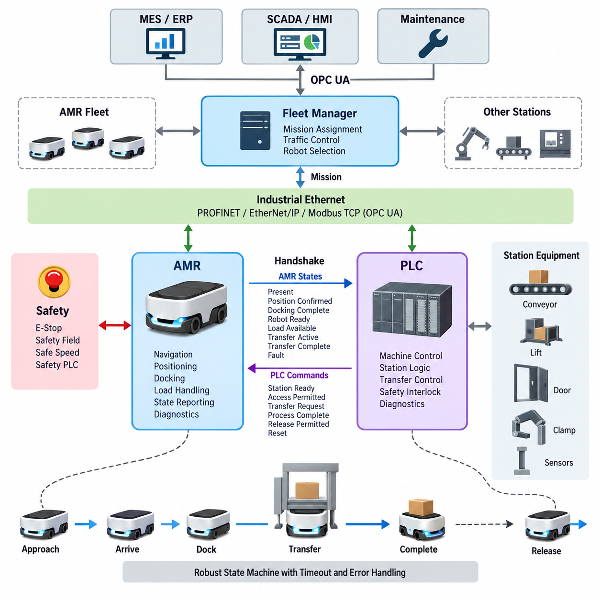
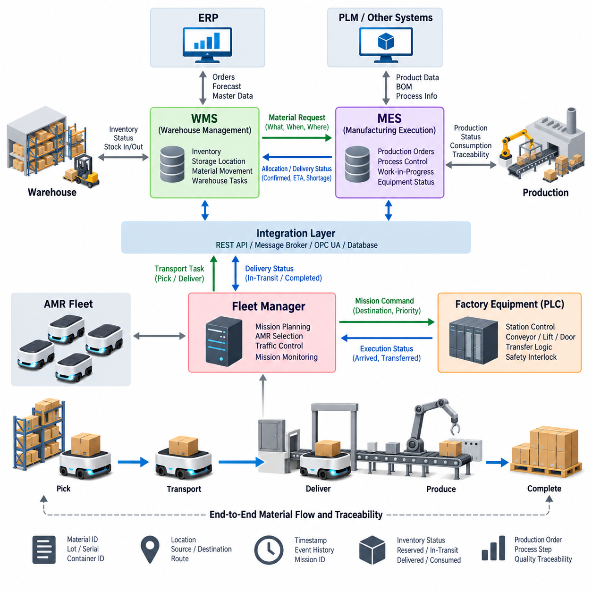
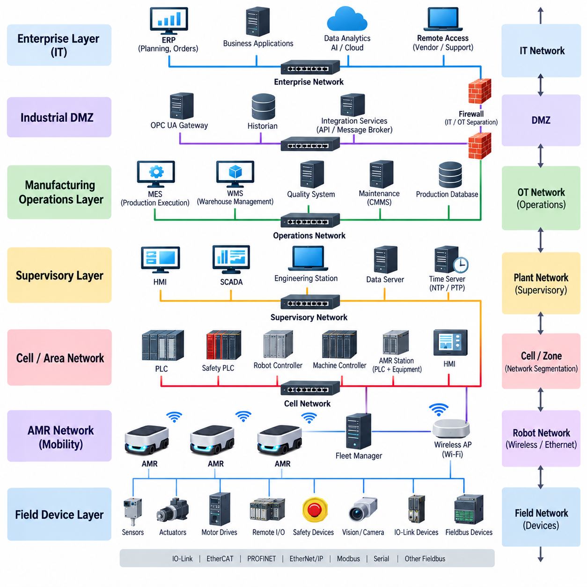
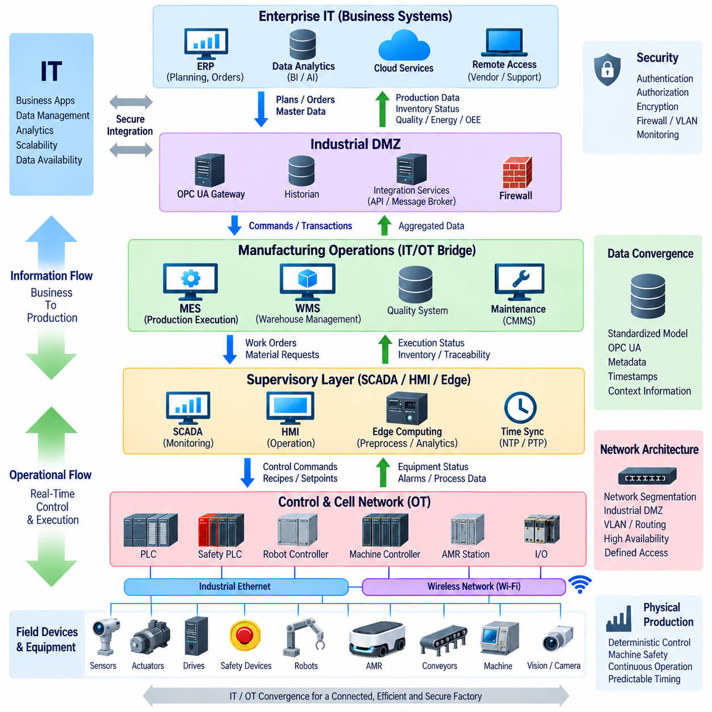
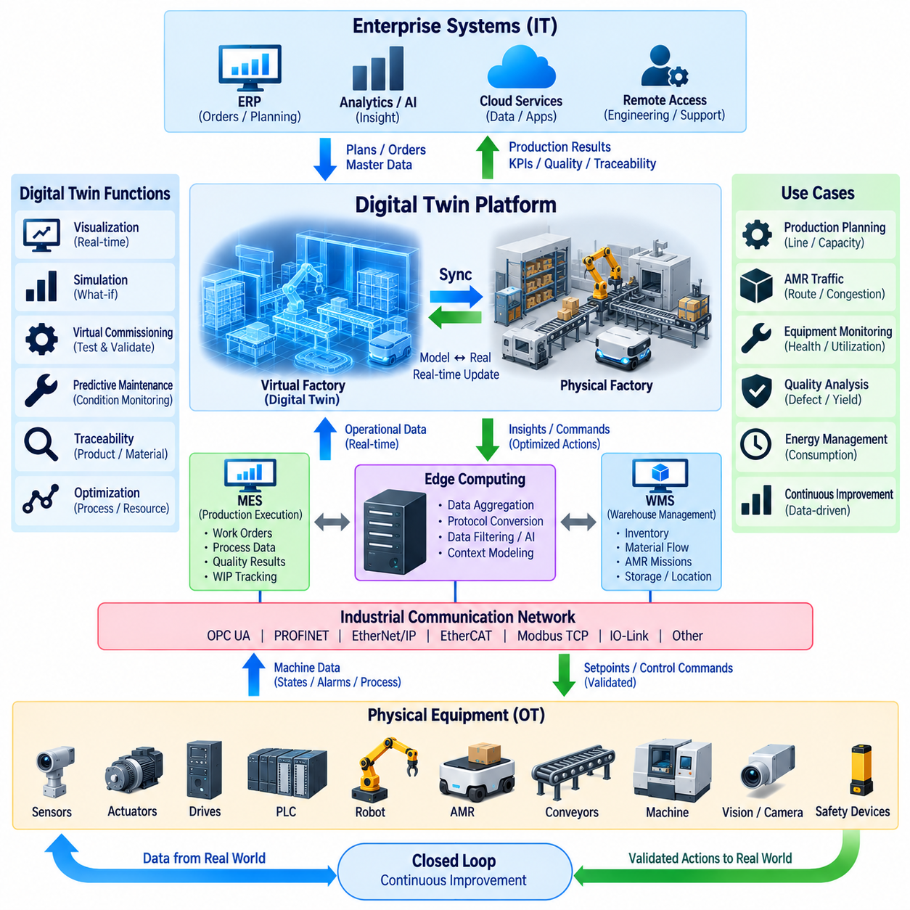

**Volume 07. Industrial Communication**


# Chapter 10. Factory Automation

##  

## 10.01. AMR PLC Integration Pattern

{width="7.268055555555556in" height="7.268055555555556in"}

An AMR--PLC integration pattern defines how an autonomous mobile robot exchanges operational states, commands, permissions, and completion signals with factory automation equipment. The PLC normally retains deterministic control of machines and work cells, while the AMR manages navigation and mobility. Integration therefore establishes a controlled boundary between mobile autonomy and fixed automation.

A typical architecture separates fleet-level coordination from machine-level execution. A fleet manager assigns transportation missions and selects an AMR, while the robot approaches a PLC-controlled station through its navigation system. Near the station, the interaction changes from general mission control to a deterministic handshake in which both systems confirm readiness before physical transfer or processing begins.

The PLC interface should expose a compact and clearly defined set of states rather than internal robot variables. Typical information includes AMR present, position confirmed, docking complete, robot ready, load available, transfer active, transfer complete, fault, and emergency condition. The PLC returns corresponding signals such as station ready, access permitted, transfer request, process complete, release permitted, and reset.

Communication can be implemented through industrial Ethernet protocols such as PROFINET, EtherNet/IP, or Modbus TCP, depending on the installed automation environment. OPC UA may provide higher-level information exchange, especially when integration extends toward MES or supervisory systems. The selected protocol should match timing requirements, PLC capabilities, diagnostic needs, and existing factory network standards.

A robust integration pattern treats the AMR and PLC interaction as a state machine rather than a collection of unrelated Boolean signals. For example, an AMR may progress through APPROACHING, ARRIVED, DOCKING, DOCKED, TRANSFER_READY, TRANSFERRING, COMPLETE, and RELEASED states. Explicit transitions make abnormal sequences easier to detect and prevent ambiguous interpretations after communication interruptions.

Docking represents an important boundary between autonomous navigation and factory-controlled interaction. The AMR may navigate freely to a predefined approach area, but final alignment can require additional confirmation from localization markers, proximity sensors, mechanical guides, or station sensors. The PLC should not initiate conveyors, lifts, doors, clamps, or other transfer mechanisms until the required docking conditions have been verified.

Material transfer requires coordinated ownership of the physical operation. At a conveyor station, for example, the PLC can indicate that the receiving conveyor is ready before the AMR enables its onboard conveyor. Sensors on both sides then verify movement and final load position. Completion should be acknowledged by both systems so that neither the AMR nor the stationary equipment assumes that transfer succeeded based only on elapsed time.

Handshake signals should incorporate timeouts and sequence validation. If an expected acknowledgement does not arrive within a specified interval, the interface should enter a defined fault or recovery state instead of waiting indefinitely. Sequence counters, transaction identifiers, or mission identifiers can also prevent a delayed message from a previous operation from being interpreted as confirmation for the current material-transfer cycle.

Safety communication must remain distinct from ordinary production coordination. A normal PLC command such as STOP, HOLD, or WAIT represents operational control and should not automatically be treated as a safety function. Emergency stopping, protective field activation, safe speed supervision, and other safety-related functions require an appropriate safety architecture using safety-rated devices, circuits, controllers, and communication where required.

The integration pattern must also define behavior when communication is lost. The AMR should not continue a machine interaction merely because the last received PLC state indicated permission. Likewise, the PLC should not assume that an AMR remains correctly docked after connectivity disappears. Communication watchdogs, heartbeat monitoring, timeout handling, and predefined fail states allow both sides to move toward predictable and recoverable conditions.

Factory traffic introduces another coordination layer because several AMRs may request access to the same station. The fleet manager normally performs mission allocation, traffic control, and robot selection, whereas the PLC represents the availability and process state of the production station. Keeping these responsibilities separate prevents the PLC from becoming a fleet scheduler and prevents the AMR fleet system from directly controlling detailed machine sequences.

Diagnostics should provide more information than a single fault bit. Useful interface data includes communication status, current handshake state, timeout reason, docking status, transfer state, station identifier, mission identifier, and recovery condition. These values can be exposed to an HMI, SCADA, MES, or maintenance system so technicians can determine whether a failure originated in navigation, communication, docking, material transfer, or machine readiness.

Recovery logic is especially important because an AMR is a mobile system that may leave and later return to a station. After PLC restart, robot reboot, network reconnection, or interrupted transfer, both sides should determine the actual physical condition before resuming operation. A synchronization procedure can compare station occupancy, docking sensors, load presence, mission identity, and current states before selecting resume, retry, rollback, or manual recovery.

Standardization becomes valuable when many production stations and AMRs are deployed. A common interface model can define reusable state names, command semantics, data types, timeout behavior, fault codes, and version information for every compatible station. Individual equipment may then add application-specific data without changing the fundamental handshake pattern, reducing commissioning effort and simplifying future fleet expansion.

The resulting AMR--PLC integration pattern creates a layered factory automation structure in which autonomous navigation, deterministic machine control, material-transfer coordination, safety functions, and enterprise-level information exchange remain clearly separated but synchronized. This separation enables AMRs to operate as standardized mobile automation resources while preserving the predictable behavior expected from PLC-controlled industrial equipment.

AMR-PLC 통합 패턴(AMR--PLC Integration Pattern)은 자율이동로봇(Autonomous Mobile Robot, AMR)이 공장 자동화 설비와 운전 상태(Operational State), 명령(Command), 허가(Permission), 완료 신호(Completion Signal)를 교환하는 방법을 정의한다. PLC는 일반적으로 기계와 작업 셀(Work Cell)의 결정론적 제어(Deterministic Control)를 담당하고, AMR은 주행(Navigation)과 이동성(Mobility)을 담당한다. 따라서 통합은 이동형 자율 시스템(Mobile Autonomous System)과 고정형 자동화(Fixed Automation) 사이에 제어된 경계(Controlled Boundary)를 설정한다.

일반적인 아키텍처(Typical Architecture)는 플릿 수준 조정(Fleet-Level Coordination)과 기계 수준 실행(Machine-Level Execution)을 분리한다. 플릿 관리자(Fleet Manager)는 운송 미션(Transportation Mission)을 할당하고 AMR을 선택하며, 로봇은 자체 주행 시스템(Navigation System)을 통해 PLC 제어 스테이션에 접근한다. 스테이션 근처에서는 일반적인 미션 제어(Mission Control)에서 결정론적 핸드셰이크(Deterministic Handshake)로 전환되며, 물리적 이송이나 공정이 시작되기 전에 양쪽 시스템이 준비 상태를 확인한다.

PLC 인터페이스(PLC Interface)는 로봇 내부의 세부 변수보다는 간결하고 명확하게 정의된 상태(State)를 제공해야 한다. 일반적인 정보에는 AMR 도착(AMR Present), 위치 확인(Position Confirmed), 도킹 완료(Docking Complete), 로봇 준비(Robot Ready), 적재물 존재(Load Available), 이송 진행(Transfer Active), 이송 완료(Transfer Complete), 고장(Fault), 비상 상태(Emergency Condition) 등이 포함된다. PLC는 이에 대응하여 스테이션 준비(Station Ready), 접근 허가(Access Permitted), 이송 요청(Transfer Request), 공정 완료(Process Complete), 해제 허가(Release Permitted), 리셋(Reset) 등의 신호를 반환한다.

통신(Communication)은 설치된 자동화 환경에 따라 프로피넷(PROFINET), 이더넷/IP(EtherNet/IP), 모드버스 TCP(Modbus TCP)와 같은 산업용 이더넷 프로토콜(Industrial Ethernet Protocol)을 통해 구현할 수 있다. OPC UA는 특히 제조실행시스템(MES)이나 상위 감독 시스템(Supervisory System)까지 통합이 확장되는 경우 상위 수준 정보 교환(Higher-Level Information Exchange)에 활용할 수 있다. 선택되는 프로토콜은 시간 요구사항(Timing Requirements), PLC 기능, 진단 요구사항(Diagnostic Needs), 기존 공장 네트워크 표준과 일치해야 한다.

견고한 통합 패턴(Robust Integration Pattern)은 AMR과 PLC 사이의 상호작용을 서로 독립된 불리언 신호(Boolean Signal)의 집합이 아니라 상태 머신(State Machine)으로 취급한다. 예를 들어 AMR은 접근 중(APPROACHING), 도착(ARRIVED), 도킹 중(DOCKING), 도킹 완료(DOCKED), 이송 준비(TRANSFER_READY), 이송 중(TRANSFERRING), 완료(COMPLETE), 해제(RELEASED)의 상태를 순차적으로 진행할 수 있다. 명시적인 상태 전이(Explicit Transition)를 사용하면 비정상적인 순서를 쉽게 감지하고 통신 중단 이후 발생할 수 있는 모호한 상태 해석을 방지할 수 있다.

도킹(Docking)은 자율 주행(Autonomous Navigation)과 공장 제어 상호작용(Factory-Controlled Interaction) 사이의 중요한 경계를 나타낸다. AMR은 미리 정의된 접근 영역(Approach Area)까지 자율적으로 주행할 수 있지만, 최종 정렬(Final Alignment)은 위치 마커(Localization Marker), 근접 센서(Proximity Sensor), 기계적 가이드(Mechanical Guide), 스테이션 센서(Station Sensor) 등의 추가 확인이 필요할 수 있다. PLC는 필요한 도킹 조건이 확인되기 전에는 컨베이어, 리프트, 도어, 클램프 또는 기타 이송 장치를 작동시키지 않아야 한다.

물류 이송(Material Transfer)은 물리적 작업에 대한 제어 권한(Control Ownership)을 상호 조정해야 한다. 예를 들어 컨베이어 스테이션(Conveyor Station)에서는 AMR이 자체 탑재 컨베이어(Onboard Conveyor)를 활성화하기 전에 PLC가 수신 측 컨베이어의 준비 상태를 알려줄 수 있다. 이후 양쪽의 센서가 물체의 이동과 최종 적재 위치를 확인한다. 완료 상태는 양쪽 시스템에서 모두 확인되어야 하며, AMR이나 고정 설비가 단순히 경과 시간만을 기준으로 이송 성공을 판단해서는 안 된다.

핸드셰이크 신호(Handshake Signal)에는 타임아웃(Timeout)과 시퀀스 검증(Sequence Validation)이 포함되어야 한다. 예상되는 확인 응답(Acknowledgement)이 지정된 시간 안에 도착하지 않으면 인터페이스는 무기한 대기하지 않고 정의된 고장 상태(Fault State) 또는 복구 상태(Recovery State)로 전환해야 한다. 시퀀스 카운터(Sequence Counter), 트랜잭션 식별자(Transaction Identifier), 미션 식별자(Mission Identifier)를 사용하면 이전 작업에서 지연된 메시지가 현재 물류 이송 사이클의 확인 신호로 잘못 해석되는 것을 방지할 수 있다.

안전 통신(Safety Communication)은 일반적인 생산 조정(Production Coordination)과 명확하게 분리되어야 한다. 정지(STOP), 보류(HOLD), 대기(WAIT)와 같은 일반 PLC 명령은 운전 제어(Operational Control)를 의미하며 자동으로 안전 기능(Safety Function)으로 취급해서는 안 된다. 비상 정지(Emergency Stop), 보호 영역 활성화(Protective Field Activation), 안전 속도 감시(Safe Speed Supervision) 및 기타 안전 관련 기능은 필요한 경우 안전 등급 장치(Safety-Rated Device), 회로, 제어기 및 안전 통신을 사용하는 적절한 안전 아키텍처(Safety Architecture)를 필요로 한다.

통합 패턴은 통신이 끊어졌을 때의 동작도 정의해야 한다. AMR은 마지막으로 수신한 PLC 상태가 허가 상태였다는 이유만으로 기계와의 상호작용을 계속해서는 안 된다. 마찬가지로 PLC도 연결이 끊어진 이후 AMR이 여전히 올바르게 도킹되어 있다고 가정해서는 안 된다. 통신 워치독(Communication Watchdog), 하트비트 모니터링(Heartbeat Monitoring), 타임아웃 처리(Timeout Handling), 사전 정의된 고장 안전 상태(Fail State)를 사용하면 양쪽 시스템이 예측 가능하고 복구 가능한 상태로 전환될 수 있다.

공장 교통(Factory Traffic)에서는 여러 AMR이 동일한 스테이션에 접근을 요청할 수 있기 때문에 추가적인 조정 계층(Coordination Layer)이 필요하다. 플릿 관리자(Fleet Manager)는 일반적으로 미션 할당(Mission Allocation), 교통 제어(Traffic Control), 로봇 선택(Robot Selection)을 수행하며, PLC는 생산 스테이션의 가용성과 공정 상태(Process State)를 나타낸다. 이러한 책임을 분리하면 PLC가 플릿 스케줄러(Fleet Scheduler)가 되는 것을 방지하고, AMR 플릿 시스템이 세부적인 기계 시퀀스를 직접 제어하는 것도 방지할 수 있다.

진단(Diagnostics)은 단일 고장 비트(Fault Bit)보다 많은 정보를 제공해야 한다. 유용한 인터페이스 데이터에는 통신 상태(Communication Status), 현재 핸드셰이크 상태(Current Handshake State), 타임아웃 원인(Timeout Reason), 도킹 상태(Docking Status), 이송 상태(Transfer State), 스테이션 식별자(Station Identifier), 미션 식별자(Mission Identifier), 복구 상태(Recovery Condition) 등이 포함된다. 이러한 값은 HMI, SCADA, MES 또는 유지보수 시스템(Maintenance System)에 제공되어 기술자가 고장의 원인이 주행, 통신, 도킹, 물류 이송 또는 기계 준비 상태 중 어디에서 발생했는지 판단할 수 있도록 한다.

복구 로직(Recovery Logic)은 AMR이 스테이션을 떠났다가 다시 돌아올 수 있는 이동형 시스템이라는 점에서 특히 중요하다. PLC 재시작, 로봇 재부팅, 네트워크 재연결 또는 이송 중단 이후 양쪽 시스템은 작업을 재개하기 전에 실제 물리적 상태(Physical Condition)를 확인해야 한다. 동기화 절차(Synchronization Procedure)는 스테이션 점유 상태, 도킹 센서, 적재물 존재 여부, 미션 식별 정보 및 현재 상태를 비교한 후 재개(Resume), 재시도(Retry), 롤백(Rollback), 수동 복구(Manual Recovery) 중 적절한 절차를 선택할 수 있다.

많은 생산 스테이션과 AMR을 구축할수록 표준화(Standardization)의 중요성이 커진다. 공통 인터페이스 모델(Common Interface Model)은 호환 가능한 모든 스테이션에 대해 재사용 가능한 상태 이름(State Name), 명령 의미(Command Semantics), 데이터 형식(Data Type), 타임아웃 동작(Timeout Behavior), 고장 코드(Fault Code), 버전 정보(Version Information)를 정의할 수 있다. 개별 설비는 기본 핸드셰이크 패턴을 변경하지 않고 응용 분야별 데이터를 추가할 수 있으므로 시운전(Commissioning) 작업을 줄이고 향후 플릿 확장(Fleet Expansion)을 단순화할 수 있다.

최종적인 AMR-PLC 통합 패턴(AMR--PLC Integration Pattern)은 자율 주행(Autonomous Navigation), 결정론적 기계 제어(Deterministic Machine Control), 물류 이송 조정(Material-Transfer Coordination), 안전 기능(Safety Function), 기업 수준 정보 교환(Enterprise-Level Information Exchange)이 명확하게 분리되면서도 서로 동기화되는 계층형 공장 자동화 구조(Layered Factory Automation Structure)를 형성한다. 이러한 역할 분리는 PLC 기반 산업 설비에서 요구되는 예측 가능한 동작을 유지하면서 AMR을 표준화된 이동형 자동화 자원(Standardized Mobile Automation Resource)으로 운영할 수 있게 한다.

##  

## 10.02. WMS/MES Interface

{width="7.268055555555556in" height="7.268055555555556in"}

A Warehouse Management System (WMS) and a Manufacturing Execution System (MES) occupy different but closely connected layers of factory operations. The WMS primarily manages inventory, storage locations, material movement, and warehouse resources, while the MES coordinates manufacturing orders, production processes, work-in-progress, and equipment execution. Their interface connects material logistics with production demand.

In an automated factory, production cannot proceed efficiently unless required materials arrive at the correct workstation at the correct time. The MES therefore generates material requirements based on production schedules, work orders, recipes, or process states. These requirements are communicated to the WMS, which determines where the requested material is stored and organizes the corresponding retrieval and transportation operation.

The WMS normally maintains the logistical representation of materials, including item identifiers, quantities, lot numbers, storage locations, containers, pallets, and inventory status. The MES maintains the manufacturing context in which those materials will be consumed. Connecting these information models allows a material request to be associated with a specific production order, process step, workstation, or manufacturing resource.

Material requests should contain sufficient context to prevent ambiguity. Typical information includes material ID, requested quantity, source or inventory constraints, destination station, required delivery time, production order, priority, and tracking identifiers. The WMS may respond with allocation status, selected inventory, estimated delivery state, shortage information, and confirmation that the requested material has been dispatched or delivered.

AMRs provide a physical execution layer between the WMS/MES information systems and factory equipment. After receiving a transportation requirement, the WMS or fleet management layer can generate a mission for an available AMR. The AMR retrieves the assigned container, pallet, rack, or component and transports it to the production station while reporting mission progress and delivery status to higher-level systems.

A clear separation of responsibilities is important. The MES should normally determine what production requires and when it is required, while the WMS determines where the material is located and how inventory is allocated. The fleet manager determines which AMR performs the transportation mission and manages robot traffic. The PLC controls deterministic interaction with conveyors, doors, lifts, fixtures, and other station equipment.

The WMS--MES interface can be implemented through REST APIs, message brokers, database integration, OPC UA, or other enterprise and industrial communication mechanisms. The appropriate method depends on system architecture, transaction frequency, latency requirements, vendor capabilities, and existing IT/OT infrastructure. Asynchronous messaging is particularly useful when operations must remain robust despite temporary delays between systems.

Interface design should distinguish commands, events, and states. A material request is a command or business transaction, while material picked, AMR dispatched, material delivered, and production consumption confirmed are events. Inventory availability, mission status, workstation readiness, and work-order status represent states. Keeping these concepts distinct simplifies synchronization and prevents repeated messages from accidentally creating duplicate operations.

Every transaction should have a unique identifier that can be traced across the MES, WMS, fleet manager, AMR, and production station. A production order may generate a material request identifier, which can then be associated with a warehouse task and an AMR mission. This end-to-end traceability allows operators to determine which physical movement corresponds to a particular manufacturing requirement.

Acknowledgement mechanisms are necessary because successful message transmission does not guarantee successful physical execution. The WMS may acknowledge that a request was accepted, later report that inventory was allocated, and subsequently indicate that transportation began. Final delivery should be confirmed independently, preferably using information from the AMR, destination station, sensors, or PLC-controlled equipment rather than relying only on mission dispatch.

Exception handling must be designed as part of the normal interface rather than added after commissioning. Materials may be unavailable, inventory records may disagree with physical stock, an AMR may become unavailable, a destination may remain occupied, or production may be delayed. The interface should communicate these conditions using defined status and error information so that higher-level systems can reschedule, retry, substitute, or request operator intervention.

Production priorities can change while transportation missions are already active. The MES may accelerate an urgent work order or postpone a process because of equipment downtime. The WMS and fleet management system therefore require mechanisms for updating priorities without creating inconsistent inventory or robot states. Cancellation and modification rules should define which missions can be changed safely and which must first reach a controlled intermediate state.

Inventory synchronization is another critical aspect of the interface. A material may be logically allocated before it physically leaves a storage location, while consumption may be recorded only after it reaches the workstation or enters the manufacturing process. The systems should clearly distinguish available, reserved, picked, in-transit, delivered, staged, consumed, rejected, and returned material states to maintain accurate inventory records.

The interface also supports production traceability. Lot numbers, serial numbers, container identifiers, timestamps, source locations, destination stations, and production-order references can accompany material movements. When these records are synchronized between WMS and MES, manufacturers can reconstruct the relationship between warehouse inventory, transportation activities, production processes, and finished products for quality analysis and operational diagnostics.

Security becomes increasingly important as WMS and MES integration crosses traditional IT and OT boundaries. Authentication, authorization, encrypted communication, network segmentation, controlled API access, logging, and audit trails should protect operational transactions. Interfaces should expose only the information and operations required for integration rather than providing unrestricted access to internal databases or control functions.

A standardized WMS--MES interface ultimately creates a closed information loop between production demand and physical material flow. The MES expresses manufacturing requirements, the WMS converts them into inventory and logistics actions, the fleet system coordinates mobile transportation, and PLC-controlled stations complete physical interaction. Status and completion information then flows upward, allowing production planning to remain synchronized with actual factory execution.

창고관리시스템(Warehouse Management System, WMS)과 제조실행시스템(Manufacturing Execution System, MES)은 공장 운영에서 서로 다르지만 밀접하게 연결된 계층을 담당한다. WMS는 주로 재고(Inventory), 저장 위치(Storage Location), 자재 이동(Material Movement), 창고 자원(Warehouse Resource)을 관리하며, MES는 제조 지시(Manufacturing Order), 생산 공정(Production Process), 재공품(Work-in-Progress), 설비 실행(Equipment Execution)을 조정한다. 두 시스템의 인터페이스는 자재 물류(Material Logistics)와 생산 요구(Production Demand)를 연결한다.

자동화 공장(Automated Factory)에서는 필요한 자재가 정확한 시간에 정확한 작업 스테이션(Workstation)에 도착하지 않으면 생산을 효율적으로 진행할 수 없다. 따라서 MES는 생산 일정(Production Schedule), 작업 지시(Work Order), 레시피(Recipe), 공정 상태(Process State)를 기반으로 자재 요구사항(Material Requirement)을 생성한다. 이러한 요구사항은 WMS로 전달되며, WMS는 요청된 자재가 어디에 보관되어 있는지 확인하고 이에 필요한 출고 및 운송 작업을 구성한다.

WMS는 일반적으로 품목 식별자(Item Identifier), 수량(Quantity), 로트 번호(Lot Number), 저장 위치(Storage Location), 컨테이너(Container), 팔레트(Pallet), 재고 상태(Inventory Status)를 포함하는 자재의 물류 정보(Logistical Representation)를 관리한다. MES는 해당 자재가 소비되는 제조 상황(Manufacturing Context)을 관리한다. 이러한 정보 모델(Information Model)을 연결하면 자재 요청을 특정 생산 지시(Production Order), 공정 단계(Process Step), 작업 스테이션 또는 제조 자원(Manufacturing Resource)과 연계할 수 있다.

자재 요청(Material Request)에는 모호성을 방지할 수 있도록 충분한 상황 정보(Context)가 포함되어야 한다. 일반적인 정보에는 자재 ID(Material ID), 요청 수량(Requested Quantity), 출처 또는 재고 제약조건(Inventory Constraint), 목적지 스테이션(Destination Station), 요구 배송 시간(Required Delivery Time), 생산 지시, 우선순위(Priority), 추적 식별자(Tracking Identifier)가 포함된다. WMS는 할당 상태(Allocation Status), 선택된 재고, 예상 배송 상태, 재고 부족 정보(Shortage Information), 출고 또는 배송 확인 정보를 반환할 수 있다.

자율이동로봇(Autonomous Mobile Robot, AMR)은 WMS/MES 정보 시스템과 공장 설비 사이에서 물리적 실행 계층(Physical Execution Layer)을 제공한다. 운송 요구사항을 수신하면 WMS 또는 플릿 관리 계층(Fleet Management Layer)은 사용 가능한 AMR에 대한 미션(Mission)을 생성할 수 있다. AMR은 지정된 컨테이너, 팔레트, 랙(Rack), 부품(Component)을 인수하여 생산 스테이션으로 운송하면서 미션 진행 상황(Mission Progress)과 배송 상태를 상위 시스템에 보고한다.

명확한 책임 분리(Separation of Responsibilities)가 중요하다. MES는 일반적으로 생산에 무엇이 필요한지와 언제 필요한지를 결정하고, WMS는 자재가 어디에 있으며 재고를 어떻게 할당할지를 결정해야 한다. 플릿 관리자(Fleet Manager)는 어떤 AMR이 운송 미션을 수행할지 결정하고 로봇 교통(Robot Traffic)을 관리한다. PLC는 컨베이어, 도어, 리프트, 고정 장치(Fixture) 및 기타 스테이션 설비와의 결정론적 상호작용(Deterministic Interaction)을 제어한다.

WMS-MES 인터페이스(WMS--MES Interface)는 REST API, 메시지 브로커(Message Broker), 데이터베이스 통합(Database Integration), OPC UA 또는 기타 기업 및 산업용 통신 방식(Enterprise and Industrial Communication Mechanism)을 통해 구현할 수 있다. 적절한 방식은 시스템 아키텍처, 트랜잭션 빈도(Transaction Frequency), 지연시간 요구사항(Latency Requirement), 공급업체 기능(Vendor Capability), 기존 IT/OT 인프라에 따라 결정된다. 비동기 메시징(Asynchronous Messaging)은 시스템 간 일시적인 지연이 발생하더라도 운영의 견고성을 유지해야 할 때 특히 유용하다.

인터페이스 설계(Interface Design)에서는 명령(Command), 이벤트(Event), 상태(State)를 구분해야 한다. 자재 요청은 명령 또는 비즈니스 트랜잭션(Business Transaction)에 해당하며, 자재 피킹 완료(Material Picked), AMR 출발(AMR Dispatched), 자재 배송 완료(Material Delivered), 생산 소비 확인(Production Consumption Confirmed)은 이벤트에 해당한다. 재고 가용성(Inventory Availability), 미션 상태, 작업 스테이션 준비 상태, 작업 지시 상태는 상태 정보를 나타낸다. 이러한 개념을 명확하게 분리하면 동기화를 단순화하고 반복된 메시지로 인해 중복 작업이 생성되는 것을 방지할 수 있다.

모든 트랜잭션(Transaction)에는 MES, WMS, 플릿 관리자, AMR, 생산 스테이션 전체에서 추적할 수 있는 고유 식별자(Unique Identifier)가 있어야 한다. 하나의 생산 지시에서 자재 요청 식별자(Material Request Identifier)가 생성될 수 있으며, 이는 다시 창고 작업(Warehouse Task) 및 AMR 미션과 연계될 수 있다. 이러한 종단 간 추적성(End-to-End Traceability)을 통해 운영자는 특정 제조 요구사항이 어떤 실제 물리적 이동과 연결되어 있는지를 확인할 수 있다.

메시지가 성공적으로 전달되었다고 해서 물리적 작업이 성공적으로 실행된 것은 아니므로 확인 응답 메커니즘(Acknowledgement Mechanism)이 필요하다. WMS는 요청이 접수되었음을 먼저 확인하고, 이후 재고가 할당되었음을 보고하며, 다시 운송이 시작되었음을 알릴 수 있다. 최종 배송(Final Delivery)은 단순한 미션 발행 여부에 의존하지 않고 AMR, 목적지 스테이션, 센서 또는 PLC 제어 설비에서 제공되는 정보를 이용하여 독립적으로 확인하는 것이 바람직하다.

예외 처리(Exception Handling)는 시운전(Commissioning) 이후 추가하는 기능이 아니라 정상적인 인터페이스 설계의 일부로 포함되어야 한다. 자재를 사용할 수 없거나, 재고 기록과 실제 재고가 일치하지 않거나, AMR을 사용할 수 없거나, 목적지가 계속 점유되어 있거나, 생산이 지연될 수 있다. 인터페이스는 정의된 상태 및 오류 정보(Error Information)를 통해 이러한 상황을 전달하여 상위 시스템이 재일정(Reschedule), 재시도(Retry), 대체(Substitute), 운영자 개입(Operator Intervention)을 수행할 수 있도록 해야 한다.

운송 미션이 이미 진행 중인 상황에서도 생산 우선순위(Production Priority)는 변경될 수 있다. MES는 긴급 작업 지시(Urgent Work Order)의 우선순위를 높이거나 설비 정지(Equipment Downtime)로 인해 공정을 연기할 수 있다. 따라서 WMS와 플릿 관리 시스템에는 재고 상태나 로봇 상태의 불일치를 발생시키지 않으면서 우선순위를 변경하는 메커니즘이 필요하다. 취소 및 변경 규칙(Cancellation and Modification Rule)은 어떤 미션을 안전하게 변경할 수 있으며 어떤 미션은 먼저 제어 가능한 중간 상태(Controlled Intermediate State)에 도달해야 하는지를 정의해야 한다.

재고 동기화(Inventory Synchronization) 역시 인터페이스의 중요한 요소이다. 자재는 물리적으로 저장 위치를 떠나기 전에 논리적으로 할당(Logically Allocated)될 수 있으며, 소비(Consumption)는 작업 스테이션에 도착하거나 실제 제조 공정에 투입된 이후에 기록될 수 있다. 정확한 재고 기록을 유지하려면 사용 가능(Available), 예약(Reserved), 피킹 완료(Picked), 운송 중(In-Transit), 배송 완료(Delivered), 대기 배치(Staged), 소비 완료(Consumed), 거부(Rejected), 반품(Returned) 상태를 명확하게 구분해야 한다.

인터페이스는 생산 추적성(Production Traceability)도 지원한다. 로트 번호, 일련번호(Serial Number), 컨테이너 식별자(Container Identifier), 타임스탬프(Timestamp), 출발 위치(Source Location), 목적지 스테이션, 생산 지시 참조 정보가 자재 이동과 함께 관리될 수 있다. 이러한 기록이 WMS와 MES 사이에서 동기화되면 제조업체는 품질 분석(Quality Analysis)과 운영 진단(Operational Diagnostics)을 위해 창고 재고, 운송 활동, 생산 공정 및 완제품 사이의 관계를 재구성할 수 있다.

WMS와 MES의 통합이 기존 정보기술(IT)과 운영기술(OT)의 경계를 넘어서면서 보안(Security)의 중요성도 증가한다. 인증(Authentication), 권한 부여(Authorization), 암호화 통신(Encrypted Communication), 네트워크 분할(Network Segmentation), 통제된 API 접근(Controlled API Access), 로깅(Logging), 감사 추적(Audit Trail)을 통해 운영 트랜잭션을 보호해야 한다. 인터페이스는 내부 데이터베이스나 제어 기능에 제한 없는 접근을 허용하는 대신 통합에 필요한 정보와 기능만 제공해야 한다.

표준화된 WMS-MES 인터페이스는 궁극적으로 생산 요구(Production Demand)와 실제 자재 흐름(Physical Material Flow) 사이에 폐루프 정보 구조(Closed Information Loop)를 형성한다. MES는 제조 요구사항을 표현하고, WMS는 이를 재고 및 물류 작업으로 변환하며, 플릿 시스템(Fleet System)은 이동형 운송을 조정하고, PLC 제어 스테이션은 실제 물리적 상호작용을 완료한다. 이후 상태와 완료 정보가 다시 상위 계층으로 전달되어 생산 계획(Production Planning)이 실제 공장 실행(Factory Execution) 상태와 지속적으로 동기화될 수 있도록 한다.

##  

## 10.03. Factory Network Architecture

{width="7.268055555555556in" height="7.268055555555556in"}

A factory network architecture provides the communication foundation that connects field devices, controllers, robots, production systems, and enterprise applications into a coordinated automation environment. Unlike a conventional office network, it must support deterministic control, high availability, industrial diagnostics, cybersecurity, and predictable communication while accommodating both fixed machinery and mobile systems such as AMRs.

At the lowest level, sensors, actuators, motor drives, remote I/O modules, safety devices, and intelligent instruments interact directly with physical processes. Technologies such as IO-Link, EtherCAT, PROFINET, EtherNet/IP, and traditional serial or fieldbus networks may coexist at this level. Protocol selection depends on cycle time, topology, synchronization, safety requirements, device ecosystem, and installed factory infrastructure.

The control level contains PLCs, safety PLCs, robot controllers, motion controllers, and dedicated machine controllers. These systems execute deterministic logic and coordinate local equipment such as conveyors, lifts, doors, grippers, and production machinery. Industrial Ethernet switches connect controllers and distributed devices while preserving the timing, availability, diagnostics, and traffic characteristics required by automation applications.

Above individual machines, a cell or production-area network connects multiple PLCs, industrial robots, inspection systems, AMR stations, HMIs, and supervisory controllers. Communication at this level coordinates operations between machines rather than controlling every actuator directly. Segmentation into cells or zones limits unnecessary traffic and provides manageable boundaries for configuration, troubleshooting, maintenance, and cybersecurity.

AMRs introduce mobility into an architecture traditionally designed around fixed equipment. Their navigation computers and fleet communication normally use Ethernet and wireless networking, while interaction with production stations may involve PLC-controlled industrial Ethernet interfaces. Reliable Wi-Fi or other appropriate wireless infrastructure is therefore required so that robots can maintain mission communication while moving between warehouse, production, charging, and transfer areas.

The AMR fleet manager occupies a coordination layer above individual mobile robots. It assigns missions, selects available robots, manages traffic conflicts, monitors charging, and coordinates access to shared resources. The fleet system can communicate with WMS, MES, or other supervisory applications while station-level PLCs retain deterministic control of local machinery. This separation prevents enterprise logistics decisions from becoming tightly coupled to machine control logic.

At the supervisory level, HMI and SCADA systems collect equipment status, alarms, operating data, and diagnostic information from multiple controllers. These systems provide operators with a factory-wide operational view without replacing the real-time control performed by PLCs. OPC UA can provide structured information exchange between automation systems and higher-level applications, allowing equipment data to be represented through standardized information models.

The manufacturing operations layer typically contains MES, WMS, quality systems, maintenance applications, and production databases. MES coordinates production execution and work orders, while WMS manages inventory and material logistics. Their commands and transactions can eventually generate physical actions through fleet managers, AMRs, PLCs, and machines, while execution status flows upward to maintain synchronization between digital production records and actual factory operations.

Enterprise IT systems such as ERP operate above manufacturing execution and normally exchange production plans, orders, inventory information, and business data rather than real-time control signals. The architecture should avoid allowing enterprise applications to communicate directly with low-level controllers unless a specifically controlled interface requires it. Integration services, APIs, message brokers, OPC UA gateways, and industrial middleware can establish controlled communication between these layers.

Network segmentation is fundamental because a modern factory may contain thousands of endpoints with very different communication requirements. Logical or physical separation can divide enterprise IT, manufacturing operations, production cells, safety systems, robot networks, engineering systems, and external services. VLANs, routing policies, firewalls, access-control mechanisms, and industrial security gateways can restrict traffic to explicitly required communication paths.

An industrial demilitarized zone, commonly called an Industrial DMZ, can provide an additional boundary between enterprise IT and operational technology networks. Services that must exchange information across this boundary can be placed or mediated through controlled infrastructure rather than exposing production controllers directly. This approach reduces the possibility that an enterprise-side incident can propagate immediately into critical factory automation systems.

Availability must be considered together with segmentation. Failure of a single switch, uplink, power supply, or communication path can stop multiple machines when network dependencies are poorly designed. Managed industrial switches, redundant links, resilient topologies, redundant power, network monitoring, and appropriate recovery mechanisms can reduce single points of failure. Critical communication paths should be identified according to their effect on production and safety.

Time synchronization becomes increasingly important when data from PLCs, robots, cameras, inspection equipment, AMRs, and edge computers must be correlated. Technologies such as NTP and PTP can provide different levels of synchronization depending on application requirements. Consistent timestamps improve event reconstruction, sensor-data alignment, production traceability, distributed diagnostics, and analysis of failures occurring across several networked systems.

Quality of Service and traffic engineering are necessary when control traffic, video streams, diagnostics, engineering access, robot communication, and production data share network infrastructure. High-bandwidth camera or AI traffic should not unintentionally interfere with time-sensitive automation messages. Network design therefore considers bandwidth, latency, jitter, multicast behavior, broadcast domains, traffic priority, and expected peak utilization rather than only nominal link speed.

Cybersecurity should be designed into the architecture instead of being applied after deployment. Device authentication, role-based access, encrypted protocols where appropriate, firewall policies, secure remote access, patch management, logging, asset inventory, and network monitoring contribute to defense in depth. Engineering laptops, vendor maintenance connections, wireless devices, and external cloud interfaces require particular attention because they can create paths across established security boundaries.

Diagnostics and observability are equally important for maintaining a large industrial network. Managed switches and network-management systems can expose port status, errors, utilization, topology changes, communication failures, and device availability. When this information is correlated with PLC alarms, AMR events, MES transactions, and production timestamps, maintenance teams can distinguish network faults from controller, robot, sensor, or application failures.

A well-designed factory network ultimately forms a layered communication structure connecting physical devices, deterministic control, mobile robotics, supervisory automation, manufacturing operations, and enterprise systems. Industrial protocols provide local execution, Ethernet and wireless networks provide scalable connectivity, and controlled IT/OT interfaces support information exchange. The result is a network that enables factory-wide integration without sacrificing control determinism, availability, safety boundaries, maintainability, or cybersecurity.

공장 네트워크 아키텍처(Factory Network Architecture)는 필드 장치(Field Device), 제어기(Controller), 로봇(Robot), 생산 시스템(Production System), 기업 애플리케이션(Enterprise Application)을 하나의 통합된 자동화 환경으로 연결하는 통신 기반을 제공한다. 일반적인 사무용 네트워크와 달리 결정론적 제어(Deterministic Control), 고가용성(High Availability), 산업용 진단(Industrial Diagnostics), 사이버보안(Cybersecurity), 예측 가능한 통신을 지원하면서 자율이동로봇(AMR)과 같은 이동형 시스템도 수용해야 한다.

가장 하위 계층에서는 센서(Sensor), 액추에이터(Actuator), 모터 드라이브(Motor Drive), 원격 입출력 모듈(Remote I/O Module), 안전 장치(Safety Device), 지능형 계측기(Intelligent Instrument)가 실제 물리 공정과 직접 상호작용한다. 이 계층에서는 IO-Link, EtherCAT, PROFINET, EtherNet/IP와 기존 직렬 통신(Serial Communication) 또는 필드버스(Fieldbus)가 함께 사용될 수 있다. 프로토콜은 제어 주기(Cycle Time), 토폴로지(Topology), 동기화, 안전 요구사항, 장치 생태계, 기존 공장 인프라를 고려하여 선택한다.

제어 계층(Control Level)에는 PLC, 안전 PLC(Safety PLC), 로봇 제어기(Robot Controller), 모션 제어기(Motion Controller), 전용 기계 제어기(Dedicated Machine Controller)가 위치한다. 이 시스템들은 결정론적 로직(Deterministic Logic)을 실행하며 컨베이어, 리프트, 도어, 그리퍼 및 생산 설비와 같은 로컬 장비를 조정한다. 산업용 이더넷 스위치(Industrial Ethernet Switch)는 자동화 애플리케이션에 필요한 타이밍, 가용성, 진단 및 트래픽 특성을 유지하면서 제어기와 분산 장치를 연결한다.

개별 기계보다 상위에서는 셀 또는 생산 영역 네트워크(Cell or Production-Area Network)가 여러 PLC, 산업용 로봇(Industrial Robot), 검사 시스템(Inspection System), AMR 스테이션, HMI, 감독 제어기(Supervisory Controller)를 연결한다. 이 계층의 통신은 모든 액추에이터를 직접 제어하기보다 기계 간 작업을 조정한다. 네트워크를 셀(Cell) 또는 존(Zone)으로 분할하면 불필요한 트래픽을 제한하고 구성, 문제 해결, 유지보수 및 사이버보안을 위한 관리 가능한 경계를 형성할 수 있다.

AMR은 전통적으로 고정형 설비를 중심으로 설계된 네트워크 아키텍처에 이동성(Mobility)을 추가한다. AMR의 주행 컴퓨터(Navigation Computer)와 플릿 통신(Fleet Communication)은 일반적으로 이더넷과 무선 네트워크를 사용하며, 생산 스테이션과의 상호작용에는 PLC가 제어하는 산업용 이더넷 인터페이스가 사용될 수 있다. 따라서 로봇이 창고, 생산, 충전 및 이송 영역을 이동하는 동안 미션 통신(Mission Communication)을 유지할 수 있는 안정적인 Wi-Fi 또는 적절한 무선 인프라가 필요하다.

AMR 플릿 관리자(Fleet Manager)는 개별 이동 로봇보다 상위의 조정 계층(Coordination Layer)에 위치한다. 플릿 관리자는 미션을 할당하고, 사용 가능한 로봇을 선택하며, 교통 충돌(Traffic Conflict)을 관리하고, 충전 상태를 감시하며, 공유 자원에 대한 접근을 조정한다. 플릿 시스템은 WMS, MES 또는 기타 상위 애플리케이션과 통신할 수 있으며, 스테이션 수준 PLC는 로컬 기계의 결정론적 제어를 유지한다. 이러한 역할 분리는 기업 수준 물류 결정과 기계 제어 로직이 지나치게 결합되는 것을 방지한다.

감독 계층(Supervisory Level)에서는 HMI와 SCADA 시스템이 여러 제어기로부터 설비 상태, 알람(Alarm), 운전 데이터 및 진단 정보를 수집한다. 이러한 시스템은 PLC가 수행하는 실시간 제어(Real-Time Control)를 대체하지 않으면서 운영자에게 공장 전체의 운전 상태를 제공한다. OPC UA는 자동화 시스템과 상위 애플리케이션 사이에서 구조화된 정보 교환(Structured Information Exchange)을 제공하며, 표준화된 정보 모델(Information Model)을 통해 설비 데이터를 표현할 수 있다.

제조 운영 계층(Manufacturing Operations Layer)에는 일반적으로 MES, WMS, 품질 시스템(Quality System), 유지보수 애플리케이션(Maintenance Application), 생산 데이터베이스(Production Database)가 위치한다. MES는 생산 실행과 작업 지시를 조정하고 WMS는 재고와 자재 물류를 관리한다. 이들의 명령과 트랜잭션(Transaction)은 플릿 관리자, AMR, PLC 및 기계를 통해 실제 물리적 작업으로 이어지며, 실행 상태는 다시 상위로 전달되어 디지털 생산 기록과 실제 공장 운영을 동기화한다.

전사적 자원관리(Enterprise Resource Planning, ERP)와 같은 기업 IT 시스템은 제조 실행 계층보다 상위에 위치하며 일반적으로 실시간 제어 신호가 아니라 생산 계획, 주문, 재고 정보 및 비즈니스 데이터(Business Data)를 교환한다. 특별히 제어된 인터페이스가 필요한 경우를 제외하고 기업 애플리케이션이 하위 제어기와 직접 통신하는 것은 피해야 한다. 통합 서비스(Integration Service), API, 메시지 브로커(Message Broker), OPC UA 게이트웨이(Gateway), 산업용 미들웨어(Industrial Middleware)를 통해 계층 간 통신을 제어할 수 있다.

네트워크 분할(Network Segmentation)은 현대 공장에 서로 다른 통신 요구사항을 가진 수천 개의 엔드포인트(Endpoint)가 존재할 수 있기 때문에 기본적으로 고려해야 한다. 논리적 또는 물리적 분리를 통해 기업 IT, 제조 운영, 생산 셀, 안전 시스템, 로봇 네트워크, 엔지니어링 시스템 및 외부 서비스를 구분할 수 있다. VLAN, 라우팅 정책(Routing Policy), 방화벽(Firewall), 접근 제어 메커니즘(Access-Control Mechanism), 산업용 보안 게이트웨이를 이용하면 명시적으로 필요한 통신 경로만 허용할 수 있다.

산업용 비무장지대(Industrial Demilitarized Zone, Industrial DMZ)는 기업 IT와 운영기술(Operational Technology, OT) 네트워크 사이에 추가적인 경계를 제공할 수 있다. 이 경계를 넘어 정보를 교환해야 하는 서비스는 생산 제어기를 직접 외부에 노출하는 대신 통제된 인프라를 통해 배치하거나 중계할 수 있다. 이러한 구조는 기업 IT 영역에서 발생한 보안 사고가 핵심 공장 자동화 시스템으로 즉시 확산될 가능성을 줄인다.

가용성(Availability)은 네트워크 분할과 함께 고려해야 한다. 네트워크 의존성을 적절하게 설계하지 않으면 단일 스위치, 업링크(Uplink), 전원 공급장치 또는 통신 경로의 고장으로 여러 기계가 동시에 정지할 수 있다. 관리형 산업용 스위치(Managed Industrial Switch), 이중화 링크(Redundant Link), 복원력 있는 토폴로지(Resilient Topology), 이중화 전원(Redundant Power), 네트워크 모니터링 및 적절한 복구 메커니즘을 사용하면 단일 고장점(Single Point of Failure)을 줄일 수 있다. 핵심 통신 경로는 생산과 안전에 미치는 영향에 따라 식별되어야 한다.

시간 동기화(Time Synchronization)는 PLC, 로봇, 카메라, 검사 장비, AMR 및 엣지 컴퓨터(Edge Computer)의 데이터를 서로 연관시켜야 하는 환경에서 더욱 중요해진다. NTP와 PTP 같은 기술은 애플리케이션 요구사항에 따라 서로 다른 수준의 시간 동기화 성능을 제공한다. 일관된 타임스탬프(Timestamp)는 이벤트 재구성(Event Reconstruction), 센서 데이터 정렬, 생산 추적성(Production Traceability), 분산 진단(Distributed Diagnostics), 여러 네트워크 시스템에 걸쳐 발생하는 고장 분석을 향상시킨다.

서비스 품질(Quality of Service, QoS)과 트래픽 엔지니어링(Traffic Engineering)은 제어 트래픽, 영상 스트림(Video Stream), 진단, 엔지니어링 접근, 로봇 통신 및 생산 데이터가 동일한 네트워크 인프라를 공유할 때 필요하다. 대역폭이 큰 카메라 또는 AI 트래픽이 시간 민감형 자동화 메시지를 방해해서는 안 된다. 따라서 네트워크 설계에서는 단순한 명목 링크 속도뿐만 아니라 대역폭(Bandwidth), 지연시간(Latency), 지터(Jitter), 멀티캐스트(Multicast), 브로드캐스트 도메인(Broadcast Domain), 트래픽 우선순위 및 최대 예상 사용률을 함께 고려해야 한다.

사이버보안(Cybersecurity)은 시스템 구축 이후 추가되는 기능이 아니라 네트워크 아키텍처 설계 단계부터 포함되어야 한다. 장치 인증(Device Authentication), 역할 기반 접근(Role-Based Access), 적절한 암호화 프로토콜, 방화벽 정책, 보안 원격 접근(Secure Remote Access), 패치 관리(Patch Management), 로깅, 자산 목록(Asset Inventory), 네트워크 모니터링을 통해 심층 방어(Defense in Depth)를 구성할 수 있다. 엔지니어링 노트북, 공급업체 유지보수 연결, 무선 장치 및 외부 클라우드 인터페이스는 기존 보안 경계를 가로지르는 경로가 될 수 있으므로 특히 주의해야 한다.

대규모 산업 네트워크를 유지하기 위해서는 진단(Diagnostics)과 관측 가능성(Observability)도 중요하다. 관리형 스위치와 네트워크 관리 시스템(Network Management System)은 포트 상태, 오류, 사용률, 토폴로지 변화, 통신 장애 및 장치 가용성을 제공할 수 있다. 이러한 정보를 PLC 알람, AMR 이벤트, MES 트랜잭션 및 생산 타임스탬프와 연계하면 유지보수 담당자는 네트워크 장애와 제어기, 로봇, 센서 또는 애플리케이션 장애를 구분할 수 있다.

잘 설계된 공장 네트워크는 궁극적으로 물리적 장치, 결정론적 제어, 이동형 로봇(Mobile Robotics), 감독 자동화(Supervisory Automation), 제조 운영 및 기업 시스템을 연결하는 계층형 통신 구조(Layered Communication Structure)를 형성한다. 산업용 프로토콜은 로컬 실행을 담당하고, 이더넷과 무선 네트워크는 확장 가능한 연결성을 제공하며, 통제된 IT/OT 인터페이스는 계층 간 정보 교환을 지원한다. 이를 통해 제어 결정성(Control Determinism), 가용성, 안전 경계(Safety Boundary), 유지보수성(Maintainability), 사이버보안을 유지하면서 공장 전체의 통합을 구현할 수 있다.

##  

## 10.04. IT/OT Convergence

{width="7.268055555555556in" height="7.268055555555556in"}

Information Technology (IT) and Operational Technology (OT) convergence describes the integration of enterprise information systems with the industrial systems that monitor and control physical processes. IT traditionally manages business applications, databases, analytics, and enterprise networks, while OT manages PLCs, robots, sensors, actuators, and production equipment. Convergence connects these domains without eliminating their different operational responsibilities.

Traditional factories often separated IT and OT because their engineering priorities were different. IT environments emphasized information processing, interoperability, scalability, and data availability, whereas OT environments emphasized deterministic control, continuous operation, machine safety, and predictable timing. Modern automation increasingly requires information to move between these domains so production decisions can reflect actual equipment and material conditions.

The convergence process can be understood as a controlled flow of information from physical equipment toward business applications and operational commands in the opposite direction. Sensors and controllers generate machine states, alarms, production counts, energy information, and quality data. These values can be aggregated by supervisory and manufacturing systems before being delivered to enterprise applications, analytics platforms, or other authorized services.

MES and WMS provide important intermediate functions between enterprise IT and shop-floor OT. MES converts production plans into manufacturing execution activities and tracks work-in-progress, while WMS manages inventory and material logistics. Their transactions can generate downstream actions involving AMRs, PLC-controlled stations, conveyors, robots, and other equipment, while execution results are returned upward to synchronize digital records with physical operations.

Industrial communication technologies form the technical bridge supporting this convergence. PROFINET, EtherNet/IP, EtherCAT, Modbus TCP, and IO-Link connect controllers and field equipment according to application requirements, while OPC UA can expose structured industrial information to supervisory or higher-level systems. REST APIs and message brokers can further connect manufacturing applications with enterprise software where transactional or asynchronous communication is appropriate.

Edge computing provides another important convergence point because it can process OT data close to machines while supporting IT-oriented software and analytics. An industrial edge computer may collect PLC information, robot status, sensor streams, or inspection data and perform preprocessing, inference, aggregation, or protocol translation. Only required results need to move upward, reducing bandwidth demand and allowing local operations to continue when external connectivity is limited.

AMRs illustrate the convergence of IT and OT particularly well. Their onboard computers perform navigation and autonomous decision functions, fleet managers coordinate missions and traffic, WMS or MES generates logistical requirements, and PLCs control deterministic station interactions. A single material movement can therefore cross several layers, from a digital production request through mobile robot execution to physical transfer and final transaction confirmation.

IT/OT convergence does not mean placing all factory devices on one unrestricted network. Network segmentation remains necessary to separate enterprise systems, manufacturing operations, supervisory networks, production cells, robot networks, safety systems, and field devices. Firewalls, VLANs, routing policies, industrial gateways, and access controls establish defined communication paths while reducing unnecessary exposure between systems with different security and availability requirements.

An Industrial DMZ can provide a controlled transition zone between enterprise IT and production OT. Integration services, historians, gateways, update services, or other shared functions can be positioned or mediated through this boundary according to the architecture. This prevents enterprise applications from requiring unrestricted direct access to PLCs and other controllers while still enabling authorized production information to move between organizational domains.

Cybersecurity becomes a central design consideration because convergence creates communication paths that did not exist in isolated automation systems. Authentication, authorization, encryption where appropriate, secure remote access, asset management, logging, patch management, and network monitoring contribute to defense in depth. Engineering workstations, vendor connections, wireless networks, edge computers, and cloud interfaces require particular attention because they can bridge multiple security zones.

Availability requirements also differ between IT and OT. Restarting a business application may cause temporary inconvenience, while restarting a controller or disrupting an industrial network can stop production or interrupt a physical process. Converged architectures must therefore preserve local control independence wherever practical. A PLC-controlled machine should not become unnecessarily dependent on continuous cloud or enterprise connectivity for basic deterministic operation.

Data modeling is essential because raw controller addresses have limited meaning outside the machine that generated them. A PLC register may represent motor speed, station readiness, production count, or fault status, but higher-level applications require contextual information. OPC UA information models, standardized naming conventions, asset identifiers, timestamps, units, and metadata can transform low-level signals into information that MES, analytics, maintenance, and enterprise applications can interpret consistently.

Time synchronization further improves the value of converged data. PLC events, AMR missions, camera observations, inspection results, MES transactions, and network alarms may originate from different systems. NTP or PTP can provide appropriate synchronization depending on required precision. Consistent timestamps allow engineers to reconstruct production events and correlate a physical machine condition with robot behavior, quality results, network events, or higher-level transactions.

Convergence also enables closed-loop operational improvement. Equipment condition can be collected from OT systems, converted into structured information, analyzed by edge or higher-level applications, and used to support maintenance or production decisions. The resulting action may then return through MES, WMS, fleet management, or controlled automation interfaces. This creates an information cycle linking observation, analysis, planning, execution, and verification.

Governance is necessary because IT and OT teams often manage different technologies, lifecycles, risks, and engineering procedures. Responsibilities for network configuration, controller changes, cybersecurity, software updates, data ownership, remote access, backup, and incident response should be explicitly defined. Effective convergence therefore depends not only on communication protocols but also on coordinated engineering processes and clearly assigned operational authority.

Successful IT/OT convergence ultimately creates a layered factory architecture in which enterprise information systems and physical automation can exchange meaningful information without destroying their necessary boundaries. IT contributes scalable computing, data management, analytics, and business integration, while OT preserves deterministic control and reliable physical execution. Their controlled integration enables connected factories, autonomous logistics, traceable production, intelligent maintenance, and increasingly data-driven industrial automation.

정보기술(Information Technology, IT)과 운영기술(Operational Technology, OT)의 융합(Convergence)은 기업 정보 시스템(Enterprise Information System)과 물리적 공정을 감시하고 제어하는 산업 시스템(Industrial System)의 통합을 의미한다. IT는 전통적으로 비즈니스 애플리케이션, 데이터베이스, 데이터 분석 및 기업 네트워크를 관리하며, OT는 PLC, 로봇, 센서, 액추에이터 및 생산 설비를 관리한다. IT/OT 융합은 서로 다른 운영 책임을 제거하는 것이 아니라 이 두 영역을 체계적으로 연결하는 것이다.

전통적인 공장에서는 IT와 OT가 서로 다른 엔지니어링 우선순위(Engineering Priority)를 가지고 있었기 때문에 두 영역을 분리하는 경우가 많았다. IT 환경은 정보 처리(Information Processing), 상호운용성(Interoperability), 확장성(Scalability), 데이터 가용성(Data Availability)을 중요하게 다루었으며, OT 환경은 결정론적 제어(Deterministic Control), 연속 운전(Continuous Operation), 기계 안전(Machine Safety), 예측 가능한 타이밍(Predictable Timing)을 중요하게 다루었다. 현대 자동화에서는 실제 설비와 자재 상태를 생산 의사결정에 반영하기 위해 두 영역 사이의 정보 이동이 점점 더 필요해지고 있다.

융합 과정은 물리적 설비에서 비즈니스 애플리케이션 방향으로 전달되는 제어된 정보 흐름(Controlled Information Flow)과 그 반대 방향으로 전달되는 운영 명령(Operational Command)의 흐름으로 이해할 수 있다. 센서와 제어기는 기계 상태, 알람, 생산 수량, 에너지 정보 및 품질 데이터를 생성한다. 이러한 값은 감독 시스템(Supervisory System)과 제조 시스템에서 집계된 후 기업 애플리케이션, 분석 플랫폼(Analytics Platform) 또는 기타 승인된 서비스로 전달될 수 있다.

제조실행시스템(Manufacturing Execution System, MES)과 창고관리시스템(Warehouse Management System, WMS)은 기업 IT와 생산 현장 OT 사이에서 중요한 중간 기능을 제공한다. MES는 생산 계획을 제조 실행 활동(Manufacturing Execution Activity)으로 변환하고 재공품(Work-in-Progress)을 추적하며, WMS는 재고와 자재 물류(Material Logistics)를 관리한다. 이들의 트랜잭션(Transaction)은 AMR, PLC 제어 스테이션, 컨베이어, 로봇 및 기타 설비의 하위 작업으로 이어질 수 있으며, 실행 결과는 다시 상위 계층으로 전달되어 디지털 기록과 실제 물리적 운영을 동기화한다.

산업용 통신 기술(Industrial Communication Technology)은 이러한 융합을 지원하는 기술적 연결 수단을 제공한다. PROFINET, EtherNet/IP, EtherCAT, Modbus TCP, IO-Link는 애플리케이션 요구사항에 따라 제어기와 필드 장비를 연결하며, OPC UA는 구조화된 산업 정보(Structured Industrial Information)를 감독 시스템 또는 상위 시스템에 제공할 수 있다. REST API와 메시지 브로커(Message Broker)는 트랜잭션 또는 비동기 통신(Asynchronous Communication)이 적절한 환경에서 제조 애플리케이션과 기업 소프트웨어를 추가적으로 연결할 수 있다.

엣지 컴퓨팅(Edge Computing)은 기계 가까이에서 OT 데이터를 처리하면서 IT 지향 소프트웨어와 분석 기능을 지원할 수 있기 때문에 또 하나의 중요한 융합 지점(Convergence Point)을 제공한다. 산업용 엣지 컴퓨터(Industrial Edge Computer)는 PLC 정보, 로봇 상태, 센서 스트림, 검사 데이터를 수집하고 전처리(Preprocessing), 추론(Inference), 집계(Aggregation), 프로토콜 변환(Protocol Translation)을 수행할 수 있다. 필요한 결과만 상위 계층으로 전달하면 네트워크 대역폭 요구량을 줄이고 외부 연결이 제한된 상황에서도 로컬 운영을 지속할 수 있다.

자율이동로봇(Autonomous Mobile Robot, AMR)은 IT와 OT의 융합을 특히 잘 보여주는 사례이다. AMR의 온보드 컴퓨터(Onboard Computer)는 주행과 자율 판단 기능을 수행하고, 플릿 관리자(Fleet Manager)는 미션과 교통을 조정하며, WMS 또는 MES는 물류 요구사항을 생성하고, PLC는 스테이션에서 결정론적 상호작용을 제어한다. 따라서 하나의 자재 이동은 디지털 생산 요청에서 시작하여 이동 로봇의 실행과 실제 물리적 이송을 거쳐 최종 트랜잭션 확인까지 여러 계층을 통과할 수 있다.

IT/OT 융합은 모든 공장 장치를 하나의 제한 없는 네트워크에 연결한다는 의미가 아니다. 기업 시스템, 제조 운영, 감독 네트워크, 생산 셀, 로봇 네트워크, 안전 시스템 및 필드 장치를 분리하기 위해 네트워크 분할(Network Segmentation)은 계속 필요하다. 방화벽(Firewall), VLAN, 라우팅 정책(Routing Policy), 산업용 게이트웨이(Industrial Gateway), 접근 제어(Access Control)는 명확하게 정의된 통신 경로를 형성하면서 서로 다른 보안 및 가용성 요구사항을 가진 시스템 간의 불필요한 노출을 줄인다.

산업용 비무장지대(Industrial Demilitarized Zone, Industrial DMZ)는 기업 IT와 생산 OT 사이에 통제된 전환 영역(Controlled Transition Zone)을 제공할 수 있다. 통합 서비스(Integration Service), 히스토리언(Historian), 게이트웨이, 업데이트 서비스(Update Service) 또는 기타 공유 기능은 아키텍처에 따라 이러한 경계를 통해 배치되거나 중계될 수 있다. 이를 통해 기업 애플리케이션이 PLC 및 기타 제어기에 제한 없이 직접 접근하지 않으면서도 승인된 생산 정보가 조직 영역 사이에서 이동할 수 있다.

융합으로 인해 기존의 격리된 자동화 시스템에는 존재하지 않았던 통신 경로가 만들어지기 때문에 사이버보안(Cybersecurity)은 핵심적인 설계 고려사항이 된다. 인증(Authentication), 권한 부여(Authorization), 적절한 암호화(Encryption), 보안 원격 접근(Secure Remote Access), 자산 관리(Asset Management), 로깅(Logging), 패치 관리(Patch Management), 네트워크 모니터링(Network Monitoring)은 심층 방어(Defense in Depth)를 구성한다. 엔지니어링 워크스테이션, 공급업체 연결, 무선 네트워크, 엣지 컴퓨터 및 클라우드 인터페이스는 여러 보안 영역을 연결할 수 있으므로 특히 주의해야 한다.

가용성 요구사항(Availability Requirement) 역시 IT와 OT 사이에서 차이가 있다. 비즈니스 애플리케이션을 재시작하면 일시적인 불편이 발생할 수 있지만, 제어기를 재시작하거나 산업 네트워크 통신을 중단하면 생산이 정지하거나 실제 물리적 공정이 중단될 수 있다. 따라서 융합 아키텍처에서는 가능한 범위에서 로컬 제어 독립성(Local Control Independence)을 유지해야 한다. PLC 제어 기계의 기본적인 결정론적 운전이 지속적인 클라우드 또는 기업 네트워크 연결에 불필요하게 의존해서는 안 된다.

원시 제어기 주소(Raw Controller Address)는 해당 데이터를 생성한 기계 외부에서는 의미가 제한적이므로 데이터 모델링(Data Modeling)이 중요하다. PLC 레지스터(Register)는 모터 속도, 스테이션 준비 상태, 생산 수량 또는 고장 상태를 나타낼 수 있지만 상위 애플리케이션에서는 이에 대한 상황 정보(Contextual Information)가 필요하다. OPC UA 정보 모델(Information Model), 표준화된 명명 규칙(Standardized Naming Convention), 자산 식별자(Asset Identifier), 타임스탬프(Timestamp), 단위(Unit), 메타데이터(Metadata)를 이용하면 하위 신호를 MES, 분석, 유지보수 및 기업 애플리케이션에서 일관되게 해석할 수 있는 정보로 변환할 수 있다.

시간 동기화(Time Synchronization)는 융합된 데이터의 가치를 더욱 향상시킨다. PLC 이벤트, AMR 미션, 카메라 관측, 검사 결과, MES 트랜잭션 및 네트워크 알람은 서로 다른 시스템에서 발생할 수 있다. 요구되는 정밀도에 따라 NTP 또는 PTP를 이용하여 적절한 시간 동기화를 제공할 수 있다. 일관된 타임스탬프를 사용하면 엔지니어가 생산 이벤트를 재구성하고 실제 기계 상태를 로봇 동작, 품질 결과, 네트워크 이벤트 또는 상위 트랜잭션과 연관시킬 수 있다.

융합은 폐루프 운영 개선(Closed-Loop Operational Improvement)도 가능하게 한다. 설비 상태는 OT 시스템에서 수집되어 구조화된 정보로 변환되고, 엣지 또는 상위 애플리케이션에서 분석되어 유지보수나 생산 의사결정을 지원할 수 있다. 그 결과로 생성된 작업은 MES, WMS, 플릿 관리 또는 통제된 자동화 인터페이스를 통해 다시 현장으로 전달될 수 있다. 이를 통해 관측(Observation), 분석(Analysis), 계획(Planning), 실행(Execution), 검증(Verification)을 연결하는 정보 순환 구조가 형성된다.

IT와 OT 조직은 서로 다른 기술, 수명주기(Lifecycle), 위험 및 엔지니어링 절차를 관리하는 경우가 많으므로 거버넌스(Governance)가 필요하다. 네트워크 구성, 제어기 변경, 사이버보안, 소프트웨어 업데이트, 데이터 소유권(Data Ownership), 원격 접근, 백업(Backup), 사고 대응(Incident Response)에 대한 책임을 명확하게 정의해야 한다. 따라서 효과적인 융합은 통신 프로토콜뿐만 아니라 조정된 엔지니어링 프로세스(Coordinated Engineering Process)와 명확하게 할당된 운영 권한(Operational Authority)에 의존한다.

성공적인 IT/OT 융합은 궁극적으로 기업 정보 시스템과 물리적 자동화 시스템이 필요한 경계를 유지하면서 의미 있는 정보를 교환할 수 있는 계층형 공장 아키텍처(Layered Factory Architecture)를 구축한다. IT는 확장 가능한 컴퓨팅, 데이터 관리, 분석 및 비즈니스 통합을 제공하고, OT는 결정론적 제어와 신뢰성 높은 물리적 실행을 유지한다. 이러한 통제된 통합을 통해 연결형 공장(Connected Factory), 자율 물류(Autonomous Logistics), 추적 가능한 생산(Traceable Production), 지능형 유지보수(Intelligent Maintenance), 데이터 기반 산업 자동화(Data-Driven Industrial Automation)를 구현할 수 있다.

##  

## 10.05. Digital Twin Integration

{width="7.268055555555556in" height="7.268055555555556in"}

A digital twin is a continuously updated digital representation of a physical asset, machine, robot, production cell, or factory process. In factory automation, it connects engineering models with operational data so that the digital representation reflects relevant conditions of the physical system. Unlike a static CAD model, a digital twin evolves as equipment states, production events, and operating conditions change.

Digital twin integration begins with a clear relationship between physical assets and their digital identities. PLCs, robots, AMRs, conveyors, sensors, drives, and production stations can each be associated with identifiers, configuration data, operating states, and historical records. These relationships allow information from different automation systems to be organized around the actual equipment and processes represented by the twin.

The physical layer generates the operational information required to maintain the digital representation. Sensors measure variables such as position, speed, temperature, current, vibration, load, and environmental conditions, while PLCs and robot controllers provide machine states, alarms, cycle information, and process results. AMRs additionally provide position, mission status, battery condition, payload state, docking status, and navigation-related information.

Industrial communication networks transport this information from equipment toward supervisory and computing systems. PROFINET, EtherNet/IP, EtherCAT, Modbus TCP, IO-Link, and other industrial protocols may provide machine-level connectivity, while OPC UA can expose structured information to higher layers. Gateways and edge computers can aggregate signals, translate protocols, normalize data, and attach context before information enters the digital twin environment.

A digital twin should not simply reproduce every raw signal generated by factory equipment. Instead, integration normally selects information that describes the state and behavior of the represented asset. Raw PLC addresses can be converted into meaningful properties such as machine mode, conveyor speed, station occupancy, robot availability, material presence, or fault condition. Context transforms low-level data into an interpretable digital representation.

Time synchronization is important because the twin may combine information from many independent systems. PLC events, AMR trajectories, robot actions, camera observations, inspection results, and MES transactions must often be correlated according to when they occurred. NTP or PTP can provide suitable synchronization depending on precision requirements, while consistent timestamps support event reconstruction, sequence analysis, diagnostics, and comparison between physical and simulated behavior.

Edge computing can provide an intermediate processing layer between physical equipment and the digital twin platform. An edge computer may filter high-frequency sensor data, calculate features, perform AI inference, detect anomalies, or aggregate events before transmission. This reduces unnecessary network traffic and allows important local processing to remain close to the production system while higher-level twin services receive structured information.

MES and WMS add manufacturing and logistics context that cannot be obtained from machine signals alone. MES can associate equipment behavior with production orders, process steps, quality results, and work-in-progress, while WMS provides inventory, storage, material, and transportation information. Combining this context with OT data allows the digital twin to represent not only machines but also the production activities occurring around them.

AMRs extend digital twins from fixed equipment into dynamic factory space. Their continuously changing position, route, mission, payload, battery state, and destination can be represented together with production stations and warehouse locations. A factory-level twin can therefore visualize or analyze material movement, robot traffic, station utilization, congestion, charging behavior, and interactions between mobile robots and fixed automation.

Bidirectional integration allows the digital twin to support more than monitoring. A change can first be evaluated in a simulation or analytical model before an authorized command is sent toward the physical system. However, the twin should not bypass established control responsibilities. Real-time machine control remains with PLCs, robot controllers, and safety systems, while higher-level changes should pass through controlled MES, fleet, supervisory, or automation interfaces.

Simulation is one of the major capabilities enabled by digital twin integration. Engineers can evaluate production sequences, robot paths, AMR traffic, station capacities, material flow, or equipment utilization before changing the physical factory. Simulation results can reveal bottlenecks and resource conflicts, while operational data from the real system can continuously improve assumptions and parameters used by the digital model.

Digital twins also support virtual commissioning. PLC logic, robot sequences, material-transfer behavior, and equipment interfaces can be tested against simulated machinery before the complete physical system becomes available. This allows engineers to identify sequence errors, interface mismatches, timeout conditions, and abnormal-state behavior earlier in the development process, reducing commissioning effort and production disruption.

Condition monitoring and predictive maintenance can use digital twin information to compare expected and observed equipment behavior. Historical trends from motors, drives, batteries, actuators, or mechanical systems can be combined with operating context to identify degradation. The twin can represent current condition, maintenance history, utilization, and abnormal patterns, allowing maintenance decisions to consider how the equipment has actually been operated.

Digital twin integration also improves traceability by connecting asset state with production and logistics events. Material identifiers, production orders, AMR missions, machine cycles, inspection results, alarms, and timestamps can be associated within a common operational context. Engineers can then reconstruct how a product or material moved through the factory and determine which equipment states or process conditions existed during production.

Cybersecurity and access control remain essential because bidirectional digital twin connections may bridge OT, edge, manufacturing, and enterprise networks. Network segmentation, authentication, authorization, encrypted communication where appropriate, logging, and controlled gateways should limit access to operational systems. A digital twin platform should never become an unrestricted path through which external applications can directly manipulate critical controllers.

A mature digital twin architecture ultimately forms a closed information cycle between the physical factory and its digital representation. Physical systems generate operational data, communication and edge layers convert it into contextual information, and digital models support visualization, analysis, simulation, optimization, and prediction. Validated decisions can then return through controlled automation interfaces, creating a continuously synchronized relationship between physical execution and digital intelligence.

디지털 트윈(Digital Twin)은 물리적 자산(Physical Asset), 기계, 로봇, 생산 셀(Production Cell) 또는 공장 공정(Factory Process)을 지속적으로 업데이트하여 표현하는 디지털 모델이다. 공장 자동화에서는 엔지니어링 모델(Engineering Model)과 운영 데이터(Operational Data)를 연결하여 디지털 표현이 실제 물리 시스템의 주요 상태를 반영하도록 한다. 정적인 CAD 모델과 달리 디지털 트윈은 설비 상태, 생산 이벤트 및 운전 조건이 변화함에 따라 함께 변화한다.

디지털 트윈 통합(Digital Twin Integration)은 물리적 자산과 해당 디지털 식별자(Digital Identity) 사이의 명확한 관계를 설정하는 것에서 시작한다. PLC, 로봇, AMR, 컨베이어, 센서, 드라이브 및 생산 스테이션 각각에 식별자(Identifier), 구성 데이터(Configuration Data), 운전 상태(Operating State), 이력 기록(Historical Record)을 연결할 수 있다. 이러한 관계를 통해 서로 다른 자동화 시스템의 정보를 디지털 트윈이 표현하는 실제 설비와 공정을 중심으로 구성할 수 있다.

물리 계층(Physical Layer)은 디지털 표현을 유지하는 데 필요한 운영 정보를 생성한다. 센서는 위치(Position), 속도(Speed), 온도(Temperature), 전류(Current), 진동(Vibration), 하중(Load), 환경 조건(Environmental Condition) 등의 변수를 측정하며, PLC와 로봇 제어기(Robot Controller)는 기계 상태, 알람, 사이클 정보 및 공정 결과를 제공한다. AMR은 추가적으로 위치, 미션 상태(Mission Status), 배터리 상태, 페이로드 상태(Payload State), 도킹 상태 및 주행 관련 정보를 제공한다.

산업용 통신 네트워크(Industrial Communication Network)는 이러한 정보를 설비에서 감독 시스템(Supervisory System)과 컴퓨팅 시스템으로 전달한다. PROFINET, EtherNet/IP, EtherCAT, Modbus TCP, IO-Link 및 기타 산업용 프로토콜은 기계 수준 연결성을 제공하며, OPC UA는 구조화된 정보를 상위 계층에 제공할 수 있다. 게이트웨이(Gateway)와 엣지 컴퓨터(Edge Computer)는 신호를 집계하고, 프로토콜을 변환하며, 데이터를 정규화(Normalization)하고 상황 정보(Context)를 추가한 후 디지털 트윈 환경으로 전달할 수 있다.

디지털 트윈은 공장 설비에서 생성되는 모든 원시 신호(Raw Signal)를 단순하게 복제해서는 안 된다. 일반적으로 통합 과정에서는 표현 대상 자산의 상태와 동작을 설명하는 정보를 선택한다. 원시 PLC 주소(Raw PLC Address)는 기계 모드(Machine Mode), 컨베이어 속도, 스테이션 점유 상태, 로봇 가용성(Robot Availability), 자재 존재 여부 또는 고장 상태와 같은 의미 있는 속성으로 변환될 수 있다. 상황 정보는 하위 수준 데이터를 해석 가능한 디지털 표현으로 변환한다.

디지털 트윈은 여러 독립적인 시스템에서 발생하는 정보를 결합할 수 있으므로 시간 동기화(Time Synchronization)가 중요하다. PLC 이벤트, AMR 궤적(Trajectory), 로봇 동작, 카메라 관측, 검사 결과 및 MES 트랜잭션은 발생 시간을 기준으로 서로 연관시켜야 하는 경우가 많다. 요구되는 정밀도에 따라 NTP 또는 PTP를 사용할 수 있으며, 일관된 타임스탬프(Timestamp)는 이벤트 재구성(Event Reconstruction), 시퀀스 분석, 진단 및 실제 시스템과 시뮬레이션 동작의 비교를 지원한다.

엣지 컴퓨팅(Edge Computing)은 물리적 설비와 디지털 트윈 플랫폼 사이에서 중간 처리 계층(Intermediate Processing Layer)을 제공할 수 있다. 엣지 컴퓨터는 고주파 센서 데이터(High-Frequency Sensor Data)를 필터링하고, 특징(Feature)을 계산하며, AI 추론(Inference), 이상 탐지(Anomaly Detection), 이벤트 집계(Event Aggregation)를 수행한 후 데이터를 전송할 수 있다. 이를 통해 불필요한 네트워크 트래픽을 줄이고 중요한 로컬 처리를 생산 시스템 가까이에 유지하면서 상위 디지털 트윈 서비스에는 구조화된 정보를 제공할 수 있다.

MES와 WMS는 기계 신호만으로는 얻을 수 없는 제조 및 물류 상황 정보(Manufacturing and Logistics Context)를 추가한다. MES는 설비 동작을 생산 지시(Production Order), 공정 단계(Process Step), 품질 결과(Quality Result), 재공품(Work-in-Progress)과 연결할 수 있으며, WMS는 재고, 저장 위치, 자재 및 운송 정보를 제공한다. 이러한 정보를 OT 데이터와 결합하면 디지털 트윈은 기계뿐만 아니라 기계를 중심으로 진행되는 생산 활동까지 표현할 수 있다.

AMR은 디지털 트윈의 범위를 고정형 설비에서 동적인 공장 공간(Dynamic Factory Space)으로 확장한다. 지속적으로 변화하는 AMR의 위치, 경로(Route), 미션, 페이로드, 배터리 상태 및 목적지를 생산 스테이션과 창고 위치 정보와 함께 표현할 수 있다. 따라서 공장 수준 디지털 트윈은 자재 이동, 로봇 교통(Robot Traffic), 스테이션 활용률(Station Utilization), 혼잡(Congestion), 충전 동작 및 이동 로봇과 고정 자동화 설비 간의 상호작용을 시각화하거나 분석할 수 있다.

양방향 통합(Bidirectional Integration)을 사용하면 디지털 트윈을 단순한 모니터링 이상의 목적으로 활용할 수 있다. 변경 사항을 실제 물리 시스템에 적용하기 전에 시뮬레이션 또는 분석 모델에서 먼저 평가한 후 승인된 명령을 실제 시스템으로 전달할 수 있다. 그러나 디지털 트윈이 기존 제어 책임(Control Responsibility)을 우회해서는 안 된다. 실시간 기계 제어는 PLC, 로봇 제어기 및 안전 시스템이 담당하고, 상위 수준의 변경은 통제된 MES, 플릿(Fleet), 감독 또는 자동화 인터페이스를 통해 전달되어야 한다.

시뮬레이션(Simulation)은 디지털 트윈 통합을 통해 제공되는 주요 기능 중 하나이다. 엔지니어는 실제 공장을 변경하기 전에 생산 시퀀스(Production Sequence), 로봇 경로, AMR 교통, 스테이션 용량(Station Capacity), 자재 흐름 및 설비 활용률을 평가할 수 있다. 시뮬레이션 결과는 병목(Bottleneck)과 자원 충돌(Resource Conflict)을 발견하는 데 활용할 수 있으며, 실제 시스템에서 수집된 운영 데이터는 디지털 모델의 가정과 파라미터(Parameter)를 지속적으로 개선할 수 있다.

디지털 트윈은 가상 시운전(Virtual Commissioning)도 지원한다. 전체 물리 시스템이 완성되기 전에 PLC 로직, 로봇 시퀀스, 자재 이송 동작 및 설비 인터페이스를 시뮬레이션된 기계를 대상으로 시험할 수 있다. 이를 통해 엔지니어는 시퀀스 오류(Sequence Error), 인터페이스 불일치(Interface Mismatch), 타임아웃 조건(Timeout Condition), 비정상 상태 동작을 개발 초기 단계에서 발견하여 실제 시운전 작업과 생산 중단을 줄일 수 있다.

상태 모니터링(Condition Monitoring)과 예지보전(Predictive Maintenance)은 디지털 트윈 정보를 이용하여 예상되는 설비 동작과 실제 관측된 동작을 비교할 수 있다. 모터, 드라이브, 배터리, 액추에이터 또는 기계 시스템의 이력 추세(Historical Trend)를 운전 상황과 결합하여 성능 저하(Degradation)를 식별할 수 있다. 디지털 트윈은 현재 상태, 유지보수 이력, 사용량(Utilization), 비정상 패턴을 표현하여 실제 설비가 어떻게 운용되어 왔는지를 기반으로 유지보수 의사결정을 지원한다.

디지털 트윈 통합은 자산 상태와 생산 및 물류 이벤트를 연결함으로써 추적성(Traceability)도 향상시킨다. 자재 식별자(Material Identifier), 생산 지시, AMR 미션, 기계 사이클, 검사 결과, 알람 및 타임스탬프를 공통 운영 상황(Common Operational Context) 안에서 연계할 수 있다. 이를 통해 엔지니어는 제품이나 자재가 공장을 통과한 과정을 재구성하고 생산 과정에서 어떤 설비 상태 또는 공정 조건이 존재했는지를 확인할 수 있다.

양방향 디지털 트윈 연결은 OT, 엣지, 제조 및 기업 네트워크를 연결할 수 있기 때문에 사이버보안(Cybersecurity)과 접근 제어(Access Control)가 필수적이다. 네트워크 분할(Network Segmentation), 인증(Authentication), 권한 부여(Authorization), 적절한 암호화 통신, 로깅(Logging), 통제된 게이트웨이를 통해 운영 시스템에 대한 접근을 제한해야 한다. 디지털 트윈 플랫폼이 외부 애플리케이션에서 핵심 제어기를 직접 조작할 수 있는 제한 없는 통신 경로가 되어서는 안 된다.

성숙한 디지털 트윈 아키텍처(Digital Twin Architecture)는 궁극적으로 실제 공장과 디지털 표현 사이에 폐루프 정보 순환(Closed Information Cycle)을 형성한다. 물리 시스템은 운영 데이터를 생성하고, 통신 및 엣지 계층은 이를 상황 정보가 포함된 데이터로 변환하며, 디지털 모델은 시각화(Visualization), 분석(Analysis), 시뮬레이션, 최적화(Optimization), 예측(Prediction)을 지원한다. 검증된 의사결정은 통제된 자동화 인터페이스를 통해 다시 실제 시스템으로 전달되어 물리적 실행(Physical Execution)과 디지털 지능(Digital Intelligence)이 지속적으로 동기화되는 관계를 형성한다.
